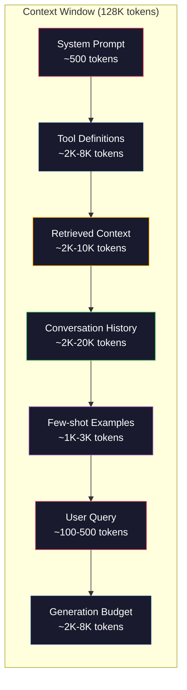
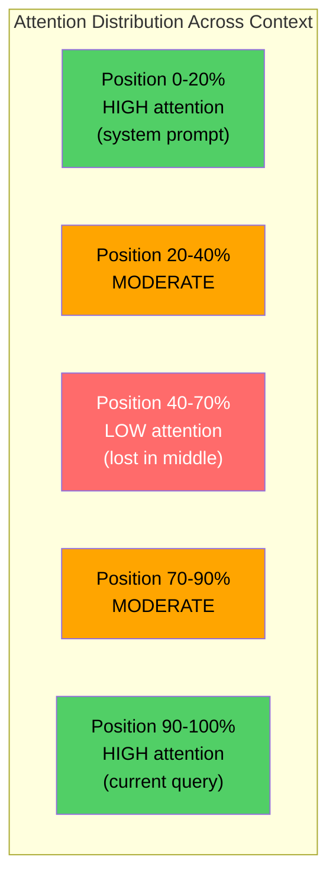
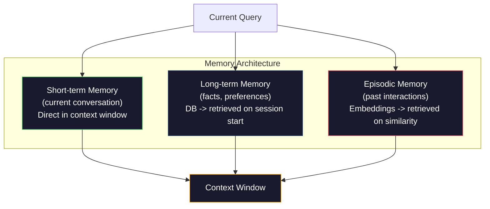

# Context Engineering: Windows, Budgets, Memory, and Retrieval

> Prompt engineering là một phần nhỏ. Context engineering mới là cuộc chơi chính. Prompt là một chuỗi ký tự bạn nhập vào. Context là tất cả những gì đi vào cửa sổ của mô hình: chỉ dẫn hệ thống (system instructions), tài liệu được truy xuất, định nghĩa công cụ, lịch sử hội thoại, các ví dụ few-shot và chính prompt đó. Những kỹ sư AI giỏi nhất năm 2026 chính là các context engineer. Họ là người quyết định cái gì được đưa vào, cái gì bị loại ra và theo thứ tự nào.

**Type:** Build
**Languages:** Python
**Prerequisites:** Phase 10 (LLMs from Scratch), Phase 11 Lesson 01-02
**Time:** ~90 phút
**Related:** Phase 11 · 15 (Prompt Caching) — bố cục thân thiện với cache là một phần mở rộng của context engineering. Phase 5 · 28 (Long-Context Evaluation) để biết cách đo lường hiện tượng "lost-in-the-middle" với NIAH/RULER.

## Mục tiêu học tập

- Tính toán ngân sách token trên tất cả các thành phần của cửa sổ ngữ cảnh (system prompt, công cụ, lịch sử, tài liệu truy xuất, khoảng trống cho việc tạo văn bản)
- Triển khai các chiến lược quản lý cửa sổ ngữ cảnh: cắt bớt (truncation), tóm tắt (summarization) và cửa sổ trượt (sliding window) cho lịch sử hội thoại
- Ưu tiên và sắp xếp các thành phần ngữ cảnh để tối đa hóa sự chú ý của mô hình vào thông tin liên quan nhất
- Xây dựng một bộ lắp ráp ngữ cảnh (context assembler) phân bổ token linh hoạt dựa trên loại truy vấn và không gian cửa sổ khả dụng

## Vấn đề

Claude Opus 4.7 có cửa sổ 200K token (1M trong bản beta). GPT-5 có 400K. Gemini 3 Pro có 2M. Llama 4 tuyên bố đạt 10M. Những con số này nghe có vẻ khổng lồ cho đến khi bạn lấp đầy chúng.

Đây là bảng phân tích thực tế cho một trợ lý lập trình. System prompt: 500 token. Định nghĩa công cụ cho 50 công cụ: 8.000 token. Tài liệu được truy xuất: 4.000 token. Lịch sử hội thoại (10 lượt): 6.000 token. Truy vấn hiện tại của người dùng: 200 token. Ngân sách tạo văn bản (đầu ra tối đa): 4.000 token. Tổng cộng: 22.700 token. Đó chỉ là 18% của cửa sổ 128K.

Nhưng sự chú ý (attention) không tỷ lệ thuận với độ dài ngữ cảnh. Một mô hình với 128K token ngữ cảnh phải trả chi phí chú ý bậc hai (O(n^2) trong các transformer thông thường, mặc dù hầu hết các mô hình sản xuất sử dụng các biến thể attention hiệu quả). Quan trọng hơn, độ chính xác của việc truy xuất bị suy giảm. Bài kiểm tra "Needle in a Haystack" cho thấy các mô hình gặp khó khăn khi tìm thông tin đặt ở giữa các ngữ cảnh dài. Nghiên cứu của Liu và cộng sự (2023) cho thấy LLM truy xuất thông tin ở đầu và cuối ngữ cảnh dài với độ chính xác gần như hoàn hảo, nhưng độ chính xác giảm 10-20% đối với thông tin đặt ở giữa (vị trí 40-70% của ngữ cảnh). Hiệu ứng "lost-in-the-middle" này thay đổi tùy theo mô hình nhưng ảnh hưởng đến tất cả các kiến trúc hiện tại.

Bài học thực tế: có sẵn 200K token không có nghĩa là sử dụng 200K token sẽ hiệu quả. Một ngữ cảnh 10K token được chọn lọc kỹ lưỡng thường vượt trội hơn một ngữ cảnh 100K token được đổ vào một cách bừa bãi. Context engineering là kỷ luật tối đa hóa tỷ lệ tín hiệu trên nhiễu (signal-to-noise ratio) trong cửa sổ ngữ cảnh.

Mỗi token bạn đưa vào cửa sổ sẽ thay thế một token có thể mang thông tin liên quan hơn. Mỗi định nghĩa công cụ không liên quan, mỗi lượt hội thoại cũ, mỗi đoạn văn bản truy xuất không trả lời được câu hỏi — mỗi thứ đều làm mô hình kém đi một chút trong việc thực hiện nhiệm vụ.

## Khái niệm

### Cửa sổ ngữ cảnh là một tài nguyên khan hiếm

Hãy coi cửa sổ ngữ cảnh như RAM, không phải ổ cứng. Nó nhanh và có thể truy cập trực tiếp, nhưng bị giới hạn. Bạn không thể chứa tất cả mọi thứ. Bạn phải lựa chọn.



Mỗi thành phần đều cạnh tranh không gian. Thêm nhiều định nghĩa công cụ nghĩa là ít chỗ hơn cho lịch sử hội thoại. Thêm nhiều ngữ cảnh truy xuất nghĩa là ít chỗ hơn cho các ví dụ few-shot. Context engineering là nghệ thuật phân bổ ngân sách này để tối đa hóa hiệu suất nhiệm vụ.

### Lost-in-the-Middle

Phát hiện thực nghiệm quan trọng nhất trong context engineering. Các mô hình chú ý tốt hơn đến thông tin ở đầu và cuối ngữ cảnh. Thông tin ở giữa nhận được điểm chú ý thấp hơn và có nhiều khả năng bị bỏ qua hơn.

Liu và cộng sự (2023) đã kiểm tra điều này một cách có hệ thống. Họ đặt một tài liệu liên quan vào giữa 20 tài liệu không liên quan ở các vị trí khác nhau và đo lường độ chính xác của câu trả lời. Khi tài liệu liên quan ở đầu hoặc cuối, độ chính xác là 85-90%. Khi nó ở giữa (vị trí 10 trên 20), độ chính xác giảm xuống 60-70%.

Điều này có ý nghĩa kỹ thuật trực tiếp:

- Đặt thông tin quan trọng nhất lên đầu (system prompt, các chỉ dẫn quan trọng)
- Đặt truy vấn hiện tại và ngữ cảnh liên quan nhất xuống cuối (độ lệch gần đây - recency bias giúp ích)
- Coi phần giữa của ngữ cảnh là vùng ưu tiên thấp nhất
- Nếu bạn bắt buộc phải đưa thông tin vào giữa, hãy lặp lại điểm chính ở cuối



### Các thành phần ngữ cảnh

**System prompt**: thiết lập tính cách, các ràng buộc và quy tắc hành vi. Phần này đi đầu tiên và giữ nguyên qua các lượt hội thoại. Claude Code sử dụng khoảng 6.000 token cho system prompt bao gồm định nghĩa công cụ và chỉ dẫn hành vi. Hãy giữ nó ngắn gọn. Mỗi từ trong system prompt đều được lặp lại trong mỗi lần gọi API.

**Định nghĩa công cụ**: mỗi công cụ thêm 50-200 token (tên, mô tả, schema tham số). 50 công cụ với 150 token mỗi cái là 7.500 token trước khi bất kỳ cuộc hội thoại nào diễn ra. Lựa chọn công cụ động — chỉ bao gồm các công cụ liên quan đến truy vấn hiện tại — có thể giảm con số này xuống 60-80%.

**Ngữ cảnh truy xuất**: các tài liệu từ cơ sở dữ liệu vector, kết quả tìm kiếm, nội dung tệp. Chất lượng truy xuất quyết định trực tiếp chất lượng phản hồi. Truy xuất tồi còn tệ hơn là không truy xuất — nó lấp đầy cửa sổ bằng nhiễu và chủ động đánh lạc hướng mô hình.

**Lịch sử hội thoại**: mọi tin nhắn người dùng và phản hồi của trợ lý trước đó. Tăng tuyến tính theo độ dài hội thoại. Một cuộc hội thoại 50 lượt với 200 token mỗi lượt là 10.000 token lịch sử. Hầu hết trong số đó không liên quan đến truy vấn hiện tại.

**Ví dụ few-shot**: các cặp đầu vào/đầu ra minh họa hành vi mong muốn. Hai đến ba ví dụ được chọn lọc kỹ lưỡng thường cải thiện chất lượng đầu ra tốt hơn hàng ngàn token chỉ dẫn. Nhưng chúng tốn không gian.

**Ngân sách tạo văn bản**: các token dành riêng cho phản hồi của mô hình. Nếu bạn lấp đầy cửa sổ đến mức tối đa, mô hình sẽ không còn chỗ để trả lời. Hãy dành ít nhất 2.000-4.000 token cho việc tạo văn bản.

### Chiến lược nén ngữ cảnh

**Tóm tắt lịch sử**: thay vì giữ tất cả các lượt trước đó nguyên văn, hãy định kỳ tóm tắt cuộc hội thoại. "Chúng ta đã thảo luận X, quyết định Y và người dùng muốn Z" trong 100 token sẽ thay thế 10 lượt tốn 2.000 token. Chạy tóm tắt khi lịch sử vượt quá ngưỡng (ví dụ: 5.000 token).

**Lọc mức độ liên quan**: chấm điểm từng tài liệu được truy xuất so với truy vấn hiện tại và loại bỏ các tài liệu dưới ngưỡng. Nếu bạn truy xuất 10 đoạn nhưng chỉ 3 đoạn liên quan, hãy loại bỏ 7 đoạn còn lại. Thà có 3 đoạn cực kỳ liên quan còn hơn 10 đoạn tầm thường.

**Cắt tỉa công cụ**: phân loại ý định truy vấn của người dùng và chỉ bao gồm các công cụ liên quan đến ý định đó. Một câu hỏi về mã nguồn không cần công cụ lịch. Một câu hỏi về lập lịch không cần công cụ hệ thống tệp. Điều này có thể giảm định nghĩa công cụ từ 8.000 token xuống 1.000.

**Tóm tắt đệ quy**: đối với các tài liệu rất dài, hãy tóm tắt theo từng giai đoạn. Đầu tiên tóm tắt từng phần, sau đó tóm tắt các bản tóm tắt. Một tài liệu 50 trang trở thành một bản tóm tắt 500 token nắm bắt các điểm chính.

### Hệ thống bộ nhớ

Context engineering trải dài trên ba khung thời gian.

**Bộ nhớ ngắn hạn**: cuộc hội thoại hiện tại. Được lưu trữ trực tiếp trong cửa sổ ngữ cảnh. Tăng lên sau mỗi lượt. Được quản lý bằng cách tóm tắt và cắt bớt.

**Bộ nhớ dài hạn**: các sự kiện và sở thích tồn tại qua các cuộc hội thoại. "Người dùng thích TypeScript." "Dự án sử dụng PostgreSQL." Được lưu trữ trong cơ sở dữ liệu, truy xuất khi bắt đầu phiên. Claude Code lưu trữ điều này trong các tệp CLAUDE.md. ChatGPT lưu trữ nó trong tính năng bộ nhớ của mình.

**Bộ nhớ tình tiết (Episodic memory)**: các tương tác cụ thể trong quá khứ có thể liên quan. "Thứ Ba tuần trước, chúng ta đã gỡ lỗi một vấn đề tương tự trong module xác thực." Được lưu trữ dưới dạng embedding, truy xuất khi cuộc hội thoại hiện tại khớp với một tình tiết trong quá khứ.



### Lắp ráp ngữ cảnh động

Thông tin quan trọng: các truy vấn khác nhau cần ngữ cảnh khác nhau. Một system prompt tĩnh + công cụ tĩnh + lịch sử tĩnh là lãng phí. Các hệ thống tốt nhất lắp ráp ngữ cảnh một cách linh hoạt cho mỗi truy vấn.

1. Phân loại ý định truy vấn
2. Chọn các công cụ liên quan (không phải tất cả công cụ)
3. Truy xuất các tài liệu liên quan (không phải một tập cố định)
4. Bao gồm các lượt lịch sử liên quan (không phải toàn bộ lịch sử)
5. Thêm các ví dụ few-shot phù hợp với loại nhiệm vụ
6. Sắp xếp mọi thứ theo tầm quan trọng: quan trọng nhất lên đầu, quan trọng nhì xuống cuối, tùy chọn ở giữa

Đây là điều tạo nên sự khác biệt giữa một ứng dụng AI tốt và một ứng dụng AI tuyệt vời. Mô hình là như nhau. Ngữ cảnh mới là yếu tố khác biệt.

```figure
lost-in-the-middle
```

## Xây dựng

### Bước 1: Bộ đếm token

Bạn không thể lập ngân sách cho những gì bạn không thể đo lường. Hãy xây dựng một bộ đếm token đơn giản (xấp xỉ bằng cách tách khoảng trắng, vì số lượng chính xác phụ thuộc vào tokenizer).

```python
import json
import numpy as np
from collections import OrderedDict

def count_tokens(text):
    if not text:
        return 0
    return int(len(text.split()) * 1.3)

def count_tokens_json(obj):
    return count_tokens(json.dumps(obj))
```

### Bước 2: Trình quản lý ngân sách ngữ cảnh

Trừu tượng hóa cốt lõi. Một trình quản lý ngân sách theo dõi số lượng token mà mỗi thành phần sử dụng và thực thi các giới hạn.

```python
class ContextBudget:
    def __init__(self, max_tokens=128000, generation_reserve=4000):
        self.max_tokens = max_tokens
        self.generation_reserve = generation_reserve
        self.available = max_tokens - generation_reserve
        self.allocations = OrderedDict()

    def allocate(self, component, content, max_tokens=None):
        tokens = count_tokens(content)
        if max_tokens and tokens > max_tokens:
            words = content.split()
            target_words = int(max_tokens / 1.3)
            content = " ".join(words[:target_words])
            tokens = count_tokens(content)

        used = sum(self.allocations.values())
        if used + tokens > self.available:
            allowed = self.available - used
            if allowed <= 0:
                return None, 0
            words = content.split()
            target_words = int(allowed / 1.3)
            content = " ".join(words[:target_words])
            tokens = count_tokens(content)

        self.allocations[component] = tokens
        return content, tokens

    def remaining(self):
        used = sum(self.allocations.values())
        return self.available - used

    def utilization(self):
        used = sum(self.allocations.values())
        return used / self.max_tokens

    def report(self):
        total_used = sum(self.allocations.values())
        lines = []
        lines.append(f"Context Budget Report ({self.max_tokens:,} token window)")
        lines.append("-" * 50)
        for component, tokens in self.allocations.items():
            pct = tokens / self.max_tokens * 100
            bar = "#" * int(pct / 2)
            lines.append(f"  {component:<25} {tokens:>6} tokens ({pct:>5.1f}%) {bar}")
        lines.append("-" * 50)
        lines.append(f"  {'Used':<25} {total_used:>6} tokens ({total_used/self.max_tokens*100:.1f}%)")
        lines.append(f"  {'Generation reserve':<25} {self.generation_reserve:>6} tokens")
        lines.append(f"  {'Remaining':<25} {self.remaining():>6} tokens")
        return "\n".join(lines)
```

### Bước 3: Sắp xếp lại theo Lost-in-the-Middle

Triển khai chiến lược sắp xếp lại: các mục quan trọng nhất đi đầu và cuối, các mục ít quan trọng nhất đi vào giữa.

```python
def reorder_lost_in_middle(items, scores):
    paired = sorted(zip(scores, items), reverse=True)
    sorted_items = [item for _, item in paired]

    if len(sorted_items) <= 2:
        return sorted_items

    first_half = sorted_items[::2]
    second_half = sorted_items[1::2]
    second_half.reverse()

    return first_half + second_half

def score_relevance(query, documents):
    query_words = set(query.lower().split())
    scores = []
    for doc in documents:
        doc_words = set(doc.lower().split())
        if not query_words:
            scores.append(0.0)
            continue
        overlap = len(query_words & doc_words) / len(query_words)
        scores.append(round(overlap, 3))
    return scores
```

### Bước 4: Bộ nén lịch sử hội thoại

Tóm tắt các lượt hội thoại cũ để lấy lại ngân sách token.

```python
class ConversationManager:
    def __init__(self, max_history_tokens=5000):
        self.turns = []
        self.summaries = []
        self.max_history_tokens = max_history_tokens

    def add_turn(self, role, content):
        self.turns.append({"role": role, "content": content})
        self._compress_if_needed()

    def _compress_if_needed(self):
        total = sum(count_tokens(t["content"]) for t in self.turns)
        if total <= self.max_history_tokens:
            return

        while total > self.max_history_tokens and len(self.turns) > 4:
            old_turns = self.turns[:2]
            summary = self._summarize_turns(old_turns)
            self.summaries.append(summary)
            self.turns = self.turns[2:]
            total = sum(count_tokens(t["content"]) for t in self.turns)

    def _summarize_turns(self, turns):
        parts = []
        for t in turns:
            content = t["content"]
            if len(content) > 100:
                content = content[:100] + "..."
            parts.append(f"{t['role']}: {content}")
        return "Previous: " + " | ".join(parts)

    def get_context(self):
        parts = []
        if self.summaries:
            parts.append("[Conversation Summary]")
            for s in self.summaries:
                parts.append(s)
        parts.append("[Recent Conversation]")
        for t in self.turns:
            parts.append(f"{t['role']}: {t['content']}")
        return "\n".join(parts)

    def token_count(self):
        return count_tokens(self.get_context())
```

### Bước 5: Bộ chọn công cụ động

Chỉ bao gồm các công cụ liên quan đến truy vấn hiện tại. Phân loại ý định, sau đó lọc.

```python
TOOL_REGISTRY = {
    "read_file": {
        "description": "Read contents of a file",
        "tokens": 120,
        "categories": ["code", "files"],
    },
    "write_file": {
        "description": "Write content to a file",
        "tokens": 150,
        "categories": ["code", "files"],
    },
    "search_code": {
        "description": "Search for patterns in codebase",
        "tokens": 130,
        "categories": ["code"],
    },
    "run_command": {
        "description": "Execute a shell command",
        "tokens": 140,
        "categories": ["code", "system"],
    },
    "create_calendar_event": {
        "description": "Create a new calendar event",
        "tokens": 180,
        "categories": ["calendar"],
    },
    "list_emails": {
        "description": "List recent emails",
        "tokens": 160,
        "categories": ["email"],
    },
    "send_email": {
        "description": "Send an email message",
        "tokens": 200,
        "categories": ["email"],
    },
    "web_search": {
        "description": "Search the web for information",
        "tokens": 140,
        "categories": ["research"],
    },
    "query_database": {
        "description": "Run a SQL query on the database",
        "tokens": 170,
        "categories": ["code", "data"],
    },
    "generate_chart": {
        "description": "Generate a chart from data",
        "tokens": 190,
        "categories": ["data", "visualization"],
    },
}

def classify_intent(query):
    query_lower = query.lower()

    intent_keywords = {
        "code": ["code", "function", "bug", "error", "file", "implement", "refactor", "debug", "test"],
        "calendar": ["meeting", "schedule", "calendar", "appointment", "event"],
        "email": ["email", "mail", "send", "inbox", "message"],
        "research": ["search", "find", "what is", "how does", "explain", "look up"],
        "data": ["data", "query", "database", "chart", "graph", "analytics", "sql"],
    }

    scores = {}
    for intent, keywords in intent_keywords.items():
        score = sum(1 for kw in keywords if kw in query_lower)
        if score > 0:
            scores[intent] = score

    if not scores:
        return ["code"]

    max_score = max(scores.values())
    return [intent for intent, score in scores.items() if score >= max_score * 0.5]

def select_tools(query, token_budget=2000):
    intents = classify_intent(query)
    relevant = {}
    total_tokens = 0

    for name, tool in TOOL_REGISTRY.items():
        if any(cat in intents for cat in tool["categories"]):
            if total_tokens + tool["tokens"] <= token_budget:
                relevant[name] = tool
                total_tokens += tool["tokens"]

    return relevant, total_tokens
```

### Bước 6: Pipeline lắp ráp ngữ cảnh đầy đủ

Kết nối mọi thứ lại với nhau. Với một truy vấn, hãy lắp ráp ngữ cảnh tối ưu một cách linh hoạt.

```python
class ContextEngine:
    def __init__(self, max_tokens=128000, generation_reserve=4000):
        self.budget = ContextBudget(max_tokens, generation_reserve)
        self.conversation = ConversationManager(max_history_tokens=5000)
        self.system_prompt = (
            "You are a helpful AI assistant. You have access to tools for "
            "code editing, file management, web search, and data analysis. "
            "Use the appropriate tools for each task. Be concise and accurate."
        )
        self.knowledge_base = [
            "Python 3.12 introduced type parameter syntax for generic classes using bracket notation.",
            "The project uses PostgreSQL 16 with pgvector for embedding storage.",
            "Authentication is handled by Supabase Auth with JWT tokens.",
            "The frontend is built with Next.js 15 using the App Router.",
            "API rate limits are set to 100 requests per minute per user.",
            "The deployment pipeline uses GitHub Actions with Docker multi-stage builds.",
            "Test coverage must be above 80% for all new modules.",
            "The codebase follows the repository pattern for data access.",
        ]

    def assemble(self, query):
        self.budget = ContextBudget(self.budget.max_tokens, self.budget.generation_reserve)

        system_content, _ = self.budget.allocate("system_prompt", self.system_prompt, max_tokens=1000)

        tools, tool_tokens = select_tools(query, token_budget=2000)
        tool_text = json.dumps(list(tools.keys()))
        tool_content, _ = self.budget.allocate("tools", tool_text, max_tokens=2000)

        relevance = score_relevance(query, self.knowledge_base)
        threshold = 0.1
        relevant_docs = [
            doc for doc, score in zip(self.knowledge_base, relevance)
            if score >= threshold
        ]

        if relevant_docs:
            doc_scores = [s for s in relevance if s >= threshold]
            reordered = reorder_lost_in_middle(relevant_docs, doc_scores)
            doc_text = "\n".join(reordered)
            doc_content, _ = self.budget.allocate("retrieved_context", doc_text, max_tokens=3000)

        history_text = self.conversation.get_context()
        if history_text.strip():
            history_content, _ = self.budget.allocate("conversation_history", history_text, max_tokens=5000)

        query_content, _ = self.budget.allocate("user_query", query, max_tokens=500)

        return self.budget

    def chat(self, query):
        self.conversation.add_turn("user", query)
        budget = self.assemble(query)
        response = f"[Response to: {query[:50]}...]"
        self.conversation.add_turn("assistant", response)
        return budget


def run_demo():
    print("=" * 60)
    print("  Context Engineering Pipeline Demo")
    print("=" * 60)

    engine = ContextEngine(max_tokens=128000, generation_reserve=4000)

    print("\n--- Query 1: Code task ---")
    budget = engine.chat("Fix the bug in the authentication module where JWT tokens expire too early")
    print(budget.report())

    print("\n--- Query 2: Research task ---")
    budget = engine.chat("What is the best approach for implementing vector search in PostgreSQL?")
    print(budget.report())

    print("\n--- Query 3: After conversation history builds up ---")
    for i in range(8):
        engine.conversation.add_turn("user", f"Follow-up question number {i+1} about the implementation details of the system")
        engine.conversation.add_turn("assistant", f"Here is the response to follow-up {i+1} with technical details about the architecture")

    budget = engine.chat("Now implement the changes we discussed")
    print(budget.report())

    print("\n--- Tool Selection Examples ---")
    test_queries = [
        "Fix the bug in auth.py",
        "Schedule a meeting with the team for Tuesday",
        "Show me the database query performance stats",
        "Search for best practices on error handling",
    ]

    for q in test_queries:
        tools, tokens = select_tools(q)
        intents = classify_intent(q)
        print(f"\n  Query: {q}")
        print(f"  Intents: {intents}")
        print(f"  Tools: {list(tools.keys())} ({tokens} tokens)")

    print("\n--- Lost-in-the-Middle Reordering ---")
    docs = ["Doc A (most relevant)", "Doc B (somewhat relevant)", "Doc C (least relevant)",
            "Doc D (relevant)", "Doc E (moderately relevant)"]
    scores = [0.95, 0.60, 0.20, 0.80, 0.50]
    reordered = reorder_lost_in_middle(docs, scores)
    print(f"  Original order: {docs}")
    print(f"  Scores:         {scores}")
    print(f"  Reordered:      {reordered}")
    print(f"  (Most relevant at start and end, least relevant in middle)")
```

## Sử dụng

### Ngữ cảnh được quản lý bởi Harness

Claude Code quản lý ngữ cảnh bằng cách tiếp cận theo lớp. System prompt bao gồm các quy tắc hành vi và định nghĩa công cụ (~6K token). Khi bạn mở một tệp, nội dung của nó được đưa vào dưới dạng ngữ cảnh. Khi bạn tìm kiếm, kết quả được thêm vào. Các lượt hội thoại cũ được tóm tắt. CLAUDE.md cung cấp bộ nhớ dài hạn tồn tại qua các phiên.

Quyết định kỹ thuật quan trọng: Claude Code không đổ toàn bộ codebase của bạn vào ngữ cảnh. Nó truy xuất các tệp liên quan theo yêu cầu. Đây là context engineering trong thực tế.

### Tải ngữ cảnh động

Cursor lập chỉ mục toàn bộ codebase của bạn thành các embedding. Khi bạn nhập truy vấn, nó truy xuất các tệp và khối mã liên quan nhất bằng cách sử dụng độ tương đồng vector. Chỉ những phần đó mới đi vào cửa sổ ngữ cảnh. Một codebase 500K dòng được nén thành 5-10 khối mã liên quan nhất.

Đây là mô hình: nhúng mọi thứ, truy xuất theo yêu cầu, chỉ bao gồm những gì quan trọng.

### Bộ nhớ dài hạn của trợ lý

ChatGPT lưu trữ sở thích và sự kiện của người dùng dưới dạng bộ nhớ dài hạn. Khi bắt đầu mỗi cuộc hội thoại, các bộ nhớ liên quan được truy xuất và đưa vào system prompt. "Người dùng thích Python" tốn 5 token nhưng tiết kiệm hàng trăm token chỉ dẫn lặp đi lặp lại qua các cuộc hội thoại.

### RAG như là Context Engineering

Retrieval-Augmented Generation (RAG) là context engineering được chính thức hóa. Thay vì nhồi nhét kiến thức vào trọng số của mô hình (đào tạo) hoặc system prompt (ngữ cảnh tĩnh), bạn truy xuất các tài liệu liên quan tại thời điểm truy vấn và đưa chúng vào cửa sổ ngữ cảnh. Toàn bộ pipeline RAG — chia nhỏ (chunking), nhúng (embedding), truy xuất, xếp hạng lại (reranking) — tồn tại để giải quyết một vấn đề: đưa đúng thông tin vào cửa sổ ngữ cảnh.

## Triển khai

Bài học này tạo ra `outputs/prompt-context-optimizer.md` — một prompt có thể tái sử dụng để kiểm tra chiến lược lắp ráp ngữ cảnh và đề xuất các tối ưu hóa. Hãy cung cấp system prompt, số lượng công cụ, độ dài lịch sử trung bình và chiến lược truy xuất của bạn, nó sẽ xác định sự lãng phí token và gợi ý các cải tiến.

Nó cũng tạo ra `outputs/skill-context-engineering.md` — một khung quyết định để thiết kế các pipeline lắp ráp ngữ cảnh dựa trên loại nhiệm vụ, kích thước cửa sổ ngữ cảnh và ngân sách độ trễ.

## Bài tập

1. Thêm "bộ phát hiện lãng phí token" vào lớp ContextBudget. Nó sẽ gắn cờ các thành phần sử dụng hơn 30% ngân sách và đề xuất các chiến lược nén cụ thể cho từng loại thành phần (tóm tắt lịch sử, cắt tỉa công cụ, xếp hạng lại tài liệu).

2. Triển khai khử trùng lặp ngữ nghĩa (semantic deduplication) cho ngữ cảnh được truy xuất. Nếu hai tài liệu được truy xuất giống nhau hơn 80% (theo sự trùng lặp từ hoặc độ tương đồng cosine của embedding), chỉ giữ lại tài liệu có điểm cao hơn. Đo lường xem điều này thu hồi được bao nhiêu ngân sách token.

3. Xây dựng công cụ "phát lại ngữ cảnh" (context replay). Với một bản ghi hội thoại, hãy phát lại nó qua ContextEngine và hình dung cách phân bổ ngân sách thay đổi theo từng lượt. Vẽ biểu đồ sử dụng token theo thành phần theo thời gian. Xác định lượt mà ngữ cảnh bắt đầu bị nén.

4. Triển khai bộ chọn công cụ dựa trên ưu tiên. Thay vì bao gồm/loại trừ nhị phân, hãy gán cho mỗi công cụ một điểm liên quan đến truy vấn hiện tại. Bao gồm các công cụ theo thứ tự giảm dần của mức độ liên quan cho đến khi ngân sách công cụ cạn kiệt. So sánh hiệu suất nhiệm vụ với 5, 10, 20 và 50 công cụ được bao gồm.

5. Xây dựng bộ nén ngữ cảnh đa chiến lược. Triển khai ba chiến lược nén (cắt bớt, tóm tắt, trích xuất các câu chính) và đánh giá chúng trên một tập hợp 20 tài liệu. Đo lường sự đánh đổi giữa tỷ lệ nén và khả năng giữ lại thông tin (phiên bản nén có còn chứa câu trả lời cho truy vấn không?).

## Thuật ngữ chính

| Thuật ngữ | Cách mọi người nói | Ý nghĩa thực tế |
|------|----------------|----------------------|
| Context window | "Mô hình đọc được bao nhiêu" | Số lượng token tối đa (đầu vào + đầu ra) mà mô hình xử lý trong một lần truyền xuôi (forward pass) -- 400K cho GPT-5, 200K (1M beta) cho Claude Opus 4.7, 2M cho Gemini 3 Pro |
| Context engineering | "Prompt engineering nâng cao" | Kỷ luật quyết định những gì đi vào cửa sổ ngữ cảnh, theo thứ tự nào và ưu tiên nào -- bao gồm truy xuất, nén, lựa chọn công cụ và quản lý bộ nhớ |
| Lost-in-the-middle | "Mô hình quên đồ ở giữa" | Phát hiện thực nghiệm rằng LLM chú ý tốt hơn đến đầu và cuối ngữ cảnh, với độ chính xác giảm 10-20% đối với thông tin đặt ở giữa |
| Token budget | "Bạn còn bao nhiêu token" | Việc phân bổ rõ ràng dung lượng cửa sổ ngữ cảnh cho các thành phần (system prompt, công cụ, lịch sử, truy xuất, tạo văn bản) với các giới hạn cho từng thành phần |
| Dynamic context | "Tải đồ ngay lập tức" | Lắp ráp cửa sổ ngữ cảnh khác nhau cho mỗi truy vấn dựa trên phân loại ý định, lựa chọn công cụ liên quan và kết quả truy xuất |
| History summarization | "Nén cuộc hội thoại" | Thay thế các lượt hội thoại cũ nguyên văn bằng một bản tóm tắt ngắn gọn, giảm chi phí token trong khi vẫn giữ lại thông tin chính |
| Tool pruning | "Chỉ bao gồm công cụ liên quan" | Phân loại ý định truy vấn và chỉ bao gồm các định nghĩa công cụ khớp, giảm chi phí token công cụ xuống 60-80% |
| Long-term memory | "Ghi nhớ qua các phiên" | Các sự kiện và sở thích được lưu trữ trong cơ sở dữ liệu và truy xuất khi bắt đầu phiên -- CLAUDE.md, ChatGPT Memory và các hệ thống tương tự |
| Episodic memory | "Ghi nhớ các sự kiện cụ thể" | Các tương tác trong quá khứ được lưu trữ dưới dạng embedding và truy xuất khi truy vấn hiện tại tương tự với một cuộc hội thoại cũ |
| Generation budget | "Chỗ cho câu trả lời" | Các token dành riêng cho đầu ra của mô hình -- nếu ngữ cảnh lấp đầy cửa sổ hoàn toàn, mô hình không còn chỗ để phản hồi |

## Đọc thêm

- [Liu và cộng sự, 2023 -- "Lost in the Middle: How Language Models Use Long Contexts"](https://arxiv.org/abs/2307.03172) -- nghiên cứu xác định về sự chú ý phụ thuộc vào vị trí, cho thấy các mô hình gặp khó khăn với thông tin ở giữa các ngữ cảnh dài
- [Bài đăng trên blog về Contextual Retrieval của Anthropic](https://www.anthropic.com/news/contextual-retrieval) -- cách Anthropic tiếp cận việc truy xuất đoạn văn bản nhận biết ngữ cảnh, giảm lỗi truy xuất xuống 49%
- [Bài đăng "Context Engineering" của Simon Willison](https://simonwillison.net/2025/Jun/27/context-engineering/) -- bài đăng trên blog đặt tên cho kỷ luật này và phân biệt nó với prompt engineering
- [Tài liệu LangChain về RAG](https://python.langchain.com/docs/tutorials/rag/) -- triển khai thực tế của retrieval-augmented generation như một mô hình context engineering
- [Bài kiểm tra Needle in a Haystack của Greg Kamradt](https://github.com/gkamradt/LLMTest_NeedleInAHaystack) -- tiêu chuẩn đánh giá đã tiết lộ các lỗi truy xuất phụ thuộc vào vị trí trên tất cả các mô hình lớn
- [Pope và cộng sự, "Efficiently Scaling Transformer Inference" (2022)](https://arxiv.org/abs/2211.05102) -- tại sao độ dài ngữ cảnh thúc đẩy bộ nhớ và độ trễ, và cách KV cache, MQA, GQA thay đổi việc tính toán ngân sách.
- [Agrawal và cộng sự, "SARATHI: Efficient LLM Inference by Piggybacking Decodes with Chunked Prefills" (2023)](https://arxiv.org/abs/2308.16369) -- hai giai đoạn suy luận làm cho các prompt dài trở nên đắt đỏ trong TTFT nhưng rẻ trong TPOT; sự thật đằng sau các đánh đổi về context-packing.
- [Ainslie và cộng sự, "GQA: Training Generalized Multi-Query Transformer Models from Multi-Head Checkpoints" (EMNLP 2023)](https://arxiv.org/abs/2305.13245) -- bài báo về grouped-query attention đã cắt giảm bộ nhớ KV 8 lần trong các bộ giải mã sản xuất mà không làm giảm chất lượng.