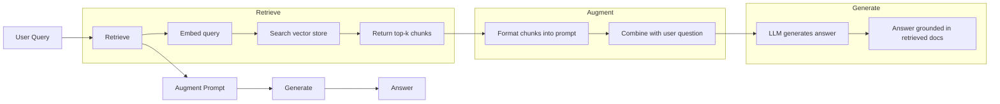
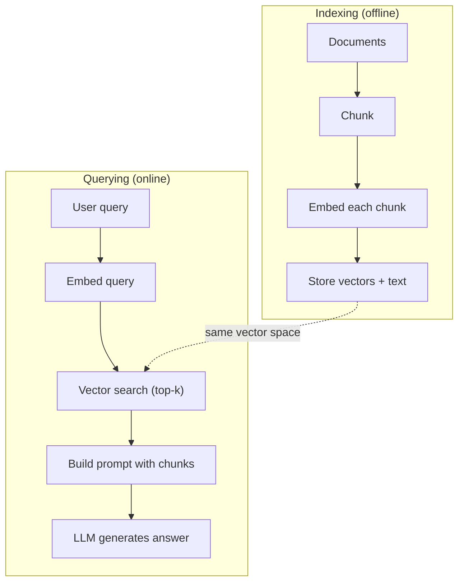

# RAG (Retrieval-Augmented Generation)

> LLM của bạn biết mọi thứ cho đến thời điểm cắt dữ liệu huấn luyện (training cutoff). Nó không biết gì về tài liệu công ty, codebase hay ghi chú cuộc họp tuần trước của bạn. RAG giải quyết vấn đề này bằng cách truy xuất các tài liệu liên quan và đưa chúng vào prompt. Đây là mô hình được triển khai nhiều nhất trong AI thực tế. Nếu bạn chỉ xây dựng một thứ từ khóa học này, hãy xây dựng một RAG pipeline.

**Type:** Build
**Languages:** Python
**Prerequisites:** Phase 10 (LLMs from Scratch), Phase 11 Lessons 01-05
**Time:** ~90 minutes
**Related:** Phase 5 · 23 (Chunking Strategies for RAG) để tìm hiểu sáu thuật toán chia nhỏ (chunking) và ưu điểm của từng loại. Phase 5 · 22 (Embedding Models Deep Dive) để chọn mô hình embedding. Phase 11 · 07 (Advanced RAG) cho hybrid search, reranking và query transformation.

## Mục tiêu học tập

- Xây dựng một RAG pipeline hoàn chỉnh: tải tài liệu, chia nhỏ (chunking), embedding, lưu trữ vector, truy xuất và tạo phản hồi (generation)
- Triển khai tìm kiếm ngữ nghĩa (semantic search) sử dụng vector database (ChromaDB, FAISS hoặc Pinecone) với indexing phù hợp
- Giải thích lý do tại sao RAG được ưu tiên hơn fine-tuning cho các ứng dụng dựa trên tri thức (chi phí, độ mới, khả năng truy xuất nguồn gốc)
- Đánh giá chất lượng RAG bằng các chỉ số truy xuất (precision, recall) và chỉ số tạo phản hồi (faithfulness, relevance)

## Vấn đề

Bạn xây dựng một chatbot cho công ty. Một khách hàng hỏi: "Chính sách hoàn tiền cho các gói doanh nghiệp là gì?". LLM trả về câu trả lời chung chung về các chính sách hoàn tiền SaaS thông thường. Chính sách thực tế, nằm trong một wiki nội bộ dài 200 trang, ghi rằng khách hàng doanh nghiệp có thời hạn 60 ngày với chính sách hoàn tiền theo tỷ lệ. LLM chưa bao giờ thấy tài liệu này. Nó không thể biết những gì nó không được huấn luyện.

Fine-tuning là một giải pháp. Lấy LLM, huấn luyện nó trên tài liệu nội bộ của bạn và triển khai mô hình đã cập nhật. Cách này hiệu quả nhưng có những vấn đề nghiêm trọng. Fine-tuning tốn hàng ngàn đô la chi phí tính toán. Mô hình trở nên lỗi thời ngay khi tài liệu thay đổi. Bạn không có cách nào biết mô hình đã lấy thông tin từ nguồn nào. Và nếu tháng sau công ty mua lại một dòng sản phẩm khác, bạn lại phải fine-tune lần nữa.

RAG là giải pháp còn lại. Giữ nguyên mô hình. Khi có câu hỏi, hãy tìm kiếm trong kho tài liệu của bạn các đoạn văn liên quan, dán chúng vào prompt trước câu hỏi và để mô hình trả lời dựa trên các đoạn văn đó làm ngữ cảnh. Kho tài liệu có thể được cập nhật trong vài phút. Bạn có thể thấy chính xác tài liệu nào đã được truy xuất. Bản thân mô hình không bao giờ thay đổi. Đây là lý do tại sao RAG là mô hình thống trị trong thực tế: nó rẻ hơn, mới hơn, dễ kiểm tra hơn và hoạt động với bất kỳ LLM nào.

## Khái niệm

### Mô hình RAG

Toàn bộ mô hình gói gọn trong bốn bước:



Query -> Retrieve -> Augment prompt -> Generate. Mọi hệ thống RAG đều tuân theo mô hình này. Sự khác biệt giữa các hệ thống RAG trong thực tế nằm ở chi tiết của từng bước: cách bạn chia nhỏ (chunk), cách bạn embedding, cách bạn tìm kiếm và cách bạn xây dựng prompt.

### Tại sao RAG vượt trội hơn Fine-tuning

| Mối quan tâm | Fine-tuning | RAG |
|---------|------------|-----|
| Chi phí | $1,000-$100,000+ mỗi lần huấn luyện | $0.01-$0.10 mỗi truy vấn (embedding + LLM) |
| Độ mới | Lỗi thời cho đến khi huấn luyện lại | Cập nhật trong vài phút bằng cách re-indexing tài liệu |
| Khả năng kiểm tra | Không thể truy vết câu trả lời về nguồn | Có thể hiển thị chính xác các đoạn văn đã truy xuất |
| Ảo tưởng (Hallucination) | Vẫn ảo tưởng tự do | Dựa trên các tài liệu đã truy xuất |
| Bảo mật dữ liệu | Dữ liệu huấn luyện nằm trong trọng số | Tài liệu nằm trong vector store của bạn |

Fine-tuning thay đổi trọng số của mô hình vĩnh viễn. RAG thay đổi ngữ cảnh của mô hình tạm thời. Đối với hầu hết các ứng dụng, ngữ cảnh tạm thời là thứ bạn cần.

Trường hợp duy nhất mà fine-tuning thắng thế: khi bạn cần mô hình áp dụng một phong cách, tông giọng hoặc mô hình suy luận cụ thể mà không thể đạt được chỉ bằng prompting. Đối với việc truy xuất tri thức thực tế, RAG luôn thắng.

### Embedding Models

Một embedding model chuyển đổi văn bản thành một vector dày đặc (dense vector). Các văn bản tương tự nhau tạo ra các vector nằm gần nhau trong không gian nhiều chiều này. "Làm thế nào để đặt lại mật khẩu?" và "Tôi cần thay đổi mật khẩu" tạo ra các vector gần như giống hệt nhau mặc dù chia sẻ ít từ ngữ. "Con mèo ngồi trên tấm thảm" tạo ra một vector rất khác biệt.

Các embedding model phổ biến (danh sách năm 2026 — xem Phase 5 · 22 để phân tích đầy đủ):

| Model | Dimensions | Provider | Ghi chú |
|-------|-----------|----------|-------|
| text-embedding-3-small | 1536 (Matryoshka) | OpenAI | Giá/hiệu năng tốt nhất cho hầu hết các trường hợp |
| text-embedding-3-large | 3072 (Matryoshka) | OpenAI | Độ chính xác cao hơn, có thể cắt ngắn xuống 256/512/1024 |
| Gemini Embedding 2 | 3072 (Matryoshka) | Google | Top MTEB retrieval; 8K context |
| voyage-4 | 1024/2048 (Matryoshka) | Voyage AI | Các biến thể theo lĩnh vực (code, tài chính, luật) |
| Cohere embed-v4 | 1024 (Matryoshka) | Cohere | Đa ngôn ngữ mạnh mẽ, 128K context |
| BGE-M3 | 1024 (dense + sparse + ColBERT) | BAAI (open-weight) | Ba góc nhìn từ một mô hình |
| Qwen3-Embedding | 4096 (Matryoshka) | Alibaba (open-weight) | Điểm truy xuất top đầu cho open-weight |
| all-MiniLM-L6-v2 | 384 | Open-weight (Sentence Transformers) | Baseline cho tạo mẫu (prototyping) |

Trong bài học này, chúng ta tự xây dựng một embedding đơn giản bằng TF-IDF. Không phải vì TF-IDF là thứ các hệ thống thực tế sử dụng, mà vì nó làm cho khái niệm trở nên cụ thể: văn bản đi vào, vector đi ra, các văn bản tương tự tạo ra các vector tương tự.

### Vector Similarity

Với hai vector, làm thế nào để đo lường sự tương đồng? Ba tùy chọn:

**Cosine similarity**: cosin của góc giữa hai vector. Dao động từ -1 (đối lập) đến 1 (giống hệt). Bỏ qua độ lớn, chỉ quan tâm đến hướng. Đây là mặc định cho RAG.

```
cosine_sim(a, b) = dot(a, b) / (||a|| * ||b||)
```

**Dot product**: tích vô hướng thô. Các vector lớn hơn có điểm số cao hơn. Hữu ích khi độ lớn mang thông tin (tài liệu dài hơn có thể liên quan hơn).

```
dot(a, b) = sum(a_i * b_i)
```

**L2 (Euclidean) distance**: khoảng cách đường thẳng trong không gian vector. Khoảng cách nhỏ hơn = tương đồng hơn. Nhạy cảm với sự khác biệt về độ lớn.

```
L2(a, b) = sqrt(sum((a_i - b_i)^2))
```

Cosine similarity là tiêu chuẩn. Nó xử lý các tài liệu có độ dài khác nhau một cách linh hoạt vì nó chuẩn hóa theo độ lớn. Khi ai đó nói "vector search", họ gần như luôn có ý nói đến cosine similarity.

### Chiến lược Chunking

Tài liệu quá dài để embedding thành một vector duy nhất. Một file PDF 50 trang có thể tạo ra một embedding tồi tệ vì nó chứa hàng tá chủ đề. Thay vào đó, bạn chia tài liệu thành các đoạn (chunks) và embedding từng đoạn riêng biệt.

**Fixed-size chunking**: chia mỗi N token. Đơn giản và dễ dự đoán. Một chunk 512 token với 50 token chồng lấp (overlap) nghĩa là chunk 1 là token 0-511, chunk 2 là token 462-973, v.v. Sự chồng lấp đảm bảo bạn không cắt một câu tại ranh giới không may mắn.

**Semantic chunking**: chia tại các ranh giới tự nhiên. Đoạn văn, phần hoặc tiêu đề markdown. Mỗi chunk là một đơn vị ý nghĩa mạch lạc. Phức tạp hơn để triển khai nhưng tạo ra kết quả truy xuất tốt hơn.

**Recursive chunking**: cố gắng chia tại ranh giới lớn nhất trước (tiêu đề phần). Nếu một phần vẫn quá lớn, chia tại ranh giới đoạn văn. Nếu một đoạn văn vẫn quá lớn, chia tại ranh giới câu. Đây là cách tiếp cận RecursiveCharacterTextSplitter của LangChain và nó hoạt động tốt trong thực tế.

Kích thước chunk quan trọng hơn mọi người nghĩ:

- Quá nhỏ (64-128 token): mỗi chunk thiếu ngữ cảnh. "Nó đã tăng 15% trong quý trước" không có nghĩa gì nếu không biết "nó" đề cập đến cái gì.
- Quá lớn (2048+ token): mỗi chunk bao phủ nhiều chủ đề, làm loãng sự liên quan. Khi bạn tìm kiếm dữ liệu doanh thu, bạn nhận được một chunk chứa 10% về doanh thu và 90% về nhân sự.
- Điểm ngọt (256-512 token): đủ ngữ cảnh để tự chứa đựng, đủ tập trung để liên quan.

Hầu hết các hệ thống RAG thực tế sử dụng chunk 256-512 token với 50 token chồng lấp. Các hướng dẫn RAG của Anthropic khuyến nghị phạm vi này.

### Vector Databases

Khi đã có embeddings, bạn cần nơi để lưu trữ và tìm kiếm chúng. Các tùy chọn:

| Database | Type | Tốt nhất cho |
|----------|------|----------|
| FAISS | Library (in-process) | Prototyping, tập dữ liệu nhỏ đến trung bình |
| Chroma | Lightweight DB | Phát triển cục bộ, triển khai nhỏ |
| Pinecone | Managed service | Sản xuất mà không cần quản lý vận hành |
| Weaviate | Open source DB | Sản xuất tự lưu trữ (self-hosted) |
| pgvector | Postgres extension | Đã sử dụng Postgres |
| Qdrant | Open source DB | Tự lưu trữ hiệu năng cao |

Trong bài học này, chúng ta xây dựng một vector store đơn giản trong bộ nhớ. Nó lưu trữ các vector trong một danh sách và thực hiện tìm kiếm cosine similarity vét cạn (brute-force). Điều này tương đương với FAISS với flat index. Nó có thể mở rộng đến khoảng 100,000 vector trước khi trở nên chậm. Các hệ thống thực tế sử dụng các thuật toán approximate nearest neighbor (ANN) như HNSW để tìm kiếm hàng triệu vector trong vài mili giây.

### Pipeline hoàn chỉnh



Giai đoạn indexing chạy một lần cho mỗi tài liệu (hoặc khi tài liệu cập nhật). Giai đoạn querying chạy trên mỗi yêu cầu của người dùng. Trong thực tế, indexing có thể xử lý hàng triệu tài liệu trong nhiều giờ. Querying phải phản hồi trong dưới một giây.

### Số liệu thực tế

Hầu hết các hệ thống RAG thực tế sử dụng các tham số sau:

- **k = 5 đến 10** đoạn được truy xuất mỗi truy vấn
- **Chunk size = 256 đến 512 token** với 50 token chồng lấp
- **Context budget**: 2,500-5,000 token nội dung được truy xuất mỗi truy vấn
- **Total prompt**: ~8,000-16,000 token (system prompt + các đoạn truy xuất + lịch sử hội thoại + truy vấn người dùng)
- **Embedding dimension**: 384-3072 tùy thuộc vào mô hình
- **Indexing throughput**: 100-1,000 tài liệu mỗi giây với API embeddings
- **Query latency**: 50-200ms cho truy xuất, 500-3000ms cho tạo phản hồi

```figure
rag-chunking
```

## Xây dựng

### Bước 1: Document Chunking

```python
def chunk_text(text, chunk_size=200, overlap=50):
    words = text.split()
    chunks = []
    start = 0
    while start < len(words):
        end = start + chunk_size
        chunk = " ".join(words[start:end])
        chunks.append(chunk)
        start += chunk_size - overlap
    return chunks
```

### Bước 2: TF-IDF Embeddings

Chúng ta xây dựng một hàm embedding đơn giản. TF-IDF (Term Frequency-Inverse Document Frequency) không phải là một neural embedding, nhưng nó chuyển đổi văn bản thành các vector theo cách nắm bắt được tầm quan trọng của từ ngữ. Các từ xuất hiện thường xuyên trong một tài liệu có TF cao hơn. Các từ hiếm trong toàn bộ kho dữ liệu có IDF cao hơn. Tích số tạo ra một vector nơi các từ quan trọng, đặc trưng có giá trị cao.

```python
import math
from collections import Counter

def build_vocabulary(documents):
    vocab = set()
    for doc in documents:
        vocab.update(doc.lower().split())
    return sorted(vocab)

def compute_tf(text, vocab):
    words = text.lower().split()
    count = Counter(words)
    total = len(words)
    return [count.get(word, 0) / total for word in vocab]

def compute_idf(documents, vocab):
    n = len(documents)
    idf = []
    for word in vocab:
        doc_count = sum(1 for doc in documents if word in doc.lower().split())
        idf.append(math.log((n + 1) / (doc_count + 1)) + 1)
    return idf

def tfidf_embed(text, vocab, idf):
    tf = compute_tf(text, vocab)
    return [t * i for t, i in zip(tf, idf)]
```

### Bước 3: Cosine Similarity Search

```python
def cosine_similarity(a, b):
    dot = sum(x * y for x, y in zip(a, b))
    norm_a = math.sqrt(sum(x * x for x in a))
    norm_b = math.sqrt(sum(x * x for x in b))
    if norm_a == 0 or norm_b == 0:
        return 0.0
    return dot / (norm_a * norm_b)

def search(query_embedding, stored_embeddings, top_k=5):
    scores = []
    for i, emb in enumerate(stored_embeddings):
        sim = cosine_similarity(query_embedding, emb)
        scores.append((i, sim))
    scores.sort(key=lambda x: x[1], reverse=True)
    return scores[:top_k]
```

### Bước 4: Prompt Construction

Đây là nơi chữ "augmented" trong RAG xuất hiện. Lấy các đoạn đã truy xuất, định dạng chúng thành một prompt và yêu cầu LLM trả lời dựa trên ngữ cảnh được cung cấp.

```python
def build_rag_prompt(query, retrieved_chunks):
    context = "\n\n---\n\n".join(
        f"[Source {i+1}]\n{chunk}"
        for i, chunk in enumerate(retrieved_chunks)
    )
    return f"""Answer the question based ONLY on the following context.
If the context doesn't contain enough information, say "I don't have enough information to answer that."

Context:
{context}

Question: {query}

Answer:"""
```

### Bước 5: The Complete RAG Pipeline

```python
class RAGPipeline:
    def __init__(self):
        self.chunks = []
        self.embeddings = []
        self.vocab = []
        self.idf = []

    def index(self, documents):
        all_chunks = []
        for doc in documents:
            all_chunks.extend(chunk_text(doc))
        self.chunks = all_chunks
        self.vocab = build_vocabulary(all_chunks)
        self.idf = compute_idf(all_chunks, self.vocab)
        self.embeddings = [
            tfidf_embed(chunk, self.vocab, self.idf)
            for chunk in all_chunks
        ]

    def query(self, question, top_k=5):
        query_emb = tfidf_embed(question, self.vocab, self.idf)
        results = search(query_emb, self.embeddings, top_k)
        retrieved = [(self.chunks[i], score) for i, score in results]
        prompt = build_rag_prompt(
            question, [chunk for chunk, _ in retrieved]
        )
        return prompt, retrieved
```

### Bước 6: Generation (mô phỏng)

Trong thực tế, đây là nơi bạn gọi API LLM. Đối với bài học này, chúng ta mô phỏng việc tạo phản hồi bằng cách trích xuất câu liên quan nhất từ ngữ cảnh đã truy xuất.

```python
def simple_generate(prompt, retrieved_chunks):
    query_words = set(prompt.lower().split("question:")[-1].split())
    best_sentence = ""
    best_score = 0
    for chunk in retrieved_chunks:
        for sentence in chunk.split("."):
            sentence = sentence.strip()
            if not sentence:
                continue
            words = set(sentence.lower().split())
            overlap = len(query_words & words)
            if overlap > best_score:
                best_score = overlap
                best_sentence = sentence
    return best_sentence if best_sentence else "I don't have enough information."
```

## Sử dụng

Với một embedding model và LLM thực tế, mã nguồn hầu như không thay đổi:

```python
from openai import OpenAI

client = OpenAI()

def embed(text):
    response = client.embeddings.create(
        model="text-embedding-3-small",
        input=text
    )
    return response.data[0].embedding

def generate(prompt):
    response = client.chat.completions.create(
        model="gpt-4o-mini",
        messages=[{"role": "user", "content": prompt}],
        temperature=0
    )
    return response.choices[0].message.content
```

Hoặc với Anthropic:

```python
import anthropic

client = anthropic.Anthropic()

def generate(prompt):
    response = client.messages.create(
        model="claude-sonnet-5",
        max_tokens=1024,
        messages=[{"role": "user", "content": prompt}]
    )
    return response.content[0].text
```

Pipeline vẫn như cũ. Thay đổi hàm embedding. Thay đổi hàm tạo phản hồi. Logic truy xuất, chia nhỏ, xây dựng prompt — tất cả đều giống hệt nhau bất kể bạn sử dụng mô hình nào.

Để lưu trữ vector ở quy mô lớn, hãy thay thế tìm kiếm vét cạn bằng một vector database thực thụ:

```python
import chromadb

client = chromadb.Client()
collection = client.create_collection("my_docs")

collection.add(
    documents=chunks,
    ids=[f"chunk_{i}" for i in range(len(chunks))]
)

results = collection.query(
    query_texts=["What is the refund policy?"],
    n_results=5
)
```

Chroma xử lý embedding nội bộ (nó sử dụng all-MiniLM-L6-v2 theo mặc định) và lưu trữ các vector trong một cơ sở dữ liệu cục bộ. Cùng một mô hình, hệ thống ống dẫn khác nhau.

## Triển khai

Bài học này tạo ra:
- `outputs/prompt-rag-architect.md` -- một prompt để thiết kế các hệ thống RAG cho các trường hợp sử dụng cụ thể
- `outputs/skill-rag-pipeline.md` -- một kỹ năng dạy các tác nhân (agents) cách xây dựng và gỡ lỗi các RAG pipeline

## Bài tập

1. Thay thế TF-IDF embeddings bằng phương pháp bag-of-words đơn giản (nhị phân: 1 nếu từ có mặt, 0 nếu không). So sánh chất lượng truy xuất trên các tài liệu mẫu. TF-IDF sẽ vượt trội hơn vì nó gán trọng số cao hơn cho các từ hiếm.

2. Thử nghiệm với các kích thước chunk: thử 50, 100, 200 và 500 từ trên cùng một tập tài liệu. Với mỗi kích thước, chạy 5 truy vấn giống nhau và đếm xem có bao nhiêu truy vấn trả về một chunk liên quan trong top-3. Tìm điểm ngọt nơi chất lượng truy xuất đạt đỉnh.

3. Thêm metadata vào mỗi chunk (tên tài liệu nguồn, vị trí chunk). Sửa đổi template prompt để bao gồm trích dẫn nguồn để LLM ghi rõ nguồn của nó.

4. Triển khai đánh giá đơn giản: với 10 cặp câu hỏi-trả lời, chạy mỗi câu hỏi qua RAG pipeline và đo lường tỷ lệ phần trăm các chunk được truy xuất có chứa câu trả lời. Đây là retrieval recall tại k.

5. Xây dựng một RAG pipeline nhận biết hội thoại: duy trì lịch sử của 3 lần trao đổi gần nhất và đưa chúng vào prompt cùng với các chunk được truy xuất. Kiểm tra với các câu hỏi tiếp theo như "Còn về doanh nghiệp thì sao?" sau khi đã hỏi về giá cả.

## Thuật ngữ chính

| Thuật ngữ | Mọi người nói | Ý nghĩa thực tế |
|------|----------------|----------------------|
| RAG | "AI đọc tài liệu của bạn" | Truy xuất tài liệu liên quan, dán vào prompt và tạo câu trả lời dựa trên các tài liệu đó |
| Embedding | "Chuyển văn bản thành số" | Một biểu diễn vector dày đặc của văn bản, nơi các ý nghĩa tương tự tạo ra các vector tương tự |
| Vector database | "Công cụ tìm kiếm cho AI" | Một kho dữ liệu được tối ưu hóa để lưu trữ vector và tìm các láng giềng gần nhất theo sự tương đồng |
| Chunking | "Chia tài liệu thành các mảnh" | Chia tài liệu thành các phân đoạn nhỏ hơn (thường là 256-512 token) để mỗi đoạn có thể được embedding và truy xuất độc lập |
| Cosine similarity | "Hai vector giống nhau thế nào" | Cosin của góc giữa hai vector; 1 = hướng giống hệt, 0 = vuông góc, -1 = đối lập |
| Top-k retrieval | "Lấy k kết quả tốt nhất" | Trả về k chunk tương tự nhất với truy vấn từ vector store |
| Context window | "LLM thấy được bao nhiêu văn bản" | Số lượng token tối đa mà LLM có thể xử lý trong một yêu cầu; các chunk được truy xuất phải nằm trong giới hạn này |
| Augmented generation | "Trả lời bằng ngữ cảnh đã cho" | Tạo phản hồi sử dụng các tài liệu được truy xuất làm ngữ cảnh thay vì chỉ dựa vào tri thức đã huấn luyện |
| TF-IDF | "Chấm điểm tầm quan trọng của từ" | Tần suất xuất hiện của từ nhân với nghịch đảo tần suất tài liệu; gán trọng số cho từ dựa trên độ đặc trưng của chúng trong kho dữ liệu |
| Indexing | "Chuẩn bị tài liệu để tìm kiếm" | Quá trình offline gồm chia nhỏ, embedding và lưu trữ tài liệu để có thể tìm kiếm tại thời điểm truy vấn |

## Đọc thêm

- Lewis et al., "Retrieval-Augmented Generation for Knowledge-Intensive NLP Tasks" (2020) -- bài báo RAG gốc từ Facebook AI Research đã chính thức hóa mô hình truy xuất-rồi-tạo (retrieve-then-generate)
- Tài liệu RAG của Anthropic (docs.anthropic.com) -- các hướng dẫn thực tế về kích thước chunk, xây dựng prompt và đánh giá
- Pinecone Learning Center, "What is RAG?" -- giải thích trực quan rõ ràng về RAG pipeline với các cân nhắc thực tế
- Sentence-BERT: Reimers & Gurevych (2019) -- bài báo đằng sau các mô hình embedding all-MiniLM, cho thấy cách huấn luyện bi-encoders cho sự tương đồng ngữ nghĩa
- [Karpukhin et al., "Dense Passage Retrieval for Open-Domain Question Answering" (EMNLP 2020)](https://arxiv.org/abs/2004.04906) -- bài báo DPR chứng minh rằng truy xuất dense bi-encoder vượt trội hơn BM25 trong QA mở và thiết lập mô hình cho các bộ truy xuất RAG hiện đại.
- [LlamaIndex High-Level Concepts](https://docs.llamaindex.ai/en/stable/getting_started/concepts.html) -- các khái niệm chính cần biết khi xây dựng RAG pipeline: data loaders, node parsers, indices, retrievers, response synthesizers.
- [LangChain RAG tutorial](https://python.langchain.com/docs/tutorials/rag/) -- trình điều phối theo phong cách đối lập; cái nhìn chain-of-runnables về cùng một mô hình truy xuất-rồi-tạo.