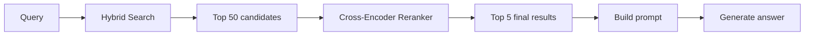
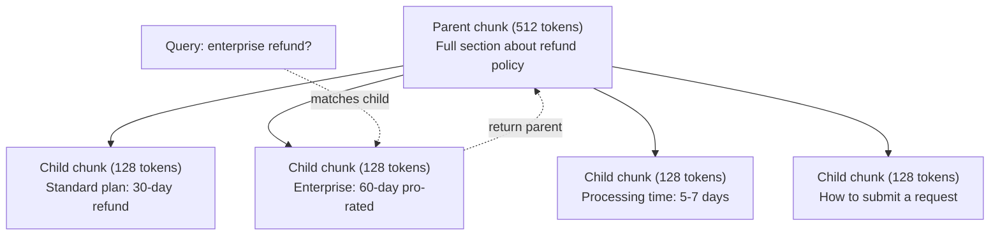
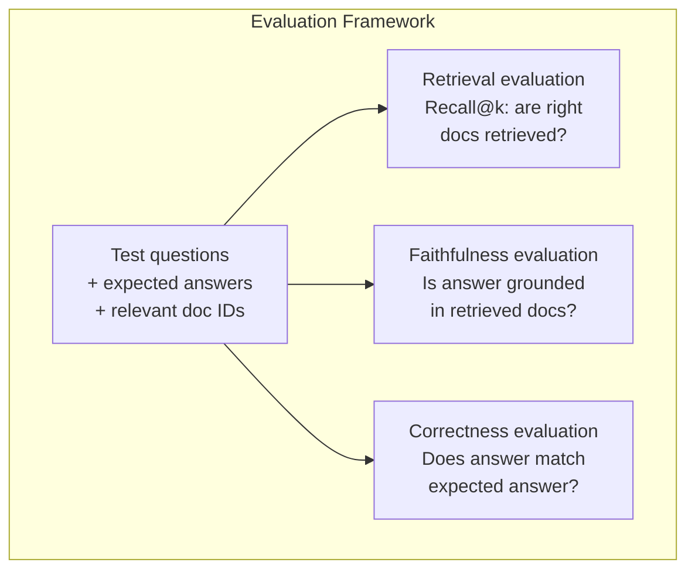

# Advanced RAG (Chunking, Reranking, Hybrid Search)

> RAG cơ bản truy xuất top-k các đoạn văn bản (chunks) có độ tương đồng cao nhất. Cách này hiệu quả với các câu hỏi đơn giản, nhưng sẽ thất bại đối với các truy vấn đa bước (multi-hop reasoning), truy vấn mơ hồ và các tập dữ liệu lớn. Advanced RAG chính là sự khác biệt giữa một bản demo hoạt động trên 10 tài liệu và một hệ thống hoạt động trên 10 triệu tài liệu.

**Type:** Build
**Languages:** Python
**Prerequisites:** Phase 11, Lesson 06 (RAG)
**Time:** ~90 phút
**Related:** Phase 5 · 23 (Chunking Strategies for RAG) bao gồm tất cả sáu thuật toán chunking — recursive, semantic, sentence, parent-document, late chunking, contextual retrieval — cùng với các benchmark từ Vectara/Anthropic. Bài học này xây dựng dựa trên nền tảng đó: hybrid search, reranking, query transformation.

## Mục tiêu học tập

- Triển khai các chiến lược chunking nâng cao (semantic, recursive, parent-child) giúp bảo toàn cấu trúc và ngữ cảnh tài liệu.
- Xây dựng pipeline hybrid search kết hợp giữa khớp từ khóa BM25 với tìm kiếm vector ngữ nghĩa và một cross-encoder reranker.
- Áp dụng các kỹ thuật biến đổi truy vấn (HyDE, multi-query, step-back) để cải thiện khả năng truy xuất đối với các câu hỏi phức tạp hoặc mơ hồ.
- Chẩn đoán và khắc phục các lỗi RAG phổ biến: truy xuất sai chunk, câu trả lời không nằm trong ngữ cảnh, lỗi suy luận đa bước.

## Vấn đề

Bạn đã xây dựng một pipeline RAG cơ bản ở Bài 06. Nó hoạt động tốt với các câu hỏi trực diện trên tập dữ liệu nhỏ. Bây giờ hãy thử các trường hợp sau:

**Truy vấn mơ hồ**: "Doanh thu quý trước là bao nhiêu?" Tìm kiếm ngữ nghĩa trả về các đoạn văn bản về chiến lược doanh thu, dự báo doanh thu và suy nghĩ của CFO về tăng trưởng doanh thu. Tất cả đều tương đồng về mặt ngữ nghĩa với từ "doanh thu". Nhưng không đoạn nào chứa con số thực tế. Đoạn văn bản chính xác ghi "$47.2M in Q3 2025" but uses the word "earnings" instead of "revenue." The embedding model thinks "revenue strategy" is closer to the query than "Q3 earnings were $47.2M."

**Câu hỏi đa bước**: "Đội ngũ nào có mức cải thiện điểm hài lòng khách hàng cao nhất?" Điều này đòi hỏi phải tìm điểm hài lòng của từng đội, so sánh chúng và xác định giá trị lớn nhất. Không có một đoạn văn bản đơn lẻ nào chứa câu trả lời. Thông tin nằm rải rác trong các báo cáo của các đội.

**Vấn đề tập dữ liệu lớn**: Bạn có 2 triệu chunks. Câu trả lời đúng nằm ở chunk #1,847,293. Việc truy xuất top-5 của bạn lấy ra các chunk #14, #89,201, #1,200,000, #44 và #901,333. Chúng gần nhau trong không gian embedding, nhưng không đoạn nào chứa câu trả lời. Ở quy mô này, tìm kiếm láng giềng gần nhất (approximate nearest neighbor) tạo ra đủ sai số khiến các kết quả liên quan bị đẩy ra khỏi top-k.

RAG cơ bản thất bại vì độ tương đồng vector không đồng nghĩa với sự liên quan. Một đoạn văn bản có thể tương đồng về ngữ nghĩa với truy vấn mà không hữu ích để trả lời nó. Advanced RAG giải quyết vấn đề này bằng bốn kỹ thuật: hybrid search (thêm khớp từ khóa), reranking (chấm điểm ứng viên cẩn thận hơn), query transformation (sửa truy vấn trước khi tìm kiếm) và chunking tốt hơn (truy xuất ở độ chi tiết phù hợp).

## Khái niệm

### Hybrid Search: Semantic + Keyword

Tìm kiếm ngữ nghĩa (tương đồng vector) giỏi trong việc hiểu ý nghĩa. "Làm thế nào để hủy đăng ký?" khớp với "Các bước để chấm dứt gói dịch vụ của bạn" mặc dù chúng không chia sẻ từ ngữ nào. Nhưng nó bỏ lỡ các khớp chính xác. "Mã lỗi E-4021" có thể không khớp với một đoạn văn bản chứa "E-4021" nếu mô hình embedding coi đó là nhiễu.

Tìm kiếm từ khóa (BM25) thì ngược lại. Nó xuất sắc trong việc khớp chính xác. "E-4021" khớp hoàn hảo. Nhưng "hủy đăng ký" sẽ trả về kết quả bằng không nếu tài liệu ghi là "chấm dứt gói dịch vụ".

Hybrid search chạy cả hai, sau đó hợp nhất kết quả.

**BM25** (Best Matching 25) là thuật toán tìm kiếm từ khóa tiêu chuẩn. Nó là xương sống của các công cụ tìm kiếm từ những năm 1990. Công thức:

```
BM25(q, d) = sum over terms t in q:
    IDF(t) * (tf(t,d) * (k1 + 1)) / (tf(t,d) + k1 * (1 - b + b * |d| / avgdl))
```

Trong đó tf(t,d) là tần suất xuất hiện của thuật ngữ t trong tài liệu d, IDF(t) là tần suất nghịch đảo của tài liệu, |d| là độ dài tài liệu, avgdl là độ dài trung bình của tài liệu, k1 kiểm soát độ bão hòa tần suất thuật ngữ (mặc định 1.2), và b kiểm soát chuẩn hóa độ dài (mặc định 0.75).

Nói một cách đơn giản: BM25 chấm điểm tài liệu cao hơn khi chúng chứa các thuật ngữ truy vấn (đặc biệt là các từ hiếm), nhưng với lợi nhuận giảm dần cho các thuật ngữ lặp lại. Một tài liệu chứa từ "doanh thu" 50 lần không có nghĩa là liên quan gấp 50 lần so với tài liệu chứa từ đó một lần.

### Reciprocal Rank Fusion (RRF)

Bạn có hai danh sách xếp hạng: một từ tìm kiếm vector, một từ BM25. Làm thế nào để kết hợp chúng? Reciprocal Rank Fusion là phương pháp tiêu chuẩn.

```
RRF_score(d) = sum over rankings R:
    1 / (k + rank_R(d))
```

Trong đó k là một hằng số (thường là 60) giúp ngăn chặn kết quả xếp hạng cao nhất chiếm ưu thế tuyệt đối.

Một tài liệu xếp hạng #1 trong tìm kiếm vector và #5 trong BM25 nhận được: 1/(60+1) + 1/(60+5) = 0.0164 + 0.0154 = 0.0318

Một tài liệu xếp hạng #3 trong tìm kiếm vector và #2 trong BM25 nhận được: 1/(60+3) + 1/(60+2) = 0.0159 + 0.0161 = 0.0320

RRF cân bằng hai tín hiệu một cách tự nhiên. Tài liệu xếp hạng cao trong cả hai danh sách sẽ có điểm tốt nhất. Tài liệu xếp hạng #1 trong một danh sách nhưng vắng mặt trong danh sách kia sẽ có điểm trung bình. Phương pháp này mạnh mẽ vì nó sử dụng thứ hạng thay vì điểm số thô, do đó sự khác biệt trong phân phối điểm số giữa hai hệ thống không quan trọng.

### Reranking

Truy xuất (dù là vector, từ khóa hay hybrid) đều nhanh nhưng thiếu chính xác. Nó sử dụng bi-encoders: truy vấn và mỗi tài liệu được nhúng độc lập, sau đó so sánh. Các embedding được tính toán một lần và lưu vào bộ nhớ đệm. Điều này có thể mở rộng lên hàng triệu tài liệu.

Reranking sử dụng cross-encoders: truy vấn và tài liệu ứng viên được đưa cùng lúc vào một mô hình để xuất ra điểm liên quan. Mô hình nhìn thấy cả hai văn bản đồng thời và có thể nắm bắt các tương tác chi tiết giữa chúng. Một cross-encoder có thể hiểu rằng "Thu nhập quý 3 là bao nhiêu?" rất liên quan đến một đoạn văn bản chứa "$47.2M trong Q3" ngay cả khi bi-encoder bỏ lỡ kết nối đó.

Đánh đổi: cross-encoders chậm hơn 10-1000 lần so với bi-encoders vì chúng xử lý cặp truy vấn-tài liệu cùng nhau. Bạn không thể tính trước điểm cross-encoder cho hàng triệu tài liệu. Giải pháp: truy xuất một tập ứng viên lớn hơn (top-50 từ hybrid search), sau đó rerank bằng cross-encoder để lấy top-5 cuối cùng.



Các mô hình reranking phổ biến (năm 2026):
- Cohere Rerank 3.5: API được quản lý, đa ngôn ngữ, tăng recall tốt nhất trên các tập dữ liệu hỗn hợp.
- Voyage rerank-2.5: API được quản lý, độ trễ thấp nhất trong các tùy chọn hosted.
- Jina-Reranker-v2 Multilingual: open-weight, hỗ trợ 100+ ngôn ngữ.
- bge-reranker-v2-m3: open-weight, baseline mạnh mẽ.
- cross-encoder/ms-marco-MiniLM-L-6-v2: open-weight, chạy trên CPU để tạo mẫu.
- ColBERTv2 / Jina-ColBERT-v2: rerankers đa vector tương tác muộn (late-interaction) — O(tokens) thay vì O(docs) tại thời điểm chấm điểm.

### Query Transformation

Đôi khi vấn đề không nằm ở việc truy xuất mà ở chính truy vấn. "Cái thứ về thay đổi chính sách mới là gì?" là một truy vấn tìm kiếm tồi tệ. Nó không chứa thuật ngữ cụ thể nào. Embedding rất mơ hồ. Không hệ thống truy xuất nào có thể tìm thấy tài liệu đúng từ truy vấn này.

**Query rewriting**: diễn giải lại truy vấn của người dùng thành một truy vấn tìm kiếm tốt hơn. LLM có thể làm điều này:

```
User: "What was that thing about the new policy change?"
Rewritten: "Recent policy changes and updates"
```

**HyDE (Hypothetical Document Embeddings)**: thay vì tìm kiếm bằng truy vấn, hãy tạo một câu trả lời giả định, nhúng câu trả lời đó và tìm kiếm các tài liệu thực tương tự.

```
Query: "What is the refund policy for enterprise?"
Hypothetical answer: "Enterprise customers are eligible for a full refund
within 60 days of purchase. Refunds are pro-rated based on the remaining
subscription period and processed within 5-7 business days."
```

Nhúng câu trả lời giả định và tìm kiếm các tài liệu thực tương tự với nó. Trực giác: câu trả lời giả định nằm gần hơn trong không gian embedding so với câu hỏi gốc. Câu hỏi và câu trả lời có cấu trúc ngôn ngữ khác nhau. Bằng cách tạo ra một câu trả lời giả định, bạn thu hẹp khoảng cách giữa "không gian câu hỏi" và "không gian câu trả lời" trong embedding.

HyDE thêm một lần gọi LLM trước khi truy xuất. Điều này làm tăng độ trễ thêm 500-2000ms. Đáng giá khi chất lượng truy xuất kém đối với các truy vấn thô.

### Parent-Child Chunking

Chunking tiêu chuẩn buộc phải đánh đổi: chunks nhỏ để truy xuất chính xác, chunks lớn để đủ ngữ cảnh. Parent-child chunking loại bỏ sự đánh đổi này.

Lập chỉ mục các chunks nhỏ (128 tokens) để truy xuất. Khi một chunk nhỏ được truy xuất, hãy trả về chunk cha của nó (512 tokens) cho prompt. Chunk nhỏ khớp chính xác với truy vấn. Chunk cha cung cấp đủ ngữ cảnh để LLM tạo ra câu trả lời tốt.



Truy vấn "hoàn tiền doanh nghiệp?" khớp chính xác với chunk con C2. Nhưng prompt nhận được toàn bộ chunk cha P, bao gồm ngữ cảnh xung quanh về thời gian xử lý và quy trình gửi yêu cầu.

### Metadata Filtering

Trước khi chạy tìm kiếm vector, hãy lọc tập dữ liệu theo metadata: ngày tháng, nguồn, danh mục, tác giả, ngôn ngữ. Điều này giảm không gian tìm kiếm và ngăn chặn các kết quả không liên quan.

"Có gì thay đổi trong chính sách bảo mật tháng trước?" chỉ nên tìm kiếm các tài liệu từ 30 ngày qua trong danh mục bảo mật. Nếu không có lọc metadata, bạn sẽ tìm kiếm toàn bộ tập dữ liệu và có thể truy xuất một tài liệu bảo mật từ 2 năm trước vốn tình cờ tương đồng về ngữ nghĩa.

Các hệ thống RAG sản xuất lưu trữ metadata cùng với mỗi chunk: tài liệu nguồn, ngày tạo, danh mục, tác giả, phiên bản. Các cơ sở dữ liệu vector hỗ trợ lọc trước (pre-filtering) theo metadata trước khi tìm kiếm tương đồng, điều này rất quan trọng cho hiệu suất ở quy mô lớn.

### Đánh giá

Bạn đã xây dựng một hệ thống RAG. Làm thế nào để biết nó hoạt động? Ba chỉ số:

**Độ liên quan khi truy xuất (Recall@k)**: đối với một tập hợp các câu hỏi kiểm tra có tài liệu liên quan đã biết, tỷ lệ phần trăm tài liệu liên quan xuất hiện trong top-k kết quả là bao nhiêu? Nếu câu trả lời cho một câu hỏi nằm ở chunk #47, liệu chunk #47 có xuất hiện trong top-5 không?

**Độ trung thực (Faithfulness)**: câu trả lời được tạo ra có dựa trên các tài liệu được truy xuất không? Nếu các chunks được truy xuất ghi "thời hạn hoàn tiền 60 ngày" và mô hình nói "thời hạn hoàn tiền 90 ngày", đó là lỗi về độ trung thực. Mô hình đã ảo tưởng (hallucinated) mặc dù có ngữ cảnh đúng.

**Độ chính xác của câu trả lời (Answer correctness)**: câu trả lời được tạo ra có khớp với câu trả lời mong đợi không? Đây là chỉ số end-to-end. Nó kết hợp chất lượng truy xuất và chất lượng tạo văn bản.

Một kiểm tra độ trung thực đơn giản: lấy từng khẳng định trong câu trả lời được tạo ra và xác minh xem nó có xuất hiện (về nội dung) trong các chunks được truy xuất hay không. Nếu câu trả lời chứa một sự thật không có trong bất kỳ chunk nào được truy xuất, khả năng cao là nó đã bị ảo tưởng.



```figure
agentic-rag-loop
```

## Xây dựng

### Bước 1: Triển khai BM25

```python
import math
from collections import Counter

class BM25:
    def __init__(self, k1=1.2, b=0.75):
        self.k1 = k1
        self.b = b
        self.docs = []
        self.doc_lengths = []
        self.avg_dl = 0
        self.doc_freqs = {}
        self.n_docs = 0

    def index(self, documents):
        self.docs = documents
        self.n_docs = len(documents)
        self.doc_lengths = []
        self.doc_freqs = {}

        for doc in documents:
            words = doc.lower().split()
            self.doc_lengths.append(len(words))
            unique_words = set(words)
            for word in unique_words:
                self.doc_freqs[word] = self.doc_freqs.get(word, 0) + 1

        self.avg_dl = sum(self.doc_lengths) / self.n_docs if self.n_docs else 1

    def score(self, query, doc_idx):
        query_words = query.lower().split()
        doc_words = self.docs[doc_idx].lower().split()
        doc_len = self.doc_lengths[doc_idx]
        word_counts = Counter(doc_words)
        score = 0.0

        for term in query_words:
            if term not in word_counts:
                continue
            tf = word_counts[term]
            df = self.doc_freqs.get(term, 0)
            idf = math.log((self.n_docs - df + 0.5) / (df + 0.5) + 1)
            numerator = tf * (self.k1 + 1)
            denominator = tf + self.k1 * (1 - self.b + self.b * doc_len / self.avg_dl)
            score += idf * numerator / denominator

        return score

    def search(self, query, top_k=10):
        scores = [(i, self.score(query, i)) for i in range(self.n_docs)]
        scores.sort(key=lambda x: x[1], reverse=True)
        return scores[:top_k]
```

### Bước 2: Reciprocal Rank Fusion

```python
def reciprocal_rank_fusion(ranked_lists, k=60):
    scores = {}
    for ranked_list in ranked_lists:
        for rank, (doc_id, _) in enumerate(ranked_list):
            if doc_id not in scores:
                scores[doc_id] = 0.0
            scores[doc_id] += 1.0 / (k + rank + 1)
    fused = sorted(scores.items(), key=lambda x: x[1], reverse=True)
    return fused
```

### Bước 3: Pipeline Hybrid Search

```python
def hybrid_search(query, chunks, vector_embeddings, vocab, idf, bm25_index, top_k=5, fusion_k=60):
    query_emb = tfidf_embed(query, vocab, idf)
    vector_results = search(query_emb, vector_embeddings, top_k=top_k * 3)
    bm25_results = bm25_index.search(query, top_k=top_k * 3)
    fused = reciprocal_rank_fusion([vector_results, bm25_results], k=fusion_k)
    return fused[:top_k]
```

### Bước 4: Reranker đơn giản

Trong sản xuất, bạn sẽ sử dụng mô hình cross-encoder. Ở đây chúng ta xây dựng một reranker chấm điểm sự liên quan giữa truy vấn-tài liệu bằng cách sử dụng sự trùng lặp từ ngữ, tầm quan trọng của thuật ngữ và khớp cụm từ.

```python
def rerank(query, candidates, chunks):
    query_words = set(query.lower().split())
    stop_words = {"the", "a", "an", "is", "are", "was", "were", "what", "how",
                  "why", "when", "where", "do", "does", "for", "of", "in", "to",
                  "and", "or", "on", "at", "by", "it", "its", "this", "that",
                  "with", "from", "be", "has", "have", "had", "not", "but"}
    query_terms = query_words - stop_words

    scored = []
    for doc_id, initial_score in candidates:
        chunk = chunks[doc_id].lower()
        chunk_words = set(chunk.split())

        term_overlap = len(query_terms & chunk_words)

        query_bigrams = set()
        q_list = [w for w in query.lower().split() if w not in stop_words]
        for i in range(len(q_list) - 1):
            query_bigrams.add(q_list[i] + " " + q_list[i + 1])
        bigram_matches = sum(1 for bg in query_bigrams if bg in chunk)

        position_boost = 0
        for term in query_terms:
            pos = chunk.find(term)
            if pos != -1 and pos < len(chunk) // 3:
                position_boost += 0.5

        rerank_score = (
            term_overlap * 1.0
            + bigram_matches * 2.0
            + position_boost
            + initial_score * 5.0
        )
        scored.append((doc_id, rerank_score))

    scored.sort(key=lambda x: x[1], reverse=True)
    return scored
```

### Bước 5: HyDE (Hypothetical Document Embeddings)

```python
def hyde_generate_hypothesis(query):
    templates = {
        "what": "The answer to '{query}' is as follows: Based on our documentation, {topic} involves specific policies and procedures that define how the process works.",
        "how": "To address '{query}': The process involves several steps. First, you need to initiate the request. Then, the system processes it according to the defined rules.",
        "default": "Regarding '{query}': Our records indicate specific details and policies related to this topic that provide a comprehensive answer."
    }
    query_lower = query.lower()
    if query_lower.startswith("what"):
        template = templates["what"]
    elif query_lower.startswith("how"):
        template = templates["how"]
    else:
        template = templates["default"]

    topic_words = [w for w in query.lower().split()
                   if w not in {"what", "is", "the", "how", "do", "does", "a", "an",
                                "for", "of", "to", "in", "on", "at", "by", "and", "or"}]
    topic = " ".join(topic_words) if topic_words else "this topic"

    return template.format(query=query, topic=topic)


def hyde_search(query, chunks, vector_embeddings, vocab, idf, top_k=5):
    hypothesis = hyde_generate_hypothesis(query)
    hypothesis_emb = tfidf_embed(hypothesis, vocab, idf)
    results = search(hypothesis_emb, vector_embeddings, top_k)
    return results, hypothesis
```

### Bước 6: Parent-Child Chunking

```python
def create_parent_child_chunks(text, parent_size=200, child_size=50):
    words = text.split()
    parents = []
    children = []
    child_to_parent = {}

    parent_idx = 0
    start = 0
    while start < len(words):
        parent_end = min(start + parent_size, len(words))
        parent_text = " ".join(words[start:parent_end])
        parents.append(parent_text)

        child_start = start
        while child_start < parent_end:
            child_end = min(child_start + child_size, parent_end)
            child_text = " ".join(words[child_start:child_end])
            child_idx = len(children)
            children.append(child_text)
            child_to_parent[child_idx] = parent_idx
            child_start += child_size

        parent_idx += 1
        start += parent_size

    return parents, children, child_to_parent
```

### Bước 7: Đánh giá độ trung thực

```python
def evaluate_faithfulness(answer, retrieved_chunks):
    answer_sentences = [s.strip() for s in answer.split(".") if len(s.strip()) > 10]
    if not answer_sentences:
        return 1.0, []

    grounded = 0
    ungrounded = []
    context = " ".join(retrieved_chunks).lower()

    for sentence in answer_sentences:
        words = set(sentence.lower().split())
        stop_words = {"the", "a", "an", "is", "are", "was", "were", "and", "or",
                      "to", "of", "in", "for", "on", "at", "by", "it", "this", "that"}
        content_words = words - stop_words
        if not content_words:
            grounded += 1
            continue

        matched = sum(1 for w in content_words if w in context)
        ratio = matched / len(content_words) if content_words else 0

        if ratio >= 0.5:
            grounded += 1
        else:
            ungrounded.append(sentence)

    score = grounded / len(answer_sentences) if answer_sentences else 1.0
    return score, ungrounded


def evaluate_retrieval_recall(queries_with_relevant, retrieval_fn, k=5):
    total_recall = 0.0
    results = []

    for query, relevant_indices in queries_with_relevant:
        retrieved = retrieval_fn(query, k)
        retrieved_indices = set(idx for idx, _ in retrieved)
        relevant_set = set(relevant_indices)
        hits = len(retrieved_indices & relevant_set)
        recall = hits / len(relevant_set) if relevant_set else 1.0
        total_recall += recall
        results.append({
            "query": query,
            "recall": recall,
            "hits": hits,
            "total_relevant": len(relevant_set)
        })

    avg_recall = total_recall / len(queries_with_relevant) if queries_with_relevant else 0
    return avg_recall, results
```

## Sử dụng

Với cross-encoder thực tế để reranking:

```python
from sentence_transformers import CrossEncoder

reranker = CrossEncoder("cross-encoder/ms-marco-MiniLM-L-6-v2")

def rerank_with_cross_encoder(query, candidates, chunks, top_k=5):
    pairs = [(query, chunks[doc_id]) for doc_id, _ in candidates]
    scores = reranker.predict(pairs)
    scored = list(zip([doc_id for doc_id, _ in candidates], scores))
    scored.sort(key=lambda x: x[1], reverse=True)
    return scored[:top_k]
```

Với reranker được quản lý của Cohere:

```python
import cohere

co = cohere.Client()

def rerank_with_cohere(query, candidates, chunks, top_k=5):
    docs = [chunks[doc_id] for doc_id, _ in candidates]
    response = co.rerank(
        model="rerank-english-v3.0",
        query=query,
        documents=docs,
        top_n=top_k
    )
    return [(candidates[r.index][0], r.relevance_score) for r in response.results]
```

Đối với HyDE với LLM thực tế:

```python
import anthropic

client = anthropic.Anthropic()

def hyde_with_llm(query):
    response = client.messages.create(
        model="claude-sonnet-5",
        max_tokens=256,
        messages=[{
            "role": "user",
            "content": f"Write a short paragraph that would be a good answer to this question. Do not say you don't know. Just write what the answer would look like.\n\nQuestion: {query}"
        }]
    )
    return response.content[0].text
```

Đối với hybrid search sản xuất với Weaviate:

```python
import weaviate

client = weaviate.connect_to_local()

collection = client.collections.get("Documents")
response = collection.query.hybrid(
    query="enterprise refund policy",
    alpha=0.5,
    limit=10
)
```

Tham số alpha kiểm soát sự cân bằng: 0.0 = chỉ từ khóa (BM25), 1.0 = chỉ vector, 0.5 = trọng số bằng nhau. Hầu hết các hệ thống sản xuất sử dụng alpha từ 0.3 đến 0.7.

## Triển khai

Bài học này tạo ra:
- `outputs/prompt-advanced-rag-debugger.md` -- một prompt để chẩn đoán và sửa lỗi chất lượng RAG
- `outputs/skill-advanced-rag.md` -- kỹ năng xây dựng RAG cấp độ sản xuất với hybrid search và reranking

## Bài tập

1. So sánh BM25 vs tìm kiếm vector vs hybrid search trên các tài liệu mẫu. Với mỗi trong 5 truy vấn kiểm tra, ghi lại cách tiếp cận nào trả về chunk liên quan nhất ở vị trí #1. Hybrid search nên thắng ít nhất 3 trên 5.

2. Triển khai bộ lọc metadata. Thêm trường "category" vào mỗi tài liệu (security, billing, api, product). Trước khi chạy tìm kiếm vector, lọc các chunks chỉ về danh mục liên quan. Kiểm tra với "Mã hóa nào được sử dụng?" và xác minh nó chỉ tìm kiếm các chunks trong danh mục bảo mật.

3. Xây dựng pipeline HyDE đầy đủ sử dụng hàm generate đơn giản từ Bài 06. So sánh chất lượng truy xuất (top-3 relevance) giữa tìm kiếm truy vấn trực tiếp và tìm kiếm HyDE trên tất cả 5 truy vấn kiểm tra. HyDE sẽ cải thiện kết quả cho các truy vấn mơ hồ.

4. Triển khai chiến lược parent-child chunking trên các tài liệu mẫu. Sử dụng child_size=30 và parent_size=100. Tìm kiếm với các chunks con nhưng trả về các chunks cha trong prompt. So sánh các câu trả lời được tạo ra với chunking tiêu chuẩn có chunk_size=50.

5. Tạo tập dữ liệu đánh giá: 10 câu hỏi với các chunks câu trả lời đã biết. Đo lường Recall@3, Recall@5 và Recall@10 cho (a) chỉ tìm kiếm vector, (b) chỉ BM25, (c) hybrid search, (d) hybrid + reranking. Vẽ biểu đồ kết quả và xác định nơi reranking giúp ích nhiều nhất.

## Thuật ngữ chính

| Thuật ngữ | Cách gọi thông thường | Ý nghĩa thực tế |
|------|----------------|----------------------|
| BM25 | "Tìm kiếm từ khóa" | Thuật toán xếp hạng xác suất chấm điểm tài liệu theo tần suất thuật ngữ, tần suất nghịch đảo và chuẩn hóa độ dài tài liệu |
| Hybrid search | "Kết hợp ưu điểm" | Chạy tìm kiếm ngữ nghĩa (vector) và từ khóa (BM25) song song, sau đó hợp nhất kết quả bằng rank fusion |
| Reciprocal Rank Fusion | "Hợp nhất danh sách xếp hạng" | Kết hợp nhiều danh sách xếp hạng bằng cách tính tổng 1/(k + rank) cho mỗi tài liệu trên tất cả các danh sách |
| Reranking | "Chấm điểm lần hai" | Sử dụng mô hình cross-encoder đắt tiền hơn để chấm điểm lại tập ứng viên từ lần truy xuất ban đầu |
| Cross-encoder | "Mô hình truy vấn-tài liệu chung" | Mô hình nhận truy vấn và tài liệu làm đầu vào duy nhất, tạo ra điểm liên quan; chính xác hơn bi-encoders nhưng quá chậm để tìm kiếm toàn bộ tập dữ liệu |
| Bi-encoder | "Mô hình nhúng độc lập" | Mô hình nhúng truy vấn và tài liệu độc lập; nhanh vì embedding được tính trước, nhưng kém chính xác hơn cross-encoders |
| HyDE | "Tìm kiếm với câu trả lời giả" | Tạo câu trả lời giả định cho truy vấn, nhúng nó và tìm kiếm các tài liệu thực tương tự |
| Parent-child chunking | "Tìm kiếm nhỏ, ngữ cảnh lớn" | Lập chỉ mục các chunks nhỏ để truy xuất chính xác nhưng trả về chunk cha lớn hơn để cung cấp đủ ngữ cảnh |
| Metadata filtering | "Thu hẹp trước khi tìm kiếm" | Lọc tài liệu theo thuộc tính (ngày, nguồn, danh mục) trước khi chạy tìm kiếm vector để giảm không gian tìm kiếm |
| Faithfulness | "Độ trung thực" | Liệu câu trả lời được tạo ra có được hỗ trợ bởi các tài liệu được truy xuất hay không, thay vì bị ảo tưởng từ dữ liệu huấn luyện của mô hình |