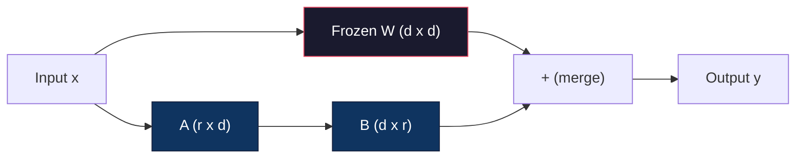
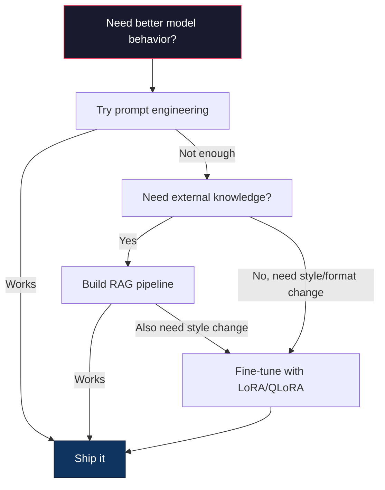

# Fine-Tuning với LoRA & QLoRA

> Việc fine-tuning toàn bộ (full fine-tuning) một model 7B đòi hỏi 56GB VRAM. Bạn không có đủ tài nguyên đó. Hầu hết các công ty cũng vậy. LoRA cho phép bạn fine-tune cùng một model đó chỉ với 6GB bằng cách huấn luyện chưa đến 1% số lượng tham số. Đây không phải là một sự đánh đổi -- nó đạt chất lượng tương đương với full fine-tuning trong hầu hết các tác vụ. Toàn bộ hệ sinh thái fine-tuning mã nguồn mở đều vận hành dựa trên thủ thuật này.

**Type:** Build
**Languages:** Python
**Prerequisites:** Phase 10, Lesson 06 (Instruction Tuning / SFT)
**Time:** ~75 phút
**Related:** Phase 10 bao gồm các vòng lặp SFT/DPO từ đầu. Bài học này tích hợp chúng vào các bộ công cụ PEFT năm 2026 (PEFT, TRL, Unsloth, Axolotl, LLaMA-Factory).

## Mục tiêu học tập

- Triển khai LoRA bằng cách chèn các ma trận adapter hạng thấp (A và B) vào các lớp attention của một model đã được huấn luyện trước.
- Tính toán mức tiết kiệm tham số của LoRA so với full fine-tuning: hạng r với kích thước d_model huấn luyện 2*r*d tham số thay vì d^2.
- Fine-tune model sử dụng QLoRA (base model được lượng tử hóa 4-bit + LoRA adapters) để phù hợp với bộ nhớ GPU phổ thông.
- Hợp nhất (merge) trọng số LoRA trở lại base model để triển khai và so sánh tốc độ inference khi có và không có adapter.

## Vấn đề

Bạn có một base model, ví dụ Llama 3 8B. Bạn muốn nó trả lời các phiếu hỗ trợ khách hàng theo văn phong của công ty bạn. SFT là câu trả lời. Nhưng SFT gặp vấn đề về chi phí.

Full fine-tuning cập nhật mọi tham số trong model. Llama 3 8B có 8 tỷ tham số. Ở định dạng fp16, mỗi tham số chiếm 2 byte. Chỉ riêng việc tải trọng số đã tốn 16GB. Trong quá trình huấn luyện, bạn còn cần gradient (16GB), trạng thái optimizer cho Adam (32GB cho momentum + variance) và các activation. Tổng cộng: khoảng 56GB VRAM cho một model 8B duy nhất.

Một chiếc A100 80GB gần như không thể chứa nổi. Hai chiếc A100 tốn $3-4/hour on cloud providers. Training for 3 epochs on 50,000 examples takes 6-10 hours. That's $30-40 mỗi thí nghiệm. Chạy 10 thí nghiệm để tinh chỉnh siêu tham số (hyperparameters) và bạn đã tiêu tốn 400 đô la trước khi triển khai bất cứ thứ gì.

Mở rộng quy mô lên Llama 3 70B và các con số trở nên vô lý. 140GB chỉ riêng cho trọng số. Bạn cần một cụm máy chủ. Hơn 100 đô la mỗi thí nghiệm.

Ngoài ra còn có một vấn đề sâu xa hơn. Full fine-tuning sửa đổi mọi trọng số trong model. Nếu bạn fine-tune trên dữ liệu hỗ trợ khách hàng, bạn có thể làm suy giảm khả năng tổng quát của model. Nó được gọi là "catastrophic forgetting" (quên lãng thảm họa). Model trở nên giỏi hơn trong tác vụ của bạn nhưng lại tệ hơn ở mọi thứ khác.

Bạn cần một phương pháp huấn luyện ít tham số hơn, sử dụng ít bộ nhớ hơn và không phá hủy kiến thức hiện có của model.

## Khái niệm

### LoRA: Low-Rank Adaptation

Edward Hu và các đồng nghiệp tại Microsoft đã công bố LoRA vào tháng 6 năm 2021. Điểm sáng của bài báo: các cập nhật trọng số trong quá trình fine-tuning có hạng nội tại (intrinsic rank) thấp. Bạn không cần cập nhật tất cả 16,7 triệu tham số trong ma trận trọng số 4096x4096. Thông tin hữu ích trong bản cập nhật có thể được nắm bắt bởi một ma trận có hạng 16 hoặc 32.

Đây là toán học. Một lớp linear tiêu chuẩn tính toán:

```
y = Wx
```

Trong đó W là ma trận d_out x d_in. Đối với một phép chiếu attention 4096x4096, đó là 16.777.216 tham số.

LoRA đóng băng W và thêm một phân rã hạng thấp:

```
y = Wx + BAx
```

Trong đó B là (d_out x r) và A là (r x d_in). Hạng r nhỏ hơn nhiều so với d -- thường là 8, 16 hoặc 32.

Với r=16 trên lớp 4096x4096:
- Tham số gốc: 4096 x 4096 = 16.777.216
- Tham số LoRA: (4096 x 16) + (16 x 4096) = 65.536 + 65.536 = 131.072
- Giảm thiểu: 131.072 / 16.777.216 = 0,78%

Bạn đang huấn luyện 0,78% số tham số và đạt được 95-100% chất lượng.



A được khởi tạo bằng phân phối Gaussian ngẫu nhiên. B được khởi tạo bằng 0. Điều này có nghĩa là đóng góp của LoRA bắt đầu bằng 0 -- model bắt đầu huấn luyện từ hành vi gốc của nó và dần dần học được sự thích nghi.

### Hệ số tỉ lệ: Alpha

LoRA giới thiệu một hệ số tỉ lệ alpha kiểm soát mức độ ảnh hưởng của cập nhật hạng thấp đến đầu ra:

```
y = Wx + (alpha / r) * BAx
```

Khi alpha = r, tỉ lệ là 1x. Khi alpha = 2r (mặc định phổ biến), tỉ lệ là 2x. Siêu tham số này kiểm soát tốc độ học (learning rate) của nhánh LoRA độc lập với tốc độ học của base model.

Hướng dẫn thực tế:
- alpha = 2 * rank là quy ước cộng đồng phổ biến (bài báo gốc sử dụng alpha = rank trong hầu hết các thí nghiệm).
- alpha = rank cho tỉ lệ 1x, bảo thủ nhưng ổn định.
- Alpha cao hơn có nghĩa là cập nhật lớn hơn mỗi bước, có thể tăng tốc hội tụ hoặc gây mất ổn định.

### Nơi áp dụng LoRA

Một transformer có nhiều lớp linear. Bạn không cần thêm LoRA vào tất cả chúng. Bài báo gốc đã thử nghiệm các kết hợp khác nhau:

| Các lớp mục tiêu | Tham số huấn luyện được (7B) | Chất lượng |
|--------------|----------------------|---------|
| q_proj chỉ | 4,7M | Tốt |
| q_proj + v_proj | 9,4M | Tốt hơn |
| q_proj + k_proj + v_proj + o_proj | 18,9M | Tốt nhất cho attention |
| Tất cả linear (attention + MLP) | 37,7M | Lợi ích nhỏ, gấp đôi tham số |

Điểm ngọt (sweet spot) cho hầu hết các tác vụ: q_proj + v_proj. Điều này nhắm vào các phép chiếu query và value trong self-attention, vốn kiểm soát những gì model chú ý và thông tin nào nó trích xuất. Thêm các lớp MLP giúp ích cho các tác vụ phức tạp như tạo mã nguồn nhưng làm tăng gấp đôi số lượng tham số với lợi ích giảm dần trên các tác vụ đơn giản hơn.

### Lựa chọn hạng (Rank)

Hạng r kiểm soát khả năng biểu đạt của sự thích nghi:

| Hạng | Tham số huấn luyện được (mỗi lớp) | Tốt nhất cho |
|------|---------------------------|----------|
| 4 | 32.768 | Phân loại đơn giản, sentiment |
| 8 | 65.536 | Q&A đơn miền, tóm tắt |
| 16 | 131.072 | Tác vụ đa miền, tuân thủ hướng dẫn |
| 32 | 262.144 | Suy luận phức tạp, tạo mã nguồn |
| 64 | 524.288 | Lợi ích giảm dần cho hầu hết tác vụ |
| 128 | 1.048.576 | Hiếm khi cần thiết |

Hu và cộng sự đã chỉ ra rằng r=4 đã nắm bắt được hầu hết sự thích nghi cho các tác vụ đơn giản. r=8 và r=16 là những lựa chọn phổ biến nhất trong thực tế. Vượt quá r=64 hiếm khi cải thiện chất lượng và bắt đầu làm mất lợi thế bộ nhớ của LoRA.

### QLoRA: Lượng tử hóa 4-bit + LoRA

Tim Dettmers và các đồng nghiệp tại Đại học Washington đã công bố QLoRA vào tháng 5 năm 2023. Ý tưởng: lượng tử hóa base model đã đóng băng xuống độ chính xác 4-bit, sau đó gắn các LoRA adapter ở định dạng fp16 lên trên.

Điều này thay đổi phương trình bộ nhớ một cách đáng kể:

| Phương pháp | Bộ nhớ trọng số (7B) | Bộ nhớ huấn luyện (7B) | Yêu cầu GPU |
|--------|-------------------|---------------------|-------------|
| Full fine-tune (fp16) | 14GB | ~56GB | 1x A100 80GB |
| LoRA (fp16 base) | 14GB | ~18GB | 1x A100 40GB |
| QLoRA (4-bit base) | 3,5GB | ~6GB | 1x RTX 3090 24GB |

QLoRA đóng góp ba cải tiến kỹ thuật:

**NF4 (Normal Float 4-bit)**: Một kiểu dữ liệu mới được thiết kế đặc biệt cho trọng số mạng thần kinh. Trọng số mạng thần kinh tuân theo phân phối chuẩn. NF4 đặt 16 mức lượng tử hóa của nó tại các phân vị của phân phối chuẩn tiêu chuẩn. Đây là tối ưu về mặt lý thuyết thông tin cho dữ liệu phân phối chuẩn. Nó mất ít thông tin hơn so với lượng tử hóa 4-bit đồng nhất (INT4) hoặc Float4 tiêu chuẩn.

**Lượng tử hóa kép (Double quantization)**: Bản thân các hằng số lượng tử hóa cũng chiếm bộ nhớ. Mỗi khối 64 trọng số cần một hệ số tỉ lệ fp32 (4 byte). Đối với model 7B, đó là thêm 0,4GB. Lượng tử hóa kép lượng tử hóa các hằng số này xuống fp8, giảm chi phí xuống còn 0,1GB. Nhỏ nhưng tích lũy lại thì đáng kể.

**Paged optimizers**: Trong quá trình huấn luyện, trạng thái optimizer (momentum và variance của Adam) có thể vượt quá bộ nhớ GPU trên các chuỗi dài. Paged optimizers sử dụng bộ nhớ thống nhất của NVIDIA để tự động chuyển trạng thái optimizer sang RAM CPU khi bộ nhớ GPU cạn kiệt và chuyển ngược lại khi cần. Điều này ngăn chặn lỗi OOM (Out of Memory) với cái giá là giảm một chút thông lượng.

### Câu hỏi về chất lượng

Việc giảm tham số hoặc lượng tử hóa base model có làm giảm chất lượng không? Kết quả từ nhiều bài báo:

| Phương pháp | MMLU (5-shot) | MT-Bench | HumanEval |
|--------|--------------|----------|-----------|
| Full fine-tune (Llama 2 7B) | 48,3 | 6,72 | 14,6 |
| LoRA r=16 | 47,9 | 6,68 | 14,0 |
| QLoRA r=16 (NF4) | 47,5 | 6,61 | 13,4 |
| QLoRA r=64 (NF4) | 48,1 | 6,70 | 14,2 |

LoRA ở r=16 nằm trong khoảng 1% so với full fine-tune trên hầu hết các benchmark. QLoRA ở r=16 mất thêm một phần trăm nhỏ. QLoRA ở r=64 về cơ bản khớp với full fine-tune trong khi sử dụng ít hơn 90% bộ nhớ.

### Chi phí thực tế

Fine-tuning Llama 3 8B trên 50.000 ví dụ (3 epochs):

| Phương pháp | GPU | Thời gian | Chi phí |
|--------|-----|------|------|
| Full fine-tune | 2x A100 80GB | 8 giờ | ~$32 |
| LoRA r=16 | 1x A100 40GB | 4 giờ | ~$8 |
| QLoRA r=16 | 1x RTX 4090 24GB | 6 giờ | ~$5 |
| QLoRA r=16 (Unsloth) | 1x RTX 4090 24GB | 2,5 giờ | ~$2 |
| QLoRA r=16 | 1x T4 16GB | 12 giờ | ~$4 |

QLoRA trên một GPU phổ thông tốn ít hơn một bữa trưa. Đây là lý do tại sao cộng đồng fine-tuning mã nguồn mở bùng nổ vào năm 2023 và tại sao mọi framework huấn luyện dưới đây đều mặc định sử dụng QLoRA vào năm 2026.

### Stack PEFT năm 2026

| Framework | Nó là gì | Chọn khi nào |
|-----------|-----------|-----------|
| **Hugging Face PEFT** | Thư viện LoRA/QLoRA/DoRA/IA3 chính thống | Bạn muốn kiểm soát thô và vòng lặp huấn luyện đã ở trên `transformers.Trainer` |
| **TRL** | Các trainer học tăng cường từ phản hồi của HF (SFT, DPO, GRPO, PPO, ORPO) | Bạn cần DPO/GRPO sau SFT; được xây dựng trên PEFT |
| **Unsloth** | Viết lại Triton-kernel cho forward/backward pass | Bạn muốn tăng tốc 2-5x + giảm một nửa VRAM mà không mất độ chính xác; họ Llama/Mistral/Qwen |
| **Axolotl** | Wrapper cấu hình YAML trên PEFT + TRL + DeepSpeed + Unsloth | Bạn muốn các đợt huấn luyện có thể tái lập, kiểm soát phiên bản |
| **LLaMA-Factory** | GUI/CLI/API trên PEFT + TRL | Bạn muốn fine-tuning không cần code; hỗ trợ 100+ họ model |
| **torchtune** | Các công thức PyTorch gốc, không phụ thuộc `transformers` | Bạn muốn tối thiểu phụ thuộc và tổ chức của bạn đã chuẩn hóa trên PyTorch |

Quy tắc ngón tay cái: sử dụng nghiên cứu hoặc thí nghiệm một lần → PEFT. Pipeline sản xuất có thể lặp lại → Axolotl với các kernel Unsloth được bật. Tạo mẫu nhanh → LLaMA-Factory.

### Hợp nhất (Merge) Adapters

Sau khi huấn luyện, bạn có hai thứ: base model đã đóng băng và một LoRA adapter nhỏ (thường là 10-100MB). Bạn có thể:

1. **Giữ chúng riêng biệt**: Tải base model, tải adapter lên trên. Hoán đổi adapter cho các tác vụ khác nhau. Đây là cách bạn phục vụ nhiều biến thể fine-tuned từ một base model.

2. **Hợp nhất vĩnh viễn**: Tính toán W' = W + (alpha/r) * BA và lưu kết quả dưới dạng một model đầy đủ mới. Model đã hợp nhất có cùng kích thước với bản gốc. Không có chi phí inference. Không cần quản lý adapter.

Để phục vụ nhiều tác vụ (adapter hỗ trợ khách hàng, adapter code, adapter dịch thuật), hãy giữ chúng riêng biệt. Để triển khai một model chuyên biệt duy nhất, hãy hợp nhất.

Các kỹ thuật hợp nhất nâng cao để kết hợp nhiều adapter:

- **TIES-Merging** (Yadav và cộng sự 2023): Cắt tỉa các tham số có độ lớn nhỏ, giải quyết xung đột dấu, sau đó hợp nhất. Giảm nhiễu giữa các adapter.
- **DARE** (Yu và cộng sự 2023): Loại bỏ ngẫu nhiên các tham số adapter trước khi hợp nhất và tỉ lệ lại phần còn lại. Hiệu quả đáng ngạc nhiên trong việc kết hợp các khả năng.
- **Task arithmetic**: Đơn giản là cộng hoặc trừ các trọng số adapter. Thêm một adapter "code" và một adapter "math" thường tạo ra một model giỏi cả hai.

### Khi nào KHÔNG nên Fine-Tune

Fine-tuning là lựa chọn thứ ba, không phải đầu tiên.

**Thứ nhất: prompt engineering.** Viết một system prompt tốt hơn. Thêm các ví dụ few-shot. Sử dụng chain-of-thought. Việc này không tốn kém và chỉ mất vài phút. Nếu prompting giúp bạn đạt được 80% mục tiêu, bạn có lẽ không cần fine-tune.

**Thứ hai: RAG.** Nếu model cần biết về dữ liệu cụ thể của bạn (tài liệu, cơ sở tri thức, danh mục sản phẩm), truy xuất (retrieval) rẻ hơn và dễ bảo trì hơn là đưa nó vào trọng số. Xem Bài học 06.

**Thứ ba: fine-tuning.** Sử dụng phương pháp này khi bạn cần model áp dụng một phong cách, định dạng hoặc mô hình suy luận cụ thể mà không thể đạt được thông qua prompting. Khi bạn cần đầu ra có cấu trúc nhất quán. Khi bạn cần chưng cất (distill) một model lớn hơn thành một model nhỏ hơn. Khi độ trễ quan trọng và bạn không thể chi trả cho các token bổ sung từ few-shot prompting.



```figure
lora-params
```

## Xây dựng

Chúng ta triển khai LoRA từ đầu bằng PyTorch thuần túy. Không thư viện. Không phép thuật. Bạn sẽ xây dựng lớp LoRA, chèn nó vào model, huấn luyện và hợp nhất các trọng số trở lại.

### Bước 1: Lớp LoRA

```python
import torch
import torch.nn as nn
import math

class LoRALayer(nn.Module):
    def __init__(self, in_features, out_features, rank=8, alpha=16):
        super().__init__()
        self.rank = rank
        self.alpha = alpha
        self.scaling = alpha / rank

        self.A = nn.Parameter(torch.randn(in_features, rank) * (1 / math.sqrt(rank)))
        self.B = nn.Parameter(torch.zeros(rank, out_features))

    def forward(self, x):
        return (x @ self.A @ self.B) * self.scaling
```

A được khởi tạo bằng các giá trị ngẫu nhiên đã tỉ lệ. B được khởi tạo bằng 0. Tích BA bắt đầu bằng 0, vì vậy model bắt đầu với hành vi gốc của nó.

### Bước 2: Lớp Linear được bọc LoRA

```python
class LinearWithLoRA(nn.Module):
    def __init__(self, linear, rank=8, alpha=16):
        super().__init__()
        self.linear = linear
        self.lora = LoRALayer(
            linear.in_features, linear.out_features, rank, alpha
        )

        for param in self.linear.parameters():
            param.requires_grad = False

    def forward(self, x):
        return self.linear(x) + self.lora(x)
```

Lớp linear gốc bị đóng băng. Chỉ các tham số LoRA (A và B) là có thể huấn luyện.

### Bước 3: Chèn LoRA vào Model

```python
def inject_lora(model, target_modules, rank=8, alpha=16):
    for param in model.parameters():
        param.requires_grad = False

    lora_layers = {}
    for name, module in model.named_modules():
        if isinstance(module, nn.Linear):
            if any(t in name for t in target_modules):
                parent_name = ".".join(name.split(".")[:-1])
                child_name = name.split(".")[-1]
                parent = dict(model.named_modules())[parent_name]
                lora_linear = LinearWithLoRA(module, rank, alpha)
                setattr(parent, child_name, lora_linear)
                lora_layers[name] = lora_linear
    return lora_layers
```

Đầu tiên, đóng băng mọi tham số trong model. Sau đó duyệt cây model, tìm các lớp linear khớp với tên mục tiêu của bạn và thay thế chúng bằng các phiên bản bọc LoRA. Các ma trận LoRA A và B là những tham số duy nhất có thể huấn luyện trong toàn bộ model.

### Bước 4: Đếm tham số

```python
def count_parameters(model):
    total = sum(p.numel() for p in model.parameters())
    trainable = sum(p.numel() for p in model.parameters() if p.requires_grad)
    frozen = total - trainable
    return {
        "total": total,
        "trainable": trainable,
        "frozen": frozen,
        "trainable_pct": 100 * trainable / total if total > 0 else 0
    }
```

### Bước 5: Hợp nhất trọng số trở lại

```python
def merge_lora_weights(model):
    for name, module in model.named_modules():
        if isinstance(module, LinearWithLoRA):
            with torch.no_grad():
                merged = (
                    module.lora.A @ module.lora.B
                ) * module.lora.scaling
                module.linear.weight.data += merged.T
            parent_name = ".".join(name.split(".")[:-1])
            child_name = name.split(".")[-1]
            if parent_name:
                parent = dict(model.named_modules())[parent_name]
            else:
                parent = model
            setattr(parent, child_name, module.linear)
```

Sau khi hợp nhất, các lớp LoRA biến mất. Model có cùng kích thước với bản gốc với sự thích nghi được "nướng" vào trọng số. Không có chi phí inference.

### Bước 6: Lượng tử hóa QLoRA mô phỏng

```python
def quantize_to_nf4(tensor, block_size=64):
    blocks = tensor.reshape(-1, block_size)
    scales = blocks.abs().max(dim=1, keepdim=True).values / 7.0
    scales = torch.clamp(scales, min=1e-8)
    quantized = torch.round(blocks / scales).clamp(-8, 7).to(torch.int8)
    return quantized, scales

def dequantize_from_nf4(quantized, scales, original_shape):
    dequantized = quantized.float() * scales
    return dequantized.reshape(original_shape)
```

Điều này mô phỏng lượng tử hóa 4-bit bằng cách ánh xạ trọng số vào 16 mức rời rạc trong các khối 64. QLoRA sản xuất sử dụng thư viện bitsandbytes cho NF4 thực sự trên GPU.

### Bước 7: Vòng lặp huấn luyện

```python
def train_lora(model, data, epochs=5, lr=1e-3, batch_size=4):
    optimizer = torch.optim.AdamW(
        [p for p in model.parameters() if p.requires_grad], lr=lr
    )
    criterion = nn.MSELoss()

    losses = []
    for epoch in range(epochs):
        epoch_loss = 0.0
        n_batches = 0
        indices = torch.randperm(len(data["inputs"]))

        for i in range(0, len(indices), batch_size):
            batch_idx = indices[i:i + batch_size]
            x = data["inputs"][batch_idx]
            y = data["targets"][batch_idx]

            output = model(x)
            loss = criterion(output, y)

            optimizer.zero_grad()
            loss.backward()
            optimizer.step()

            epoch_loss += loss.item()
            n_batches += 1

        avg_loss = epoch_loss / n_batches
        losses.append(avg_loss)

    return losses
```

### Bước 8: Demo đầy đủ

```python
def demo():
    torch.manual_seed(42)
    d_model = 256
    n_classes = 10

    model = nn.Sequential(
        nn.Linear(d_model, 512),
        nn.ReLU(),
        nn.Linear(512, 512),
        nn.ReLU(),
        nn.Linear(512, n_classes),
    )

    n_samples = 500
    x = torch.randn(n_samples, d_model)
    y = torch.randint(0, n_classes, (n_samples,))
    y_onehot = torch.zeros(n_samples, n_classes).scatter_(1, y.unsqueeze(1), 1.0)

    data = {"inputs": x, "targets": y_onehot}

    params_before = count_parameters(model)

    lora_layers = inject_lora(
        model, target_modules=["0", "2"], rank=8, alpha=16
    )

    params_after = count_parameters(model)

    losses = train_lora(model, data, epochs=20, lr=1e-3)

    merge_lora_weights(model)
    params_merged = count_parameters(model)

    return {
        "params_before": params_before,
        "params_after": params_after,
        "params_merged": params_merged,
        "losses": losses,
    }
```

Demo tạo một model nhỏ, chèn LoRA vào hai lớp, huấn luyện và hợp nhất các trọng số trở lại. Số lượng tham số giảm từ toàn bộ có thể huấn luyện xuống còn ~1% có thể huấn luyện trong quá trình huấn luyện LoRA, sau đó trở lại kiến trúc ban đầu sau khi hợp nhất.

## Sử dụng

Với hệ sinh thái Hugging Face, LoRA trên một model thực tế mất khoảng 20 dòng:

```python
from transformers import AutoModelForCausalLM, AutoTokenizer
from peft import LoraConfig, get_peft_model, TaskType

model = AutoModelForCausalLM.from_pretrained("meta-llama/Llama-3.1-8B")
tokenizer = AutoTokenizer.from_pretrained("meta-llama/Llama-3.1-8B")

lora_config = LoraConfig(
    task_type=TaskType.CAUSAL_LM,
    r=16,
    lora_alpha=32,
    lora_dropout=0.05,
    target_modules=["q_proj", "v_proj"],
)

model = get_peft_model(model, lora_config)
model.print_trainable_parameters()
```

Đối với QLoRA, thêm lượng tử hóa bitsandbytes:

```python
from transformers import BitsAndBytesConfig

bnb_config = BitsAndBytesConfig(
    load_in_4bit=True,
    bnb_4bit_quant_type="nf4",
    bnb_4bit_compute_dtype=torch.bfloat16,
    bnb_4bit_use_double_quant=True,
)

model = AutoModelForCausalLM.from_pretrained(
    "meta-llama/Llama-3.1-8B",
    quantization_config=bnb_config,
    device_map="auto",
)

model = get_peft_model(model, lora_config)
```

Chỉ vậy thôi. Cùng một vòng lặp huấn luyện. Cùng một pipeline dữ liệu. Base model bây giờ sống ở 4-bit, LoRA adapters huấn luyện ở fp16 và toàn bộ mọi thứ vừa vặn trong 6GB.

Để huấn luyện với Hugging Face Trainer:

```python
from transformers import TrainingArguments, Trainer
from datasets import load_dataset

dataset = load_dataset("tatsu-lab/alpaca", split="train[:5000]")

training_args = TrainingArguments(
    output_dir="./lora-llama",
    num_train_epochs=3,
    per_device_train_batch_size=4,
    gradient_accumulation_steps=4,
    learning_rate=2e-4,
    fp16=True,
    logging_steps=10,
    save_strategy="epoch",
    optim="paged_adamw_8bit",
)

trainer = Trainer(
    model=model,
    args=training_args,
    train_dataset=dataset,
)

trainer.train()

model.save_pretrained("./lora-adapter")
```

Adapter đã lưu có kích thước 10-100MB. Base model vẫn không bị chạm vào. Bạn có thể chia sẻ adapter trên Hugging Face Hub mà không cần phân phối lại toàn bộ model.

## Triển khai

Bài học này tạo ra:
- `outputs/prompt-lora-advisor.md` -- một prompt giúp bạn quyết định hạng LoRA, các module mục tiêu và siêu tham số cho tác vụ cụ thể của bạn.
- `outputs/skill-fine-tuning-guide.md` -- một kỹ năng dạy các agent cây quyết định về thời điểm và cách thức fine-tune.

## Bài tập

1. **Nghiên cứu cắt tỉa hạng (Rank ablation).** Chạy demo với các hạng 2, 4, 8, 16, 32 và 64. Vẽ biểu đồ loss cuối cùng so với hạng. Tìm điểm lợi ích giảm dần nơi việc tăng gấp đôi hạng không còn làm giảm một nửa loss. Đối với tác vụ phân loại đơn giản trên các đặc trưng 256-dim, điều này sẽ nằm ở khoảng r=8-16.

2. **So sánh module mục tiêu.** Sửa đổi inject_lora để chỉ nhắm vào lớp "0", chỉ lớp "2", chỉ lớp "4" và cả ba. Huấn luyện mỗi biến thể trong 20 epochs. So sánh tốc độ hội tụ và loss cuối cùng. Điều này phản ánh quyết định thực tế về việc nhắm vào q_proj so với v_proj so với tất cả các lớp linear.

3. **Phân tích lỗi lượng tử hóa.** Lấy các ma trận trọng số của model đã huấn luyện trước và sau khi quantize_to_nf4 / dequantize_from_nf4. Tính sai số bình phương trung bình (MSE), sai số tuyệt đối tối đa và mối tương quan giữa trọng số gốc và trọng số được tái tạo. Thử nghiệm với các giá trị block_size là 32, 64, 128 và 256.

4. **Phục vụ đa adapter.** Huấn luyện hai LoRA adapter trên các tập con dữ liệu khác nhau (chỉ số chẵn so với chỉ số lẻ). Lưu cả hai adapter. Tải base model một lần, sau đó hoán đổi adapter và xác minh rằng mỗi adapter tạo ra các đầu ra khác nhau trên cùng một đầu vào. Đây là cách các hệ thống sản xuất phục vụ nhiều model fine-tuned từ một base.

5. **Inference hợp nhất so với chưa hợp nhất.** So sánh đầu ra của model LoRA trước và sau khi merge_lora_weights trên cùng 100 đầu vào. Xác minh các đầu ra là giống hệt nhau (trong phạm vi dung sai dấu phẩy động 1e-5). Sau đó benchmark tốc độ inference cho cả hai -- bản hợp nhất sẽ nhanh hơn một chút vì nó là một phép nhân ma trận đơn lẻ thay vì hai.

## Thuật ngữ chính

| Thuật ngữ | Mọi người nói | Ý nghĩa thực sự |
|------|----------------|----------------------|
| LoRA | "Fine-tuning hiệu quả" | Low-Rank Adaptation: đóng băng trọng số gốc, huấn luyện hai ma trận nhỏ A và B có tích xấp xỉ cập nhật trọng số đầy đủ |
| QLoRA | "Fine-tune trên laptop" | Quantized LoRA: tải base model ở 4-bit NF4, huấn luyện LoRA adapter ở fp16 bên trên, cho phép fine-tuning 7B trong 6GB VRAM |
| Hạng (r) | "Model học được bao nhiêu" | Kích thước bên trong của ma trận A và B; kiểm soát khả năng biểu đạt so với số lượng tham số |
| Alpha | "Tốc độ học LoRA" | Hệ số tỉ lệ áp dụng cho đầu ra LoRA; alpha/r tỉ lệ đóng góp của sự thích nghi vào đầu ra cuối cùng |
| NF4 | "Lượng tử hóa 4-bit" | Normal Float 4: kiểu dữ liệu 4-bit với các mức lượng tử hóa tại các phân vị phân phối chuẩn, tối ưu cho trọng số mạng thần kinh |
| Adapter | "Phần nhỏ được huấn luyện" | Các ma trận LoRA A và B được lưu dưới dạng tệp riêng biệt (10-100MB), có thể tải lên trên bất kỳ bản sao nào của base model |
| Module mục tiêu | "Các lớp nào để LoRA" | Các lớp linear cụ thể (q_proj, v_proj, v.v.) nơi các LoRA adapter được chèn vào |
| Hợp nhất (Merging) | "Nướng nó vào" | Tính toán W + (alpha/r) * BA và thay thế trọng số gốc, loại bỏ chi phí adapter khi inference |
| Paged optimizers | "Không OOM khi huấn luyện" | Chuyển trạng thái optimizer (Adam momentum, variance) sang CPU khi bộ nhớ GPU cạn kiệt |
| Catastrophic forgetting | "Fine-tuning làm hỏng mọi thứ" | Khi cập nhật tất cả trọng số khiến model mất đi các khả năng đã học trước đó |

## Đọc thêm

- Hu và cộng sự, "LoRA: Low-Rank Adaptation of Large Language Models" (2021) -- bài báo gốc giới thiệu phương pháp phân rã hạng thấp, được thử nghiệm trên GPT-3 175B với hạng thấp tới 4.
- Dettmers và cộng sự, "QLoRA: Efficient Finetuning of Quantized Language Models" (2023) -- giới thiệu NF4, lượng tử hóa kép và paged optimizers, cho phép fine-tuning 65B trên một GPU 48GB duy nhất.
- Tài liệu thư viện PEFT (huggingface.co/docs/peft) -- thư viện tiêu chuẩn cho LoRA, QLoRA và các phương pháp hiệu quả về tham số khác trong hệ sinh thái Hugging Face.
- Yadav và cộng sự, "TIES-Merging: Resolving Interference When Merging Models" (2023) -- các kỹ thuật kết hợp nhiều LoRA adapter mà không làm giảm chất lượng.
- [Rafailov và cộng sự, "Direct Preference Optimization: Your Language Model is Secretly a Reward Model" (NeurIPS 2023)](https://arxiv.org/abs/2305.18290) -- dẫn xuất DPO; giai đoạn tinh chỉnh ưu tiên diễn ra sau SFT, không cần reward model.
- [Tài liệu TRL](https://huggingface.co/docs/trl/) -- tham chiếu chính thức cho `SFTTrainer`, `DPOTrainer`, `KTOTrainer` và bề mặt tích hợp với PEFT/bitsandbytes/Unsloth.
- [Tài liệu Unsloth](https://docs.unsloth.ai/) -- các kernel hợp nhất giúp tăng gấp đôi thông lượng fine-tuning và giảm một nửa bộ nhớ; lớp hiệu suất bên dưới TRL.
- [Tài liệu Axolotl](https://axolotl-ai-cloud.github.io/axolotl/) -- trainer SFT/DPO/QLoRA đa GPU cấu hình bằng YAML; giải pháp thay thế config-as-code cho các script viết tay.