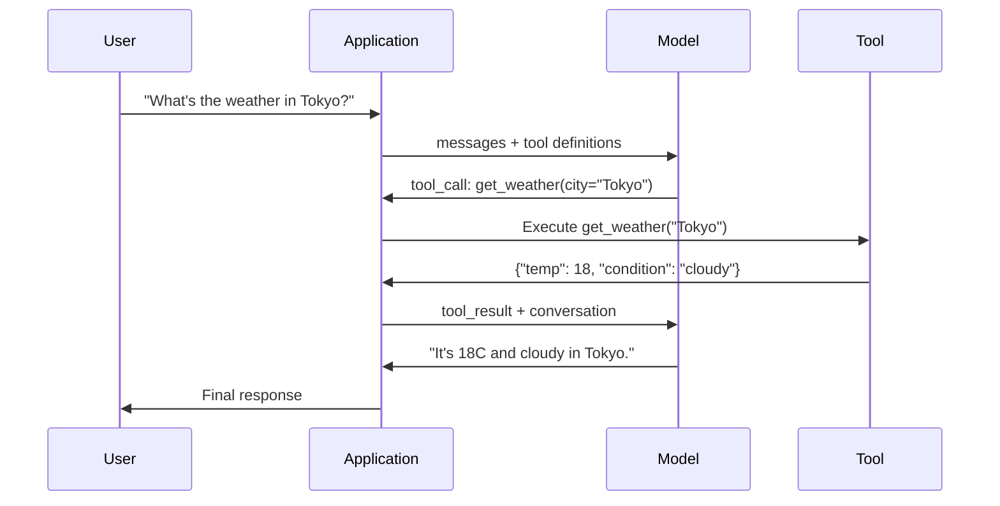

# Function Calling & Tool Use

> LLMs không thể làm gì cả. Chúng chỉ tạo ra văn bản. Đó là toàn bộ khả năng của chúng. Chúng không thể kiểm tra thời tiết, truy vấn cơ sở dữ liệu, gửi email, chạy mã nguồn hay đọc tệp tin. Mọi "AI agent" mà bạn từng thấy đều là một LLM tạo ra JSON chỉ định hàm nào cần gọi -- và sau đó mã nguồn của bạn thực sự thực thi hàm đó. Mô hình là bộ não. Công cụ (Tools) là đôi tay. Function calling là hệ thần kinh kết nối chúng.

**Type:** Build
**Languages:** Python
**Prerequisites:** Phase 11 Lesson 03 (Structured Outputs)
**Time:** ~75 phút
**Related:** Phase 11 · 14 (Model Context Protocol) — khi một công cụ được chia sẻ giữa các host, hãy nâng cấp từ function-calling nội tuyến lên MCP server. Bài học này bao gồm trường hợp nội tuyến; MCP bao gồm trường hợp giao thức.

## Mục tiêu học tập

- Triển khai vòng lặp function calling: định nghĩa schema công cụ, phân tích cú pháp JSON gọi hàm của mô hình, thực thi hàm và trả về kết quả
- Thiết kế schema công cụ với mô tả rõ ràng và các tham số có kiểu dữ liệu cụ thể mà mô hình có thể gọi một cách đáng tin cậy
- Xây dựng vòng lặp agent đa lượt (multi-turn) để xâu chuỗi nhiều lệnh gọi hàm nhằm trả lời các truy vấn phức tạp
- Xử lý các trường hợp biên của function calling: gọi công cụ song song, lan truyền lỗi và ngăn chặn vòng lặp công cụ vô hạn

## Vấn đề

Bạn xây dựng một chatbot. Người dùng hỏi: "Thời tiết ở Tokyo hiện tại thế nào?"

Mô hình phản hồi: "Tôi không có quyền truy cập vào dữ liệu thời tiết thời gian thực, nhưng dựa trên mùa, Tokyo có thể khoảng 15 độ C..."

Đó là một sự ảo tưởng (hallucination) được ngụy trang bằng một lời khước từ trách nhiệm. Mô hình không biết thời tiết. Nó sẽ không bao giờ biết. Thời tiết thay đổi hàng giờ. Dữ liệu huấn luyện của mô hình đã cũ hàng tháng.

Câu trả lời đúng đòi hỏi phải gọi API OpenWeatherMap, lấy nhiệt độ hiện tại và trả về con số thực. Mô hình không thể gọi API. Mã nguồn của bạn thì có thể. Mảnh ghép còn thiếu: một giao thức có cấu trúc cho phép mô hình nói "Tôi cần gọi API thời tiết với các đối số này" và cho phép mã nguồn của bạn thực thi nó rồi nạp kết quả ngược lại.

Đây chính là function calling. Mô hình xuất ra JSON có cấu trúc mô tả hàm nào cần gọi với đối số nào. Ứng dụng của bạn thực thi hàm đó. Kết quả quay trở lại cuộc hội thoại. Mô hình sử dụng kết quả đó để tạo ra câu trả lời cuối cùng.

Nếu không có function calling, LLM chỉ là những cuốn bách khoa toàn thư. Với nó, chúng trở thành các agent.

## Khái niệm

### Vòng lặp Function Calling

Mọi tương tác sử dụng công cụ đều tuân theo vòng lặp 5 bước giống nhau.



Bước 1: người dùng gửi tin nhắn. Bước 2: mô hình nhận tin nhắn cùng với các định nghĩa công cụ (JSON Schema mô tả các hàm khả dụng). Bước 3: thay vì phản hồi bằng văn bản, mô hình xuất ra một lệnh gọi công cụ -- một đối tượng JSON có cấu trúc với tên hàm và các đối số. Bước 4: mã nguồn của bạn thực thi hàm và thu thập kết quả. Bước 5: kết quả quay trở lại mô hình, lúc này đã có dữ liệu thực để tạo ra câu trả lời cuối cùng.

Mô hình không bao giờ thực thi bất cứ điều gì. Nó chỉ quyết định gọi cái gì và với đối số nào. Mã nguồn của bạn mới là bộ thực thi.

### Định nghĩa công cụ: Hợp đồng JSON Schema

Mỗi công cụ được định nghĩa bởi một JSON Schema cho mô hình biết hàm đó làm gì, nó nhận các đối số nào và các đối số đó phải thuộc kiểu dữ liệu gì.

```json
{
  "type": "function",
  "function": {
    "name": "get_weather",
    "description": "Get current weather for a city. Returns temperature in Celsius and conditions.",
    "parameters": {
      "type": "object",
      "properties": {
        "city": {
          "type": "string",
          "description": "City name, e.g. 'Tokyo' or 'San Francisco'"
        },
        "units": {
          "type": "string",
          "enum": ["celsius", "fahrenheit"],
          "description": "Temperature units"
        }
      },
      "required": ["city"]
    }
  }
}
```

Các trường `description` là rất quan trọng. Mô hình đọc chúng để quyết định khi nào và làm thế nào để sử dụng công cụ. Một mô tả mơ hồ như "lấy thời tiết" sẽ tạo ra lựa chọn công cụ kém hơn so với "Lấy thời tiết hiện tại cho một thành phố. Trả về nhiệt độ theo độ C và các điều kiện thời tiết." Mô tả chính là một prompt để lựa chọn công cụ.

### So sánh các nhà cung cấp

Mọi nhà cung cấp lớn đều hỗ trợ function calling, nhưng bề mặt API lại khác nhau.

| Nhà cung cấp | Tham số API | Định dạng gọi công cụ | Gọi song song | Ép buộc gọi |
|----------|--------------|-----------------|---------------|----------------|
| OpenAI (GPT-5, o4) | `tools` | `tool_calls[].function` | Có (nhiều lệnh mỗi lượt) | `tool_choice="required"` |
| Anthropic (Claude 4.6/4.7) | `tools` | `content[].type="tool_use"` | Có (nhiều khối) | `tool_choice={"type":"any"}` |
| Google (Gemini 3) | `function_declarations` | `functionCall` | Có | `function_calling_config` |
| Open-weight (Llama 4, Qwen3, DeepSeek-V3) | `tools` gốc trên Llama 4; Hermes hoặc ChatML trên các loại khác | Hỗn hợp | Phụ thuộc vào mô hình | Dựa trên prompt hoặc `tool_choice` nếu được hỗ trợ |

Đến năm 2026, ba nhà cung cấp đóng đã hội tụ về các định dạng dựa trên JSON-Schema gần như giống hệt nhau. Llama 4 đi kèm với trường `tools` gốc khớp với cấu trúc của OpenAI. Các mô hình fine-tune mã nguồn mở vẫn khác nhau — định dạng Hermes (NousResearch) là phổ biến nhất cho các bản fine-tune của bên thứ ba. Đối với các công cụ được chia sẻ giữa các host, hãy ưu tiên MCP (Phase 11 · 14) thay vì function-calling nội tuyến — server là như nhau cho tất cả.

### Lựa chọn công cụ: Tự động, Bắt buộc, Cụ thể

Bạn kiểm soát khi nào mô hình sử dụng công cụ.

**Auto** (mặc định): mô hình quyết định xem có nên gọi công cụ hay phản hồi trực tiếp. "2+2 bằng mấy?" -- phản hồi trực tiếp. "Thời tiết thế nào?" -- gọi công cụ.

**Required**: mô hình phải gọi ít nhất một công cụ. Sử dụng tùy chọn này khi bạn biết ý định của người dùng đòi hỏi phải có công cụ. Ngăn mô hình đoán mò thay vì tra cứu dữ liệu thực.

**Specific function**: ép buộc mô hình gọi một hàm cụ thể. `tool_choice={"type":"function", "function": {"name": "get_weather"}}` đảm bảo công cụ thời tiết được gọi, bất kể truy vấn là gì. Sử dụng tùy chọn này để định tuyến (routing) -- khi logic phía trên đã xác định được công cụ nào cần thiết.

### Gọi hàm song song

GPT-4o và Claude có thể gọi nhiều hàm trong một lượt. Người dùng hỏi: "Thời tiết ở Tokyo và New York thế nào?" Mô hình xuất ra hai lệnh gọi công cụ cùng lúc:

```json
[
  {"name": "get_weather", "arguments": {"city": "Tokyo"}},
  {"name": "get_weather", "arguments": {"city": "New York"}}
]
```

Mã nguồn của bạn thực thi cả hai (lý tưởng nhất là đồng thời), trả về cả hai kết quả và mô hình tổng hợp thành một phản hồi duy nhất. Điều này cắt giảm số lượt round-trip từ 2 xuống 1. Đối với các agent có 5-10 lệnh gọi công cụ mỗi truy vấn, việc gọi song song giúp giảm độ trễ từ 60-80%.

### Structured Outputs so với Function Calling

Bài học 03 đã đề cập đến structured outputs. Function calling sử dụng cùng một cơ chế JSON Schema, nhưng cho một mục đích khác.

**Structured outputs**: ép buộc mô hình tạo ra dữ liệu theo một hình dạng cụ thể. Đầu ra là sản phẩm cuối cùng. Ví dụ: trích xuất thông tin sản phẩm từ văn bản dưới dạng `{name, price, in_stock}`.

**Function calling**: mô hình tuyên bố ý định thực thi một hành động. Đầu ra là một bước trung gian. Ví dụ: `get_weather(city="Tokyo")` -- mô hình đang yêu cầu một hành động, không phải tạo ra câu trả lời cuối cùng.

Sử dụng structured outputs khi bạn muốn trích xuất dữ liệu. Sử dụng function calling khi bạn muốn mô hình tương tác với các hệ thống bên ngoài.

### Bảo mật: Các quy tắc không thể thương lượng

Function calling là khả năng nguy hiểm nhất mà bạn có thể trao cho một LLM. Mô hình chọn những gì cần thực thi. Nếu bộ công cụ của bạn bao gồm các truy vấn cơ sở dữ liệu, mô hình sẽ tự xây dựng các truy vấn đó. Nếu nó bao gồm các lệnh shell, mô hình sẽ tự viết chúng.

**Quy tắc 1: Không bao giờ truyền SQL do mô hình tạo ra trực tiếp vào cơ sở dữ liệu.** Mô hình có thể và sẽ tạo ra các lệnh DROP TABLE, tiêm nhiễm UNION hoặc các truy vấn trả về mọi hàng. Luôn tham số hóa (parameterize). Luôn xác thực. Luôn sử dụng danh sách cho phép (allowlist) các thao tác.

**Quy tắc 2: Danh sách cho phép các hàm.** Mô hình chỉ có thể gọi các hàm bạn định nghĩa rõ ràng. Không bao giờ xây dựng một công cụ "thực thi bất kỳ hàm nào theo tên" chung chung. Nếu bạn có 50 hàm nội bộ, chỉ hiển thị 5 hàm mà người dùng cần.

**Quy tắc 3: Xác thực đối số.** Mô hình có thể truyền tên thành phố là `"; DROP TABLE users; --"`. Hãy xác thực mọi đối số dựa trên các kiểu dữ liệu, phạm vi và định dạng mong đợi trước khi thực thi.

**Quy tắc 4: Làm sạch kết quả công cụ.** Nếu một công cụ trả về dữ liệu nhạy cảm (khóa API, PII, lỗi nội bộ), hãy lọc nó trước khi gửi lại cho mô hình. Mô hình sẽ bao gồm kết quả công cụ trong phản hồi của nó nguyên văn.

**Quy tắc 5: Giới hạn tốc độ gọi công cụ.** Một mô hình trong vòng lặp có thể gọi công cụ hàng trăm lần. Hãy đặt giới hạn tối đa (10-20 lệnh gọi mỗi cuộc hội thoại là hợp lý). Phá vỡ các vòng lặp vô hạn.

### Xử lý lỗi

Các công cụ có thể thất bại. API có thể hết thời gian chờ. Cơ sở dữ liệu có thể bị sập. Tệp tin có thể không tồn tại. Mô hình cần biết khi nào một công cụ thất bại và tại sao.

Trả về lỗi dưới dạng kết quả công cụ có cấu trúc, không phải ngoại lệ (exception):

```json
{
  "error": true,
  "message": "City 'Toky' not found. Did you mean 'Tokyo'?",
  "code": "CITY_NOT_FOUND"
}
```

Mô hình đọc thông tin này, điều chỉnh các đối số của nó và thử lại. Các mô hình rất giỏi trong việc tự sửa lỗi từ các thông báo lỗi có cấu trúc. Chúng rất tệ trong việc phục hồi từ các phản hồi trống hoặc các lỗi chung chung kiểu "đã có lỗi xảy ra".

### MCP: Model Context Protocol

MCP là tiêu chuẩn mở của Anthropic về khả năng tương tác công cụ. Thay vì mỗi ứng dụng tự định nghĩa công cụ riêng, MCP cung cấp một giao thức phổ quát: các công cụ được phục vụ bởi các MCP server, được tiêu thụ bởi các MCP client (như Claude Code, Cursor hoặc ứng dụng của bạn).

Một MCP server có thể hiển thị công cụ cho bất kỳ client tương thích nào. Một Postgres MCP server cung cấp cho bất kỳ agent tương thích MCP nào quyền truy cập cơ sở dữ liệu. Một GitHub MCP server cung cấp cho bất kỳ agent nào quyền truy cập kho lưu trữ. Các công cụ được định nghĩa một lần, sử dụng ở mọi nơi.

MCP đối với function calling cũng giống như HTTP đối với mạng máy tính. Nó chuẩn hóa lớp truyền tải để các công cụ trở nên di động.

```figure
mx-tool-call-loop
```

## Xây dựng

### Bước 1: Định nghĩa Registry công cụ

Xây dựng một registry lưu trữ các định nghĩa công cụ và cách triển khai của chúng. Mỗi công cụ có một định nghĩa JSON Schema (những gì mô hình thấy) và một hàm Python (những gì mã nguồn của bạn thực thi).

```python
import json
import math
import time
import hashlib


TOOL_REGISTRY = {}


def register_tool(name, description, parameters, function):
    TOOL_REGISTRY[name] = {
        "definition": {
            "type": "function",
            "function": {
                "name": name,
                "description": description,
                "parameters": parameters,
            },
        },
        "function": function,
    }
```

### Bước 2: Triển khai 5 công cụ

Xây dựng một máy tính, tra cứu thời tiết, mô phỏng tìm kiếm web, trình đọc tệp và trình chạy mã nguồn.

```python
def calculator(expression, precision=2):
    allowed = set("0123456789+-*/.() ")
    if not all(c in allowed for c in expression):
        return {"error": True, "message": f"Invalid characters in expression: {expression}"}
    try:
        result = eval(expression, {"__builtins__": {}}, {"math": math})
        return {"result": round(float(result), precision), "expression": expression}
    except Exception as e:
        return {"error": True, "message": str(e)}


WEATHER_DB = {
    "tokyo": {"temp_c": 18, "condition": "cloudy", "humidity": 72, "wind_kph": 14},
    "new york": {"temp_c": 22, "condition": "sunny", "humidity": 45, "wind_kph": 8},
    "london": {"temp_c": 12, "condition": "rainy", "humidity": 88, "wind_kph": 22},
    "san francisco": {"temp_c": 16, "condition": "foggy", "humidity": 80, "wind_kph": 18},
    "sydney": {"temp_c": 25, "condition": "sunny", "humidity": 55, "wind_kph": 10},
}


def get_weather(city, units="celsius"):
    key = city.lower().strip()
    if key not in WEATHER_DB:
        suggestions = [c for c in WEATHER_DB if c.startswith(key[:3])]
        return {
            "error": True,
            "message": f"City '{city}' not found.",
            "suggestions": suggestions,
            "code": "CITY_NOT_FOUND",
        }
    data = WEATHER_DB[key].copy()
    if units == "fahrenheit":
        data["temp_f"] = round(data["temp_c"] * 9 / 5 + 32, 1)
        del data["temp_c"]
    data["city"] = city
    return data


SEARCH_DB = {
    "python function calling": [
        {"title": "OpenAI Function Calling Guide", "url": "https://platform.openai.com/docs/guides/function-calling", "snippet": "Learn how to connect LLMs to external tools."},
        {"title": "Anthropic Tool Use", "url": "https://docs.anthropic.com/en/docs/tool-use", "snippet": "Claude can interact with external tools and APIs."},
    ],
    "MCP protocol": [
        {"title": "Model Context Protocol", "url": "https://modelcontextprotocol.io", "snippet": "An open standard for connecting AI models to data sources."},
    ],
    "weather API": [
        {"title": "OpenWeatherMap API", "url": "https://openweathermap.org/api", "snippet": "Free weather API with current, forecast, and historical data."},
    ],
}


def web_search(query, max_results=3):
    key = query.lower().strip()
    for db_key, results in SEARCH_DB.items():
        if db_key in key or key in db_key:
            return {"query": query, "results": results[:max_results], "total": len(results)}
    return {"query": query, "results": [], "total": 0}


FILE_SYSTEM = {
    "data/config.json": '{"model": "gpt-4o", "temperature": 0.7, "max_tokens": 4096}',
    "data/users.csv": "name,email,role\nAlice,alice@example.com,admin\nBob,bob@example.com,user",
    "README.md": "# My Project\nA tool-use agent built from scratch.",
}


def read_file(path):
    if ".." in path or path.startswith("/"):
        return {"error": True, "message": "Path traversal not allowed.", "code": "FORBIDDEN"}
    if path not in FILE_SYSTEM:
        available = list(FILE_SYSTEM.keys())
        return {"error": True, "message": f"File '{path}' not found.", "available_files": available, "code": "NOT_FOUND"}
    content = FILE_SYSTEM[path]
    return {"path": path, "content": content, "size_bytes": len(content), "lines": content.count("\n") + 1}


def run_code(code, language="python"):
    if language != "python":
        return {"error": True, "message": f"Language '{language}' not supported. Only 'python' is available."}
    forbidden = ["import os", "import sys", "import subprocess", "exec(", "eval(", "__import__", "open("]
    for pattern in forbidden:
        if pattern in code:
            return {"error": True, "message": f"Forbidden operation: {pattern}", "code": "SECURITY_VIOLATION"}
    try:
        local_vars = {}
        exec(code, {"__builtins__": {"print": print, "range": range, "len": len, "str": str, "int": int, "float": float, "list": list, "dict": dict, "sum": sum, "min": min, "max": max, "abs": abs, "round": round, "sorted": sorted, "enumerate": enumerate, "zip": zip, "map": map, "filter": filter, "math": math}}, local_vars)
        result = local_vars.get("result", None)
        return {"success": True, "result": result, "variables": {k: str(v) for k, v in local_vars.items() if not k.startswith("_")}}
    except Exception as e:
        return {"error": True, "message": f"{type(e).__name__}: {e}"}
```

### Bước 3: Đăng ký tất cả công cụ

```python
def register_all_tools():
    register_tool(
        "calculator", "Evaluate a mathematical expression. Supports +, -, *, /, parentheses, and decimals. Returns the numeric result.",
        {"type": "object", "properties": {"expression": {"type": "string", "description": "Math expression, e.g. '(10 + 5) * 3'"}, "precision": {"type": "integer", "description": "Decimal places in result", "default": 2}}, "required": ["expression"]},
        calculator,
    )
    register_tool(
        "get_weather", "Get current weather for a city. Returns temperature, condition, humidity, and wind speed.",
        {"type": "object", "properties": {"city": {"type": "string", "description": "City name, e.g. 'Tokyo' or 'San Francisco'"}, "units": {"type": "string", "enum": ["celsius", "fahrenheit"], "description": "Temperature units, defaults to celsius"}}, "required": ["city"]},
        get_weather,
    )
    register_tool(
        "web_search", "Search the web for information. Returns a list of results with title, URL, and snippet.",
        {"type": "object", "properties": {"query": {"type": "string", "description": "Search query"}, "max_results": {"type": "integer", "description": "Maximum results to return", "default": 3}}, "required": ["query"]},
        web_search,
    )
    register_tool(
        "read_file", "Read the contents of a file. Returns the file content, size, and line count.",
        {"type": "object", "properties": {"path": {"type": "string", "description": "Relative file path, e.g. 'data/config.json'"}}, "required": ["path"]},
        read_file,
    )
    register_tool(
        "run_code", "Execute Python code in a sandboxed environment. Set a 'result' variable to return output.",
        {"type": "object", "properties": {"code": {"type": "string", "description": "Python code to execute"}, "language": {"type": "string", "enum": ["python"], "description": "Programming language"}}, "required": ["code"]},
        run_code,
    )
```

### Bước 4: Xây dựng vòng lặp Function Calling

Đây là bộ máy cốt lõi. Nó mô phỏng việc mô hình quyết định gọi công cụ nào, thực thi công cụ và nạp kết quả ngược lại.

```python
def simulate_model_decision(user_message, tools, conversation_history):
    msg = user_message.lower()

    if any(word in msg for word in ["weather", "temperature", "forecast"]):
        cities = []
        for city in WEATHER_DB:
            if city in msg:
                cities.append(city)
        if not cities:
            for word in msg.split():
                if word.capitalize() in [c.title() for c in WEATHER_DB]:
                    cities.append(word)
        if not cities:
            cities = ["tokyo"]
        calls = []
        for city in cities:
            calls.append({"name": "get_weather", "arguments": {"city": city.title()}})
        return calls

    if any(word in msg for word in ["calculate", "compute", "math", "what is", "how much"]):
        for token in msg.split():
            if any(c in token for c in "+-*/"):
                return [{"name": "calculator", "arguments": {"expression": token}}]
        if "+" in msg or "-" in msg or "*" in msg or "/" in msg:
            expr = "".join(c for c in msg if c in "0123456789+-*/.() ")
            if expr.strip():
                return [{"name": "calculator", "arguments": {"expression": expr.strip()}}]
        return [{"name": "calculator", "arguments": {"expression": "0"}}]

    if any(word in msg for word in ["search", "find", "look up", "google"]):
        query = msg.replace("search for", "").replace("look up", "").replace("find", "").strip()
        return [{"name": "web_search", "arguments": {"query": query}}]

    if any(word in msg for word in ["read", "file", "open", "cat", "show"]):
        for path in FILE_SYSTEM:
            if path.split("/")[-1].split(".")[0] in msg:
                return [{"name": "read_file", "arguments": {"path": path}}]
        return [{"name": "read_file", "arguments": {"path": "README.md"}}]

    if any(word in msg for word in ["run", "execute", "code", "python"]):
        return [{"name": "run_code", "arguments": {"code": "result = 'Hello from the sandbox!'", "language": "python"}}]

    return []


def execute_tool_call(tool_call):
    name = tool_call["name"]
    args = tool_call["arguments"]

    if name not in TOOL_REGISTRY:
        return {"error": True, "message": f"Unknown tool: {name}", "code": "UNKNOWN_TOOL"}

    tool = TOOL_REGISTRY[name]
    func = tool["function"]
    start = time.time()

    try:
        result = func(**args)
    except TypeError as e:
        result = {"error": True, "message": f"Invalid arguments: {e}"}

    elapsed_ms = round((time.time() - start) * 1000, 2)
    return {"tool": name, "result": result, "execution_time_ms": elapsed_ms}


def run_function_calling_loop(user_message, max_iterations=5):
    conversation = [{"role": "user", "content": user_message}]
    tool_definitions = [t["definition"] for t in TOOL_REGISTRY.values()]
    all_tool_results = []

    for iteration in range(max_iterations):
        tool_calls = simulate_model_decision(user_message, tool_definitions, conversation)

        if not tool_calls:
            break

        results = []
        for call in tool_calls:
            result = execute_tool_call(call)
            results.append(result)

        conversation.append({"role": "assistant", "content": None, "tool_calls": tool_calls})

        for result in results:
            conversation.append({"role": "tool", "content": json.dumps(result["result"]), "tool_name": result["tool"]})

        all_tool_results.extend(results)
        break

    return {"conversation": conversation, "tool_results": all_tool_results, "iterations": iteration + 1 if tool_calls else 0}
```

### Bước 5: Xác thực đối số

Xây dựng một trình xác thực kiểm tra các đối số lệnh gọi công cụ dựa trên JSON Schema trước khi thực thi.

```python
def validate_tool_arguments(tool_name, arguments):
    if tool_name not in TOOL_REGISTRY:
        return [f"Unknown tool: {tool_name}"]

    schema = TOOL_REGISTRY[tool_name]["definition"]["function"]["parameters"]
    errors = []

    if not isinstance(arguments, dict):
        return [f"Arguments must be an object, got {type(arguments).__name__}"]

    for required_field in schema.get("required", []):
        if required_field not in arguments:
            errors.append(f"Missing required argument: {required_field}")

    properties = schema.get("properties", {})
    for arg_name, arg_value in arguments.items():
        if arg_name not in properties:
            errors.append(f"Unknown argument: {arg_name}")
            continue

        prop_schema = properties[arg_name]
        expected_type = prop_schema.get("type")

        type_checks = {"string": str, "integer": int, "number": (int, float), "boolean": bool, "array": list, "object": dict}
        if expected_type in type_checks:
            if not isinstance(arg_value, type_checks[expected_type]):
                errors.append(f"Argument '{arg_name}': expected {expected_type}, got {type(arg_value).__name__}")

        if "enum" in prop_schema and arg_value not in prop_schema["enum"]:
            errors.append(f"Argument '{arg_name}': '{arg_value}' not in {prop_schema['enum']}")

    return errors
```

### Bước 6: Chạy bản Demo

```python
def run_demo():
    register_all_tools()

    print("=" * 60)
    print("  Function Calling & Tool Use Demo")
    print("=" * 60)

    print("\n--- Registered Tools ---")
    for name, tool in TOOL_REGISTRY.items():
        desc = tool["definition"]["function"]["description"][:60]
        params = list(tool["definition"]["function"]["parameters"].get("properties", {}).keys())
        print(f"  {name}: {desc}...")
        print(f"    params: {params}")

    print(f"\n--- Argument Validation ---")
    validation_tests = [
        ("get_weather", {"city": "Tokyo"}, "Valid call"),
        ("get_weather", {}, "Missing required arg"),
        ("get_weather", {"city": "Tokyo", "units": "kelvin"}, "Invalid enum value"),
        ("calculator", {"expression": 123}, "Wrong type (int for string)"),
        ("unknown_tool", {"x": 1}, "Unknown tool"),
    ]
    for tool_name, args, label in validation_tests:
        errors = validate_tool_arguments(tool_name, args)
        status = "VALID" if not errors else f"ERRORS: {errors}"
        print(f"  {label}: {status}")

    print(f"\n--- Tool Execution ---")
    direct_tests = [
        {"name": "calculator", "arguments": {"expression": "(10 + 5) * 3 / 2"}},
        {"name": "get_weather", "arguments": {"city": "Tokyo"}},
        {"name": "get_weather", "arguments": {"city": "Mars"}},
        {"name": "web_search", "arguments": {"query": "python function calling"}},
        {"name": "read_file", "arguments": {"path": "data/config.json"}},
        {"name": "read_file", "arguments": {"path": "../etc/passwd"}},
        {"name": "run_code", "arguments": {"code": "result = sum(range(1, 101))"}},
        {"name": "run_code", "arguments": {"code": "import os; os.system('rm -rf /')"}},
    ]
    for call in direct_tests:
        result = execute_tool_call(call)
        print(f"\n  {call['name']}({json.dumps(call['arguments'])})")
        print(f"    -> {json.dumps(result['result'], indent=None)[:100]}")
        print(f"    time: {result['execution_time_ms']}ms")

    print(f"\n--- Full Function Calling Loop ---")
    test_queries = [
        "What's the weather in Tokyo?",
        "Calculate (100 + 250) * 0.15",
        "Search for MCP protocol",
        "Read the config file",
        "Run some Python code",
        "Tell me a joke",
    ]
    for query in test_queries:
        print(f"\n  User: {query}")
        result = run_function_calling_loop(query)
        if result["tool_results"]:
            for tr in result["tool_results"]:
                print(f"    Tool: {tr['tool']} ({tr['execution_time_ms']}ms)")
                print(f"    Result: {json.dumps(tr['result'], indent=None)[:90]}")
        else:
            print(f"    [No tool called -- direct response]")
        print(f"    Iterations: {result['iterations']}")

    print(f"\n--- Parallel Tool Calls ---")
    multi_city_query = "What's the weather in tokyo and london?"
    print(f"  User: {multi_city_query}")
    result = run_function_calling_loop(multi_city_query)
    print(f"  Tool calls made: {len(result['tool_results'])}")
    for tr in result["tool_results"]:
        city = tr["result"].get("city", "unknown")
        temp = tr["result"].get("temp_c", "N/A")
        print(f"    {city}: {temp}C, {tr['result'].get('condition', 'N/A')}")

    print(f"\n--- Security Checks ---")
    security_tests = [
        ("read_file", {"path": "../../etc/passwd"}),
        ("run_code", {"code": "import subprocess; subprocess.run(['ls'])"}),
        ("calculator", {"expression": "__import__('os').system('ls')"}),
    ]
    for tool_name, args in security_tests:
        result = execute_tool_call({"name": tool_name, "arguments": args})
        blocked = result["result"].get("error", False)
        print(f"  {tool_name}({list(args.values())[0][:40]}): {'BLOCKED' if blocked else 'ALLOWED'}")
```

## Sử dụng

### OpenAI Function Calling

```python
# from openai import OpenAI
#
# client = OpenAI()
#
# tools = [{
#     "type": "function",
#     "function": {
#         "name": "get_weather",
#         "description": "Get current weather for a city",
#         "parameters": {
#             "type": "object",
#             "properties": {
#                 "city": {"type": "string"},
#                 "units": {"type": "string", "enum": ["celsius", "fahrenheit"]}
#             },
#             "required": ["city"]
#         }
#     }
# }]
#
# response = client.chat.completions.create(
#     model="gpt-4o",
#     messages=[{"role": "user", "content": "Weather in Tokyo?"}],
#     tools=tools,
#     tool_choice="auto",
# )
#
# tool_call = response.choices[0].message.tool_calls[0]
# args = json.loads(tool_call.function.arguments)
# result = get_weather(**args)
#
# final = client.chat.completions.create(
#     model="gpt-4o",
#     messages=[
#         {"role": "user", "content": "Weather in Tokyo?"},
#         response.choices[0].message,
#         {"role": "tool", "tool_call_id": tool_call.id, "content": json.dumps(result)},
#     ],
# )
# print(final.choices[0].message.content)
```

OpenAI trả về các lệnh gọi công cụ dưới dạng `response.choices[0].message.tool_calls`. Mỗi lệnh gọi có một `id` mà bạn phải bao gồm khi trả về kết quả. Mô hình sử dụng ID này để khớp kết quả với các lệnh gọi. GPT-4o có thể trả về nhiều lệnh gọi công cụ trong một phản hồi duy nhất -- hãy lặp và thực thi tất cả chúng.

### Anthropic Tool Use

```python
# import anthropic
#
# client = anthropic.Anthropic()
#
# response = client.messages.create(
#     model="claude-sonnet-5",
#     max_tokens=1024,
#     tools=[{
#         "name": "get_weather",
#         "description": "Get current weather for a city",
#         "input_schema": {
#             "type": "object",
#             "properties": {
#                 "city": {"type": "string"},
#                 "units": {"type": "string", "enum": ["celsius", "fahrenheit"]}
#             },
#             "required": ["city"]
#         }
#     }],
#     messages=[{"role": "user", "content": "Weather in Tokyo?"}],
# )
#
# tool_block = next(b for b in response.content if b.type == "tool_use")
# result = get_weather(**tool_block.input)
#
# final = client.messages.create(
#     model="claude-sonnet-5",
#     max_tokens=1024,
#     tools=[...],
#     messages=[
#         {"role": "user", "content": "Weather in Tokyo?"},
#         {"role": "assistant", "content": response.content},
#         {"role": "user", "content": [{"type": "tool_result", "tool_use_id": tool_block.id, "content": json.dumps(result)}]},
#     ],
# )
```

Anthropic trả về các lệnh gọi công cụ dưới dạng các khối nội dung với `type: "tool_use"`. Kết quả công cụ nằm trong một tin nhắn người dùng với `type: "tool_result"`. Lưu ý sự khác biệt chính: Anthropic sử dụng `input_schema` cho các định nghĩa tham số công cụ, trong khi OpenAI sử dụng `parameters`.

### Tích hợp MCP

```python
# MCP servers expose tools over a standardized protocol.
# Any MCP-compatible client can discover and call these tools.
#
# Example: connecting to a Postgres MCP server
#
# from mcp import ClientSession, StdioServerParameters
# from mcp.client.stdio import stdio_client
#
# server_params = StdioServerParameters(
#     command="npx",
#     args=["-y", "@modelcontextprotocol/server-postgres", "postgresql://localhost/mydb"],
# )
#
# async with stdio_client(server_params) as (read, write):
#     async with ClientSession(read, write) as session:
#         await session.initialize()
#         tools = await session.list_tools()
#         result = await session.call_tool("query", {"sql": "SELECT count(*) FROM users"})
```

MCP tách biệt việc triển khai công cụ khỏi việc tiêu thụ công cụ. Postgres server biết SQL. GitHub server biết API. Agent của bạn chỉ khám phá và gọi các công cụ -- nó không cần mã nguồn cụ thể cho từng nhà cung cấp cho mỗi lần tích hợp.

## Ship It

Bài học này tạo ra `outputs/prompt-tool-designer.md` -- một mẫu prompt có thể tái sử dụng để thiết kế các định nghĩa công cụ. Cung cấp cho nó mô tả về những gì bạn muốn một công cụ thực hiện, và nó sẽ tạo ra định nghĩa JSON Schema hoàn chỉnh với các mô tả, kiểu dữ liệu và ràng buộc.

Nó cũng tạo ra `outputs/skill-function-calling-patterns.md` -- một khung quyết định để triển khai function calling trong môi trường production, bao gồm thiết kế công cụ, xử lý lỗi, bảo mật và các mẫu hình cụ thể của nhà cung cấp.

## Bài tập

1. **Thêm công cụ thứ 6: truy vấn cơ sở dữ liệu.** Triển khai một công cụ SQL mô phỏng với một bảng trong bộ nhớ. Công cụ chấp nhận tên bảng và các điều kiện lọc (không phải SQL thô). Xác thực rằng tên bảng nằm trong danh sách cho phép và các toán tử lọc bị giới hạn ở `=`, `>`, `<`, `>=`, `<=`. Trả về các hàng khớp dưới dạng JSON.

2. **Triển khai thử lại với phản hồi lỗi.** Khi một lệnh gọi công cụ thất bại (ví dụ: không tìm thấy thành phố), hãy nạp thông báo lỗi ngược lại hàm quyết định của mô hình và để nó sửa các đối số. Theo dõi xem mỗi lệnh gọi mất bao nhiêu lần thử lại. Đặt tối đa 3 lần thử lại cho mỗi lệnh gọi công cụ.

3. **Xây dựng agent đa bước.** Một số truy vấn đòi hỏi xâu chuỗi các lệnh gọi công cụ: "Đọc tệp cấu hình và cho tôi biết mô hình nào được cấu hình, sau đó tìm kiếm trên web về giá của mô hình đó." Triển khai một vòng lặp chạy cho đến khi mô hình quyết định không cần thêm công cụ nào nữa, truyền các kết quả tích lũy vào từng bước quyết định. Giới hạn ở 10 lần lặp để ngăn chặn vòng lặp vô hạn.

4. **Đo lường độ chính xác của việc lựa chọn công cụ.** Tạo 30 truy vấn kiểm tra với tên công cụ mong đợi. Chạy hàm quyết định của bạn trên cả 30 truy vấn và đo lường tỷ lệ phần trăm số lần nó chọn đúng công cụ. Xác định những truy vấn nào gây ra sự nhầm lẫn nhiều nhất giữa các công cụ.

5. **Triển khai bộ nhớ đệm cho lệnh gọi công cụ.** Nếu cùng một công cụ được gọi với các đối số giống hệt nhau trong vòng 60 giây, hãy trả về kết quả đã lưu trong bộ nhớ đệm thay vì thực thi lại. Sử dụng một từ điển được khóa bởi `(tool_name, frozenset(args.items()))`. Đo lường tỷ lệ cache hit trong một cuộc hội thoại với 20 truy vấn.

## Thuật ngữ chính

| Thuật ngữ | Cách mọi người nói | Ý nghĩa thực sự |
|------|----------------|----------------------|
| Function calling | "Tool use" | Mô hình xuất ra JSON có cấu trúc mô tả một hàm cần gọi với các đối số cụ thể -- mã nguồn của bạn thực thi nó, không phải mô hình |
| Tool definition | "Function schema" | Một đối tượng JSON Schema mô tả tên, mục đích, tham số và kiểu dữ liệu của công cụ -- mô hình đọc cái này để quyết định khi nào và làm thế nào để sử dụng công cụ |
| Tool choice | "Calling mode" | Kiểm soát xem mô hình phải gọi công cụ (required), có thể gọi công cụ (auto), hay phải gọi một công cụ cụ thể (named) |
| Parallel calling | "Multi-tool" | Mô hình xuất ra nhiều lệnh gọi công cụ trong một lượt, giảm số lượt round-trip -- GPT-4o và Claude đều hỗ trợ điều này |
| Tool result | "Function output" | Giá trị trả về từ việc thực thi một công cụ, được gửi lại cho mô hình dưới dạng tin nhắn để nó có thể sử dụng dữ liệu thực trong phản hồi |
| Argument validation | "Input checking" | Xác minh rằng các đối số do mô hình tạo ra khớp với các kiểu dữ liệu, phạm vi và ràng buộc mong đợi trước khi thực thi công cụ |
| MCP | "Tool protocol" | Model Context Protocol -- tiêu chuẩn mở của Anthropic để hiển thị các công cụ thông qua các server mà bất kỳ client tương thích nào cũng có thể khám phá và gọi |
| Agent loop | "ReAct loop" | Chu kỳ lặp đi lặp lại của việc mô hình-quyết-định-công-cụ, mã-nguồn-thực-thi-công-cụ, kết-quả-nạp-ngược-lại cho đến khi mô hình có đủ thông tin để phản hồi |
| Tool poisoning | "Prompt injection via tools" | Một cuộc tấn công trong đó kết quả công cụ chứa các hướng dẫn thao túng hành vi của mô hình -- hãy làm sạch mọi đầu ra của công cụ |
| Rate limiting | "Call budget" | Thiết lập số lượng lệnh gọi công cụ tối đa mỗi cuộc hội thoại để ngăn chặn vòng lặp vô hạn và chi phí API vượt mức |

## Đọc thêm

- [OpenAI Function Calling Guide](https://platform.openai.com/docs/guides/function-calling) -- tài liệu tham khảo chính thức về việc sử dụng công cụ với GPT-4o, bao gồm các lệnh gọi song song, ép buộc gọi và các đối số có cấu trúc
- [Anthropic Tool Use Guide](https://docs.anthropic.com/en/docs/tool-use) -- cách triển khai sử dụng công cụ của Claude với input_schema, phản hồi đa công cụ và cấu hình tool_choice
- [Model Context Protocol Specification](https://modelcontextprotocol.io) -- tiêu chuẩn mở về khả năng tương tác công cụ giữa các ứng dụng AI, với kiến trúc server/client
- [Schick et al., 2023 -- "Toolformer: Language Models Can Teach Themselves to Use Tools"](https://arxiv.org/abs/2302.04761) -- bài báo nền tảng về việc huấn luyện LLM quyết định khi nào và làm thế nào để gọi các công cụ bên ngoài
- [Patil et al., 2023 -- "Gorilla: Large Language Model Connected with Massive APIs"](https://arxiv.org/abs/2305.15334) -- fine-tuning LLM để gọi API chính xác trên 1.645 API với việc giảm thiểu ảo tưởng
- [Berkeley Function Calling Leaderboard](https://gorilla.cs.berkeley.edu/leaderboard.html) -- bảng xếp hạng thời gian thực so sánh độ chính xác của function calling trên GPT-4o, Claude, Gemini và các mô hình mở
- [Yao et al., "ReAct: Synergizing Reasoning and Acting in Language Models" (ICLR 2023)](https://arxiv.org/abs/2210.03629) -- vòng lặp Thought-Action-Observation là vòng lặp agent bao quanh mọi lệnh gọi công cụ; nơi bài học này kết thúc, Phase 14 sẽ tiếp nối.
- [Anthropic — Building effective agents (Dec 2024)](https://www.anthropic.com/research/building-effective-agents) -- năm mẫu hình có thể kết hợp (prompt chaining, routing, parallelization, orchestrator-workers, evaluator-optimizer) được xây dựng từ nguyên mẫu sử dụng công cụ đơn lẻ.