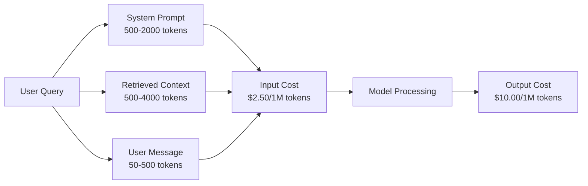
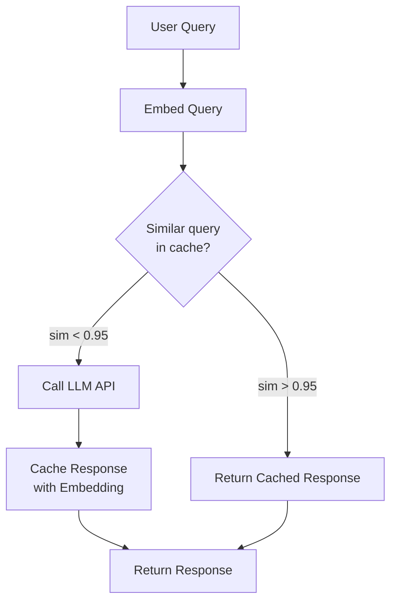
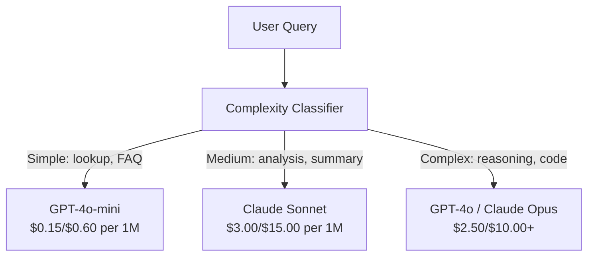

# Caching, Rate Limiting & Cost Optimization

> Hầu hết các startup AI không thất bại vì mô hình kém. Họ thất bại vì kinh tế đơn vị (unit economics) tồi tệ. Một lần gọi GPT-4o chỉ tốn vài phần trăm xu. Mười nghìn người dùng thực hiện mười cuộc gọi mỗi ngày sẽ tiêu tốn 250 đô la chỉ riêng cho input tokens -- trước khi bạn thu được một đô la nào. Những công ty tồn tại được là những công ty coi mỗi lần gọi API là một giao dịch tài chính, chứ không phải một lời gọi hàm.

**Type:** Build
**Languages:** Python
**Prerequisites:** Phase 11 Lesson 09 (Function Calling)
**Time:** ~45 phút
**Related:** Phase 11 · 15 (Prompt Caching) — bài học này bao gồm caching ở tầng ứng dụng (semantic cache, exact hash cache, model routing). Bài 15 bao gồm prompt caching ở tầng nhà cung cấp (Anthropic cache_control, OpenAI automatic, Gemini CachedContent). Kết hợp cả hai để giảm 50-95% chi phí.

## Mục tiêu học tập

- Triển khai semantic caching để phục vụ các truy vấn lặp lại hoặc tương tự từ bộ nhớ đệm thay vì thực hiện cuộc gọi API mới
- Tính toán chi phí trên mỗi yêu cầu giữa các nhà cung cấp và triển khai rate limiting dựa trên token cũng như cảnh báo ngân sách
- Xây dựng tầng tối ưu hóa chi phí với prompt compression, model routing (đắt tiền vs rẻ tiền) và response caching
- Thiết kế chiến lược caching phân tầng sử dụng exact match, semantic similarity và prefix caching cho các loại truy vấn khác nhau

## Vấn đề

Bạn xây dựng một chatbot RAG. Nó hoạt động tuyệt vời. Người dùng rất thích.

Sau đó, hóa đơn gửi đến.

GPT-5 có giá $5 per million input tokens and $15 cho mỗi triệu output. Claude Opus 4.7 có giá $15 input / $75 output. Gemini 3 Pro có giá $1.25 input / $5 output. GPT-5-mini là $0.25/$2. Giá dưới đây chỉ mang tính minh họa; hãy luôn kiểm tra trang giá hiện tại của nhà cung cấp.

Đây là bài toán khiến các startup phá sản:

- 10.000 người dùng hoạt động hàng ngày (DAU)
- 10 truy vấn mỗi người dùng mỗi ngày
- 1.000 input tokens mỗi truy vấn (system prompt + context + user message)
- 500 output tokens mỗi phản hồi

**Chi phí input hàng ngày:** 10.000 x 10 x 1.000 / 1.000.000 x $2.50 = **$250/ngày**
**Chi phí output hàng ngày:** 10.000 x 10 x 500 / 1.000.000 x $10.00 = **$500/ngày**
**Tổng hàng tháng:** **$22,500/tháng**

Đó mới chỉ là LLM. Hãy cộng thêm embeddings, lưu trữ vector database, cơ sở hạ tầng. Bạn đang nhìn vào con số 30.000 đô la/tháng cho một chatbot.

Phần tàn khốc: 40-60% các truy vấn đó gần như trùng lặp. Người dùng hỏi cùng một câu hỏi bằng những từ ngữ hơi khác nhau. System prompt của bạn -- giống hệt nhau trong mọi yêu cầu -- bị tính phí mỗi lần. Các tài liệu ngữ cảnh được RAG truy xuất lặp lại giữa những người dùng hỏi về cùng một chủ đề.

Bạn đang trả giá đầy đủ cho việc tính toán dư thừa.

## Khái niệm

### Giải phẫu chi phí của một cuộc gọi LLM

Mỗi cuộc gọi API có năm thành phần chi phí.



System prompts là kẻ giết người thầm lặng. Một system prompt 1.500 token được gửi kèm mỗi yêu cầu tốn $3.75 per million requests just for that prefix. At 100K requests per day, that is $375/ngày -- 11.250 đô la/tháng -- cho văn bản không bao giờ thay đổi.

### Provider Caching: Giảm giá tích hợp

Cả ba nhà cung cấp lớn đều cung cấp prompt caching phía nhà cung cấp vào năm 2026, nhưng cơ chế khác nhau. Xem Phase 11 · 15 để tìm hiểu sâu.

| Nhà cung cấp | Cơ chế | Giảm giá | Tối thiểu | Thời gian cache |
|----------|-----------|----------|---------|----------------|
| Anthropic | Các thẻ cache_control rõ ràng | 90% khi cache hit (trả thêm 25% khi ghi) | 1.024 tokens (Sonnet/Opus), 2.048 (Haiku) | Mặc định 5 phút; 1h mở rộng (phí ghi 2x) |
| OpenAI | Khớp tiền tố tự động | 50% khi cache hit | 1.024 tokens | Nỗ lực tốt nhất lên đến 1 giờ |
| Google Gemini | API CachedContent rõ ràng | ~75% giảm (cộng phí lưu trữ) | 4.096 (Flash) / 32.768 (Pro) | TTL do người dùng cấu hình |

**Cách tiếp cận của Anthropic** là rõ ràng. Bạn đánh dấu các phần của prompt bằng `cache_control: {"type": "ephemeral"}`. Yêu cầu đầu tiên phải trả phí ghi 25%. Các yêu cầu tiếp theo với cùng tiền tố sẽ được giảm giá 90%. Một system prompt 2.000 token có giá $0.005 normally costs $0.000625 khi cache hit. Với hơn 100 nghìn yêu cầu, điều đó tiết kiệm 437,50 đô la/ngày.

**Cách tiếp cận của OpenAI** là tự động. Bất kỳ tiền tố prompt nào khớp với yêu cầu trước đó đều được giảm giá 50%. Không cần đánh dấu. Đánh đổi: giảm giá ít hơn, ít kiểm soát hơn, nhưng không tốn công triển khai.

### Semantic Caching: Tầng tùy chỉnh của bạn

Provider caching chỉ hoạt động với các tiền tố giống hệt nhau. Semantic caching xử lý trường hợp khó hơn: các truy vấn khác nhau nhưng cùng ý nghĩa.

"Chính sách hoàn trả là gì?" và "Làm thế nào để tôi trả lại một mặt hàng?" là các chuỗi khác nhau nhưng cùng ý định. Semantic cache nhúng cả hai truy vấn, tính toán độ tương đồng cosine và trả về phản hồi đã lưu nếu độ tương đồng vượt quá ngưỡng (thường là 0.92-0.95).



Chi phí embedding là không đáng kể. text-embedding-3-small của OpenAI có giá 0,02 đô la cho mỗi triệu token. Kiểm tra cache gần như không tốn gì so với một cuộc gọi LLM đầy đủ.

### Exact Caching: Hash và Match

Đối với các cuộc gọi tất định (temperature=0, cùng mô hình, cùng prompt), exact caching đơn giản và nhanh hơn. Hash toàn bộ prompt, kiểm tra cache, trả về nếu tìm thấy.

Cách này hoạt động hoàn hảo cho:
- System prompt + ngữ cảnh cố định + truy vấn người dùng giống hệt nhau
- Function calling với định nghĩa công cụ giống hệt nhau
- Xử lý hàng loạt (batch) nơi cùng một tài liệu được xử lý nhiều lần

### Rate Limiting: Bảo vệ ngân sách của bạn

Rate limiting không chỉ là về sự công bằng. Đó là về sự sống còn.

**Thuật toán token bucket:** mỗi người dùng nhận được một thùng chứa N token được nạp lại với tốc độ R mỗi giây. Một yêu cầu tiêu thụ token từ thùng. Nếu thùng trống, yêu cầu bị từ chối. Điều này cho phép các đợt bùng nổ (sử dụng hết thùng cùng lúc) trong khi vẫn thực thi tốc độ trung bình.

**Hạn ngạch theo người dùng:** đặt giới hạn token hàng ngày/hàng tháng theo từng cấp độ người dùng.

| Cấp độ | Giới hạn Token hàng ngày | Yêu cầu tối đa/phút | Truy cập mô hình |
|------|------------------|------------------|-------------|
| Miễn phí | 50.000 | 10 | Chỉ GPT-4o-mini |
| Pro | 500.000 | 60 | GPT-4o, Claude Sonnet |
| Enterprise | 5.000.000 | 300 | Tất cả mô hình |

### Model Routing: Mô hình phù hợp cho công việc phù hợp

Không phải truy vấn nào cũng cần GPT-4o.

"Mấy giờ cửa hàng đóng cửa?" không yêu cầu một mô hình $10/M-output model. GPT-4o-mini at $0.60/M output xử lý hoàn hảo. Claude Haiku với giá 1,25 đô la/M output xử lý được. Một bộ phân loại đơn giản định tuyến các truy vấn rẻ tiền đến các mô hình rẻ tiền và các truy vấn phức tạp đến các mô hình đắt tiền.



Một bộ định tuyến được tinh chỉnh tốt giúp tiết kiệm 40-70% chi phí mô hình.

### Theo dõi chi phí: Biết tiền đi đâu

Bạn không thể tối ưu hóa những gì bạn không đo lường. Ghi lại mọi cuộc gọi API với:

- Dấu thời gian
- Tên mô hình
- Input tokens
- Output tokens
- Độ trễ (ms)
- Chi phí tính toán ($)
- ID người dùng
- Cache hit/miss
- Danh mục yêu cầu

Dữ liệu này tiết lộ tính năng nào đắt đỏ, người dùng nào tiêu thụ nhiều và nơi nào caching có tác động lớn nhất.

### Batching: Giảm giá số lượng lớn

Batch API của OpenAI xử lý các yêu cầu không đồng bộ với mức giảm giá 50%. Bạn gửi một lô lên đến 50.000 yêu cầu và kết quả trả về trong vòng 24 giờ.

Sử dụng batching cho:
- Xử lý tài liệu hàng đêm
- Phân loại số lượng lớn
- Chạy đánh giá
- Đường ống làm giàu dữ liệu

Không dùng cho: truy vấn thời gian thực hướng tới người dùng (độ trễ là quan trọng).

### Cảnh báo ngân sách và Circuit Breakers

Circuit breaker dừng chi tiêu khi bạn đạt đến giới hạn. Nếu không có nó, một lỗi hoặc sự lạm dụng có thể đốt cháy ngân sách hàng tháng của bạn trong vài giờ.

Đặt ba ngưỡng:
1. **Cảnh báo** (70% ngân sách): gửi thông báo
2. **Điều tiết** (85% ngân sách): chỉ chuyển sang các mô hình rẻ hơn
3. **Dừng** (95% ngân sách): từ chối yêu cầu mới, chỉ trả về phản hồi từ cache

### Ngăn xếp tối ưu hóa

Áp dụng các kỹ thuật này theo thứ tự. Mỗi tầng cộng dồn vào các tầng trước đó.

| Tầng | Kỹ thuật | Tiết kiệm điển hình | Công sức triển khai |
|-------|-----------|----------------|----------------------|
| 1 | Provider prompt caching | 30-50% | Thấp (thêm thẻ cache) |
| 2 | Exact caching | 10-20% | Thấp (hash + dict) |
| 3 | Semantic caching | 15-30% | Trung bình (embeddings + similarity) |
| 4 | Model routing | 40-70% | Trung bình (classifier) |
| 5 | Rate limiting | Bảo vệ ngân sách | Thấp (token bucket) |
| 6 | Prompt compression | 10-30% | Trung bình (viết lại prompts) |
| 7 | Batching | 50% cho đối tượng đủ điều kiện | Thấp (batch API) |

Một ứng dụng RAG áp dụng các tầng 1-5 thường giảm chi phí từ $22,500/month to $4.000-6.000/tháng. Đó là sự khác biệt giữa việc đốt tiền và xây dựng một doanh nghiệp.

### Tiết kiệm thực tế: Trước và Sau

Đây là bảng phân tích thực tế cho một chatbot RAG phục vụ 10.000 DAU.

| Chỉ số | Trước khi tối ưu | Sau khi tối ưu | Tiết kiệm |
|--------|--------------------|--------------------|---------|
| Chi phí LLM hàng tháng | $22,500 | $5.200 | 77% |
| Chi phí trung bình mỗi truy vấn | $0.0075 | $0.0017 | 77% |
| Tỷ lệ cache hit | 0% | 52% | -- |
| Truy vấn định tuyến đến mini | 0% | 65% | -- |
| Độ trễ P95 | 2.800ms | 900ms (cache hits: 50ms) | 68% |
| Chi phí embedding hàng tháng | $0 | $180 | (chi phí mới) |
| Tổng chi phí hàng tháng | $22,500 | $5.380 | 76% |

Chi phí embedding cho semantic caching (180 đô la/tháng) tự hoàn vốn trong giờ đầu tiên của các cache hits.

```figure
semantic-cache
```

## Xây dựng

### Bước 1: Công cụ tính chi phí

Xây dựng một công cụ tính chi phí token biết giá hiện tại cho các mô hình chính.

```python
import hashlib
import time
import json
import math
from dataclasses import dataclass, field


MODEL_PRICING = {
    "gpt-4o": {"input": 2.50, "output": 10.00, "cached_input": 1.25},
    "gpt-4o-mini": {"input": 0.15, "output": 0.60, "cached_input": 0.075},
    "gpt-4.1": {"input": 2.00, "output": 8.00, "cached_input": 0.50},
    "gpt-4.1-mini": {"input": 0.40, "output": 1.60, "cached_input": 0.10},
    "gpt-4.1-nano": {"input": 0.10, "output": 0.40, "cached_input": 0.025},
    "o3": {"input": 2.00, "output": 8.00, "cached_input": 0.50},
    "o3-mini": {"input": 1.10, "output": 4.40, "cached_input": 0.55},
    "o4-mini": {"input": 1.10, "output": 4.40, "cached_input": 0.275},
    "claude-opus-4": {"input": 15.00, "output": 75.00, "cached_input": 1.50},
    "claude-sonnet-4": {"input": 3.00, "output": 15.00, "cached_input": 0.30},
    "claude-haiku-3.5": {"input": 0.80, "output": 4.00, "cached_input": 0.08},
    "gemini-2.5-pro": {"input": 1.25, "output": 10.00, "cached_input": 0.3125},
    "gemini-2.5-flash": {"input": 0.15, "output": 0.60, "cached_input": 0.0375},
}


def calculate_cost(model, input_tokens, output_tokens, cached_input_tokens=0):
    if model not in MODEL_PRICING:
        return {"error": f"Unknown model: {model}"}
    pricing = MODEL_PRICING[model]
    non_cached = input_tokens - cached_input_tokens
    input_cost = (non_cached / 1_000_000) * pricing["input"]
    cached_cost = (cached_input_tokens / 1_000_000) * pricing["cached_input"]
    output_cost = (output_tokens / 1_000_000) * pricing["output"]
    total = input_cost + cached_cost + output_cost
    return {
        "model": model,
        "input_tokens": input_tokens,
        "output_tokens": output_tokens,
        "cached_input_tokens": cached_input_tokens,
        "input_cost": round(input_cost, 6),
        "cached_input_cost": round(cached_cost, 6),
        "output_cost": round(output_cost, 6),
        "total_cost": round(total, 6),
    }
```

### Bước 2: Exact Cache

Hash toàn bộ prompt và trả về phản hồi đã lưu cho các yêu cầu giống hệt nhau.

```python
class ExactCache:
    def __init__(self, max_size=1000, ttl_seconds=3600):
        self.cache = {}
        self.max_size = max_size
        self.ttl = ttl_seconds
        self.hits = 0
        self.misses = 0

    def _hash(self, model, messages, temperature):
        key_data = json.dumps({"model": model, "messages": messages, "temperature": temperature}, sort_keys=True)
        return hashlib.sha256(key_data.encode()).hexdigest()

    def get(self, model, messages, temperature=0.0):
        if temperature > 0:
            self.misses += 1
            return None
        key = self._hash(model, messages, temperature)
        if key in self.cache:
            entry = self.cache[key]
            if time.time() - entry["timestamp"] < self.ttl:
                self.hits += 1
                entry["access_count"] += 1
                return entry["response"]
            del self.cache[key]
        self.misses += 1
        return None

    def put(self, model, messages, temperature, response):
        if temperature > 0:
            return
        if len(self.cache) >= self.max_size:
            oldest_key = min(self.cache, key=lambda k: self.cache[k]["timestamp"])
            del self.cache[oldest_key]
        key = self._hash(model, messages, temperature)
        self.cache[key] = {
            "response": response,
            "timestamp": time.time(),
            "access_count": 1,
        }

    def stats(self):
        total = self.hits + self.misses
        return {
            "hits": self.hits,
            "misses": self.misses,
            "hit_rate": round(self.hits / total, 4) if total > 0 else 0,
            "cache_size": len(self.cache),
        }
```

### Bước 3: Semantic Cache

Nhúng các truy vấn và trả về phản hồi đã lưu khi độ tương đồng vượt quá ngưỡng.

```python
def simple_embed(text):
    words = text.lower().split()
    vocab = {}
    for w in words:
        vocab[w] = vocab.get(w, 0) + 1
    norm = math.sqrt(sum(v * v for v in vocab.values()))
    if norm == 0:
        return {}
    return {k: v / norm for k, v in vocab.items()}


def cosine_similarity(a, b):
    if not a or not b:
        return 0.0
    all_keys = set(a) | set(b)
    dot = sum(a.get(k, 0) * b.get(k, 0) for k in all_keys)
    return dot


class SemanticCache:
    def __init__(self, similarity_threshold=0.85, max_size=500, ttl_seconds=3600):
        self.entries = []
        self.threshold = similarity_threshold
        self.max_size = max_size
        self.ttl = ttl_seconds
        self.hits = 0
        self.misses = 0

    def get(self, query):
        query_embedding = simple_embed(query)
        now = time.time()
        best_match = None
        best_sim = 0.0
        for entry in self.entries:
            if now - entry["timestamp"] > self.ttl:
                continue
            sim = cosine_similarity(query_embedding, entry["embedding"])
            if sim > best_sim:
                best_sim = sim
                best_match = entry
        if best_match and best_sim >= self.threshold:
            self.hits += 1
            best_match["access_count"] += 1
            return {"response": best_match["response"], "similarity": round(best_sim, 4), "original_query": best_match["query"]}
        self.misses += 1
        return None

    def put(self, query, response):
        if len(self.entries) >= self.max_size:
            self.entries.sort(key=lambda e: e["timestamp"])
            self.entries.pop(0)
        self.entries.append({
            "query": query,
            "embedding": simple_embed(query),
            "response": response,
            "timestamp": time.time(),
            "access_count": 1,
        })

    def stats(self):
        total = self.hits + self.misses
        return {
            "hits": self.hits,
            "misses": self.misses,
            "hit_rate": round(self.hits / total, 4) if total > 0 else 0,
            "cache_size": len(self.entries),
        }
```

### Bước 4: Rate Limiter

Bộ giới hạn tốc độ token bucket với hạn ngạch theo người dùng.

```python
class TokenBucketRateLimiter:
    def __init__(self):
        self.buckets = {}
        self.tiers = {
            "free": {"capacity": 50_000, "refill_rate": 500, "max_requests_per_min": 10},
            "pro": {"capacity": 500_000, "refill_rate": 5_000, "max_requests_per_min": 60},
            "enterprise": {"capacity": 5_000_000, "refill_rate": 50_000, "max_requests_per_min": 300},
        }

    def _get_bucket(self, user_id, tier="free"):
        if user_id not in self.buckets:
            tier_config = self.tiers.get(tier, self.tiers["free"])
            self.buckets[user_id] = {
                "tokens": tier_config["capacity"],
                "capacity": tier_config["capacity"],
                "refill_rate": tier_config["refill_rate"],
                "last_refill": time.time(),
                "request_timestamps": [],
                "max_rpm": tier_config["max_requests_per_min"],
                "tier": tier,
                "total_tokens_used": 0,
            }
        return self.buckets[user_id]

    def _refill(self, bucket):
        now = time.time()
        elapsed = now - bucket["last_refill"]
        refill = int(elapsed * bucket["refill_rate"])
        if refill > 0:
            bucket["tokens"] = min(bucket["capacity"], bucket["tokens"] + refill)
            bucket["last_refill"] = now

    def check(self, user_id, tokens_needed, tier="free"):
        bucket = self._get_bucket(user_id, tier)
        self._refill(bucket)
        now = time.time()
        bucket["request_timestamps"] = [t for t in bucket["request_timestamps"] if now - t < 60]
        if len(bucket["request_timestamps"]) >= bucket["max_rpm"]:
            return {"allowed": False, "reason": "rate_limit", "retry_after_seconds": 60 - (now - bucket["request_timestamps"][0])}
        if bucket["tokens"] < tokens_needed:
            deficit = tokens_needed - bucket["tokens"]
            wait = deficit / bucket["refill_rate"]
            return {"allowed": False, "reason": "token_limit", "tokens_available": bucket["tokens"], "retry_after_seconds": round(wait, 1)}
        return {"allowed": True, "tokens_available": bucket["tokens"]}

    def consume(self, user_id, tokens_used, tier="free"):
        bucket = self._get_bucket(user_id, tier)
        bucket["tokens"] -= tokens_used
        bucket["request_timestamps"].append(time.time())
        bucket["total_tokens_used"] += tokens_used

    def get_usage(self, user_id):
        if user_id not in self.buckets:
            return {"error": "User not found"}
        b = self.buckets[user_id]
        return {
            "user_id": user_id,
            "tier": b["tier"],
            "tokens_remaining": b["tokens"],
            "capacity": b["capacity"],
            "total_tokens_used": b["total_tokens_used"],
            "utilization": round(b["total_tokens_used"] / b["capacity"], 4) if b["capacity"] else 0,
        }
```

### Bước 5: Theo dõi chi phí

Ghi lại mọi cuộc gọi và tính tổng cộng dồn.

```python
class CostTracker:
    def __init__(self, monthly_budget=1000.0):
        self.logs = []
        self.monthly_budget = monthly_budget
        self.alerts = []

    def log_call(self, model, input_tokens, output_tokens, cached_input_tokens=0, latency_ms=0, user_id="anonymous", cache_status="miss"):
        cost = calculate_cost(model, input_tokens, output_tokens, cached_input_tokens)
        entry = {
            "timestamp": time.time(),
            "model": model,
            "input_tokens": input_tokens,
            "output_tokens": output_tokens,
            "cached_input_tokens": cached_input_tokens,
            "latency_ms": latency_ms,
            "cost": cost["total_cost"],
            "user_id": user_id,
            "cache_status": cache_status,
        }
        self.logs.append(entry)
        self._check_budget()
        return entry

    def _check_budget(self):
        total = self.total_cost()
        pct = total / self.monthly_budget if self.monthly_budget > 0 else 0
        if pct >= 0.95 and not any(a["level"] == "stop" for a in self.alerts):
            self.alerts.append({"level": "stop", "message": f"Budget 95% consumed: ${total:.2f}/${self.monthly_budget:.2f}", "timestamp": time.time()})
        elif pct >= 0.85 and not any(a["level"] == "throttle" for a in self.alerts):
            self.alerts.append({"level": "throttle", "message": f"Budget 85% consumed: ${total:.2f}/${self.monthly_budget:.2f}", "timestamp": time.time()})
        elif pct >= 0.70 and not any(a["level"] == "warning" for a in self.alerts):
            self.alerts.append({"level": "warning", "message": f"Budget 70% consumed: ${total:.2f}/${self.monthly_budget:.2f}", "timestamp": time.time()})

    def total_cost(self):
        return round(sum(e["cost"] for e in self.logs), 6)

    def cost_by_model(self):
        by_model = {}
        for e in self.logs:
            m = e["model"]
            if m not in by_model:
                by_model[m] = {"calls": 0, "cost": 0, "input_tokens": 0, "output_tokens": 0}
            by_model[m]["calls"] += 1
            by_model[m]["cost"] = round(by_model[m]["cost"] + e["cost"], 6)
            by_model[m]["input_tokens"] += e["input_tokens"]
            by_model[m]["output_tokens"] += e["output_tokens"]
        return by_model

    def cache_savings(self):
        cache_hits = [e for e in self.logs if e["cache_status"] == "hit"]
        if not cache_hits:
            return {"saved": 0, "cache_hits": 0}
        saved = 0
        for e in cache_hits:
            full_cost = calculate_cost(e["model"], e["input_tokens"], e["output_tokens"])
            saved += full_cost["total_cost"]
        return {"saved": round(saved, 4), "cache_hits": len(cache_hits)}

    def summary(self):
        if not self.logs:
            return {"total_calls": 0, "total_cost": 0}
        total_latency = sum(e["latency_ms"] for e in self.logs)
        cache_hits = sum(1 for e in self.logs if e["cache_status"] == "hit")
        return {
            "total_calls": len(self.logs),
            "total_cost": self.total_cost(),
            "avg_cost_per_call": round(self.total_cost() / len(self.logs), 6),
            "avg_latency_ms": round(total_latency / len(self.logs), 1),
            "cache_hit_rate": round(cache_hits / len(self.logs), 4),
            "cost_by_model": self.cost_by_model(),
            "cache_savings": self.cache_savings(),
            "budget_remaining": round(self.monthly_budget - self.total_cost(), 2),
            "budget_utilization": round(self.total_cost() / self.monthly_budget, 4) if self.monthly_budget > 0 else 0,
            "alerts": self.alerts,
        }
```

### Bước 6: Model Router

Định tuyến các truy vấn đến mô hình rẻ nhất có thể xử lý chúng.

```python
SIMPLE_KEYWORDS = ["what time", "hours", "address", "phone", "price", "return policy", "hello", "hi", "thanks", "yes", "no"]
COMPLEX_KEYWORDS = ["analyze", "compare", "explain why", "write code", "debug", "architect", "design", "trade-off", "evaluate"]


def classify_complexity(query):
    q = query.lower()
    if len(q.split()) <= 5 or any(kw in q for kw in SIMPLE_KEYWORDS):
        return "simple"
    if any(kw in q for kw in COMPLEX_KEYWORDS):
        return "complex"
    return "medium"


def route_model(query, tier="pro"):
    complexity = classify_complexity(query)
    routing_table = {
        "simple": {"free": "gpt-4.1-nano", "pro": "gpt-4o-mini", "enterprise": "gpt-4o-mini"},
        "medium": {"free": "gpt-4o-mini", "pro": "claude-sonnet-4", "enterprise": "claude-sonnet-4"},
        "complex": {"free": "gpt-4o-mini", "pro": "gpt-4o", "enterprise": "claude-opus-4"},
    }
    model = routing_table[complexity].get(tier, "gpt-4o-mini")
    return {"query": query, "complexity": complexity, "model": model, "tier": tier}
```

### Bước 7: Chạy Demo

```python
def simulate_llm_call(model, query):
    input_tokens = len(query.split()) * 4 + 500
    output_tokens = 150 + (len(query.split()) * 2)
    latency = 200 + (output_tokens * 2)
    return {
        "model": model,
        "response": f"[Simulated {model} response to: {query[:50]}...]",
        "input_tokens": input_tokens,
        "output_tokens": output_tokens,
        "latency_ms": latency,
    }


def run_demo():
    print("=" * 60)
    print("  Caching, Rate Limiting & Cost Optimization Demo")
    print("=" * 60)

    print("\n--- Model Pricing ---")
    for model, pricing in list(MODEL_PRICING.items())[:6]:
        cost_1k = calculate_cost(model, 1000, 500)
        print(f"  {model}: ${cost_1k['total_cost']:.6f} per 1K in + 500 out")

    print("\n--- Cost Comparison: 100K Requests ---")
    for model in ["gpt-4o", "gpt-4o-mini", "claude-sonnet-4", "claude-haiku-3.5"]:
        cost = calculate_cost(model, 1000 * 100_000, 500 * 100_000)
        print(f"  {model}: ${cost['total_cost']:.2f}")

    print("\n--- Anthropic Cache Savings ---")
    no_cache = calculate_cost("claude-sonnet-4", 2000, 500, 0)
    with_cache = calculate_cost("claude-sonnet-4", 2000, 500, 1500)
    saving = no_cache["total_cost"] - with_cache["total_cost"]
    print(f"  Without cache: ${no_cache['total_cost']:.6f}")
    print(f"  With 1500 cached tokens: ${with_cache['total_cost']:.6f}")
    print(f"  Savings per call: ${saving:.6f} ({saving/no_cache['total_cost']*100:.1f}%)")

    exact_cache = ExactCache(max_size=100, ttl_seconds=300)
    semantic_cache = SemanticCache(similarity_threshold=0.75, max_size=100)
    rate_limiter = TokenBucketRateLimiter()
    tracker = CostTracker(monthly_budget=100.0)

    print("\n--- Exact Cache ---")
    messages_1 = [{"role": "user", "content": "What is the return policy?"}]
    result = exact_cache.get("gpt-4o-mini", messages_1, 0.0)
    print(f"  First lookup: {'HIT' if result else 'MISS'}")
    exact_cache.put("gpt-4o-mini", messages_1, 0.0, "You can return items within 30 days.")
    result = exact_cache.get("gpt-4o-mini", messages_1, 0.0)
    print(f"  Second lookup: {'HIT' if result else 'MISS'} -> {result}")
    result = exact_cache.get("gpt-4o-mini", messages_1, 0.7)
    print(f"  With temp=0.7: {'HIT' if result else 'MISS (non-deterministic, skip cache)'}")
    print(f"  Stats: {exact_cache.stats()}")

    print("\n--- Semantic Cache ---")
    test_queries = [
        ("What is the return policy?", "Items can be returned within 30 days with receipt."),
        ("How do I return an item?", None),
        ("What are your store hours?", "We are open 9am-9pm Monday through Saturday."),
        ("When does the store open?", None),
        ("Tell me about quantum computing", "Quantum computers use qubits..."),
        ("Explain quantum mechanics", None),
    ]
    for query, response in test_queries:
        cached = semantic_cache.get(query)
        if cached:
            print(f"  '{query[:40]}' -> CACHE HIT (sim={cached['similarity']}, original='{cached['original_query'][:40]}')")
        elif response:
            semantic_cache.put(query, response)
            print(f"  '{query[:40]}' -> MISS (stored)")
        else:
            print(f"  '{query[:40]}' -> MISS (no match)")
    print(f"  Stats: {semantic_cache.stats()}")

    print("\n--- Rate Limiting ---")
    for i in range(12):
        check = rate_limiter.check("user_1", 1000, "free")
        if check["allowed"]:
            rate_limiter.consume("user_1", 1000, "free")
        status = "OK" if check["allowed"] else f"BLOCKED ({check['reason']})"
        if i < 5 or not check["allowed"]:
            print(f"  Request {i+1}: {status}")
    print(f"  Usage: {rate_limiter.get_usage('user_1')}")

    print("\n--- Model Routing ---")
    routing_queries = [
        "What time do you close?",
        "Summarize this quarterly earnings report",
        "Analyze the trade-offs between microservices and monoliths",
        "Hello",
        "Write code for a binary search tree with deletion",
    ]
    for q in routing_queries:
        route = route_model(q, "pro")
        print(f"  '{q[:50]}' -> {route['model']} ({route['complexity']})")

    print("\n--- Full Pipeline: Before vs After Optimization ---")
    queries = [
        "What is the return policy?",
        "How do I return something?",
        "What are your hours?",
        "When do you open?",
        "Explain the difference between TCP and UDP",
        "Compare TCP vs UDP protocols",
        "Hello",
        "What is your phone number?",
        "Write a Python function to sort a list",
        "Analyze the pros and cons of serverless architecture",
    ]

    print("\n  [Before: no caching, single model (gpt-4o)]")
    tracker_before = CostTracker(monthly_budget=1000.0)
    for q in queries:
        result = simulate_llm_call("gpt-4o", q)
        tracker_before.log_call("gpt-4o", result["input_tokens"], result["output_tokens"], latency_ms=result["latency_ms"], cache_status="miss")
    before = tracker_before.summary()
    print(f"  Total cost: ${before['total_cost']:.6f}")
    print(f"  Avg cost/call: ${before['avg_cost_per_call']:.6f}")
    print(f"  Avg latency: {before['avg_latency_ms']}ms")

    print("\n  [After: caching + routing + rate limiting]")
    exact_c = ExactCache()
    semantic_c = SemanticCache(similarity_threshold=0.75)
    tracker_after = CostTracker(monthly_budget=1000.0)

    for q in queries:
        messages = [{"role": "user", "content": q}]
        cached = exact_c.get("gpt-4o", messages, 0.0)
        if cached:
            tracker_after.log_call("gpt-4o-mini", 0, 0, latency_ms=5, cache_status="hit")
            continue
        sem_cached = semantic_c.get(q)
        if sem_cached:
            tracker_after.log_call("gpt-4o-mini", 0, 0, latency_ms=15, cache_status="hit")
            continue
        route = route_model(q)
        result = simulate_llm_call(route["model"], q)
        tracker_after.log_call(route["model"], result["input_tokens"], result["output_tokens"], latency_ms=result["latency_ms"], cache_status="miss")
        exact_c.put(route["model"], messages, 0.0, result["response"])
        semantic_c.put(q, result["response"])

    after = tracker_after.summary()
    print(f"  Total cost: ${after['total_cost']:.6f}")
    print(f"  Avg cost/call: ${after['avg_cost_per_call']:.6f}")
    print(f"  Avg latency: {after['avg_latency_ms']}ms")
    print(f"  Cache hit rate: {after['cache_hit_rate']:.0%}")

    if before["total_cost"] > 0:
        savings_pct = (1 - after["total_cost"] / before["total_cost"]) * 100
        print(f"\n  SAVINGS: {savings_pct:.1f}% cost reduction")
        print(f"  Latency improvement: {(1 - after['avg_latency_ms'] / before['avg_latency_ms']) * 100:.1f}% faster")

    print("\n--- Budget Alerts Demo ---")
    alert_tracker = CostTracker(monthly_budget=0.01)
    for i in range(5):
        alert_tracker.log_call("gpt-4o", 5000, 2000, latency_ms=500)
    print(f"  Total spent: ${alert_tracker.total_cost():.6f} / ${alert_tracker.monthly_budget}")
    for alert in alert_tracker.alerts:
        print(f"  ALERT [{alert['level'].upper()}]: {alert['message']}")

    print("\n--- Cost Breakdown by Model ---")
    multi_tracker = CostTracker(monthly_budget=500.0)
    for _ in range(50):
        multi_tracker.log_call("gpt-4o-mini", 800, 200, latency_ms=150)
    for _ in range(30):
        multi_tracker.log_call("claude-sonnet-4", 1500, 500, latency_ms=400)
    for _ in range(10):
        multi_tracker.log_call("gpt-4o", 2000, 800, latency_ms=600)
    for _ in range(10):
        multi_tracker.log_call("claude-opus-4", 3000, 1000, latency_ms=1200)
    breakdown = multi_tracker.cost_by_model()
    for model, data in sorted(breakdown.items(), key=lambda x: x[1]["cost"], reverse=True):
        print(f"  {model}: {data['calls']} calls, ${data['cost']:.6f}, {data['input_tokens']:,} in / {data['output_tokens']:,} out")
    print(f"  Total: ${multi_tracker.total_cost():.6f}")

    print("\n" + "=" * 60)
    print("  Demo complete.")
    print("=" * 60)


if __name__ == "__main__":
    run_demo()
```

## Sử dụng

### Anthropic Prompt Caching

```python
# import anthropic
#
# client = anthropic.Anthropic()
#
# response = client.messages.create(
#     model="claude-sonnet-5",
#     max_tokens=1024,
#     system=[
#         {
#             "type": "text",
#             "text": "You are a helpful customer support agent for Acme Corp...",
#             "cache_control": {"type": "ephemeral"},
#         }
#     ],
#     messages=[{"role": "user", "content": "What is the return policy?"}],
# )
#
# print(f"Input tokens: {response.usage.input_tokens}")
# print(f"Cache creation tokens: {response.usage.cache_creation_input_tokens}")
# print(f"Cache read tokens: {response.usage.cache_read_input_tokens}")
```

Cuộc gọi đầu tiên ghi vào cache (phí 25%). Mỗi cuộc gọi tiếp theo với cùng tiền tố system prompt sẽ đọc từ cache (giảm giá 90%). Cache tồn tại trong 5 phút và đặt lại bộ đếm thời gian sau mỗi lần hit.

### OpenAI Automatic Caching

```python
# from openai import OpenAI
#
# client = OpenAI()
#
# response = client.chat.completions.create(
#     model="gpt-4o",
#     messages=[
#         {"role": "system", "content": "You are a helpful customer support agent..."},
#         {"role": "user", "content": "What is the return policy?"},
#     ],
# )
#
# print(f"Prompt tokens: {response.usage.prompt_tokens}")
# print(f"Cached tokens: {response.usage.prompt_tokens_details.cached_tokens}")
# print(f"Completion tokens: {response.usage.completion_tokens}")
```

OpenAI tự động lưu cache. Bất kỳ tiền tố prompt nào từ 1.024 token trở lên khớp với yêu cầu gần đây đều được giảm giá 50%. Không cần thay đổi mã -- chỉ cần kiểm tra `prompt_tokens_details.cached_tokens` trong phản hồi để xác minh nó đang hoạt động.

### OpenAI Batch API

```python
# import json
# from openai import OpenAI
#
# client = OpenAI()
#
# requests = []
# for i, query in enumerate(queries):
#     requests.append({
#         "custom_id": f"request-{i}",
#         "method": "POST",
#         "url": "/v1/chat/completions",
#         "body": {
#             "model": "gpt-4o-mini",
#             "messages": [{"role": "user", "content": query}],
#         },
#     })
#
# with open("batch_input.jsonl", "w") as f:
#     for r in requests:
#         f.write(json.dumps(r) + "\n")
#
# batch_file = client.files.create(file=open("batch_input.jsonl", "rb"), purpose="batch")
# batch = client.batches.create(input_file_id=batch_file.id, endpoint="/v1/chat/completions", completion_window="24h")
# print(f"Batch ID: {batch.id}, Status: {batch.status}")
```

Batch API giảm giá phẳng 50% cho tất cả các token. Kết quả đến trong vòng 24 giờ. Hoàn hảo cho các khối lượng công việc không thời gian thực: đánh giá, gắn nhãn dữ liệu, tóm tắt số lượng lớn.

### Production Semantic Cache với Redis

```python
# import redis
# import numpy as np
# from openai import OpenAI
#
# r = redis.Redis()
# client = OpenAI()
#
# def get_embedding(text):
#     response = client.embeddings.create(model="text-embedding-3-small", input=text)
#     return response.data[0].embedding
#
# def semantic_cache_lookup(query, threshold=0.95):
#     query_emb = np.array(get_embedding(query))
#     keys = r.keys("cache:emb:*")
#     best_sim, best_key = 0, None
#     for key in keys:
#         stored_emb = np.frombuffer(r.get(key), dtype=np.float32)
#         sim = np.dot(query_emb, stored_emb) / (np.linalg.norm(query_emb) * np.linalg.norm(stored_emb))
#         if sim > best_sim:
#             best_sim, best_key = sim, key
#     if best_sim >= threshold and best_key:
#         response_key = best_key.decode().replace("cache:emb:", "cache:resp:")
#         return r.get(response_key).decode()
#     return None
```

Trong môi trường production, hãy thay thế quét tuyến tính bằng chỉ mục vector (Redis Vector Search, Pinecone hoặc pgvector). Quét tuyến tính hoạt động cho <1.000 mục. Ngoài con số đó, hãy sử dụng ANN (approximate nearest neighbor) để tra cứu O(log n).

## Ship It

Bài học này tạo ra `outputs/prompt-cost-optimizer.md` -- một prompt có thể tái sử dụng để phân tích ứng dụng LLM của bạn và đề xuất các tối ưu hóa chi phí cụ thể với mức tiết kiệm dự kiến.

Nó cũng tạo ra `outputs/skill-cost-patterns.md` -- một khung quyết định để chọn chiến lược caching, cấu hình rate limiting và quy tắc model routing phù hợp cho trường hợp sử dụng của bạn.

## Bài tập

1. **Triển khai LRU eviction cho semantic cache.** Thay thế việc xóa cũ nhất trước bằng LRU (ít sử dụng gần đây nhất). Theo dõi thời gian truy cập cuối cùng cho mỗi mục và xóa mục có thời gian truy cập cũ nhất khi cache đầy. So sánh tỷ lệ hit giữa hai chiến lược qua 100 truy vấn.

2. **Xây dựng công cụ dự báo chi phí.** Với nhật ký các cuộc gọi API (nhật ký CostTracker), hãy dự báo chi phí hàng tháng dựa trên mức trung bình 7 ngày gần nhất. Tính đến các mô hình ngày trong tuần/cuối tuần. Kích hoạt cảnh báo nếu chi phí hàng tháng dự kiến vượt quá ngân sách hơn 20%.

3. **Triển khai semantic caching phân tầng.** Sử dụng hai ngưỡng tương đồng: 0.98 cho các hit có độ tin cậy cao (trả về ngay lập tức) và 0.90 cho các hit có độ tin cậy trung bình (trả về kèm tuyên bố từ chối trách nhiệm: "Dựa trên một câu hỏi tương tự trước đó..."). Theo dõi mỗi hit đến từ tầng nào và đo lường sự khác biệt về mức độ hài lòng của người dùng.

4. **Xây dựng bộ phân loại model routing.** Thay thế bộ phân loại dựa trên từ khóa bằng bộ phân loại dựa trên embedding. Nhúng 50 truy vấn được gắn nhãn (đơn giản/trung bình/phức tạp), sau đó phân loại các truy vấn mới bằng cách tìm ví dụ được gắn nhãn gần nhất. Đo lường độ chính xác phân loại so với tập kiểm tra gồm 20 truy vấn.

5. **Triển khai circuit breaker với các cấp độ suy giảm.** Ở mức 70% ngân sách, ghi nhật ký cảnh báo. Ở mức 85%, tự động chuyển tất cả định tuyến sang mô hình rẻ nhất (gpt-4o-mini). Ở mức 95%, chỉ phục vụ các phản hồi từ cache và từ chối các yêu cầu mới. Kiểm tra bằng cách mô phỏng 1.000 yêu cầu với ngân sách 1,00 đô la và xác minh từng ngưỡng kích hoạt chính xác.

## Thuật ngữ chính

| Thuật ngữ | Mọi người nói | Ý nghĩa thực sự |
|------|----------------|----------------------|
| Prompt caching | "Cache system prompt" | Caching cấp nhà cung cấp nơi các tiền tố prompt lặp lại được giảm giá (90% Anthropic, 50% OpenAI) -- không cần thay đổi mã cho OpenAI, các thẻ rõ ràng cho Anthropic |
| Semantic caching | "Cache thông minh" | Nhúng truy vấn, tính toán độ tương đồng với các truy vấn cũ và trả về phản hồi đã lưu nếu độ tương đồng vượt ngưỡng -- bắt được các cách diễn đạt lại mà khớp chính xác bỏ lỡ |
| Exact caching | "Hash caching" | Hash toàn bộ prompt (mô hình + tin nhắn + nhiệt độ) và trả về phản hồi đã lưu cho các đầu vào giống hệt nhau -- chỉ hoạt động cho các cuộc gọi tất định temperature=0 |
| Token bucket | "Rate limiter" | Thuật toán nơi mỗi người dùng có một thùng N token nạp lại với tốc độ R mỗi giây -- cho phép bùng nổ lên đến N trong khi thực thi tốc độ trung bình R |
| Model routing | "Định tuyến tiết kiệm" | Sử dụng bộ phân loại để gửi các truy vấn đơn giản đến các mô hình rẻ (GPT-4o-mini, Haiku) và truy vấn phức tạp đến mô hình đắt (GPT-4o, Opus) -- tiết kiệm 40-70% chi phí |
| Cost tracking | "Đo lường" | Ghi lại mọi cuộc gọi API với mô hình, token, độ trễ, chi phí và ID người dùng để biết chính xác tiền đi đâu và tính năng nào đắt đỏ |
| Circuit breaker | "Công tắc ngắt" | Tự động làm suy giảm dịch vụ (mô hình rẻ hơn, chỉ cache) hoặc dừng yêu cầu hoàn toàn khi chi tiêu tiến gần đến giới hạn ngân sách |
| Batch API | "Giảm giá số lượng" | Xử lý không đồng bộ của OpenAI với mức giảm giá 50% -- gửi tối đa 50.000 yêu cầu, nhận kết quả trong vòng 24 giờ |
| Prompt compression | "Chế độ ăn token" | Viết lại system prompts và ngữ cảnh để sử dụng ít token hơn trong khi vẫn giữ nguyên ý nghĩa -- prompt ngắn hơn tốn ít chi phí hơn và thường hoạt động tốt hơn |
| Cache hit rate | "Hiệu quả cache" | Tỷ lệ phần trăm các yêu cầu được phục vụ từ cache thay vì gọi LLM -- 40-60% là điển hình cho chatbot production, tiết kiệm chi phí tương ứng |

## Đọc thêm

- [Hướng dẫn Anthropic Prompt Caching](https://docs.anthropic.com/en/docs/build-with-claude/prompt-caching) -- tài liệu chính thức cho các thẻ cache_control rõ ràng, giá cả và hành vi tuổi thọ cache của Anthropic
- [OpenAI Prompt Caching](https://platform.openai.com/docs/guides/prompt-caching) -- caching tự động của OpenAI, cách xác minh cache hits qua các trường sử dụng và độ dài tiền tố tối thiểu
- [OpenAI Batch API](https://platform.openai.com/docs/guides/batch) -- giảm giá 50% cho xử lý không đồng bộ, định dạng JSONL, cửa sổ hoàn thành 24 giờ và giới hạn 50 nghìn yêu cầu
- [GPTCache](https://github.com/zilliztech/GPTCache) -- thư viện semantic caching mã nguồn mở hỗ trợ nhiều backend embedding, vector stores và chính sách xóa
- [Martian Model Router](https://docs.withmartian.com) -- định tuyến mô hình production tự động chọn mô hình rẻ nhất có khả năng xử lý từng truy vấn
- [Not Diamond](https://www.notdiamond.ai) -- bộ định tuyến mô hình dựa trên ML học từ các mẫu lưu lượng truy cập của bạn để tối ưu hóa sự đánh đổi chi phí/chất lượng giữa các nhà cung cấp
- [Helicone](https://www.helicone.ai) -- nền tảng quan sát LLM với theo dõi chi phí, caching, rate limiting và cảnh báo ngân sách như một tầng proxy
- [Dean & Barroso, "The Tail at Scale" (CACM 2013)](https://research.google/pubs/the-tail-at-scale/) -- độ trễ, thông lượng, phần trăm TTFT/TPOT và các yêu cầu hedged; mô hình chi phí đằng sau "chọn mô hình rẻ nhất vẫn đáp ứng P95."
- [Kwon et al., "Efficient Memory Management for Large Language Model Serving with PagedAttention" (SOSP 2023)](https://arxiv.org/abs/2309.06180) -- bài báo vLLM; tại sao paged KV-cache + continuous batching đánh bại các máy chủ thông thường 24 lần về thông lượng, tầng hạ tầng bên dưới "caching và chi phí."
- [Dao et al., "FlashAttention-2: Faster Attention with Better Parallelism and Work Partitioning" (ICLR 2024)](https://arxiv.org/abs/2307.08691) -- giảm chi phí cấp kernel trực giao với prompt caching; đọc cùng với speculative decoding và GQA để có bức tranh toàn cảnh về đường cong chi phí.