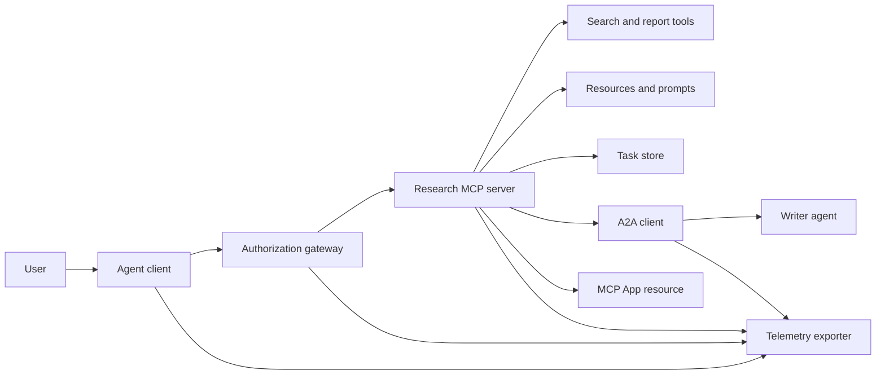
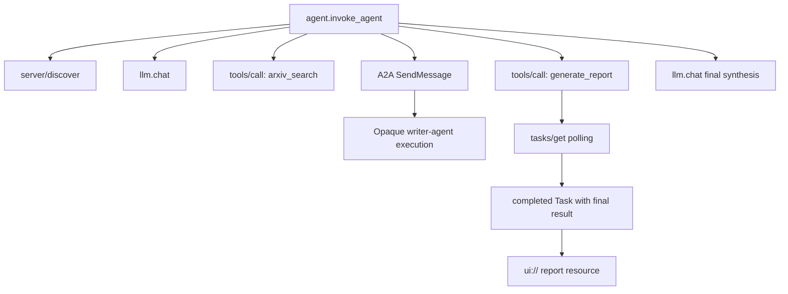
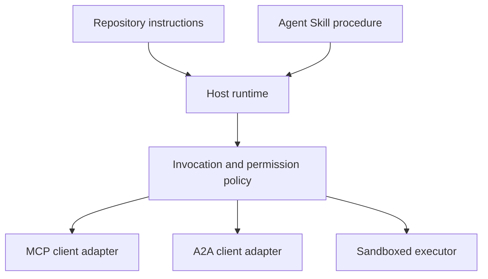

# Capstone: Hệ sinh thái công cụ không trạng thái (Stateless Tool Ecosystem)

> Một hệ thống agent trong môi trường production là tập hợp các ranh giới, không phải là một đống tính năng. Capstone này tách biệt mô phỏng in-process dễ đọc khỏi các client giao thức, server xác thực, sandbox và bộ xuất telemetry mà một bản triển khai thực tế cần có.

**Type:** Build
**Languages:** Python (stdlib, in-process simulation)
**Prerequisites:** Phase 13 · 01 đến 22, sử dụng bản sửa đổi MCP `2026-07-28`
**Time:** ~120 phút

## Mục tiêu học tập

- Kết hợp các lệnh gọi công cụ (tool calls), kết quả dạng tác vụ (task-shaped results), công việc được ủy quyền, tài nguyên UI, chính sách ủy quyền và bản ghi trace vào một luồng duy nhất.
- Truyền phiên bản giao thức, danh tính client và các khả năng (capabilities) trên mỗi yêu cầu MCP thay vì dựa vào phiên session kết nối.
- Khám phá server trước khi sử dụng và điều khiển công việc dài hạn thông qua phần mở rộng Tasks chính thức.
- Phân biệt mô phỏng dạng giao thức với bản triển khai MCP, A2A, OAuth hoặc OpenTelemetry thực tế.
- Ánh xạ từng ranh giới mô phỏng tới thành phần production tương ứng cần thay thế.
- Giữ `AGENTS.md`, Agent Skill, các bộ điều hợp runtime (runtime adapters), công cụ và chính sách bảo mật ở đúng vai trò của chúng.
- Giải thích những tuyên bố nào có thể xác minh từ đầu ra cục bộ và những tuyên bố nào cần kiểm thử tích hợp thực tế.

## Vấn đề

Thiết kế một hệ thống nghiên cứu và báo cáo. Người dùng yêu cầu các bài báo về giao thức agent. Hệ thống tìm kiếm danh mục bài báo, ủy quyền tóm tắt, tạo báo cáo, trả về tài nguyên UI và ghi lại lộ trình thông qua hệ thống.

Câu đó ẩn chứa nhiều hợp đồng độc lập:

- lược đồ công cụ (tool schema) hướng mô hình;
- phong bì yêu cầu không trạng thái (stateless request envelope) và hợp đồng khám phá server;
- quyết định gateway cho actor, phạm vi (scope) và danh tính công cụ;
- hợp đồng vận hành dài hạn (long-running operation);
- giao thức ủy quyền (delegation protocol);
- cầu nối host-to-app;
- lan truyền và xuất trace;
- quy trình vận hành có thể tái sử dụng.

`code/main.py` giữ cho các ranh giới đó hiển thị với các hàm và từ điển Python thông thường. Nó không mở transport, không liên hệ arXiv, không thực hiện OAuth, không gọi server A2A, không render MCP App, cũng không xuất telemetry. Điều này giúp luồng điều khiển dễ kiểm tra mà không cần trình bày mô phỏng như một dịch vụ tuân thủ.

## Khái niệm

### Kiến trúc mục tiêu



Kiến trúc này là sự kết hợp khái niệm của các mẫu giao thức công khai. Nó không phải là tuyên bố về nội bộ riêng tư của bất kỳ sản phẩm nào.

### Trace mục tiêu



Trong bản triển khai thực tế, mỗi bước nhảy (hop) đều lan truyền ngữ cảnh trace. Tên span và thuộc tính phải tuân theo các quy ước ngữ nghĩa OpenTelemetry được hỗ trợ bởi phiên bản instrumentation đã chọn. Chỉ riêng một định danh trace dùng chung không chứng minh được sự kế thừa, xuất dữ liệu hoặc ingestion backend chính xác.

### Các bề mặt giao thức hiện tại

Sử dụng tên phương thức được định nghĩa bởi giao thức hiện tại, không phải tên ghi nhớ từ bản nháp cũ:

| Ranh giới | Bề mặt hiện tại | Những gì Capstone mô phỏng |
|---|---|---|
| Khám phá MCP | `server/discover` bắt buộc | Một hàm trực tiếp trả về các phiên bản, khả năng và danh tính server |
| Ngữ cảnh yêu cầu MCP | Phiên bản, khả năng và danh tính client trong mỗi `params._meta` | Siêu dữ liệu yêu cầu mới được truyền vào mỗi lệnh gọi mô phỏng |
| Lệnh gọi công cụ MCP | `tools/call` | Điều phối hàm Python trực tiếp |
| Thăm dò tác vụ MCP | `io.modelcontextprotocol/tasks` với `tasks/get` | Một handle công việc theo sau bởi một tác vụ đã hoàn thành mang kết quả cuối cùng |
| Ủy quyền A2A | `SendMessage` trong gRPC và JSON-RPC; `POST /message:send` trong HTTP+JSON | Một span lồng nhau không có lệnh gọi từ xa hoặc độ trễ nhân tạo |
| MCP App gọi công cụ server | `app.callServerTool({ name, arguments })` | Một chuỗi HTML không có cầu nối trực tiếp |
| Ủy quyền OAuth | Server ủy quyền, siêu dữ liệu tài nguyên được bảo vệ, xác thực audience và scope | Tra cứu token tĩnh và thành viên scope |
| OpenTelemetry | SDK, propagator, exporter và collector hoặc backend | Các từ điển span trong bộ nhớ |

Tên giao thức chỉ là lớp đầu tiên. Các bài kiểm thử production phải thực hiện tuần tự hóa, lỗi xác thực, hủy bỏ, timeout, thử lại và tính tương thích phiên bản trên đường truyền thực tế.

### MCP không trạng thái thay đổi ranh giới tích hợp

Bản sửa đổi `2026-07-28` loại bỏ các session giao thức và bắt tay `initialize` / `notifications/initialized`. Nó cũng loại bỏ `Mcp-Session-Id`. Mỗi yêu cầu mang các trường `_meta` có namespace sau:

```json
{
  "io.modelcontextprotocol/protocolVersion": "2026-07-28",
  "io.modelcontextprotocol/clientCapabilities": {
    "extensions": {
      "io.modelcontextprotocol/tasks": {}
    }
  },
  "io.modelcontextprotocol/clientInfo": {
    "name": "capstone-client",
    "version": "1.0.0"
  }
}
```

Server phải triển khai `server/discover`. Các kết quả thông thường sử dụng `resultType: "complete"`; một handle tác vụ sử dụng `resultType: "task"`. Mỗi kết quả nên xác định server trong `_meta.io.modelcontextprotocol/serverInfo`.

Phần mở rộng tác vụ có `tasks/get`, `tasks/update` và `tasks/cancel`. Một công cụ có thể trả về `resultType: "task"` trước; bản thân `tasks/get` trả về `resultType: "complete"`, và `Task` đã hoàn thành chứa kết quả cuối cùng. Các phương thức `tasks/result` và `tasks/list` cũ không phải là một phần của phần mở rộng hiện tại. Client phải quảng bá `io.modelcontextprotocol/tasks` trong cùng yêu cầu có thể nhận handle tác vụ. Nếu không, server trả về `-32021` với `requiredCapabilities` được định dạng là đối tượng khả năng client bị thiếu, bao gồm `extensions.io.modelcontextprotocol/tasks`.

### Tư thế bảo mật

Bản triển khai dự kiến sử dụng phòng thủ theo chiều sâu (defense in depth):

- Ủy quyền OAuth với PKCE khi loại client yêu cầu;
- Ràng buộc tài nguyên và audience cho các access token được cấp;
- RBAC tại gateway kiểm tra công cụ và scope được yêu cầu;
- Thông tin xác thực upstream được giữ bên ngoài ngữ cảnh hiển thị với mô hình;
- Manifest mô tả công cụ được ghim hoặc xem xét;
- Đánh giá "Rule of Two" cho đầu vào không tin cậy, dữ liệu nhạy cảm và các hành động có hệ quả;
- Sandbox thực thi mà hệ thống tệp, tiến trình, mạng, thông tin xác thực và giới hạn tài nguyên được thực thi bên ngoài skill.

Bản demo chỉ triển khai các token tĩnh, kiểm tra scope và băm mô tả. Nó hữu ích cho luồng chính sách, không phải để xác thực bảo mật.

### Skills là quy trình, không phải transport

Một Agent Skill có thể cho runtime biết cách thực hiện quy trình nghiên cứu, những hợp đồng công cụ nào cần mong đợi, bằng chứng nào cần lưu và khi nào cần dừng lại. Nó không thể tạo ra một MCP server, thiết lập tính tương thích A2A, cấp scope hoặc tạo sandbox.



Gửi toàn bộ thư mục skill khi quy trình tham chiếu đến các tệp đi kèm. Artifact phẳng trong capstone cũ này là bản thiết kế khóa học, không phải bằng chứng cho thấy host bảo tồn một gói di động. Các bài học 24 đến 27 xây dựng và kiểm thử vòng đời gói đầy đủ.

### Metadata artifact khóa học là một bộ điều hợp cục bộ

Danh mục khóa học và trình cài đặt nhận diện các tệp phẳng có tên `skill-*.md`, nhưng đó là quy ước của repository thay vì hợp đồng gói Agent Skills di động. Trình phân tích frontmatter tối giản của chúng chỉ đọc các khóa cấp cao nhất. Do đó, bài học này giữ các trường danh tính di động và các trường danh mục khóa học ở cùng một cấp độ:

```yaml
---
name: ecosystem-blueprint
description: Produce a full Phase 13 ecosystem architecture for a product need.
version: "1.0.0"
phase: "13"
lesson: "23"
tags: [mcp, capstone, ecosystem, architecture, a2a, otel]
---
```

`name` và `description` là các trường danh tính di động. `version`, `phase`, `lesson` và `tags` là các phần mở rộng danh mục dành riêng cho khóa học. Trình phân tích khóa học yêu cầu `tags` dưới dạng danh sách nội dòng để `--tag capstone` có thể khớp với nó.

Một skill thư mục di động có thể sử dụng bản đồ `metadata` tùy chọn cho dữ liệu mở rộng dạng chuỗi. Điều đó không làm cho `metadata` có thể thay thế cho lược đồ danh mục của repository này. Nếu tệp phẳng này lồng `version` hoặc `tags` bên dưới `metadata`, trình phân tích tối giản sẽ bỏ qua các khóa thụt lề đó, danh mục ghi lại phiên bản trống và bộ lọc thẻ không thể tìm thấy artifact. Các host production nên sử dụng trình phân tích YAML an toàn và xác thực lược đồ được tài liệu hóa của riêng họ.

### Mô phỏng so với Production

| Lớp | `code/main.py` | Thay thế Production | Bằng chứng yêu cầu |
|---|---|---|---|
| Khám phá | `server_discover()` cộng với `TOOLS` tĩnh | `server/discover` theo sau bởi `tools/list` nhận biết cache | Bản ghi wire, thứ tự xác định và xác thực lược đồ |
| Xác thực | Từ điển khóa token | Ủy quyền OAuth và xác thực server tài nguyên | Issuer, audience, scope, hết hạn và kiểm thử lỗi |
| Ủy quyền | Thành viên scope | Chính sách gateway gắn với actor, công cụ, mục tiêu và tenant | Các trường hợp kiểm toán cho phép và từ chối |
| Tìm kiếm | Các fixture bài báo tĩnh | API tìm kiếm hoặc MCP server | Nguồn gốc, xếp hạng và kiểm thử lỗi |
| Tác vụ | Handle cục bộ cộng với `tasks/get` tức thì | Kho lưu trữ `io.modelcontextprotocol/tasks` bền vững với `tasks/get`, `tasks/update`, `tasks/cancel` và TTL | Kiểm thử chuyển đổi trạng thái, đầu vào, hủy bỏ và khôi phục |
| Ủy quyền | Sleep cộng với span lồng nhau | Client A2A và Agent Card từ xa | Kiểm thử hợp đồng, timeout, thử lại và độ mờ |
| App | Chuỗi HTML và URI | Tài nguyên MCP Apps và cầu nối `App` | Kiểm thử CSP, quyền, lệnh gọi công cụ và trình duyệt |
| Telemetry | Danh sách trong bộ nhớ | OTel SDK và exporter | Xác nhận biên nhận collector và trace-parent |
| Sandbox | Không có | Executor cô lập do host thực thi | Kiểm thử thoát, egress, bí mật và giới hạn tài nguyên |

Bảng này là ranh giới bàn giao. Một lần chạy cục bộ thành công chỉ xác thực mô phỏng.

### Bản đồ Phase 13

| Bài học | Đóng góp |
|---|---|
| 01-05 | Giao diện công cụ, lệnh gọi, lược đồ, kết quả có cấu trúc và xác thực xác định |
| 06-14 | Phong bì yêu cầu MCP không trạng thái, khám phá, transport, tài nguyên, prompt, phần mở rộng và Apps |
| 15-18 | Phòng thủ chống độc hại, OAuth, gateway, registry và xác thực production |
| 19 | Thông điệp A2A và ủy quyền tác vụ |
| 20 | Thiết kế trace GenAI OpenTelemetry |
| 21 | Định tuyến nhà cung cấp mô hình |
| 22 | Hợp đồng skill di động và ranh giới runtime |

```figure
t3-capstone-chain
```

## Xây dựng

Chạy harness in-process:

```bash
cd phases/13-tools-and-protocols/23-capstone-tool-ecosystem
python3 code/main.py
```

Kiểm tra năm điều:

1. `server/discover` quảng bá phiên bản `2026-07-28` và phần mở rộng Tasks.
2. Alice có thể đọc và tạo báo cáo, trong khi lệnh gọi có phạm vi ghi của Bob bị từ chối.
3. Mỗi span cục bộ trong một lần chạy orchestrator chia sẻ một định danh trace và ghi lại các định danh span cha.
4. Báo cáo bắt đầu dưới dạng handle tác vụ. `tasks/get` trả về một tác vụ đã hoàn thành có kết quả cuối cùng chứa văn bản và tham chiếu `ui://`.
5. Người viết được ủy quyền vẫn mờ đục vì orchestrator chỉ ghi lại span ranh giới.
6. Không có đầu ra nào tuyên bố rằng kết nối mạng, trao đổi OAuth, xuất collector, render trình duyệt hoặc thực thi sandbox đã xảy ra.

Script chạy hai lần, vì vậy nó tạo ra hai trace gốc. Các mục kiểm toán là cục bộ theo tiến trình và được đặt lại ở lần chạy tiếp theo.

## Sử dụng

Thúc đẩy từng lớp một:

1. Thay thế `server_discover()` và danh sách công cụ tĩnh bằng các lệnh gọi `server/discover` và `tools/list` thực tế. Gửi phiên bản, danh tính và khả năng trong mỗi yêu cầu.
2. Thay thế token tĩnh bằng server ủy quyền và xác thực tài nguyên được bảo vệ.
3. Triển khai phần mở rộng `io.modelcontextprotocol/tasks` và kiểm thử `tasks/get`, `tasks/update`, `tasks/cancel`, timeout, TTL và khôi phục sau khi khởi động lại. Không thêm `tasks/result` hoặc `tasks/list`.
4. Thay thế stub ủy quyền bằng client A2A phân giải Agent Card và gửi thông điệp.
5. Xây dựng App với SDK chính thức và gọi các công cụ server thông qua `app.callServerTool`.
6. Xuất các span tới một collector kiểm thử và xác nhận sự kế thừa tại receiver.
7. Chạy thực thi công cụ và script bên trong hợp đồng sandbox từ Bài học 26.
8. Đóng gói quy trình dưới dạng gói thư mục hoàn chỉnh và vượt qua cổng phát hành Bài học 27.

Mỗi bước thúc đẩy cần một bài kiểm thử tích hợp vượt qua ranh giới mới. Đừng xóa các bài kiểm thử chính sách cấp thấp hơn khi đường truyền trở thành thực tế.

## Vận chuyển

Bài học này tạo ra `outputs/skill-ecosystem-blueprint.md`, một artifact khóa học tệp đơn lẻ kế thừa. Nó yêu cầu một kiến trúc một trang bao gồm các nguyên hàm, bảo mật, ủy quyền, telemetry, đóng gói và rủi ro vận hành khó khăn nhất. Các trường danh mục cấp cao nhất của nó được thực thi bởi các trình phân tích danh mục và trình cài đặt thực tế của repository.

Vì nó không phải là một gói thư mục, nó không thể mang theo các tham chiếu, script, tài sản hoặc fixture đánh giá. Sử dụng định dạng gói từ Bài học 22 và 24 đến 27 khi xuất bản một skill có thể tái sử dụng bên ngoài khóa học này.

## Bài tập

1. Chạy `code/main.py`. Tách biệt các sự kiện được chứng minh bởi đầu ra khỏi các tuyên bố production vẫn cần bằng chứng tích hợp.
2. Thêm backend tĩnh thứ hai và định nghĩa quy tắc va chạm cho hai công cụ có cùng tên. Sau đó thay thế cả hai danh sách bằng các lệnh gọi `tools/list` thực tế.
3. Thay thế stub người viết bằng server kiểm thử A2A. Ghi lại Agent Card, yêu cầu thông điệp, lộ trình timeout và artifact được trả về.
4. Thêm kho lưu trữ tác vụ tồn tại sau khi khởi động lại tiến trình. Chứng minh client có thể tiếp tục với `tasks/get`, tôn trọng `pollIntervalMs` và đọc kết quả cuối cùng của tác vụ đã hoàn thành mà không cần `tasks/result`.
5. Xây dựng một MCP App tối giản và xác minh `app.callServerTool` trong trình duyệt với CSP hạn chế và các quyền rõ ràng.
6. Xuất các span mô phỏng thông qua OTel SDK tới một collector cục bộ. Xác nhận biên nhận, định danh trace, sự kế thừa và trạng thái lỗi.
7. Viết `AGENTS.md` cho các quy tắc bảo trì toàn repository và một gói skill riêng cho quy trình nghiên cứu có thể tái sử dụng. Giải thích tại sao không tệp nào cấp quyền công cụ.

## Thuật ngữ chính

| Thuật ngữ | Mọi người nói | Ý nghĩa thực sự |
|---|---|---|
| Capstone | "Mọi thứ được kết nối với nhau" | Một sự tích hợp theo giai đoạn mà các ranh giới mô phỏng và thực tế vẫn rõ ràng |
| Mô phỏng dạng giao thức | "Nó cơ bản là MCP" | Dữ liệu và lệnh gọi cục bộ giống với giao thức mà không triển khai hợp đồng wire của nó |
| Phần mở rộng Tasks | "Lệnh gọi công cụ dài" | Một vòng đời `io.modelcontextprotocol/tasks` tùy chọn với danh tính bền vững, thăm dò, đầu vào client, kết quả cuối cùng và ngữ nghĩa hủy bỏ |
| Ranh giới mờ đục | "Agent kia xử lý nó" | Caller thấy giao diện và artifact được khai báo, không phải suy luận riêng tư hoặc trạng thái nội bộ |
| Bộ điều hợp runtime | "Tích hợp skill" | Mã host ánh xạ quy trình di động tới khám phá, gọi, công cụ, chính sách và ngữ cảnh |
| Bằng chứng tích hợp | "Nó đã vượt qua" | Một bản ghi, artifact hoặc quan sát phía receiver chứng minh ranh giới thực tế đã bị vượt qua |

## Đọc thêm

- [Đặc tả MCP 2026-07-28](https://modelcontextprotocol.io/specification/2026-07-28) cho các yêu cầu không trạng thái, khám phá, công cụ, ủy quyền và hành vi transport.
- [Các thay đổi chính MCP 2026-07-28](https://modelcontextprotocol.io/specification/2026-07-28/changelog) cho việc loại bỏ session, siêu dữ liệu mỗi yêu cầu, MRTR, phần mở rộng và các mục bị phản đối.
- [Phần mở rộng MCP Tasks](https://tasks.extensions.modelcontextprotocol.io/specification/draft/tasks) cho `tasks/get`, `tasks/update`, `tasks/cancel` và các kết quả cuối cùng được mang theo bởi các tác vụ terminal.
- [MCP Apps SDK](https://github.com/modelcontextprotocol/ext-apps/blob/main/docs/overview.md) cho `App` và `app.callServerTool`.
- [Giao thức A2A](https://a2a-protocol.org/latest/) cho Agent Cards, gửi thông điệp, tác vụ, artifact và ràng buộc transport.
- [Quy ước ngữ nghĩa GenAI OpenTelemetry](https://opentelemetry.io/docs/specs/semconv/gen-ai/) cho các quy ước trace và thuộc tính.
- [Đặc tả Agent Skills](https://agentskills.io/specification) cho hợp đồng gói di động được sử dụng bởi lớp quy trình.