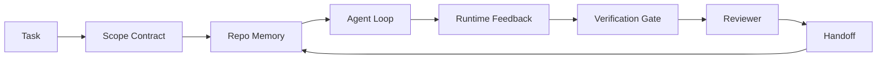

# Agent Workbench Engineering: Tại sao các mô hình mạnh vẫn thất bại

> Một mô hình mạnh là chưa đủ. Các agent đáng tin cậy cần một "workbench" (bàn làm việc): hướng dẫn, trạng thái, phạm vi, phản hồi, kiểm chứng, đánh giá và bàn giao. Nếu thiếu đi những yếu tố này, ngay cả một mô hình tiên phong cũng sẽ tạo ra kết quả không an toàn để triển khai.

**Type:** Learn + Build
**Languages:** Python (stdlib)
**Prerequisites:** Phase 14 · 01 (Agent Loop), Phase 14 · 26 (Failure Modes)
**Time:** ~45 phút

## Mục tiêu học tập

- Phân biệt năng lực mô hình với độ tin cậy trong thực thi.
- Gọi tên bảy bề mặt (surfaces) của workbench quyết định việc một agent có được triển khai hay không.
- So sánh một lần chạy chỉ dựa trên prompt với một lần chạy được hướng dẫn bởi workbench trên một tác vụ repo nhỏ.
- Tạo báo cáo về các chế độ thất bại (failure-mode report) ánh xạ từng bề mặt bị bỏ lỡ với triệu chứng mà nó gây ra.

## Vấn đề

Bạn đưa một mô hình tiên phong vào một repo thực tế và yêu cầu nó thêm xác thực đầu vào (input validation). Nó mở bốn tệp, viết mã có vẻ hợp lý, tuyên bố thành công và dừng lại. Bạn chạy các bài kiểm thử. Hai bài thất bại. Một tệp thứ ba bị thay đổi dù không liên quan gì đến xác thực. Không có hồ sơ nào ghi lại những gì agent đã giả định, những gì nó đã thử trước đó, hoặc những gì còn dang dở.

Mô hình không sai về Python. Nó sai về công việc. Nó không biết thế nào là hoàn thành, nơi nào được phép ghi, bài kiểm thử nào là có thẩm quyền, hoặc phiên làm việc tiếp theo phải bắt đầu từ đâu.

Đây không phải là lỗi của mô hình. Đây là lỗi của workbench. Bề mặt xung quanh agent đang thiếu các thành phần biến một lần tạo (one-shot generation) thành kỹ thuật đáng tin cậy và có thể tiếp tục (resumable).

## Khái niệm

Workbench là môi trường vận hành bao bọc mô hình trong suốt quá trình thực hiện tác vụ. Nó có bảy bề mặt:

| Bề mặt | Nội dung mang theo | Thất bại khi thiếu |
|---------|-----------------|----------------------|
| Instructions | Quy tắc khởi động, hành động bị cấm, định nghĩa hoàn thành | Agent đoán mò ý nghĩa của việc triển khai |
| State | Tác vụ hiện tại, các tệp đã chạm vào, vật cản, hành động tiếp theo | Mỗi phiên làm việc bắt đầu lại từ con số 0 |
| Scope | Các tệp được phép/bị cấm, tiêu chí chấp nhận | Các chỉnh sửa rò rỉ sang mã không liên quan |
| Feedback | Kết quả lệnh thực tế được ghi lại vào vòng lặp | Agent tuyên bố thành công trên một lỗi 400 |
| Verification | Kiểm thử, lint, chạy thử (smoke run), kiểm tra phạm vi | "Trông có vẻ ổn" được đưa vào main |
| Review | Một lượt kiểm tra thứ hai với vai trò khác | Người xây dựng tự chấm điểm bài làm của mình |
| Handoff | Những gì đã thay đổi, tại sao, còn lại gì | Phiên tiếp theo phải khám phá lại mọi thứ |

Workbench độc lập với mô hình. Bạn có thể thay đổi mô hình và giữ nguyên các bề mặt. Bạn không thể thay đổi các bề mặt mà vẫn giữ được độ tin cậy.



Vòng lặp đóng lại trên tệp trạng thái (state file), không phải trên lịch sử trò chuyện. Trò chuyện là thứ dễ bay hơi. Repo mới là hệ thống lưu trữ chính thức.

### Workbench so với prompt engineering

Prompting cho mô hình biết bạn muốn gì trong lượt này. Workbench cho mô hình biết cách thực hiện công việc qua các lượt và các phiên làm việc. Hầu hết các câu chuyện thất bại của agent thực chất là thất bại của workbench nhưng khoác lên mình lớp áo prompt engineering.

### Workbench so với framework

Framework cung cấp cho bạn một runtime (LangGraph, AutoGen, Agents SDK). Workbench cung cấp cho agent một nơi để làm việc bên trong runtime đó. Bạn cần cả hai. Mini-track này tập trung vào cái thứ hai.

### Suy luận từ các nguyên thủy (primitives), không phải từ phân loại của nhà cung cấp

Hiện nay có rất nhiều bài viết về "harness engineering". Addy Osmani, OpenAI, Anthropic, LangChain, Martin Fowler, MongoDB, HumanLayer, Augment Code, Thoughtworks, danh sách awesome của walkinglabs và các bài viết trên Medium, Hacker News đều đang đề cập đến nó. Họ không đồng nhất về ranh giới của một harness, những gì nằm trong phạm vi và từ vựng cần sử dụng. Chúng ta không cần chọn phe. Bảy bề mặt là một lớp UX; bên dưới mỗi workbench là cùng một tập hợp các nguyên thủy hệ thống phân tán (distributed-systems primitives) hỗ trợ bất kỳ backend đáng tin cậy nào.

Hãy tạm bỏ nhãn "agent" sang một bên. Một lần chạy agent là quá trình tính toán xuyên thời gian, tiến trình và máy móc. Để làm cho nó đáng tin cậy, bạn cần các nguyên thủy giống như bất kỳ hệ thống sản xuất nào cần.

| Nguyên thủy | Nó là gì | Nó mang lại gì cho agent |
|-----------|------------|------------------------------|
| Function | Trình xử lý có kiểu. Thuần túy nếu có thể. Sở hữu đầu vào/đầu ra. | Một lệnh gọi công cụ, kiểm tra quy tắc, bước kiểm chứng, gọi mô hình |
| Worker | Tiến trình chạy lâu dài sở hữu một hoặc nhiều hàm và vòng đời | Người xây dựng, người đánh giá, người kiểm chứng, MCP server |
| Trigger | Nguồn sự kiện kích hoạt một hàm | Tick vòng lặp agent, yêu cầu HTTP, tin nhắn hàng đợi, cron, thay đổi tệp |
| Runtime | Ranh giới quyết định cái gì chạy ở đâu, với timeout và tài nguyên nào | Tiến trình của Claude Code, runtime của LangGraph, container worker |
| HTTP / RPC | Dây dẫn giữa người gọi và worker | Giao thức gọi công cụ, yêu cầu MCP, API mô hình |
| Queue | Bộ đệm bền vững giữa trigger và worker; back-pressure, retry, idempotency | Bảng tác vụ, nhật ký phản hồi, hộp thư đánh giá |
| Session persistence | Trạng thái tồn tại sau khi crash, khởi động lại, đổi mô hình | `agent_state.json`, checkpoint, KV store, chính repo đó |
| Authorization policy | Ai có thể gọi hàm nào với phạm vi nào | Tệp được phép/bị cấm, ranh giới phê duyệt, danh sách khả năng MCP |

Bây giờ, hãy ánh xạ bảy bề mặt workbench lên các nguyên thủy đó.

- **Instructions** — chính sách + metadata của hàm. Các quy tắc là các hàm kiểm tra. Bộ định tuyến (`AGENTS.md`) là chính sách gắn liền với quá trình khởi động của runtime.
- **State** — lưu trữ phiên làm việc bền vững. Một kho lưu trữ khóa-giá trị mà runtime đọc ở mỗi bước. Tệp, KV, hoặc DB; ngữ nghĩa bền vững quan trọng, backend lưu trữ thì không.
- **Scope** — chính sách ủy quyền theo tác vụ. Các glob được phép/bị cấm là một ACL. Các phê duyệt bắt buộc là một lưới quyền hạn.
- **Feedback** — nhật ký gọi hàm được ghi vào hàng đợi. Mỗi lệnh gọi shell là một bản ghi, bền vững, có thể phát lại.
- **Verification** — một hàm. Xác định trên đầu vào. Được kích hoạt khi đóng tác vụ. Mặc định thất bại (fails closed).
- **Review** — một worker riêng biệt với quyền đọc trên các artifact của người xây dựng và quyền ghi trên các báo cáo đánh giá.
- **Handoff** — một bản ghi bền vững được phát ra bởi trigger kết thúc phiên. Trigger khởi động của phiên tiếp theo sẽ đọc nó.

Bản thân vòng lặp agent là một worker tiêu thụ các sự kiện (tin nhắn người dùng, kết quả công cụ, tick hẹn giờ), gọi các hàm (mô hình, sau đó là các công cụ mà mô hình chọn), ghi lại các bản ghi (trạng thái, phản hồi) và phát ra các trigger (kiểm chứng, đánh giá, bàn giao). Không có gì bí ẩn; nó có hình dạng giống như một bộ xử lý công việc (job processor).

### Các mô hình phổ biến, được dịch sang nguyên thủy

Mỗi mô hình harness phổ biến đều quy về tám nguyên thủy. Bảng dịch:

| Mô hình cộng đồng hoặc nhà cung cấp | Nó thực sự là gì |
|------------------------------|--------------------|
| Ralph Loop (Claude Code, Codex, sách agentic_harness) | Một trigger tái nhập tác vụ với context sạch; session persistence mang mục tiêu đi tiếp |
| Plan / Execute / Verify (PEV) | Ba worker, mỗi vai trò một, giao tiếp qua trạng thái và hàng đợi giữa các giai đoạn |
| Harness-compute separation (OpenAI Agents SDK) | Tách biệt control-plane / data-plane. Ý tưởng đã có từ hàng thập kỷ |
| Open Agent Passport (OAP) | Chính sách ủy quyền được thực thi bởi một worker tiền hành động, với hàng đợi kiểm toán đã ký |
| Guides and Sensors (Birgitta Böckeler / Thoughtworks) | Quy tắc feedforward + quan sát phản hồi (chính sách ủy quyền + hàm kiểm chứng) |
| Progressive compaction, 5-stage | Một worker quản lý trạng thái chạy định kỳ trên session persistence để giữ nó trong ngân sách |
| Hooks / middleware (LangChain, Claude Code) | Các trigger + hàm bao quanh đường dẫn gọi của runtime |
| Skills as Markdown with progressive disclosure | Một registry hàm nơi metadata được tải vào context đúng lúc (just-in-time) |
| Sandbox agents (Codex, Sandcastle, Vercel Sandbox) | Compute plane: một runtime với hệ thống tệp, mạng và vòng đời cô lập |
| MCP servers | Các worker cung cấp hàm qua RPC ổn định, với danh sách khả năng là ủy quyền |

Mọi mục trong bảng đó đều là việc cộng đồng agent tìm đến một nguyên thủy đã có tên trong hệ thống phân tán và đặt cho nó một cái tên mới. Nhãn hữu ích cho tiếp thị; không hữu ích làm từ vựng kỹ thuật.

### Những gì thực tế chứng minh

Tuyên bố "harness quan trọng hơn mô hình" hiện đã có số liệu. Đáng để biết, vì đó cũng là lập luận trung thực duy nhất chống lại việc "chỉ cần đợi một mô hình thông minh hơn".

- Terminal Bench 2.0 — cùng một mô hình, thay đổi harness đã đưa một coding agent từ ngoài top 30 lên hạng năm (LangChain, *Anatomy of an Agent Harness*).
- Vercel — xóa 80% công cụ của agent; tỷ lệ thành công tăng từ 80% lên 100% (MongoDB).
- Harvey — các agent pháp lý tăng độ chính xác lên hơn gấp đôi chỉ nhờ tối ưu hóa harness (MongoDB).
- 88% các dự án AI agent doanh nghiệp thất bại trong việc đưa vào sản xuất. Các thất bại tập trung quanh runtime, không phải suy luận (preprints.org, *Harness Engineering for Language Agents*).

Bài học không phải là "harness thắng mãi mãi". Các mô hình sẽ hấp thụ các thủ thuật harness theo thời gian. Bài học là hiện nay, kỹ thuật chịu tải nằm xung quanh mô hình, không phải bên trong nó, và các nguyên thủy mang tải trọng đó là những thứ mà mọi hệ thống sản xuất luôn cần.

### Nơi các bài viết của nhà cung cấp dừng lại

Đây là phần bạn không cần phải lịch sự.

- *Anatomy of an Agent Harness* của LangChain liệt kê mười một thành phần — prompts, tools, hooks, sandboxes, orchestration, memory, skills, subagents, và một runtime "dumb loop". Nó không gọi tên hàng đợi, worker như một đơn vị triển khai, ngữ nghĩa trigger, session persistence như một mối quan tâm riêng biệt, hoặc chính sách ủy quyền. Nó coi harness là một đối tượng bạn cấu hình, không phải một hệ thống bạn triển khai.
- *Agent Harness Engineering* của Addy Osmani đưa ra khung `Agent = Model + Harness` và mô hình ratchet, nhưng dừng lại trước khi nói harness được xây dựng từ cái gì. Nó đọc như một quan điểm, không phải một đặc tả.
- Anthropic và OpenAI đi sâu nhất vào các bề mặt nhưng vẫn ở trong runtime của riêng họ. Thông báo "harness-compute separation" trong Agents SDK là bài viết đầu tiên của nhà cung cấp ủng hộ rõ ràng việc tách control-plane / data-plane. Đó là một ý tưởng nguyên thủy, không phải mới.
- Sách *agentic_harness* coi harness là một đối tượng cấu hình (Jaymin West, *Agentic Engineering*, chương 6) và dòng mạnh mẽ nhất trong đó là "harness là ranh giới bảo mật chính trong một hệ thống agentic". Đó chỉ là chính sách ủy quyền, được diễn đạt lại.
- Các luồng Hacker News liên tục đi đến cùng một nơi. Luồng *The agent harness belongs outside the sandbox* lập luận rằng harness nên nằm "giống như một hypervisor nằm ngoài mọi thứ và ủy quyền truy cập dựa trên ngữ cảnh và người dùng". Đó, một lần nữa, là chính sách ủy quyền như một mặt phẳng riêng biệt.

Bạn không cần phải bất đồng với bất kỳ bài viết nào trong số này để nhận ra khoảng trống. Họ đang viết mô tả UX của một hệ thống đã tồn tại. Chúng ta đang xây dựng hệ thống đó. Khi hệ thống được xây dựng đúng, bảy bề mặt sẽ tự xuất hiện từ các nguyên thủy. Khi xây dựng sai, không lượng polish `AGENTS.md` nào sửa được hàng đợi bị thiếu.

Vì vậy, khi bạn nghe "harness engineering" ở nơi khác, hãy dịch sang nguyên thủy. Prompts và quy tắc là chính sách và hàm. Scaffolding là runtime. Guardrails là ủy quyền + kiểm chứng. Hooks là trigger. Memory là session persistence. Ralph Loop là requeue. Subagents là worker. Sandboxes là compute plane. Từ vựng thay đổi; kỹ thuật thì không. Workbench là UX hướng tới agent; harness, theo nghĩa tồn tại sau lần tái cấu trúc tiếp theo của nhà cung cấp, là các hàm, worker, trigger, runtime, hàng đợi, sự bền vững và chính sách được kết nối với nhau một cách chính xác.

```figure
wb-seven-surfaces
```

## Xây dựng

`code/main.py` chạy một tác vụ repo nhỏ hai lần. Lần đầu chỉ với prompt, lần sau với bảy bề mặt được kết nối. Cùng mô hình, cùng tác vụ. Script đếm xem những bề mặt nào bị thiếu trong lần chạy thất bại và in ra báo cáo chế độ thất bại.

Tác vụ repo được cố tình làm nhỏ: thêm xác thực đầu vào vào một handler kiểu FastAPI một tệp và viết một bài kiểm thử vượt qua.

Chạy nó:

```
python3 code/main.py
```

Đầu ra: một nhật ký song song của hai lần chạy, một `failure_modes.json` tóm tắt lần chạy chỉ dựa trên prompt, và một phán quyết một dòng cho lần chạy workbench.

Agent là một stub dựa trên quy tắc nhỏ; điểm mấu chốt là các bề mặt, không phải mô hình. Trong phần còn lại của mini-track này, bạn sẽ xây dựng lại từng bề mặt như một artifact thực tế, có thể tái sử dụng.

## Sử dụng

Ba nơi mà các bề mặt workbench đã tồn tại trong thực tế, ngay cả khi không ai gọi chúng bằng cái tên đó:

- **Claude Code, Codex, Cursor.** `AGENTS.md` và `CLAUDE.md` là bề mặt hướng dẫn. Slash commands là phạm vi. Hooks là kiểm chứng.
- **LangGraph, OpenAI Agents SDK.** Checkpoints và session stores là bề mặt trạng thái. Handoffs là bề mặt bàn giao.
- **CI trên một repo thực tế.** Tests, lint, và type-check là kiểm chứng. PR template là bàn giao. CODEOWNERS là đánh giá.

Workbench engineering là kỷ luật làm cho các bề mặt đó trở nên rõ ràng và có thể tái sử dụng, thay vì để mỗi nhóm tự khám phá lại chúng.

## Triển khai

`outputs/skill-workbench-audit.md` là một kỹ năng di động kiểm toán một repo hiện có để tìm bảy bề mặt workbench và báo cáo cái nào bị thiếu, cái nào một phần, và cái nào khỏe mạnh. Đặt nó cạnh bất kỳ thiết lập agent nào; nó cho bạn biết cần sửa cái gì trước.

## Bài tập

1. Chọn một repo nơi bạn đã chạy một agent. Chấm điểm bảy bề mặt từ 0 (thiếu) đến 2 (khỏe mạnh). Bề mặt yếu nhất của bạn là gì?
2. Mở rộng `main.py` để lần chạy chỉ dựa trên prompt cũng tạo ra một tuyên bố "thành công" giả. Kiểm chứng xem cổng kiểm chứng có bắt được nó không.
3. Thêm bề mặt thứ tám cho sản phẩm của riêng bạn. Biện minh tại sao nó không bị gộp vào một trong bảy bề mặt hiện có.
4. Chạy lại script với một stub agent khác tạo ra một tệp ghi giả. Bề mặt nào bắt được nó đầu tiên?
5. Ánh xạ năm chế độ thất bại phổ biến trong ngành từ Phase 14 · 26 lên bảy bề mặt. Mỗi bề mặt được thiết kế để hấp thụ chế độ nào?

## Thuật ngữ chính

| Thuật ngữ | Mọi người nói | Ý nghĩa thực sự |
|------|----------------|------------------------|
| Workbench | "Thiết lập" | Các bề mặt được thiết kế xung quanh mô hình giúp công việc đáng tin cậy |
| Surface | "Tài liệu" hoặc "script" | Một đầu vào có tên, máy đọc được mà agent đọc hoặc ghi mỗi lượt |
| System of record | "Ghi chú" | Tệp mà agent coi là sự thật khi lịch sử trò chuyện biến mất |
| Definition of done | "Chấp nhận" | Một danh sách kiểm tra khách quan, dựa trên tệp mà agent không thể làm giả |
| Workbench audit | "Kiểm tra sẵn sàng repo" | Một lượt kiểm tra bảy bề mặt để gắn cờ các mảnh thiếu trước khi bắt đầu công việc |

## Đọc thêm

Đọc những tài liệu này như các điểm dữ liệu, không phải như các cơ quan có thẩm quyền. Mỗi tài liệu là một phân loại một phần. Dịch mọi khái niệm trở lại nguyên thủy (hàm, worker, trigger, runtime, HTTP/RPC, hàng đợi, sự bền vững, chính sách) trước khi quyết định áp dụng nó.

Các khung của nhà cung cấp:

- [Addy Osmani, Agent Harness Engineering](https://addyosmani.com/blog/agent-harness-engineering/) — `Agent = Model + Harness` và mô hình ratchet; thiếu hạ tầng
- [LangChain, The Anatomy of an Agent Harness](https://blog.langchain.com/the-anatomy-of-an-agent-harness/) — mười một thành phần: prompts, tools, hooks, orchestration, sandboxes, memory, skills, subagents, runtime; bỏ qua hàng đợi, triển khai, ủy quyền
- [OpenAI, Harness engineering: leveraging Codex in an agent-first world](https://openai.com/index/harness-engineering/) — góc nhìn của nhóm Codex về các bề mặt xung quanh runtime của họ
- [OpenAI, Unrolling the Codex agent loop](https://openai.com/index/unrolling-the-codex-agent-loop/) — vòng lặp agent được rút gọn thành `while` qua các lệnh gọi hàm
- [Anthropic, Effective harnesses for long-running agents](https://www.anthropic.com/engineering/effective-harnesses-for-long-running-agents) — các bề mặt dài hạn bên trong một runtime cụ thể
- [Anthropic, Harness design for long-running application development](https://www.anthropic.com/engineering/harness-design-long-running-apps) — ghi chú thiết kế ứng dụng
- [LangChain Deep Agents harness capabilities](https://docs.langchain.com/oss/python/deepagents/harness) — bề mặt cấu hình runtime

Các bài viết của người thực hành với chi tiết hữu ích:

- [Martin Fowler / Birgitta Böckeler, Harness engineering for coding agent users](https://martinfowler.com/articles/harness-engineering.html) — guides (feedforward) + sensors (feedback); khung lý thuyết điều khiển sạch nhất
- [HumanLayer, Skill Issue: Harness Engineering for Coding Agents](https://www.humanlayer.dev/blog/skill-issue-harness-engineering-for-coding-agents) — "đây không phải vấn đề mô hình, đây là vấn đề cấu hình"
- [MongoDB, The Agent Harness: Why the LLM Is the Smallest Part of Your Agent System](https://www.mongodb.com/company/blog/technical/agent-harness-why-llm-is-smallest-part-of-your-agent-system) — số liệu: Vercel 80% lên 100%, Harvey tăng 2x độ chính xác, Terminal Bench Top 30 lên Top 5
- [Augment Code, Harness Engineering for AI Coding Agents](https://www.augmentcode.com/guides/harness-engineering-ai-coding-agents) — hướng dẫn ưu tiên ràng buộc
- [Sequoia podcast, Harrison Chase on Context Engineering Long-Horizon Agents](https://sequoiacap.com/podcast/context-engineering-our-way-to-long-horizon-agents-langchains-harrison-chase/) — các mối quan tâm về runtime hơn là mô hình

Sách, bài báo và triển khai tham khảo:

- [Jaymin West, Agentic Engineering — Chapter 6: Harnesses](https://www.jayminwest.com/agentic-engineering-book/6-harnesses) — xử lý cấp độ sách, coi harness là ranh giới bảo mật chính
- [preprints.org, Harness Engineering for Language Agents (March 2026)](https://www.preprints.org/manuscript/202603.1756) — khung học thuật về điều khiển / đại diện / runtime
- [walkinglabs/awesome-harness-engineering](https://github.com/walkinglabs/awesome-harness-engineering) — danh sách đọc được tuyển chọn về ngữ cảnh, đánh giá, quan sát, điều phối
- [ai-boost/awesome-harness-engineering](https://github.com/ai-boost/awesome-harness-engineering) — danh sách tuyển chọn thay thế (công cụ, evals, bộ nhớ, MCP, quyền hạn)
- [andrewgarst/agentic_harness](https://github.com/andrewgarst/agentic_harness) — triển khai tham khảo sẵn sàng sản xuất với bộ nhớ Redis và bộ eval
- [HKUDS/OpenHarness](https://github.com/HKUDS/OpenHarness) — open agent harness với personal agent tích hợp

Các luồng Hacker News đáng đọc vì những bất đồng, không phải sự đồng thuận:

- [HN: Effective harnesses for long-running agents](https://news.ycombinator.com/item?id=46081704)
- [HN: Improving 15 LLMs at Coding in One Afternoon. Only the Harness Changed](https://news.ycombinator.com/item?id=46988596)
- [HN: The agent harness belongs outside the sandbox](https://news.ycombinator.com/item?id=47990675) — lập luận cho ủy quyền như một mặt phẳng riêng biệt

Tham chiếu chéo trong chương trình giảng dạy này:

- Phase 14 · 23 — OpenTelemetry GenAI conventions: lớp quan sát mà tài liệu về cảm biến chỉ ra
- Phase 14 · 26 — Các chế độ thất bại mà bảy bề mặt được thiết kế để hấp thụ
- Phase 14 · 27 — Các biện pháp phòng thủ tiêm prompt nằm ở nguyên thủy chính sách ủy quyền
- Phase 14 · 29 — Runtime sản xuất (hàng đợi, sự kiện, cron): nơi các nguyên thủy trong bài học này sống trong triển khai