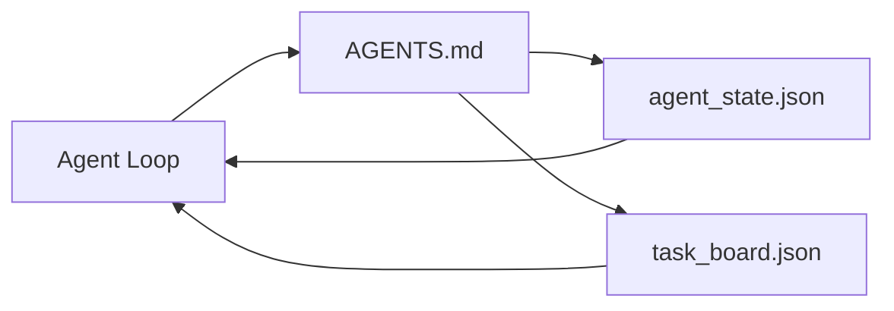

# The Minimal Agent Workbench

> Workbench tối thiểu hữu dụng nhất bao gồm ba tệp: một bộ định tuyến (router) hướng dẫn gốc, một tệp trạng thái (state file) và một bảng tác vụ (task board). Mọi thứ khác đều được xây dựng dựa trên nền tảng này. Nếu một repo không thể duy trì ba tệp này, sẽ không có model nào có thể cứu vãn được nó.

**Type:** Build
**Languages:** Python (stdlib)
**Prerequisites:** Phase 14 · 31 (Why Capable Models Still Fail)
**Time:** ~45 minutes

## Mục tiêu học tập

- Xác định ba tệp tạo nên workbench tối thiểu khả thi (minimum viable workbench).
- Giải thích lý do tại sao một bộ định tuyến gốc ngắn gọn lại hiệu quả hơn một `AGENTS.md` nguyên khối dài dòng.
- Xây dựng một tệp trạng thái mà agent có thể đọc ở mỗi lượt và ghi lại sau khi kết thúc.
- Xây dựng một bảng tác vụ có thể tồn tại qua các phiên làm việc mà không cần lịch sử trò chuyện.

## Vấn đề

Hầu hết các đội ngũ cố gắng tạo workbench bằng cách viết một `AGENTS.md` dài 3000 dòng và coi đó là xong. Model tải nó, bỏ qua những phần nó không thể tóm tắt và vẫn thất bại trên những bề mặt mà nó luôn thất bại.

Bạn cần điều ngược lại. Một tệp gốc nhỏ gọn chỉ điều hướng agent vào các tệp sâu hơn khi cần thiết. Trạng thái bền vững mà agent đọc trước khi hành động và ghi lại sau đó. Một bảng tác vụ cho biết những gì đang thực hiện, những gì đang bị chặn và những gì tiếp theo.

Ba tệp. Mỗi tệp có một công việc. Mỗi tệp đủ khả năng để máy đọc và phát triển thành một hệ thống thực thụ sau này.

## Khái niệm



### AGENTS.md là một bộ định tuyến, không phải là sách hướng dẫn

Một `AGENTS.md` tốt phải ngắn gọn. Nó hướng agent đến:

- Tệp trạng thái (bạn đang ở đâu).
- Bảng tác vụ (những gì còn lại).
- Các quy tắc sâu hơn (dưới `docs/agent-rules.md`).
- Lệnh xác minh (làm thế nào để biết nó hoạt động).

Bất cứ thứ gì dài hơn đều nằm trong các tài liệu chuyên sâu, chỉ được tải khi cần. Sách hướng dẫn dài thường bị bỏ qua. Bộ định tuyến ngắn gọn sẽ được tuân thủ.

### agent_state.json là hệ thống ghi chép (system of record)

Trạng thái mang theo: id tác vụ đang hoạt động, các tệp đã chạm vào, các giả định đã đặt ra, các rào cản và hành động tiếp theo. Agent đọc nó ở mỗi lượt. Phiên làm việc tiếp theo sẽ đọc nó thay vì phát lại lịch sử trò chuyện.

Trạng thái nằm trong một tệp vì lịch sử trò chuyện không đáng tin cậy. Các phiên làm việc kết thúc. Các cuộc hội thoại bị cắt bớt. Tệp tin thì không.

### task_board.json là hàng đợi

Bảng tác vụ mang mọi tác vụ với trạng thái `todo | in_progress | done | blocked`. Đây là hàng đợi mà agent lấy ra khi trạng thái trống, và là hàng đợi bạn đọc khi muốn biết liệu agent có đang đi đúng hướng hay không.

Một tác vụ trên bảng có id, mục tiêu, người sở hữu (`builder`, `reviewer`, hoặc `human`) và tiêu chí chấp nhận. Bảng được thiết kế nhỏ gọn có chủ đích: khi nó phát triển vượt quá một màn hình, bạn đang gặp vấn đề về lập kế hoạch, không phải vấn đề về bảng.

### Ba tệp là nền tảng, không phải giới hạn

Các bài học sau sẽ bổ sung các hợp đồng phạm vi, trình chạy phản hồi, cổng xác minh, danh sách kiểm tra của người đánh giá và các gói bàn giao. Ba tệp ở đây là những gì tất cả các thành phần đó giả định.

```figure
wb-three-files
```

## Xây dựng

`code/main.py` viết workbench tối thiểu vào một repo trống và minh họa một lượt agent đơn lẻ:

1. Đọc `agent_state.json`.
2. Lấy tác vụ tiếp theo từ `task_board.json` nếu trạng thái trống.
3. Chạm vào một tệp duy nhất trong phạm vi.
4. Ghi lại trạng thái đã cập nhật.

Chạy nó:

```
python3 code/main.py
```

Script tạo ra `workdir/` bên cạnh nó, thiết lập ba tệp, chạy một lượt và in ra diff. Chạy lại để xem lượt thứ hai tiếp tục từ nơi lượt thứ nhất đã dừng lại như thế nào.

## Sử dụng

Bên trong các sản phẩm agent thực tế, ba tệp tương tự xuất hiện dưới các tên khác nhau:

- **Claude Code:** `AGENTS.md` hoặc `CLAUDE.md` cho bộ định tuyến, các kho lưu trữ kiểu `.claude/state.json` cho trạng thái, các hook cho bảng.
- **Codex / Cursor:** quy tắc không gian làm việc cho bộ định tuyến, bộ nhớ phiên cho trạng thái, các tác vụ được xếp hàng trong thanh bên trò chuyện cho bảng.
- **Custom Python agent:** chính các tệp bạn vừa viết.

Tên gọi thay đổi. Hình thái thì không.

## Các mô hình sản xuất trong thực tế

Workbench tối thiểu tồn tại được khi tiếp xúc với các monorepo thực tế khi ba mô hình được xếp chồng lên trên nó. Chúng độc lập; hãy chọn những cái mà repo của bạn thực sự cần.

**`AGENTS.md` lồng nhau với ưu tiên gần nhất.** OpenAI vận chuyển 88 tệp `AGENTS.md` trên khắp repo chính, mỗi tệp cho một thành phần con. Codex, Cursor, Claude Code và Copilot đều đi từ tệp đang làm việc về phía gốc repo và nối tất cả các tệp `AGENTS.md` mà chúng tìm thấy trên đường đi. Các tệp thư mục con mở rộng tệp gốc. Codex thêm `AGENTS.override.md` để thay thế thay vì mở rộng; cơ chế ghi đè này là đặc thù của Codex và nên tránh cho công việc đa công cụ. Phép đo của Augment Code là dòng quan trọng: các tệp `AGENTS.md` tốt nhất mang lại bước nhảy vọt về chất lượng tương đương với việc nâng cấp từ Haiku lên Opus; những tệp tệ nhất làm cho đầu ra còn tệ hơn cả khi không có tệp nào.

**Các phản mô hình (anti-patterns) cần từ chối, ngay cả khi chúng trông giống như độ bao phủ.** Các hướng dẫn xung đột sẽ âm thầm đẩy agent từ chế độ tương tác sang chế độ tham lam (ICLR 2026 AMBIG-SWE: 48.8% → 28% tỷ lệ giải quyết); hãy đánh số ưu tiên thay vì xếp chồng chúng phẳng. Các quy tắc kiểu không thể xác minh ("tuân theo Google Python Style Guide") mà không có lệnh thực thi sẽ khiến agent tự bịa ra sự tuân thủ; hãy ghép mỗi quy tắc kiểu với lệnh lint chính xác. Dẫn dắt bằng kiểu thay vì lệnh sẽ chôn vùi lộ trình xác minh; lệnh trước, kiểu sau. Viết cho con người thay vì cho agent sẽ lãng phí ngân sách ngữ cảnh; sự ngắn gọn là một tính năng.

**Symlink đa công cụ.** Một tệp gốc duy nhất với các symlink (`ln -s AGENTS.md CLAUDE.md`, `ln -s AGENTS.md .github/copilot-instructions.md`, `ln -s AGENTS.md .cursorrules`) giữ cho mọi agent lập trình trên cùng một nguồn sự thật. `nx ai-setup` của Nx tự động hóa điều này trên Claude Code, Cursor, Copilot, Gemini, Codex và OpenCode từ một cấu hình duy nhất.

## Triển khai

`outputs/skill-minimal-workbench.md` tạo ra workbench ba tệp cho bất kỳ repo mới nào: một bộ định tuyến `AGENTS.md` được tinh chỉnh cho dự án, một `agent_state.json` với các khóa phù hợp và một `task_board.json` được gieo mầm với backlog hiện tại.

## Bài tập

1. Thêm dấu thời gian `last_run` vào `agent_state.json`. Từ chối chạy nếu tệp cũ hơn 24 giờ trừ khi người vận hành xác nhận.
2. Thêm trường `priority` vào bảng tác vụ và thay đổi bộ lấy tác vụ để luôn chọn `todo` có mức ưu tiên cao nhất.
3. Di chuyển `task_board.json` sang JSON Lines để mỗi tác vụ là một dòng và các diff sạch sẽ trong kiểm soát phiên bản.
4. Viết một `lint_workbench.py` thất bại nếu `AGENTS.md` dài hơn 80 dòng hoặc tham chiếu đến một tệp không tồn tại.
5. Quyết định xem tệp nào trong ba tệp sẽ gây đau đớn nhất nếu bị mất. Hãy bảo vệ quan điểm đó.

## Thuật ngữ chính

| Thuật ngữ | Mọi người nói | Ý nghĩa thực sự |
|------|----------------|------------------------|
| Router | `AGENTS.md` | Tệp gốc ngắn gọn hướng agent đến các tài liệu và tệp sâu hơn |
| State file | "Ghi chú" | Bản ghi máy có thể đọc được về vị trí của agent, được ghi lại mỗi lượt |
| Task board | "Backlog" | Hàng đợi JSON các công việc với trạng thái, người sở hữu, tiêu chí chấp nhận |
| System of record | "Nguồn sự thật" | Tệp mà workbench coi là có thẩm quyền khi không còn lịch sử trò chuyện |

## Đọc thêm

- [agents.md — the open spec](https://agents.md/) — được áp dụng bởi Cursor, Codex, Claude Code, Copilot, Gemini, OpenCode
- [Augment Code, A good AGENTS.md is a model upgrade. A bad one is worse than no docs at all](https://www.augmentcode.com/blog/how-to-write-good-agents-dot-md-files) — các bước nhảy vọt về chất lượng được đo lường
- [Blake Crosley, AGENTS.md Patterns: What Actually Changes Agent Behavior](https://blakecrosley.com/blog/agents-md-patterns) — những gì hoạt động theo kinh nghiệm, những gì không
- [Datadog Frontend, Steering AI Agents in Monorepos with AGENTS.md](https://dev.to/datadog-frontend-dev/steering-ai-agents-in-monorepos-with-agentsmd-13g0) — ưu tiên lồng nhau trong thực tế
- [Nx Blog, Teach Your AI Agent How to Work in a Monorepo](https://nx.dev/blog/nx-ai-agent-skills) — tạo nguồn đơn lẻ trên sáu công cụ
- [The Prompt Shelf, AGENTS.md Best Practices: Structure, Scope, and Real Examples](https://thepromptshelf.dev/blog/agents-md-best-practices/) — thứ tự phần tồn tại sau khi đánh giá
- [Anthropic, Claude Code subagents](https://code.claude.com/docs/en/sub-agents)
- Phase 14 · 31 — các chế độ thất bại mà workbench tối thiểu này hấp thụ
- Phase 14 · 34 — lược đồ trạng thái bền vững mà bài học này giới thiệu trước