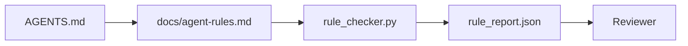

# Hướng dẫn cho Agent dưới dạng các Ràng buộc có thể thực thi

> Các hướng dẫn được viết dưới dạng văn xuôi chỉ là những mong muốn. Các hướng dẫn được viết dưới dạng ràng buộc mới là các bài kiểm tra. Workbench biến mỗi quy tắc thành thứ mà agent có thể kiểm tra trong thời gian chạy (runtime) và người đánh giá có thể xác minh sau đó.

**Type:** Build
**Languages:** Python (stdlib)
**Prerequisites:** Phase 14 · 32 (Minimal Workbench)
**Time:** ~50 phút

## Mục tiêu học tập

- Tách biệt văn xuôi điều hướng khỏi các quy tắc vận hành.
- Thể hiện các quy tắc khởi động, hành động bị cấm, định nghĩa hoàn thành (definition of done), xử lý sự không chắc chắn và ranh giới phê duyệt dưới dạng các ràng buộc có thể kiểm tra bằng máy.
- Triển khai bộ kiểm tra quy tắc (rule checker) để chấm điểm một phiên chạy dựa trên bộ quy tắc.
- Làm cho bộ quy tắc thân thiện với diff để người đánh giá có thể thấy những gì đã thay đổi.

## Vấn đề

Một `AGENTS.md` điển hình thường đọc giống như tài liệu giới thiệu (onboarding). Nó bảo agent "hãy cẩn thận", "kiểm tra kỹ lưỡng" và "hỏi nếu không chắc chắn". Ba ngày sau, agent thực hiện thay đổi mà không có kiểm tra nào, ghi vào một thư mục bị cấm và không bao giờ hỏi vì nó không bao giờ biết ranh giới nằm ở đâu.

Các hướng dẫn sẽ mạnh mẽ khi chúng mang tính vận hành và yếu ớt khi chúng chỉ mang tính khát vọng. Giải pháp là viết các quy tắc mà workbench có thể diễn giải và người đánh giá có thể chấm điểm.

## Khái niệm

Các quy tắc thuộc về `docs/agent-rules.md`, tách biệt khỏi bộ định tuyến gốc (root router) ngắn gọn. Mỗi quy tắc có một tên, một danh mục và một bài kiểm tra.



### Năm danh mục bao quát hầu hết các quy tắc

| Danh mục | Câu hỏi mà quy tắc trả lời | Ví dụ |
|----------|---------------------------|---------|
| Startup | Điều gì phải đúng trước khi bắt đầu công việc? | "tệp trạng thái tồn tại và mới" |
| Forbidden | Điều gì không bao giờ được phép xảy ra? | "không chỉnh sửa `scripts/release.sh`" |
| Definition of done | Điều gì chứng minh nhiệm vụ đã hoàn thành? | "pytest thoát 0 và dòng chấp nhận vượt qua" |
| Uncertainty | Agent làm gì khi không chắc chắn? | "mở một ghi chú câu hỏi thay vì đoán" |
| Approval | Điều gì cần sự phê duyệt của con người? | "bất kỳ dependency mới nào, bất kỳ ghi chép nào vào prod" |

Một quy tắc không phù hợp với một trong năm danh mục này thường nên được chia thành hai quy tắc. Hãy ép buộc việc chia tách đó.

### Các quy tắc có thể đọc được bằng máy

Mỗi quy tắc có một slug, một danh mục, một mô tả một dòng và một trường `check` đặt tên cho một hàm trong `rule_checker.py`. Thêm một quy tắc nghĩa là thêm một bài kiểm tra; bộ kiểm tra sẽ phát triển cùng với workbench.

### Các quy tắc thân thiện với diff

Các quy tắc nằm mỗi quy tắc một tiêu đề trong một tệp markdown duy nhất. Việc đổi tên có thể nhìn thấy trong các diff. Các quy tắc mới nằm ở đầu danh mục của chúng. Các quy tắc cũ bị xóa, không phải comment lại, vì workbench là nguồn sự thật duy nhất, không phải nhật ký trò chuyện về cảm nhận của nhóm trong quý trước.

### Quy tắc so với các guardrail của framework

Các guardrail của framework (OpenAI Agents SDK guardrails, LangGraph interrupts) thực thi các quy tắc ở cấp độ runtime. Bộ quy tắc trong bài học này là hợp đồng có thể đọc được bởi con người và có thể đánh giá được mà các guardrail đó thực hiện. Bạn cần cả hai: runtime bắt các vi phạm trong một lượt, bộ quy tắc chứng minh rằng runtime đang làm đúng.

### Tiết lộ lũy tiến: một bản đồ, không phải một bách khoa toàn thư

Lý do `AGENTS.md` liên tục phát triển là vì mỗi sự cố đều thêm một quy tắc và không có sự cố nào loại bỏ quy tắc cũ. Một năm sau, tệp dài hai nghìn dòng, và agent đọc màn hình đầu tiên, hết ngân sách chú ý (attention budget) và chỉ hành động dựa trên một phần nhỏ những gì nó được bảo. Một tệp hướng dẫn khổng lồ thất bại vì cùng lý do một tài liệu onboarding dài bốn mươi trang thất bại: người đọc lướt qua nó một lần và không bao giờ quay lại phần quan trọng.

Giải pháp không phải là một tệp ngắn hơn. Đó là một tệp có phân lớp. Bộ định tuyến gốc đủ nhỏ để đọc trong mỗi phiên và không chứa gì ngoài các con trỏ. Độ sâu nằm trong các tệp chủ đề mà agent chỉ tải khi nhiệm vụ chạm đến chúng. Hãy đưa cho agent một bản đồ, không phải toàn bộ bách khoa toàn thư, và để nó tự đi đến trang nó cần.

```
AGENTS.md                  # router, < 50 lines: what this repo is, where to look, the 5 hard rules
docs/
  agent-rules.md           # the full rule set (this lesson)
  architecture.md          # loaded when the task touches module boundaries
  testing.md               # loaded when the task writes or runs tests
  deploy.md                # loaded only for release work, gated behind an approval rule
feature_list.json          # the backlog (Phase 14 · 36)
```

| Tầng | Nằm trong | Đọc khi | Ngân sách kích thước |
|------|----------|-----------|-------------|
| Router | `AGENTS.md` | Mỗi phiên, luôn luôn | Dưới ~50 dòng |
| Rules | `docs/agent-rules.md` | Mỗi phiên, khi khởi động | Một màn hình mỗi danh mục |
| Topic docs | `docs/<topic>.md` | Chỉ khi nhiệm vụ chạm đến chủ đề đó | Sâu tùy ý |

Hai bài kiểm tra giữ cho việc phân lớp trung thực. Bài kiểm tra khả năng tiếp cận (reachability test): một agent sẽ tiếp cận bất kỳ quy tắc nào trong tối đa hai bước nhảy từ router, vì vậy router phải liên kết mọi tài liệu chủ đề theo đường dẫn, không mô tả nó bằng văn xuôi. Bài kiểm tra độ mới (freshness test): router đủ ngắn để người đánh giá đọc lại trong mỗi PR, đây là điều duy nhất ngăn nó âm thầm phát triển trở lại thành bách khoa toàn thư mà nó đã thay thế. Một con trỏ không còn phân giải được là một thất bại tồi tệ hơn một quy tắc bị thiếu, vì vậy một liên kết hỏng trong router tự nó là một vi phạm kiểm tra khởi động.

```figure
wb-rule-checkoff
```

## Xây dựng nó

`code/main.py` cung cấp:

- Trình phân tích `agent-rules.md` tải các quy tắc vào một dataclass.
- Các hàm kiểm tra kiểu `rule_checker.py`, mỗi hàm cho một tham chiếu `check`.
- Một bản demo chạy agent vi phạm hai quy tắc và một bài kiểm tra vượt qua để bắt chúng.

Chạy nó:

```
python3 code/main.py
```

Đầu ra: bộ quy tắc đã phân tích, dấu vết chạy (run trace), đạt/không đạt cho mỗi quy tắc và một `rule_report.json` được lưu bên cạnh tập lệnh.

## Các mô hình sản xuất trong thực tế

Ba mô hình tách biệt một bộ quy tắc tồn tại được một quý với một bộ quy tắc suy tàn trong một tuần.

**Gán nhãn mức độ nghiêm trọng tại thời điểm viết.** Mỗi quy tắc mang theo `severity`: `block`, `warn`, hoặc `info`. Bộ kiểm tra báo cáo cả ba; runtime chỉ từ chối ở mức `block`. Hầu hết các nhóm phóng đại mức độ nghiêm trọng sớm rồi âm thầm làm yếu nó dưới áp lực thời hạn; gán nhãn tại thời điểm viết buộc phải hiệu chỉnh ngay từ đầu. Kết hợp với cổng xác minh (Phase 14 · 38), cổng này ký xác nhận bất kỳ sự ghi đè nào của quy tắc `block` vào nhật ký kiểm toán `overrides.jsonl`.

**Hết hạn quy tắc như một chức năng ép buộc.** Mỗi quy tắc mang theo ngày `expires_at` (mặc định 90 ngày kể từ khi soạn thảo). Bộ kiểm tra phát ra cảnh báo khi một quy tắc chưa hết hạn có 0 vi phạm trong 60 ngày liên tiếp; đánh giá hàng quý tiếp theo sẽ biện minh cho việc giữ lại, làm yếu nó thành `info`, hoặc xóa nó. Dữ liệu Đánh giá Mã AI sản xuất của Cloudflare (tháng 4 năm 2026, 131.246 lượt đánh giá trên 5.169 repo trong 30 ngày) cho thấy các bộ quy tắc có thời hạn hết hạn rõ ràng duy trì dưới 30 quy tắc mỗi repo; các bộ không có thời hạn đã tăng lên hơn 80 với hầu hết không bao giờ kích hoạt.

**Markdown làm nguồn, JSON làm bộ nhớ đệm.** `agent-rules.md` là tệp được soạn thảo; `agent-rules.lock.json` là bộ nhớ đệm mà bộ kiểm tra đọc trong đường dẫn nóng (hot path). Khóa được tạo lại bởi một pre-commit hook. Các diff Markdown có thể đánh giá được; việc phân tích JSON nằm ngoài mọi lượt chạy. Cùng hình dạng với `package.json` / `package-lock.json` và `Cargo.toml` / `Cargo.lock`.

## Sử dụng nó

Trong sản xuất:

- Claude Code, Codex, Cursor đọc các quy tắc khi bắt đầu phiên và trích dẫn chúng khi từ chối các hành động. Bộ kiểm tra chạy lại chúng trong CI để bắt các sai lệch âm thầm.
- OpenAI Agents SDK guardrails đăng ký các bài kiểm tra tương tự như các guardrail đầu vào và đầu ra. Markdown là bề mặt tài liệu; SDK là bề mặt runtime.
- LangGraph interrupts kích hoạt khi một node đang chạy vi phạm quy tắc. Trình xử lý ngắt đọc quy tắc, hỏi con người và tiếp tục.

Bộ quy tắc có thể di chuyển trên cả ba vì nó chỉ là markdown cộng với tên hàm.

## Gửi nó

`outputs/skill-rule-set-builder.md` phỏng vấn chủ sở hữu dự án, phân loại các hướng dẫn văn xuôi hiện có của họ thành năm danh mục và phát ra một `agent-rules.md` có phiên bản cộng với một stub kiểm tra.

## Bài tập

1. Thêm danh mục thứ sáu nếu sản phẩm của bạn thực sự cần. Biện minh tại sao nó không thể gộp vào một trong năm danh mục kia.
2. Mở rộng bộ kiểm tra để một quy tắc có thể mang theo mức độ nghiêm trọng (`block`, `warn`, `info`) và báo cáo tổng hợp tương ứng.
3. Kết nối bộ kiểm tra vào CI: làm thất bại bản build nếu một quy tắc mức độ block thất bại trong lần chạy agent mới nhất.
4. Thêm trường "hết hạn" cho mỗi quy tắc. Sau 90 ngày không có lỗi kiểm tra, quy tắc đó sẽ được xem xét lại.
5. Tìm một `AGENTS.md` thực tế và viết lại nó thành các quy tắc năm danh mục. Bao nhiêu dòng trong đó là vận hành? Bao nhiêu là khát vọng?

## Thuật ngữ chính

| Thuật ngữ | Mọi người nói | Ý nghĩa thực sự |
|------|----------------|------------------------|
| Operational rule | "Một hướng dẫn thực sự" | Một quy tắc mà workbench có thể kiểm tra tại runtime |
| Aspirational rule | "Hãy cẩn thận" | Một quy tắc không có kiểm tra; hãy xóa hoặc nâng cấp |
| Definition of done | "Chấp nhận" | Một bằng chứng khách quan, dựa trên tệp rằng nhiệm vụ đã hoàn thành |
| Block severity | "Quy tắc cứng" | Vi phạm sẽ dừng phiên chạy; không thể tắt mà không có người vận hành |
| Rule expiry | "Quét quy tắc cũ" | Một quy tắc không có lỗi trong N ngày sẽ được nghỉ hưu |

## Đọc thêm

- [OpenAI Agents SDK guardrails](https://openai.github.io/openai-agents-python/guardrails/)
- [LangGraph interrupts](https://langchain-ai.github.io/langgraph/how-tos/human_in_the_loop/breakpoints/)
- [Anthropic, Building Effective Agents](https://www.anthropic.com/research/building-effective-agents)
- [Rick Hightower, Agent RuleZ: A Deterministic Policy Engine](https://medium.com/@richardhightower/agent-rulez-a-deterministic-policy-engine-for-ai-coding-agents-9489e0561edf) — mức độ nghiêm trọng block/warn/info trong sản xuất
- [Cloudflare, Orchestrating AI Code Review at Scale](https://blog.cloudflare.com/ai-code-review/) — 131k lượt đánh giá, bài học về soạn thảo quy tắc
- [microservices.io, GenAI development platform — part 1: guardrails](https://microservices.io/post/architecture/2026/03/09/genai-development-platform-part-1-development-guardrails.html) — phòng thủ theo chiều sâu giữa quy tắc và CI
- [Type-Checked Compliance: Deterministic Guardrails (arXiv 2604.01483)](https://arxiv.org/pdf/2604.01483) — Lean 4 là giới hạn trên của quy tắc-như-kiểm tra
- [logi-cmd/agent-guardrails](https://github.com/logi-cmd/agent-guardrails) — triển khai merge-gate: phạm vi, kiểm tra đột biến, ngân sách vi phạm
- Phase 14 · 32 — workbench tối thiểu mà bộ quy tắc này được đưa vào
- Phase 14 · 38 — cổng xác minh tiêu thụ báo cáo quy tắc
- Phase 14 · 39 — agent đánh giá chấm điểm tuân thủ quy tắc