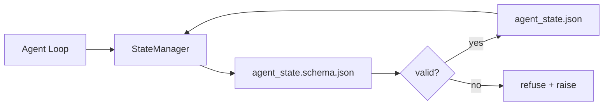

# Repo Memory và Durable State

> Lịch sử trò chuyện là dữ liệu tạm thời. Repo mới là dữ liệu bền vững. Workbench lưu trữ trạng thái của agent trong các tệp được đánh phiên bản để phiên làm việc tiếp theo, agent tiếp theo và người đánh giá tiếp theo đều đọc từ cùng một nguồn dữ liệu tin cậy (source of truth).

**Type:** Build
**Languages:** Python (stdlib + `jsonschema` tùy chọn)
**Prerequisites:** Phase 14 · 32 (Minimal Workbench)
**Time:** ~60 phút

## Mục tiêu học tập

- Xác định những gì thuộc về repo memory và những gì thuộc về lịch sử trò chuyện.
- Viết JSON Schema cho `agent_state.json` và `task_board.json`.
- Xây dựng trình quản lý trạng thái (state manager) có khả năng tải, xác thực, thay đổi và lưu trữ trạng thái một cách nguyên tử (atomically).
- Sử dụng schema để từ chối các thao tác ghi dữ liệu lỗi trước khi chúng làm hỏng workbench.

## Vấn đề

Agent kết thúc một phiên làm việc. Cuộc trò chuyện đóng lại. Phiên tiếp theo mở ra và hỏi bắt đầu từ đâu. Model trả lời "để tôi kiểm tra các tệp", đọc các ghi chú cũ và thực hiện lại công việc đã hoàn thành. Tệ hơn nữa, nó ghi đè lên một tệp đã hoàn thiện vì không ai thông báo cho nó biết tệp đó đã xong.

Giải pháp của workbench là repo memory: trạng thái nằm trong các tệp JSON trong repo, được ghi theo một schema, được lưu trữ nguyên tử và thân thiện với việc diff trong code review. Chat là một luồng dữ liệu tạm thời; repo là hệ thống lưu trữ chính thức.

## Khái niệm



### Những gì thuộc về repo memory

| Thuộc về | Không thuộc về |
|---------|-----------------|
| ID tác vụ đang thực hiện | Bản ghi chat thô |
| Các tệp đã chỉnh sửa trong phiên này | Các bước suy luận ở cấp độ token |
| Các giả định mà agent đã đưa ra | "Người dùng có vẻ thất vọng" |
| Các rào cản (blockers) đang mở | Các kết quả mẫu (sampled completions) |
| Hành động tiếp theo | ID model cụ thể của nhà cung cấp |

Bài kiểm tra là tính bền vững: liệu thông tin này có hữu ích sau ba tháng nữa trong một lần chạy CI không? Nếu có, hãy đưa vào repo. Nếu không, đó là telemetry.

### Trạng thái ưu tiên Schema (Schema-first)

JSON Schema là bản hợp đồng. Nếu không có nó, mỗi agent sẽ tự tạo ra các trường mới, mỗi người đánh giá phải học một cấu trúc mới và mỗi script CI phải xử lý các trường hợp ngoại lệ cho các phiên bản cũ. Với nó, một thao tác ghi lỗi sẽ bị từ chối.

Schema bao gồm:

- Các khóa bắt buộc.
- Các giá trị `status` được phép.
- Các giá trị bị cấm (ví dụ: `null` cho mảng).
- Các ràng buộc mẫu (task id phải khớp với `T-\d{3,}`).
- Trường phiên bản để phục vụ việc di chuyển (migrations).

### Ghi dữ liệu nguyên tử (Atomic writes)

Các thao tác ghi trạng thái cần phải tồn tại được sau các lỗi cục bộ: ghi vào tệp tạm, fsync, sau đó đổi tên đè lên tệp đích. Tệp trạng thái là nguồn dữ liệu tin cậy; một tệp bị ghi dở dang còn tệ hơn là không có tệp nào.

### Di chuyển (Migrations)

Khi schema thay đổi, hãy gửi kèm một script di chuyển cùng với bản cập nhật schema. Tệp trạng thái mang theo một trường `schema_version`; trình quản lý sẽ từ chối tải tệp từ một phiên bản mà nó không thể di chuyển.

```figure
wb-state-persist
```

## Xây dựng

`code/main.py` triển khai:

- `agent_state.schema.json` và `task_board.schema.json`.
- Trình xác thực chỉ dùng stdlib (tập con của JSON Schema: required, type, enum, pattern, items).
- `StateManager.load`, `StateManager.update`, `StateManager.commit` với các thao tác ghi nguyên tử (temp-and-rename).
- Một bản demo thực hiện thay đổi trạng thái, lưu trữ, tải lại và chứng minh quá trình round-trip.

Chạy nó:

```
python3 code/main.py
```

Script này ghi `workdir/agent_state.json` và `workdir/task_board.json`, thay đổi chúng qua hai lượt và in trạng thái đã xác thực tại mỗi bước.

## Các mô hình sản xuất thực tế

Bốn mô hình giúp biến bài học cơ bản này thành thứ mà một monorepo đa agent có thể vận hành ổn định.

**Atomic temp-and-rename là bắt buộc.** Một báo cáo lỗi của dự án Hive vào tháng 3 năm 2026 ghi lại chế độ lỗi này một cách rõ ràng: `state.json` được ghi thông qua `write_text()` và các ngoại lệ bị bắt và bỏ qua. Việc ghi dữ liệu một phần khiến các phiên làm việc tiếp tục với trạng thái bị hỏng mà không có tín hiệu cảnh báo. Giải pháp luôn là: `tempfile.mkstemp` trong cùng thư mục với tệp đích, ghi dữ liệu, `fsync`, `os.replace` (đổi tên nguyên tử trên POSIX và Windows). `atomic_write` trong bài học này thực hiện chính xác điều đó.

**Idempotency keys (khóa lũy đẳng) cho mọi lệnh gọi tool không lũy đẳng.** Nếu một agent bị crash sau khi gọi tool nhưng trước khi checkpoint kết quả, quá trình khôi phục sẽ thử lại lệnh gọi tool đó. Điều này an toàn với các lệnh đọc, nhưng nguy hiểm với email, chèn DB, tải tệp lên. Mô hình: ghi lại mọi ID lệnh gọi tool trước khi thực thi vào một `pending_calls.jsonl`. Khi thử lại, hãy kiểm tra ID đó; nếu đã tồn tại, hãy bỏ qua lệnh gọi và sử dụng kết quả đã lưu trong cache. Cả Anthropic và LangChain đều đề cập đến điều này trong hướng dẫn năm 2026; checkpointer của LangGraph cũng lưu trữ các thao tác ghi đang chờ xử lý vì lý do tương tự.

**Tách biệt các artifact lớn khỏi trạng thái.** Đừng lưu trữ CSV, bản ghi dài hoặc các tệp được tạo ra trong `agent_state.json`. Hãy lưu artifact dưới dạng tệp riêng biệt (hoặc tải lên object storage) và chỉ giữ đường dẫn trong trạng thái. Các checkpoint sẽ luôn nhỏ và nhanh; các artifact sẽ phát triển độc lập.

**Event sourcing cho kiểm toán, snapshots để khôi phục.** Ghi thêm vào nhật ký sự kiện (`state.events.jsonl`) trong mỗi lần thay đổi; định kỳ snapshot vào `state.json`. Khi khôi phục, hệ thống đọc snapshot, sau đó phát lại (replay) bất kỳ sự kiện nào sau dấu thời gian của snapshot. Cách này tốn dung lượng đĩa hơn nhưng cho phép bạn phát lại các quyết định của agent một cách nguyên bản — rất cần thiết khi gỡ lỗi các lần chạy dài hạn. Đây cũng là cấu trúc mà Postgres sử dụng nội bộ cho WAL.

**Di chuyển schema hoặc từ chối tải.** Số nguyên `schema_version` là bản hợp đồng. Khi trình quản lý tải một tệp ở phiên bản không xác định, nó sẽ từ chối đọc. Hãy gửi kèm script di chuyển cùng với bản cập nhật schema; `tools/migrate_state.py` chạy một cách lũy đẳng trong mỗi lần khởi động.

## Sử dụng

Trong sản xuất:

- **LangGraph checkpointers.** Cùng ý tưởng, khác bộ lưu trữ. Checkpointer lưu trữ trạng thái đồ thị vào SQLite, Postgres hoặc backend tùy chỉnh. Schema mà bài học này dạy là thứ bạn cần khi checkpointer gặp sự cố và bạn cần đọc trạng thái thủ công.
- **Letta memory blocks.** Các khối lưu trữ bền vững với schema có cấu trúc (Phase 14 · 08). Cùng một kỷ luật được áp dụng cho các persona chạy dài hạn.
- **OpenAI Agents SDK session store.** Backend có thể cắm vào, nhận biết schema. Tệp trạng thái trong bài học này chính là backend tệp cục bộ.

## Triển khai

`outputs/skill-state-schema.md` tạo ra một cặp JSON Schema dành riêng cho dự án (state + board), một `StateManager` Python được kết nối với các thao tác ghi nguyên tử và một khung di chuyển để bản cập nhật schema tiếp theo không làm hỏng workbench.

## Bài tập

1. Thêm dấu thời gian `last_human_touch`. Từ chối bất kỳ thao tác ghi nào của agent trong vòng năm giây kể từ khi con người chỉnh sửa.
2. Mở rộng trình xác thực để hỗ trợ `oneOf` để một tác vụ có thể là tác vụ build hoặc tác vụ review với các trường bắt buộc khác nhau.
3. Thêm trường `schema_version` và viết script di chuyển từ v1 lên v2 (đổi tên `blockers` thành `risks`).
4. Chuyển backend lưu trữ từ tệp cục bộ sang SQLite. Giữ API `StateManager` không đổi.
5. Chạy hai agent cùng lúc trên cùng một tệp trạng thái với độ trễ ghi 50 ms. Điều gì xảy ra và thao tác đổi tên nguyên tử cứu bạn như thế nào?

## Thuật ngữ chính

| Thuật ngữ | Cách gọi thông thường | Ý nghĩa thực tế |
|------|----------------|------------------------|
| Repo memory | "Tệp ghi chú" | Trạng thái được lưu trong các tệp được theo dõi trong repo, theo schema |
| Schema-first | "Xác thực đầu vào" | Xác định hợp đồng trước khi ghi, từ chối sự sai lệch |
| Atomic write | "Chỉ cần đổi tên" | Ghi vào tệp tạm, fsync, đổi tên, để lỗi cục bộ không làm hỏng dữ liệu |
| Migration | "Cập nhật schema" | Script chuyển đổi trạng thái vN sang v(N+1) |
| System of record | "Nguồn tin cậy" | Artifact mà workbench coi là thẩm quyền cao nhất |

## Đọc thêm

- [JSON Schema specification](https://json-schema.org/specification.html)
- [LangGraph checkpointers](https://langchain-ai.github.io/langgraph/concepts/persistence/)
- [Letta memory blocks](https://docs.letta.com/concepts/memory)
- [Fast.io, AI Agent State Checkpointing: A Practical Guide](https://fast.io/resources/ai-agent-state-checkpointing/) — checkpointing ưu tiên schema với tính lũy đẳng
- [Fast.io, AI Agent Workflow State Persistence: Best Practices 2026](https://fast.io/resources/ai-agent-workflow-state-persistence/) — kiểm soát đồng thời, TTL, event sourcing
- [Hive Issue #6263 — non-atomic state.json writes silently ignored](https://github.com/aden-hive/hive/issues/6263) — chế độ lỗi trong một dự án thực tế
- [eunomia, Checkpoint/Restore Systems: Evolution, Techniques, Applications](https://eunomia.dev/blog/2025/05/11/checkpointrestore-systems-evolution-techniques-and-applications-in-ai-agents/) — các nguyên tắc CR từ lịch sử OS áp dụng cho agent
- [Indium, 7 State Persistence Strategies for Long-Running AI Agents in 2026](https://www.indium.tech/blog/7-state-persistence-strategies-ai-agents-2026/)
- [Microsoft Agent Framework, Compaction](https://learn.microsoft.com/en-us/agent-framework/agents/conversations/compaction) — trình quản lý checkpoint của nhà cung cấp
- Phase 14 · 08 — memory blocks và tính toán trong thời gian nghỉ
- Phase 14 · 32 — cấu trúc tối thiểu ba tệp mà bài học này schematize
- Phase 14 · 40 — các gói bàn giao (handoff packets) đọc từ cùng một schema