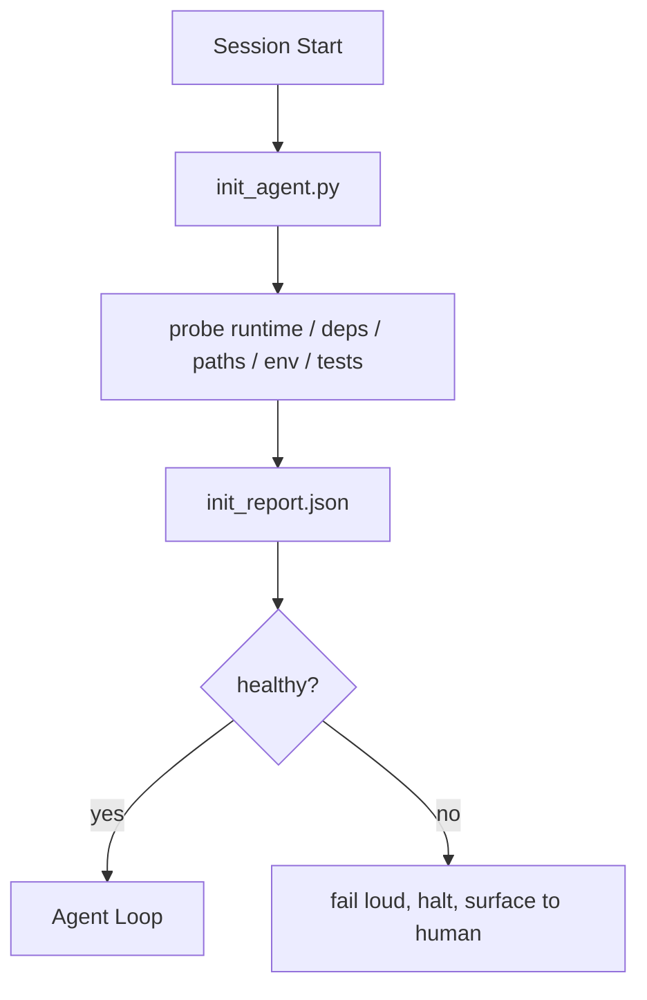

# Các tập lệnh khởi tạo (Initialization Scripts) cho Agent

> Mỗi phiên làm việc bắt đầu từ trạng thái "lạnh" (cold start) đều phải trả một khoản thuế. Agent phải đọc lại các tệp tin, thử lại các bước thăm dò và tìm lại các đường dẫn cũ. Một tập lệnh khởi tạo (init script) sẽ giúp trả khoản thuế đó một lần duy nhất và ghi kết quả vào trạng thái (state).

**Type:** Build
**Languages:** Python (stdlib)
**Prerequisites:** Phase 14 · 32 (Minimal Workbench), Phase 14 · 34 (Repo Memory)
**Time:** ~45 phút

## Mục tiêu học tập

- Xác định những công việc mà agent không bao giờ nên phải làm lại trong mỗi phiên.
- Xây dựng một tập lệnh khởi tạo có tính xác định (deterministic) để thăm dò môi trường runtime, các phụ thuộc (dependencies) và tình trạng của kho lưu trữ (repo health).
- Lưu trữ kết quả thăm dò để agent đọc thay vì phải chạy lại các kiểm tra.
- Thông báo lỗi rõ ràng, nhanh chóng và tập trung tại một nơi duy nhất khi quá trình khởi tạo thất bại.

## Vấn đề

Mở một phiên làm việc. Agent đoán phiên bản Python. Đoán lệnh chạy thử nghiệm. Liệt kê thư mục gốc của repo năm lần để tìm điểm bắt đầu. Cố gắng import một gói chưa được cài đặt. Hỏi người dùng tệp cấu hình nằm ở đâu. Trước khi thực hiện bất kỳ thay đổi thực sự nào, mười nghìn token đã bị lãng phí cho công việc thiết lập vốn dĩ chỉ cần một tập lệnh duy nhất.

Giải pháp là một tập lệnh khởi tạo chạy trước khi agent thực hiện bất cứ điều gì khác và ghi lại một `init_report.json` mà agent sẽ đọc khi khởi động.

## Khái niệm



### Những gì tập lệnh khởi tạo cần thăm dò

| Thăm dò (Probe) | Tại sao nó quan trọng |
|-------|----------------|
| Phiên bản Runtime | Sai phiên bản Python hoặc Node dẫn đến các lỗi phiên bản ngầm định |
| Sự sẵn có của Dependency | Một gói bị thiếu sau này sẽ tốn kém gấp mười lần so với việc phát hiện ngay bây giờ |
| Lệnh kiểm thử (Test command) | Agent phải biết cách xác minh; nếu thiếu lệnh này, workbench bị hỏng |
| Đường dẫn Repo | Các đường dẫn cứng (hard-coded) dễ bị sai lệch; hãy giải quyết và ghim chúng lại |
| Biến môi trường | Thiếu `OPENAI_API_KEY` là một bề mặt lỗi, không phải là bí ẩn runtime |
| Trạng thái + độ mới của board | Trạng thái cũ từ một phiên bị treo là một cái bẫy (footgun) |
| Commit tốt gần nhất (Last-known-good) | Điểm neo cho diff bàn giao ở cuối phiên làm việc |

### Thất bại ồn ào, thất bại nhanh, thất bại tại một nơi

Một lỗi thăm dò nghĩa là phải dừng lại và thông báo cho con người. Không có chuyện "agent sẽ tự tìm cách". Mục đích của init là từ chối khởi động khi workbench bị hỏng.

### Tính lũy đẳng (Idempotent)

Chạy nó hai lần liên tiếp. Lần chạy thứ hai không được thay đổi gì ngoại trừ dấu thời gian (timestamp). Tính lũy đẳng là thứ cho phép bạn tích hợp tập lệnh vào CI, các hook hoặc lệnh slash tiền tác vụ.

### Init so với các quy tắc khởi động (Startup rules)

Các quy tắc (Phase 14 · 33) mô tả những gì phải đúng để có thể hành động. Init là tập lệnh thiết lập để các quy tắc đó có thể được kiểm tra. Các quy tắc mà không có init sẽ trở thành lời khuyên "hãy cẩn thận". Init mà không có quy tắc sẽ trở thành một sự thất bại được trau chuốt.

```figure
wb-init-probes
```

## Xây dựng

`code/main.py` triển khai `init_agent.py`:

- Năm bước thăm dò: Phiên bản Python, liệt kê các dependency qua `importlib.util.find_spec`, khả năng giải quyết lệnh kiểm thử, các biến môi trường bắt buộc, độ mới của tệp trạng thái.
- Mỗi bước thăm dò trả về `(name, status, detail)`.
- Tập lệnh ghi lại `init_report.json` với toàn bộ tập hợp thăm dò và thoát với mã lỗi khác 0 nếu bất kỳ bước thăm dò nghiêm trọng nào thất bại.

Chạy nó:

```
python3 code/main.py
```

Tập lệnh in bảng các bước thăm dò, ghi lại `init_report.json` và thoát với mã 0 nếu thành công hoặc mã khác 0 kèm danh sách các bước thăm dò thất bại.

## Các mô hình sản xuất thực tế

Ba mô hình phân biệt một tập lệnh khởi tạo hữu ích với một thủ tục rườm rà.

**Neo commit tốt gần nhất (Last-known-good commit anchoring).** Thăm dò commit hiện tại so với tệp `LKG` được ghi lại ở lần merge thành công gần nhất. Nếu diff vượt quá ngân sách (mặc định là 50 tệp), hãy từ chối khởi động và yêu cầu con người xác nhận baseline mới. Đây là cách AI Code Review của Cloudflare sử dụng để giới hạn phạm vi các agent đánh giá: mỗi phiên đánh giá neo vào cùng một commit tốt gần nhất và không bao giờ tích tụ sự sai lệch qua các phiên.

**Tệp khóa với TTL (Time-to-live).** Ghi lại một `prereqs.lock` sau lần chạy thăm dò thành công đầu tiên. Các lần chạy tiếp theo tin tưởng vào tệp khóa trong N giờ (mặc định 24h) và bỏ qua các bước thăm dò tốn kém. Tập lệnh init đọc tệp khóa trước; nếu nó còn mới và hash của manifest dependency khớp, nó sẽ bỏ qua các bước còn lại. Đây là mô hình Docker sử dụng cho layer cache: thăm dò lũy đẳng + hash nội dung = bỏ qua.

**Không mạng, không LLM, không bất ngờ trong đường dẫn nóng (hot path).** Các bước thăm dò init là hệ thống ống dẫn có tính xác định. Một bước thăm dò gọi LLM để phân loại lỗi hoặc truy cập dịch vụ bên ngoài để kiểm tra license không phải là thăm dò; đó là một quy trình làm việc (workflow). Nếu một bước thăm dò mất hơn ba giây trong quá trình chạy thử, hãy coi đó là dấu hiệu workbench có vấn đề và chuyển nó ra khỏi init hoặc cache kết quả.

## Sử dụng

Trong môi trường sản xuất:

- **Claude Code hooks.** Hook `pre-task` gọi tập lệnh init và từ chối khởi chạy agent nếu nó thất bại.
- **GitHub Actions.** Một job `setup-agent` chạy tập lệnh init; job của agent sẽ phụ thuộc vào nó.
- **Docker entrypoint.** Container của agent chạy tập lệnh init trước khi thực thi runtime của agent; log sẽ hiển thị khi có lỗi.

Tập lệnh init có tính di động vì nó không gọi đến bất kỳ framework cụ thể nào. Bash, Make hoặc tệp tasks đều có thể bao bọc nó.

## Triển khai

`outputs/skill-init-script.md` phỏng vấn dự án, phân loại công việc thiết lập thành các bước thăm dò và tạo ra một `init_agent.py` dành riêng cho dự án cùng với quy trình CI chạy nó trước bất kỳ bước nào của agent.

## Bài tập

1. Thêm một bước thăm dò so sánh commit hiện tại với commit tốt gần nhất và từ chối khởi động nếu có hơn 50 tệp thay đổi.
2. Kết nối tập lệnh để ghi tệp `prereqs.lock` và từ chối khởi động nếu tệp khóa cũ hơn bảy ngày.
3. Thêm cờ `--fix` để tự động cài đặt các dev dependency bị thiếu nhưng không bao giờ sửa đổi runtime dependency nếu không có sự phê duyệt.
4. Di chuyển các bước thăm dò từ các hàm hard-coded sang một registry YAML. Biện luận cho sự đánh đổi này.
5. Thêm ngân sách thời gian cho mỗi bước thăm dò. Một bước thăm dò chạy lâu hơn ba giây là dấu hiệu workbench có vấn đề.

## Thuật ngữ chính

| Thuật ngữ | Cách gọi thông thường | Ý nghĩa thực tế |
|------|----------------|------------------------|
| Probe | "Một kiểm tra" | Một hàm có tính xác định trả về `(name, status, detail)` |
| Init report | "Kết quả thiết lập" | JSON được ghi cạnh tệp trạng thái với kết quả thăm dò |
| Idempotent | "An toàn để chạy lại" | Hai lần chạy liên tiếp tạo ra báo cáo giống hệt nhau ngoại trừ dấu thời gian |
| Fail loud | "Đừng nuốt lỗi" | Dừng lại và thông báo cho con người; không có fallback ngầm định |
| Setup tax | "Chi phí khởi động" | Các token mà agent tiêu tốn mỗi phiên để tìm lại những thứ hiển nhiên |

## Đọc thêm

- [Anthropic, Effective harnesses for long-running agents](https://www.anthropic.com/engineering/effective-harnesses-for-long-running-agents)
- [GitHub Actions, composite actions for setup](https://docs.github.com/en/actions/sharing-automations/creating-actions/creating-a-composite-action)
- [microservices.io, GenAI dev platform: guardrails](https://microservices.io/post/architecture/2026/03/09/genai-development-platform-part-1-development-guardrails.html) — pre-commit + CI checks as init
- [Augment Code, How to Build Your AGENTS.md (2026)](https://www.augmentcode.com/guides/how-to-build-agents-md) — init expectations
- [Codex Blog, Codex CLI Context Compaction](https://codex.danielvaughan.com/2026/03/31/codex-cli-context-compaction-architecture/) — session start as compaction-aware init
- Phase 14 · 33 — tập hợp quy tắc mà tập lệnh này kích hoạt
- Phase 14 · 34 — tệp trạng thái mà tập lệnh này gieo mầm
- Phase 14 · 38 — cổng xác minh mà tập lệnh init cung cấp dữ liệu
- Phase 14 · 40 — quá trình bàn giao tiêu thụ last-known-good từ báo cáo init