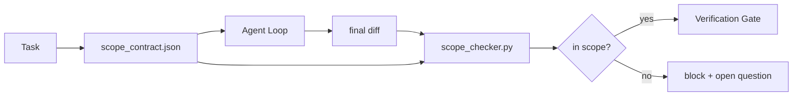

# Scope Contracts and Task Boundaries

> Mô hình không biết công việc kết thúc ở đâu. Scope contract là một tệp tin theo từng tác vụ, xác định nơi công việc bắt đầu, nơi kết thúc và cách rollback nếu công việc vượt quá phạm vi. Hợp đồng này biến "giữ đúng phạm vi" từ một mong muốn thành một bước kiểm tra thực tế.

**Type:** Build
**Languages:** Python (stdlib)
**Prerequisites:** Phase 14 · 32 (Minimal Workbench), Phase 14 · 33 (Rules as Constraints)
**Time:** ~50 minutes

## Learning Objectives

- Viết một scope contract mà agent đọc khi bắt đầu tác vụ và verifier đọc khi kết thúc tác vụ.
- Chỉ định các tệp được phép, tệp bị cấm, tiêu chí chấp nhận, kế hoạch rollback và ranh giới phê duyệt.
- Triển khai một scope checker so sánh diff với hợp đồng và gắn cờ các vi phạm.
- Làm cho scope creep trở nên hữu hình, tự động và có thể xem xét lại.

## The Problem

Các agent thường bị "creep" (phạm vi công việc bị mở rộng). Tác vụ là "sửa lỗi đăng nhập". Diff lại chạm vào route đăng nhập, helper email, driver cơ sở dữ liệu, README và script phát hành. Mỗi lần chạm đều có lý do hợp lý tại thời điểm đó. Nhưng tổng hợp lại, chúng tạo thành một thay đổi khác hoàn toàn so với những gì đã được review.

Scope creep là chế độ lỗi ít được giám sát nhất trong công việc của agent vì agent tường thuật từng bước một cách thiện chí. Giải pháp không phải là một prompt nghiêm ngặt hơn. Giải pháp là một hợp đồng trên đĩa cứng ghi rõ những gì đã hứa và một bước kiểm tra so sánh kết quả với lời hứa đó.

## The Concept



### What goes in a scope contract

| Field | Purpose |
|-------|---------|
| `task_id` | Liên kết đến tác vụ trên bảng công việc |
| `goal` | Một câu mà người review có thể xác minh |
| `allowed_files` | Các glob mà agent được phép ghi |
| `forbidden_files` | Các glob mà agent không được chạm vào dù vô tình |
| `acceptance_criteria` | Các lệnh kiểm thử hoặc dòng assertion chứng minh đã hoàn thành |
| `rollback_plan` | Một đoạn văn mà người vận hành có thể thực thi nếu cần dừng khẩn cấp |
| `approvals_required` | Các hành động ngoài phạm vi cần sự phê duyệt rõ ràng của con người |

Một hợp đồng thiếu `forbidden_files` là không hoàn chỉnh. Không gian phủ định (negative space) chiếm một nửa hợp đồng.

### Globs, not raw paths

Các repo thực tế thường di chuyển tệp tin. Hãy ghim các hợp đồng vào các glob (`app/**/*.py`, `tests/test_signup*.py`) để việc refactor giữa các phiên làm việc không làm mất hiệu lực của hợp đồng.

### Rollback is part of scope

Việc liệt kê cách rollback buộc người viết hợp đồng phải suy nghĩ về những gì có thể sai sót. Một hợp đồng mà bạn không thể rollback thì không nên được phê duyệt.

### Scope check is a diff check

Agent viết một diff. Checker đọc diff, các glob được phép, các glob bị cấm và danh sách các lệnh chấp nhận đã chạy. Mỗi vi phạm là một phát hiện được gắn thẻ mà cổng xác minh (verification gate) có thể từ chối.

### Two altitudes of scope: the feature list and the task contract

Scope contract giới hạn một tác vụ. Nó không giới hạn toàn bộ dự án. Một agent có thể giữ đúng phạm vi trong hợp đồng cho việc sửa lỗi đăng nhập, nhưng ở lượt tiếp theo, lại quyết định rằng dự án cũng cần một trang cài đặt, một nút chuyển chế độ tối và viết lại router. Hợp đồng chưa bao giờ được hỏi công việc nào nằm trong phạm vi của dự án, mà chỉ hỏi tệp nào nằm trong phạm vi của tác vụ.

Độ cao thứ hai đó cần một primitive riêng: một `feature_list.json` mà agent đọc khi bắt đầu phiên làm việc. Đó là backlog dự án dưới dạng tệp tin có thể đọc được bằng máy và có thứ tự. Agent chọn chính xác một tính năng có `status` là `todo`, ghi `id` của nó vào scope contract đang hoạt động và bị cấm bắt đầu tính năng thứ hai trong cùng một phiên. "Mỗi lần một tính năng" không còn là một dòng trong prompt mà agent có thể hợp lý hóa, mà trở thành một giá trị nó đọc từ đĩa và một bước kiểm tra mà cổng thực thi.

```json
{
  "project": "knowledge-base",
  "active": "import-pdf",
  "features": [
    { "id": "import-pdf",   "status": "in_progress", "goal": "import a PDF into the library",        "done_when": "pytest tests/test_import.py && a sample PDF appears in the library view" },
    { "id": "full-text-search", "status": "todo",     "goal": "search document text and rank hits",   "done_when": "query returns ranked results with snippets" },
    { "id": "cite-answers", "status": "todo",         "goal": "answers carry source citations",        "done_when": "every answer renders at least one clickable citation" }
  ]
}
```

| Field | Purpose |
|-------|---------|
| `active` | Tính năng duy nhất mà phiên hiện tại có thể chạm vào; trống nghĩa là chọn một và thiết lập nó |
| `features[].id` | Slug ổn định mà `task_id` của scope contract trỏ tới |
| `features[].status` | `todo`, `in_progress`, `done`, `blocked`; chỉ một `in_progress` tại một thời điểm |
| `features[].goal` | Một câu mà người review có thể xác minh |
| `features[].done_when` | Dòng chấp nhận chuyển `in_progress` thành `done` |

Hai quy tắc làm cho danh sách này trở nên quan trọng thay vì chỉ để trang trí. Thứ nhất, bất biến "tối đa một `in_progress`" tự nó là một bước kiểm tra khởi động (Phase 14 · 33): nếu danh sách hiển thị hai, phiên làm việc sẽ từ chối bắt đầu cho đến khi con người giải quyết. Thứ hai, danh sách tính năng là một tệp tin, không phải tin nhắn chat, vì chat sẽ trôi mất ngữ cảnh còn tệp tin tồn tại qua các phiên và các agent. Việc bàn giao (Phase 14 · 40) ghi trạng thái của tính năng đã hoàn thành trở lại `done` để phiên tiếp theo mở ra với một bảng công việc chính xác thay vì phải suy luận lại những gì còn sót lại.

Hợp đồng và danh sách kết hợp theo nguyên tắc đặc quyền tối thiểu (least privilege), cùng kiểu hợp nhất được mô tả bên dưới: `allowed_files` của task contract phải nằm trong phạm vi mà tính năng đang hoạt động chạm tới, không bao giờ nằm ngoài đó.

```figure
wb-scope-bounce
```

## Build It

`code/main.py` triển khai:

- `scope_contract.json` schema (tập con của JSON Schema, mảng glob).
- Một trình phân tích diff chuyển danh sách các tệp đã chạm vào cộng với danh sách các lệnh đã chạy thành một `RunSummary`.
- Một `scope_check` trả về `(violations, in_scope, off_scope)` so với hợp đồng.
- Hai lần chạy demo: một lần giữ đúng phạm vi, một lần bị creep. Checker gắn cờ sự creep với tệp tin và lý do chính xác.

Run it:

```
python3 code/main.py
```

Output: hợp đồng, hai lần chạy, kết quả đánh giá cho mỗi lần chạy và một `scope_report.json` đã lưu.

## Production patterns in the wild

Một người thực hành "specsmaxxing" (sử dụng scope contract bằng YAML trước khi gọi agent) báo cáo tỷ lệ đi chệch hướng (rabbit-hole) giảm từ 52% xuống 21% trong ba tuần mà không cần thay đổi agent. Hợp đồng đã thực hiện công việc, không phải mô hình. Ba mô hình giúp duy trì kết quả này:

**Violation budgets, not binary failures.** `agent-guardrails` (cổng hợp nhất OSS được sử dụng bởi Claude Code, Cursor, Windsurf, Codex qua MCP) cung cấp một `violationBudget` cho mỗi tác vụ: các lỗi phạm vi nhỏ trong ngân sách được hiển thị dưới dạng cảnh báo; chỉ khi vượt quá ngân sách, cổng hợp nhất mới từ chối. Kết hợp với `violationSeverity: "error" | "warning"`. Ngân sách là sự khác biệt giữa một cổng hoạt động hiệu quả và một cổng bị đội ngũ vô hiệu hóa vì quá khó chịu.

**Severity asymmetry by path family.** Các ghi chép ngoài phạm vi vào `docs/**` thường là `warn`; các ghi chép ngoài phạm vi vào `scripts/**`, `migrations/**`, `config/prod/**` luôn là `block`. Sự bất đối xứng này phải nằm trong hợp đồng, không phải trong runtime, vì nó đặc thù cho dự án và thay đổi theo từng tác vụ.

**Time and network budgets next to file budgets.** Một trường `time_budget_minutes` giới hạn thời gian thực; runtime từ chối tiếp tục sau thời gian đó nếu không được phê duyệt lại. Một danh sách cho phép `network_egress` trên các hostname ngăn agent âm thầm truy cập vào một API bên ngoài không nằm trong tác vụ. Đây cũng là các chiều kích của phạm vi; các glob tệp tin là cần thiết nhưng chưa đủ.

**Multi-contract merge semantics (least privilege).** Khi hai scope contract áp dụng (ví dụ: hợp đồng toàn dự án cộng với hợp đồng cụ thể cho tác vụ), việc hợp nhất là: **giao** `allowed_files` (cả hai hợp đồng phải cho phép đường dẫn), **hợp** `forbidden_files` (bất kỳ bên nào cũng có thể cấm), `time_budget_minutes` là hạn chế nhất (min), `approvals_required` tích lũy. `network_egress` là `None` cho việc không thực thi, `[]` cho từ chối tất cả, `[...]` là danh sách cho phép; khi hợp nhất, `None` nhường quyền cho phía bên kia, hai danh sách giao nhau và từ chối tất cả vẫn là từ chối tất cả. Hãy nêu điều này trong schema hợp đồng để việc hợp nhất mang tính cơ học và có thể review.

## Use It

Production patterns:

- **Claude Code slash commands.** Một lệnh `/scope` viết hợp đồng và ghim nó làm ngữ cảnh phiên làm việc. Các subagent đọc hợp đồng trước khi hành động.
- **GitHub PRs.** Đẩy hợp đồng dưới dạng tệp JSON trong phần thân PR hoặc dưới dạng artifact đã được kiểm tra. CI chạy scope checker so với diff hợp nhất.
- **LangGraph interrupts.** Một vi phạm phạm vi kích hoạt ngắt (interrupt); trình xử lý hỏi con người xem hợp đồng có cần mở rộng hay agent cần lùi lại.

Hợp đồng đi kèm với tác vụ. Khi tác vụ đóng lại, hợp đồng được lưu trữ dưới `outputs/scope/closed/`.

## Ship It

`outputs/skill-scope-contract.md` tạo ra một scope contract cho mô tả tác vụ và một checker nhận biết glob chạy trong CI trên mỗi diff của agent.

## Exercises

1. Thêm trường `network_egress` liệt kê các host bên ngoài được phép. Từ chối các lần chạy chạm vào các host khác.
2. Mở rộng checker để fail nhẹ (soft fail) trên `docs/**` và fail cứng (hard fail) trên `scripts/**`. Biện minh cho sự bất đối xứng này.
3. Làm cho hợp đồng suy luận `allowed_files` từ trường `goal` bằng cách sử dụng tập quy tắc tĩnh (không dùng LLM). Điều gì xảy ra ở trường hợp biên đầu tiên?
4. Thêm `time_budget_minutes` và từ chối tiếp tục khi thời gian thực vượt quá giới hạn.
5. Chạy hai hợp đồng so với cùng một diff. Đâu là ngữ nghĩa hợp nhất đúng khi cả hai cùng áp dụng?

## Key Terms

| Term | What people say | What it actually means |
|------|----------------|------------------------|
| Scope contract | "The task brief" | JSON theo tác vụ liệt kê các tệp được phép/bị cấm, chấp nhận, rollback |
| Scope creep | "It also touched..." | Các tệp ngoài hợp đồng bị thay đổi trong cùng một tác vụ |
| Rollback plan | "We can revert" | Sách hướng dẫn vận hành một đoạn văn để dừng khẩn cấp |
| Approval boundary | "Needs sign-off" | Một hành động được liệt kê trong hợp đồng yêu cầu sự phê duyệt rõ ràng của con người |
| Diff check | "Path audit" | So sánh các tệp đã chạm vào với các glob của hợp đồng |

## Further Reading

- [LangGraph human-in-the-loop interrupts](https://langchain-ai.github.io/langgraph/concepts/human_in_the_loop/)
- [OpenAI Agents SDK tool approval policies](https://platform.openai.com/docs/guides/agents-sdk)
- [logi-cmd/agent-guardrails — merge gates and scope validation](https://github.com/logi-cmd/agent-guardrails) — ngân sách vi phạm, các tầng nghiêm trọng
- [Dev|Journal, Preventing AI Agent Configuration Drift with Agent Contract Testing](https://earezki.com/ai-news/2026-05-05-i-built-a-tiny-ci-tool-to-keep-ai-agent-configs-from-drifting-in-my-repo/) — chế độ `--strict` không cần phụ thuộc bên ngoài
- [Agentic Coding Is Not a Trap (production logs)](https://dev.to/jtorchia/agentic-coding-is-not-a-trap-i-answered-the-viral-hn-post-with-my-own-production-logs-33d9) — biên lai specsmaxxing: 52% → 21%
- [OpenCode permission globs](https://opencode.ai/docs/agents/) — phạm vi chi tiết theo từng quyền
- [Knostic, AI Coding Agent Security: Threat Models and Protection Strategies](https://www.knostic.ai/blog/ai-coding-agent-security) — phạm vi như một phần của đặc quyền tối thiểu
- [Augment Code, AI Spec Template](https://www.augmentcode.com/guides/ai-spec-template) — hệ thống ranh giới ba tầng (phải/hỏi/không bao giờ)
- Phase 14 · 27 — các biện pháp phòng thủ prompt injection kết hợp với khóa phạm vi
- Phase 14 · 33 — tập quy tắc mà hợp đồng này chuyên biệt hóa theo từng tác vụ
- Phase 14 · 38 — cổng xác minh mà checker báo cáo vào