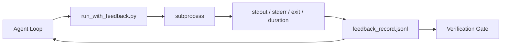

# Runtime Feedback Loops

> Các agent không nhìn thấy kết quả thực thi lệnh thực tế thường sẽ đoán mò. Một feedback runner sẽ thu thập stdout, stderr, mã thoát (exit code) và thời gian thực thi vào một bản ghi có cấu trúc mà lượt chạy tiếp theo có thể đọc được. Nhờ đó, agent phản ứng dựa trên các dữ kiện thực tế thay vì dựa trên dự đoán của chính nó.

**Type:** Build
**Languages:** Python (stdlib)
**Prerequisites:** Phase 14 · 32 (Minimal Workbench), Phase 14 · 35 (Init Script)
**Time:** ~50 phút

## Mục tiêu học tập

- Phân biệt giữa feedback runtime và telemetry quan sát (observability).
- Xây dựng một feedback runner bao bọc các lệnh shell và lưu trữ các bản ghi có cấu trúc.
- Cắt bớt (truncate) các đầu ra lớn một cách có tính toán để vòng lặp nằm trong giới hạn token.
- Từ chối tiến hành vòng lặp khi thiếu feedback.

## Vấn đề

Agent nói "đang chạy các bài kiểm tra". Tin nhắn tiếp theo nói "tất cả bài kiểm tra đều đạt". Thực tế là không có bài kiểm tra nào được chạy. Agent đã tưởng tượng ra kết quả, hoặc nó đã chạy lệnh nhưng không bao giờ đọc kết quả, hoặc nó đọc kết quả nhưng âm thầm cắt bỏ dòng lỗi.

Một feedback runner sẽ loại bỏ khoảng trống đó. Mọi lệnh đều đi qua runner. Mỗi bản ghi chứa lệnh, stdout và stderr đã thu thập, mã thoát, thời gian thực thi thực tế (wall-clock duration) và một dòng ghi chú của agent. Agent đọc bản ghi ở lượt tiếp theo. Cổng xác thực (verification gate) đọc các bản ghi khi kết thúc tác vụ.

## Khái niệm



### Những gì có trong một bản ghi feedback

| Trường | Tại sao nó quan trọng |
|-------|----------------|
| `command` | argv chính xác, không có bất ngờ từ shell expansion |
| `stdout_tail` | N dòng cuối, cắt bớt có tính toán |
| `stderr_tail` | N dòng cuối, tách biệt với stdout |
| `exit_code` | Tín hiệu thành công không gây nhầm lẫn |
| `duration_ms` | Phát hiện các tiến trình chậm và tiến trình chạy mất kiểm soát |
| `started_at` | Dấu thời gian để phát lại (replay) |
| `agent_note` | Một dòng agent viết về những gì nó mong đợi |

### Cắt bớt (Truncation) là có tính toán

Một file log 50 MB sẽ phá hủy vòng lặp. Runner cắt bỏ phần đầu và phần cuối với một dấu hiệu `...truncated N lines...`, đảm bảo tính nhất quán để cùng một đầu ra luôn tạo ra cùng một bản ghi. Không lấy mẫu ngẫu nhiên; các phần agent cần thấy (lỗi cuối cùng, tóm tắt cuối cùng) nằm ở phần đuôi.

### Feedback so với Telemetry

Telemetry (Phase 14 · 23, quy ước OTel GenAI) dành cho người vận hành xem xét các lần chạy theo thời gian. Feedback dành cho lượt chạy tiếp theo của chính phiên làm việc này. Chúng chia sẻ các trường dữ liệu nhưng nằm trong các file khác nhau với chính sách lưu giữ khác nhau.

### Từ chối tiến hành nếu không có feedback

Nếu runner gặp lỗi trước khi thu thập mã thoát, bản ghi sẽ mang giá trị `exit_code: null` và `error: <reason>`. Vòng lặp của agent phải từ chối tuyên bố thành công trên một mã thoát `null`. Không có mã thoát, không có tiến triển.

```figure
wb-feedback-loop
```

## Xây dựng

`code/main.py` triển khai:

- `run_with_feedback(command, agent_note)` bao bọc `subprocess.run`, thu thập stdout/stderr/exit/duration, cắt bớt có tính toán, ghi vào `feedback_record.jsonl`.
- Một trình tải nhỏ truyền JSONL vào một danh sách Python.
- Một bản demo chạy ba lệnh (thành công, thất bại, chậm) và in ra bản ghi cuối cùng của mỗi lệnh.

Chạy nó:

```
python3 code/main.py
```

Đầu ra: ba bản ghi feedback được thêm vào `feedback_record.jsonl`, bản ghi cuối cùng của mỗi lệnh được in trực tiếp. Theo dõi (tail) file qua các lần chạy lại để thấy vòng lặp tích lũy dữ liệu.

## Các mô hình sản xuất thực tế

Ba mô hình giúp runner đủ cứng cáp để đưa vào sản xuất.

**Redact (che giấu) tại thời điểm ghi, không phải tại thời điểm đọc.** Bất kỳ bản ghi nào chạm vào stdout hoặc stderr đều có thể làm lộ bí mật. Runner thực hiện một bước redact trước khi ghi JSONL: loại bỏ các dòng khớp với `^Bearer `, `password=`, `api[_-]?key=`, `AKIA[0-9A-Z]{16}` (AWS), `xox[baprs]-` (Slack). Redact tại thời điểm đọc là một sai lầm nghiêm trọng; file trên đĩa là thứ mà kẻ tấn công có thể truy cập. Kiểm tra các mẫu redact hàng quý dựa trên các định dạng bí mật quan sát được trong runtime sản xuất.

**Chính sách xoay vòng (rotation), không phải một file duy nhất.** Giới hạn `feedback_record.jsonl` ở mức 1 MB mỗi file; khi tràn, xoay vòng sang `.1`, `.2`, xóa `.5`. Vòng lặp của agent chỉ đọc file hiện tại, vì vậy chi phí runtime được giới hạn. Lưu trữ artifact CI sẽ nhận được toàn bộ tập hợp đã xoay vòng. Nếu không xoay vòng, file sẽ trở thành nút thắt cổ chai trong mỗi lần gọi trình tải.

**ID lệnh cha cho chuỗi thử lại (retry chains).** Mỗi bản ghi nhận `command_id`; các lần thử lại mang `parent_command_id` trỏ đến nỗ lực trước đó. Danh sách "các nỗ lực thất bại" của người đánh giá (Phase 14 · 40) và quá trình kiểm tra của cổng xác thực đều tuân theo chuỗi này. Nếu không có liên kết này, các lần thử lại trông giống như những thành công độc lập và quá trình kiểm tra sẽ che giấu lịch sử thất bại.

## Sử dụng

Các mô hình sản xuất:

- **Claude Code Bash tool.** Công cụ này đã thu thập stdout, stderr, exit và duration. Runner trong bài học này là phiên bản tương đương, không phụ thuộc vào framework cho bất kỳ sản phẩm agent nào.
- **LangGraph nodes.** Bao bọc bất kỳ node shell nào trong runner để bản ghi tồn tại bên ngoài trạng thái đồ thị.
- **CI logs.** Đẩy JSONL vào kho lưu trữ artifact CI của bạn; người đánh giá có thể phát lại bất kỳ lệnh nào mà không cần chạy lại phiên làm việc.

Runner là một lớp bao bọc mỏng có thể tồn tại qua mọi quá trình di chuyển framework vì nó sở hữu hình dạng của bản ghi.

## Triển khai

`outputs/skill-feedback-runner.md` tạo ra một `run_with_feedback.py` dành riêng cho dự án với ngân sách cắt bớt phù hợp, một trình ghi JSONL kết nối với workbench và một trình tải mà agent đọc ở mỗi lượt.

## Bài tập

1. Thêm trường `cwd` vào mỗi bản ghi để có thể phân biệt cùng một lệnh chạy từ các thư mục khác nhau.
2. Thêm bước `redaction` để loại bỏ các dòng khớp với `^Bearer ` hoặc `password=`. Kiểm tra trên một bản ghi mẫu.
3. Giới hạn tổng kích thước `feedback_record.jsonl` ở mức 1 MB bằng cách xoay vòng sang các file `.1`, `.2`. Bảo vệ chính sách xoay vòng này.
4. Thêm `parent_command_id` để các chuỗi thử lại có thể nhìn thấy được: lệnh nào đã tạo ra đầu vào mà lệnh tiếp theo tiêu thụ.
5. Đẩy JSONL vào một TUI nhỏ làm nổi bật các mã thoát khác không (non-zero exit) mới nhất. Liệt kê tám tính năng chính mà TUI phải có để hữu ích trong quá trình đánh giá.

## Thuật ngữ chính

| Thuật ngữ | Cách gọi thông thường | Ý nghĩa thực tế |
|------|----------------|------------------------|
| Feedback record | "Run log" | Mục JSONL có cấu trúc với lệnh, đầu ra, mã thoát, thời gian |
| Tail truncation | "Trim the log" | Cắt đầu và đuôi có tính toán để bản ghi vừa với ngân sách token |
| Refuse-on-null | "Block on missing data" | Vòng lặp không được tiến hành khi `exit_code` là null |
| Agent note | "Expectation tag" | Dự đoán một dòng mà agent viết trước khi đọc kết quả |
| Telemetry split | "Two log files" | Feedback cho lượt tiếp theo, telemetry cho người vận hành |

## Đọc thêm

- [OpenTelemetry GenAI semantic conventions](https://opentelemetry.io/docs/specs/semconv/gen-ai/)
- [Anthropic, Effective harnesses for long-running agents](https://www.anthropic.com/engineering/effective-harnesses-for-long-running-agents)
- [Guardrails AI x MLflow — deterministic safety, PII, quality validators](https://guardrailsai.com/blog/guardrails-mlflow) — các mẫu redact như các bài kiểm tra hồi quy
- [Aport.io, Best AI Agent Guardrails 2026: Pre-Action Authorization Compared](https://aport.io/blog/best-ai-agent-guardrails-2026-pre-action-authorization-compared/) — thu thập trước/sau công cụ
- [Andrii Furmanets, AI Agents in 2026: Practical Architecture for Tools, Memory, Evals, Guardrails](https://andriifurmanets.com/blogs/ai-agents-2026-practical-architecture-tools-memory-evals-guardrails) — các bề mặt quan sát
- Phase 14 · 23 — quy ước OTel GenAI cho phía telemetry
- Phase 14 · 24 — các nền tảng quan sát agent (Langfuse, Phoenix, Opik)
- Phase 14 · 33 — quy tắc yêu cầu feedback trước khi tuyên bố hoàn thành
- Phase 14 · 38 — cổng xác thực đọc JSONL