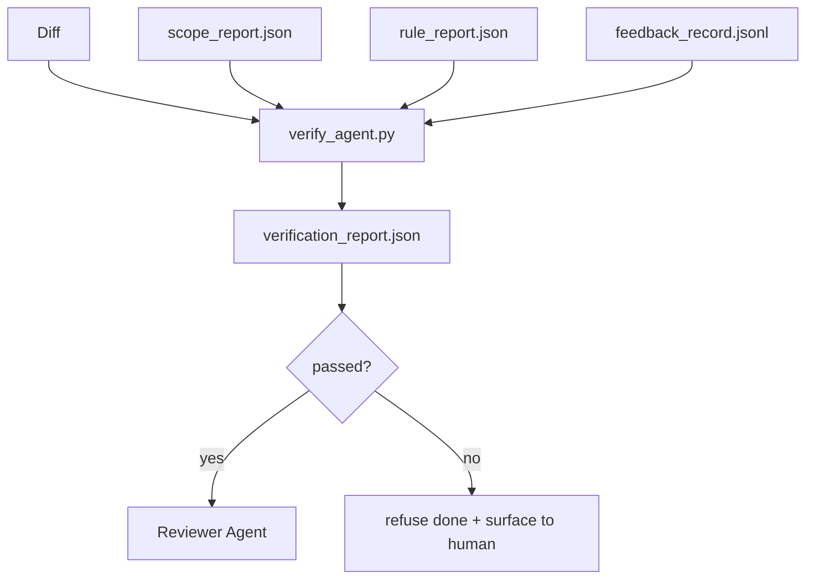

# Verification Gates

> Tác nhân (agent) không được phép tự đánh dấu công việc của mình là đã hoàn thành. Một cổng xác thực (verification gate) sẽ đọc hợp đồng phạm vi (scope contract), nhật ký phản hồi (feedback log), báo cáo quy tắc (rule report) và diff, sau đó trả lời một câu hỏi duy nhất: liệu tác vụ này đã thực sự hoàn thành chưa? Nếu cổng trả lời không, tác vụ đó chưa hoàn thành, bất kể chat log nói gì.

**Type:** Build
**Languages:** Python (stdlib)
**Prerequisites:** Phase 14 · 33 (Rules), Phase 14 · 36 (Scope), Phase 14 · 37 (Feedback)
**Time:** ~55 minutes

## Learning Objectives

- Định nghĩa cổng xác thực như một hàm tất định (deterministic function) trên các artifact của workbench.
- Kết hợp báo cáo quy tắc, báo cáo phạm vi, bản ghi phản hồi và diff thành một phán quyết duy nhất.
- Phát hành `verification_report.json` mà cả tác nhân đánh giá (reviewer agent) và CI đều có thể đọc được.
- Từ chối tiến hành tác vụ đối với bất kỳ lỗi nào có mức độ nghiêm trọng là block, không có ngoại lệ.

## The Problem

Các tác nhân thường tuyên bố thành công quá dễ dàng. Ba dạng thất bại phổ biến là:

- "Trông có vẻ ổn." Mô hình tự đọc diff của chính nó và quyết định rằng nó đúng.
- "Các bài kiểm tra đã vượt qua." Nói với sự tự tin. Không có bản ghi nào cho thấy bài kiểm tra thực sự đã chạy.
- "Đã đáp ứng tiêu chí chấp nhận." Các tiêu chí chấp nhận được diễn giải lỏng lẻo đến mức có nghĩa là "bất cứ thứ gì trông giống như đã xong".

Giải pháp cho workbench là một cổng xác thực duy nhất đọc các artifact mà tác nhân đã tạo ra và đưa ra quyết định. Cổng này là tất định. Cổng này nằm trong hệ thống kiểm soát phiên bản. Cổng này được kết nối vào CI. Tác nhân không thể hối lộ nó.

## The Concept



### What the gate checks

| Check | Source artifact | Severity |
|-------|-----------------|----------|
| Tất cả lệnh chấp nhận đã chạy | `feedback_record.jsonl` | block |
| Tất cả lệnh chấp nhận thoát với mã 0 | `feedback_record.jsonl` | block |
| Kiểm tra phạm vi không có ghi chép bị cấm | `scope_report.json` | block |
| Kiểm tra phạm vi không có ghi chép ngoài phạm vi | `scope_report.json` | block hoặc warn |
| Tất cả các quy tắc mức độ block đều vượt qua | `rule_report.json` | block |
| Không có mã thoát `null` trong phản hồi | `feedback_record.jsonl` | block |
| Các tệp đã thay đổi khớp với `scope.allowed_files` | both | warn |

Một phát hiện `warn` sẽ chú thích cho phán quyết; một phát hiện `block` sẽ ngăn chặn `passed: true`.

### Deterministic, not probabilistic

Cổng phải tạo ra cùng một phán quyết cho cùng một tập hợp artifact mỗi lần. Không dùng LLM để đánh giá. Các LLM đánh giá thuộc về phía người đánh giá (Phase 14 · 39), nơi mục tiêu là đánh giá định tính, không phải trạng thái.

### One report, one path

Cổng phát hành một `verification_report.json` cho mỗi lần đóng tác vụ, được ghi dưới `outputs/verification/<task_id>.json`. CI tiêu thụ cùng một đường dẫn đó. Nhiều cổng với các đường dẫn khác nhau sẽ làm phân tách nguồn sự thật (source of truth).

### Refuse without exception

Các phát hiện mức độ block không thể bị tác nhân ghi đè. Chúng chỉ có thể bị ghi đè bởi con người, với một `override_reason` được ghi lại và một id người dùng `overridden_by`. Việc ghi đè là một thay đổi đã ký, không phải là quyết định của tác nhân.

```figure
wb-gate-sequence
```

## Build It

`code/main.py` triển khai:

- Trình tải cho từng artifact đầu vào, tất cả đều được stub cục bộ để bài học có thể tự chứa.
- Một hàm thuần túy `verify(task_id, artifacts) -> VerdictReport`.
- Trình in hiển thị kết quả của từng kiểm tra và kết quả pass/fail cuối cùng.
- Bản demo với ba kịch bản tác vụ: vượt qua sạch, vượt quá phạm vi (scope creep), thiếu lệnh chấp nhận.

Chạy nó:

```
python3 code/main.py
```

Đầu ra: ba báo cáo phán quyết, mỗi báo cáo được lưu bên cạnh tập lệnh.

## Production patterns in the wild

Bốn mô hình nâng tầm cổng từ "một công việc lint khác" thành "cạnh quyết định".

**Defense-in-depth, not single gate.** Pre-commit hook → CI status check → pre-tool authz hook → pre-merge gate. Mỗi lớp đều là tất định nên một lỗi ở lớp này sẽ bị lớp tiếp theo bắt được. Sách hướng dẫn tháng 3 năm 2026 của microservices.io rất rõ ràng: pre-commit hook không thể bị bỏ qua vì, không giống như kỹ năng phía mô hình, nó không phụ thuộc vào việc tác nhân có tuân theo hướng dẫn hay không. Cổng xác thực nằm ở lớp CI / pre-merge.

**Defense by deterministic check, model-judge only for nuance.** Cặp đôi Hybrid Norm 2026 của Anthropic: các phần thưởng có thể xác minh (unit test, kiểm tra schema, mã thoát) trả lời "mã có giải quyết được vấn đề không?" — các rubric LLM trả lời "mã có dễ đọc, an toàn, đúng phong cách không?". Cổng chạy loại thứ nhất; người đánh giá (Phase 14 · 39) chạy loại thứ hai. Trộn lẫn chúng sẽ làm nhiễu tín hiệu.

**Signed override log, not Slack threads.** Mỗi lần ghi đè sẽ tạo ra một hàng trong `outputs/verification/overrides.jsonl` với: dấu thời gian, mã phát hiện, lý do, người dùng ký, và commit HEAD hiện tại. Runtime từ chối bất kỳ lần ghi đè nào thiếu chữ ký; dấu vết kiểm toán được theo dõi bởi git. Đây là ranh giới giữa chính sách ghi đè và sự giả tạo trong việc ghi đè.

**Coverage floor as a first-class check.** Một `coverage_report.json` cung cấp cho kiểm tra `coverage_floor` (mặc định 80%). Cổng sẽ thất bại nếu độ bao phủ đo được giảm xuống dưới mức sàn hoặc giảm hơn 1 điểm phần trăm so với lần merge trước đó. Nếu không có kiểm tra này, các tác nhân sẽ âm thầm xóa các bài kiểm tra thất bại và các báo cáo xác thực vẫn hiển thị màu xanh.

**Chế độ `--strict` nâng cấp cảnh báo thành block.** Đối với các nhánh phát hành, các PR chặn xuất xưởng hoặc phân loại sau sự cố, `--strict` biến mọi cảnh báo thành lỗi nghiêm trọng. Cờ này là tùy chọn theo nhánh; không phải mặc định toàn cục, vì việc quá nghiêm ngặt với mọi thứ sẽ làm xói mòn quy trình làm việc hàng ngày.

## Use It

Các mô hình sản xuất:

- **CI step.** Một công việc `verify_agent` chạy cổng đối với các artifact cuối cùng của tác nhân. Bảo vệ merge sẽ từ chối nếu không có `passed: true`.
- **Pre-handoff hook.** Runtime của tác nhân gọi cổng trước khi tạo tài liệu bàn giao. Không có phán quyết xanh, không có bàn giao.
- **Manual triage.** Người vận hành đọc báo cáo khi một tác nhân tuyên bố thành công và con người nghi ngờ điều đó.

Cổng là cạnh quyết định trong quy trình workbench. Mọi bề mặt khác đều nằm ở phía thượng nguồn của nó.

## Ship It

`outputs/skill-verification-gate.md` kết nối cổng vào một dự án cụ thể: lệnh chấp nhận nào cung cấp cho nó, quy tắc nào có mức độ nghiêm trọng block, ghi chép ngoài phạm vi nào được chấp nhận, nhật ký kiểm toán ghi đè được lưu trữ như thế nào.

## Exercises

1. Thêm kiểm tra `coverage_floor`: lệnh kiểm tra phải tạo ra báo cáo độ bao phủ với ít nhất 80%. Quyết định artifact nào mang mức sàn này.
2. Hỗ trợ chế độ `--strict` nâng cấp mọi `warn` thành `block`. Tài liệu hóa các trường hợp mà chế độ nghiêm ngặt là mặc định đúng.
3. Làm cho cổng tạo ra bản tóm tắt Markdown ngoài JSON. Bảo vệ các trường nào thuộc về bản tóm tắt.
4. Thêm kiểm tra `time_since_last_human_touch`: bất kỳ tệp nào được chỉnh sửa trong vòng 60 giây kể từ khi con người nhấn phím sẽ được miễn trừ khỏi các cờ ngoài phạm vi.
5. Chạy cổng trên một diff tác nhân thực tế từ sản phẩm của bạn. Có bao nhiêu phát hiện là thực và bao nhiêu là nhiễu? Cổng cần phát triển ở đâu?

## Key Terms

| Term | What people say | What it actually means |
|------|----------------|------------------------|
| Verification gate | "Cái kiểm tra dừng mọi thứ" | Hàm tất định trên các artifact workbench tạo ra phán quyết pass/fail |
| Block severity | "Lỗi nghiêm trọng" | Phát hiện ngăn chặn `passed: true` và yêu cầu ghi đè đã ký |
| Override log | "Tại sao chúng ta cho phép nó qua" | Các mục đã ký với lý do và id người dùng, được kiểm toán bởi đánh giá |
| Acceptance command | "Bằng chứng" | Lệnh shell mà mã thoát bằng 0 của nó là ý nghĩa của `done` |
| One report path | "Nguồn sự thật" | `outputs/verification/<task_id>.json`, được tiêu thụ bởi cả CI và con người |

## Further Reading

- [Anthropic, Harness design for long-running application development](https://www.anthropic.com/engineering/harness-design-long-running-apps)
- [OpenAI Agents SDK guardrails](https://openai.github.io/openai-agents-python/guardrails/)
- [microservices.io, GenAI dev platform: guardrails](https://microservices.io/post/architecture/2026/03/09/genai-development-platform-part-1-development-guardrails.html) — phòng thủ theo chiều sâu giữa pre-commit và CI
- [ICMD, The 2026 Playbook for Agentic AI Ops](https://icmd.app/article/the-2026-playbook-for-agentic-ai-ops-guardrails-costs-and-reliability-at-scale-1776661990431) — thang cổng phê duyệt (nháp → phê duyệt → tự động dưới ngưỡng)
- [Type-Checked Compliance: Deterministic Guardrails (arXiv 2604.01483)](https://arxiv.org/pdf/2604.01483) — Lean 4 là giới hạn trên của các cổng tất định
- [logi-cmd/agent-guardrails — merge gate spec](https://github.com/logi-cmd/agent-guardrails) — cổng phạm vi + kiểm tra đột biến
- [Guardrails AI x MLflow](https://guardrailsai.com/blog/guardrails-mlflow) — các trình xác thực tất định như các bộ chấm điểm CI
- [Akira, Real-Time Guardrails for Agentic Systems](https://www.akira.ai/blog/real-time-guardrails-agentic-systems) — cổng tiền/hậu công cụ
- Phase 14 · 27 — phòng thủ chống prompt injection (cặp đối nghịch của cổng)
- Phase 14 · 36 — hợp đồng phạm vi mà cổng này thực thi
- Phase 14 · 37 — nhật ký phản hồi mà cổng này chấm điểm
- Phase 14 · 39 — tác nhân đánh giá mà cổng bàn giao cho