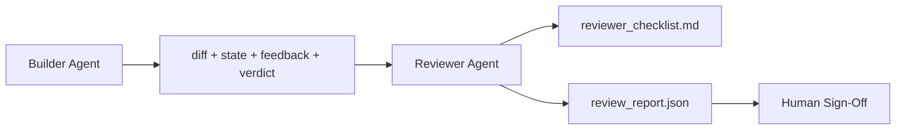

# Reviewer Agent: Tách biệt Builder và Marker

> Tác nhân (agent) viết mã không thể tự chấm điểm công việc của chính mình. Reviewer là một vòng lặp thứ hai với system prompt khác biệt, mục tiêu khác biệt và quyền truy cập chỉ đọc (read-only) vào mọi thứ mà builder đã tạo ra. Khoảng cách giữa builder và reviewer chính là nơi tạo nên phần lớn độ tin cậy.

**Type:** Build
**Languages:** Python (stdlib)
**Prerequisites:** Phase 14 · 38 (Verification Gate)
**Time:** ~55 phút

## Mục tiêu học tập

- Giải thích lý do tại sao cùng một agent không thể tự đánh giá công việc của mình một cách đáng tin cậy.
- Xây dựng một vòng lặp reviewer agent tiếp nhận các artifact từ builder và xuất ra báo cáo đánh giá có cấu trúc.
- Soạn thảo một rubric (bảng tiêu chí) cho reviewer để chấm điểm dựa trên các khía cạnh cụ thể, thay vì cảm tính.
- Tích hợp reviewer vào workbench để bước review của con người bắt đầu từ một artifact thực tế.

## Vấn đề

Bạn yêu cầu agent sửa một lỗi. Nó chỉnh sửa bốn tệp, chạy các bài kiểm tra và báo cáo hoàn thành. Verification gate (Phase 14 · 38) xác nhận rằng quá trình chấp nhận (acceptance) đã chạy và phạm vi (scope) được giữ nguyên. Gate báo `passed: true`. Bạn thực hiện merge. Hai ngày sau, bạn phát hiện ra rằng bản sửa lỗi đã giải quyết sai một nửa vấn đề.

Acceptance là cần thiết, nhưng chưa đủ. Reviewer đặt ra những câu hỏi mà acceptance không thể hỏi: liệu điều này có giải quyết đúng vấn đề không? Nó có mở rộng phạm vi mà không gắn cờ không? Nó có ghi lại các giả định đáng lẽ phải được đặt câu hỏi không? Nó có để lại workbench ở trạng thái mà phiên làm việc tiếp theo có thể tiếp tục được không?

## Khái niệm



### Reviewer rubric

Năm khía cạnh, mỗi khía cạnh được chấm từ 0 đến 2 điểm.

| Khía cạnh | Câu hỏi |
|-----------|----------|
| Problem fit | Thay đổi có giải quyết đúng tác vụ được yêu cầu, thay vì một tác vụ gần giống không? |
| Scope discipline | Các chỉnh sửa có giới hạn trong hợp đồng (contract) hay hợp đồng đã bị mở rộng một cách cố ý? |
| Assumptions | Tất cả các giả định ẩn có được ghi lại ở nơi có thể review được không? |
| Verification quality | Lệnh acceptance có thực sự chứng minh được mục tiêu, hay nó chỉ chứng minh một phiên bản yếu hơn? |
| Handoff readiness | Phiên làm việc tiếp theo có thể tiếp tục một cách sạch sẽ từ trạng thái hiện tại không? |

Tổng điểm trên 10. Điểm dưới 7 là lỗi nhẹ (soft fail); dưới 5 là lỗi nặng (hard fail).

### Reviewer là một vai trò riêng biệt, không phải một model riêng biệt

Bạn có thể chạy reviewer với cùng model như builder. Kỷ luật nằm ở sự tách biệt vai trò: system prompt khác nhau, đầu vào khác nhau, không có quyền ghi vào diff. Sự thay đổi trong tư thế chính là sự thay đổi trong tín hiệu.

### Reviewer không thể chỉnh sửa diff

Reviewer đọc diff, trạng thái, phản hồi và kết luận. Nó viết báo cáo. Nó không thực hiện patch vào diff. Nếu báo cáo nói "hãy sửa lỗi này", lượt builder tiếp theo sẽ thực hiện việc sửa lỗi; reviewer quay lại thực hiện việc review. Việc trộn lẫn các vai trò sẽ phá vỡ khoảng cách này.

### Reviewer rubric so với verification gate

Gate (Phase 14 · 38) kiểm tra các sự kiện mang tính xác định: acceptance có chạy không, các quy tắc có vượt qua không, phạm vi có được giữ nguyên không. Reviewer đưa ra các đánh giá định tính: đây có phải là công việc đúng đắn không, nó có được ghi chép không, việc bàn giao có sử dụng được không. Cả hai đều cần thiết.

```figure
wb-builder-marker
```

## Xây dựng

`code/main.py` triển khai:

- Một `ReviewerInputs` dataclass đóng gói các artifact mà reviewer đọc.
- Một bộ chấm điểm rubric với mỗi hàm cho một khía cạnh. Mỗi hàm mang tính xác định và chỉ là stub cho bài học; các triển khai thực tế sẽ gọi LLM.
- Một `review_report.json` writer với năm điểm số, tổng điểm và kết luận (`pass`, `soft_fail`, `hard_fail`).
- Hai trường hợp demo: một thay đổi sạch và một thay đổi "đúng bài kiểm tra, sai vấn đề".

Chạy nó:

```
python3 code/main.py
```

Đầu ra: hai báo cáo review được ghi vào đĩa và một bảng console hiển thị điểm số theo từng khía cạnh.

## Các mô hình sản xuất thực tế

Các số liệu: Hệ thống AI Code Review của Cloudflare vào tháng 4 năm 2026 đã thực hiện 131.246 lượt review trên 48.095 yêu cầu merge trong 5.169 kho lưu trữ trong 30 ngày. Thời gian review trung bình hoàn thành trong 3 phút 39 giây. Tối đa bảy reviewer chuyên gia (bảo mật, hiệu suất, chất lượng mã, tài liệu, quản lý phát hành, tuân thủ, Engineering Codex) chạy song song dưới sự điều phối của Review Coordinator, giúp loại bỏ trùng lặp các phát hiện và đánh giá mức độ nghiêm trọng. Model cao cấp nhất được dành riêng cho coordinator; các chuyên gia chạy trên các tầng model rẻ hơn.

Bốn mô hình giúp điều này hoạt động ở quy mô lớn.

**Nhóm chuyên gia, không phải một reviewer lớn.** Một reviewer với rubric 5 khía cạnh phù hợp cho các kho lưu trữ cá nhân. Khi codebase có các bề mặt quan trọng về bảo mật, hiệu suất và tài liệu, hãy chia thành các chuyên gia với các prompt nhỏ hơn. Coordinator thực hiện loại bỏ trùng lặp; các chuyên gia không bao giờ chạy toàn bộ rubric. Sự phân tách tầng model sẽ tự nhiên xuất hiện: chuyên gia giá rẻ, coordinator đắt tiền.

**Giảm thiểu thiên kiến như một yêu cầu thiết kế, không phải tối ưu hóa.** Các giám khảo LLM cho thấy bốn thiên kiến đáng tin cậy (Adnan Masood, tháng 4 năm 2026): thiên kiến vị trí (GPT-4 không nhất quán ~40% về thứ tự (A,B) so với (B,A)), thiên kiến độ dài (lạm phát điểm ~15% đối với các đầu ra dài hơn), ưu tiên bản thân (giám khảo ưu tiên đầu ra từ cùng một dòng model), thẩm quyền (giám khảo đánh giá quá cao các tài liệu tham khảo đến các tác giả nổi tiếng). Cách giảm thiểu: đánh giá cả hai thứ tự và chỉ tính các kết quả nhất quán; sử dụng thang điểm 1-4 thưởng rõ ràng cho sự súc tích; xoay vòng giám khảo giữa các dòng model; xóa tên tác giả trước khi chấm điểm.

**Bộ hiệu chuẩn (calibration set), không phải cảm tính.** Một tập hợp 10-20 tác vụ lịch sử với các kết luận đúng đã biết. Chạy reviewer trên đó mỗi khi thay đổi prompt. Nếu sự đồng thuận với hồ sơ lịch sử giảm xuống dưới 80%, rubric cần được sửa đổi trước khi reviewer được triển khai. Đây là điều mà mọi đội ngũ cuối cùng đều nhận ra; tốt hơn hết là bắt đầu với nó.

**Chuẩn lai với gate.** Verification gate (Phase 14 · 38) xử lý các kiểm tra xác định (acceptance có chạy không, bài kiểm tra có vượt qua không, phạm vi có giữ nguyên không). Reviewer xử lý các kiểm tra ngữ nghĩa (đây có phải là công việc đúng đắn không, các giả định có được ghi lại không, việc bàn giao có sử dụng được không). Hướng dẫn năm 2026 của Anthropic rất rõ ràng về sự phân chia này: đừng yêu cầu reviewer làm lại những gì gate đã chứng minh.

## Sử dụng

Các mô hình sản xuất:

- **Claude Code subagents.** Một subagent reviewer chạy sau khi builder đóng một tác vụ. Nó đăng một bình luận trên PR với điểm số rubric.
- **OpenAI Agents SDK handoffs.** Builder bàn giao cho Reviewer khi hoàn thành tác vụ. Reviewer có thể bàn giao lại với danh sách các phát hiện hoặc chuyển cho con người.
- **Ghép cặp hai model.** Builder chạy trên model nhanh và rẻ hơn. Reviewer chạy trên model mạnh hơn với ngữ cảnh nhỏ hơn, tập trung vào đánh giá.

Reviewer là cặp mắt thứ hai mà workbench phát triển khi con người không thể tự mình thực hiện mọi đánh giá.

## Triển khai

`outputs/skill-reviewer-agent.md` tạo ra một rubric reviewer dành riêng cho dự án, một stub reviewer agent được kết nối với các artifact của builder, và tích hợp với verification gate để việc review của con người bắt đầu từ một báo cáo bằng văn bản thay vì một trang giấy trắng.

## Bài tập

1. Thêm khía cạnh thứ sáu dành riêng cho lĩnh vực sản phẩm của bạn. Bảo vệ lý do tại sao nó không bị hấp thụ bởi năm khía cạnh hiện có.
2. Chạy reviewer với hai system prompt khác nhau (ngắn gọn, dài dòng). Cái nào tạo ra báo cáo mà con người có nhiều khả năng đọc hơn?
3. Thêm trường `confidence` cho mỗi khía cạnh. Từ chối xuất báo cáo khi độ tin cậy ở khía cạnh thấp nhất dưới 0.6.
4. Xây dựng một bộ hiệu chuẩn: 10 tác vụ lịch sử đã đóng với các kết luận đúng đã biết. Chạy reviewer trên chúng. Nó không đồng ý với hồ sơ lịch sử ở đâu?
5. Thêm khả năng "yêu cầu thêm bằng chứng": reviewer có thể yêu cầu builder chạy một bài kiểm tra cụ thể trước khi chấm điểm. Đâu là mức độ lùi lại (back-off) phù hợp để điều này không bị lặp vô tận?

## Thuật ngữ chính

| Thuật ngữ | Mọi người nói | Ý nghĩa thực sự |
|------|----------------|------------------------|
| Reviewer rubric | "Danh sách kiểm tra" | Chấm điểm 0-2 trên năm khía cạnh với một câu hỏi bằng văn bản cho mỗi khía cạnh |
| Soft fail | "Cần sửa đổi" | Tổng điểm dưới 7; builder nhận được các phát hiện để xử lý |
| Hard fail | "Từ chối" | Tổng điểm dưới 5 hoặc bất kỳ khía cạnh nào ở mức 0; dừng lại và chuyển cho con người |
| Role separation | "Prompt khác nhau" | Cùng một model có thể đóng cả hai vai trò; kỷ luật nằm ở đầu vào và tư thế |
| Confidence floor | "Đừng xuất báo cáo tín hiệu thấp" | Từ chối đưa ra kết luận khi rubric không chắc chắn |

## Đọc thêm

- [OpenAI Agents SDK handoffs](https://openai.github.io/openai-agents-python/handoffs/)
- [Anthropic Claude Code subagents](https://code.claude.com/docs/en/sub-agents)
- [Cloudflare, Orchestrating AI Code Review at Scale](https://blog.cloudflare.com/ai-code-review/) — Kiến trúc 7 chuyên gia + coordinator, 131k lượt chạy / 30 ngày
- [Agent-as-a-Judge: Evaluating Agents with Agents (OpenReview / ICLR)](https://openreview.net/forum?id=DeVm3YUnpj) — Benchmark DevAI, 366 yêu cầu giải pháp phân cấp
- [Adnan Masood, Rubric-Based Evaluations and LLM-as-a-Judge: Methodologies, Biases, Empirical Validation](https://medium.com/@adnanmasood/rubric-based-evals-llm-as-a-judge-methodologies-and-empirical-validation-in-domain-context-71936b989e80) — 4 thiên kiến và cách giảm thiểu
- [MLflow, LLM-as-a-Judge Evaluation](https://mlflow.org/llm-as-a-judge) — công cụ sản xuất cho builder/evaluator tách biệt
- [LangChain, How to Calibrate LLM-as-a-Judge with Human Corrections](https://www.langchain.com/articles/llm-as-a-judge) — quy trình làm việc với bộ hiệu chuẩn
- [Evidently AI, LLM-as-a-judge: a complete guide](https://www.evidentlyai.com/llm-guide/llm-as-a-judge)
- [Arize, LLM as a Judge — Primer and Pre-Built Evaluators](https://arize.com/llm-as-a-judge/)
- Phase 14 · 05 — Self-Refine và CRITIC (cơ sở đánh giá tự thân của single-agent)
- Phase 14 · 30 — Phát triển agent dựa trên đánh giá (trình tạo bộ hiệu chuẩn)
- Phase 14 · 38 — verification gate mà reviewer đọc
- Phase 14 · 40 — gói bàn giao mà báo cáo reviewer cung cấp