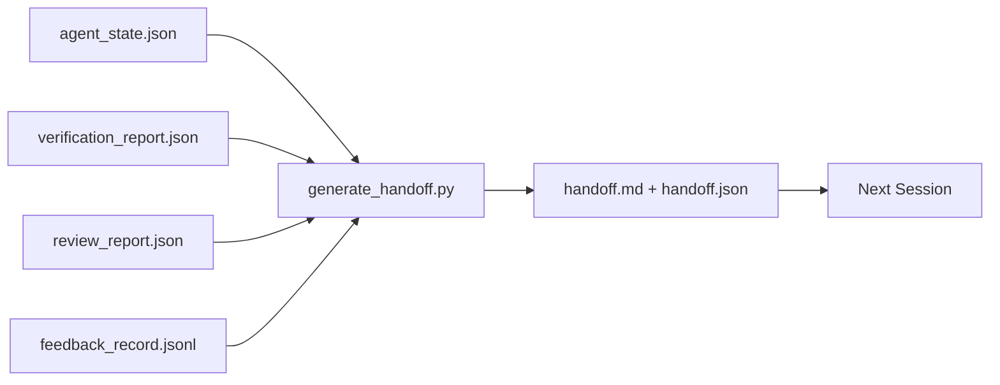

# Multi-Session Handoff

> Phiên làm việc sắp kết thúc. Công việc thì chưa. Handoff packet là vật phẩm biến "tác nhân đã làm việc trong một giờ" thành "phiên làm việc tiếp theo hiệu quả ngay từ phút đầu tiên". Hãy xây dựng nó một cách chủ đích, đừng coi đó là việc làm thêm sau cùng.

**Type:** Build
**Languages:** Python (stdlib)
**Prerequisites:** Phase 14 · 34 (Repo Memory), Phase 14 · 38 (Verification), Phase 14 · 39 (Reviewer)
**Time:** ~50 phút

## Mục tiêu học tập

- Xác định bảy trường thông tin mà mọi handoff packet cần có.
- Tạo handoff từ các artifact của workbench mà không cần viết văn bản thủ công.
- Cắt tỉa các log phản hồi lớn thành bản tóm tắt có kích thước phù hợp cho handoff.
- Làm cho hành động đầu tiên của phiên làm việc tiếp theo trở nên tất định (deterministic).

## Vấn đề

Phiên làm việc kết thúc. Tác nhân nói "tuyệt, chúng ta đã đạt được tiến bộ". Phiên làm việc tiếp theo mở ra. Tác nhân mới hỏi "chúng ta đã dừng lại ở đâu?". Câu trả lời của tác nhân trước đã mất. Tác nhân mới phải tìm hiểu lại, chạy lại các lệnh cũ, hỏi lại con người những câu hỏi cũ, và lãng phí ba mươi phút để khôi phục lại ba mươi giây cuối cùng của phiên trước.

Cái giá của một lần handoff tồi được trả trong mỗi phiên làm việc suốt vòng đời của tác vụ. Giải pháp là một gói dữ liệu được tạo tự động khi kết thúc phiên: những gì đã thay đổi, tại sao, những gì đã thử, những gì thất bại, những gì còn lại, và việc cần làm đầu tiên vào lần tới.

## Khái niệm



### Bảy trường thông tin mọi handoff cần có

| Trường | Câu hỏi cần trả lời |
|-------|---------------------|
| `summary` | Một đoạn văn về những gì đã thực hiện |
| `changed_files` | Diff trong nháy mắt |
| `commands_run` | Những gì đã thực sự được thực thi |
| `failed_attempts` | Những gì đã thử và tại sao không hiệu quả |
| `open_risks` | Những gì có thể gây rắc rối ở phiên sau, kèm mức độ nghiêm trọng |
| `next_action` | Bước cụ thể đầu tiên cần thực hiện ở phiên sau |
| `verdict_pointer` | Đường dẫn đến các báo cáo verification + review |

Trường `next_action` là trường quan trọng nhất. Một handoff có mọi thứ ngoại trừ `next_action` chỉ là một báo cáo trạng thái, không phải là một handoff.

### Handoff được tạo ra, không phải viết ra

Một handoff viết tay là loại handoff dễ bị bỏ qua vào những ngày khó khăn. Bộ tạo (generator) đọc các artifact của workbench và xuất ra gói dữ liệu. Công việc của tác nhân là để lại workbench ở trạng thái mà bộ tạo có thể tóm tắt, chứ không phải là viết bản tóm tắt đó.

### Hai định dạng: con người đọc được và máy đọc được

`handoff.md` là thứ con người đọc. `handoff.json` là thứ tác nhân tiếp theo tải vào. Cả hai đều đến từ cùng một nguồn artifact. Nếu chúng khác biệt, JSON sẽ là bản chuẩn.

### Cắt tỉa log phản hồi

Toàn bộ `feedback_record.jsonl` có thể có hàng trăm mục. Handoff chỉ mang theo K mục cuối cùng cộng với mọi mục có exit code khác không. Phiên làm việc tiếp theo sẽ tải toàn bộ log nếu cần, nhưng gói dữ liệu vẫn giữ được kích thước nhỏ gọn.

### Để lại một trạng thái sạch sẽ

Handoff mô tả công việc. Một trạng thái sạch sẽ giúp công việc có thể tiếp tục được. Chúng không phải là một. Một `handoff.md` hoàn hảo sẽ vô giá trị nếu phiên làm việc tiếp theo mở ra với một diff chưa áp dụng hết, một file tạm mà tác nhân quên xóa, một nhánh rác, và các bài kiểm tra lỗi ngay cả khi chưa chạy. Tác nhân tiếp theo sau đó mất mười phút đầu tiên để dọn dẹp thay vì xây dựng, và chi phí này cộng dồn qua từng phiên làm việc.

Vì vậy, phiên làm việc không kết thúc khi tính năng hoạt động. Nó kết thúc khi workbench ở trạng thái mà bộ tạo có thể tóm tắt và phiên tiếp theo có thể tin tưởng. Dọn dẹp là một giai đoạn riêng biệt, chạy trước khi handoff, và nó là một bước kiểm tra, không phải là một thói quen, vì thói quen là thứ dễ bị bỏ qua vào những ngày khó khăn.

| Kiểm tra | Sạch nghĩa là | Bẩn gây ra do |
|-------|-------------|----------------------|
| Working tree | Mọi thay đổi đã commit hoặc stash rõ ràng kèm ghi chú | Một diff áp dụng dở dang trông giống như công việc có chủ đích với tác nhân sau |
| Temp artifacts | Không còn `*.tmp`, thư mục nháp, debug print, hoặc các khối code bị comment | Các file rác làm ô nhiễm diff và mô hình tư duy của tác nhân sau |
| Tests | Xanh, hoặc đỏ với lỗi được nêu tên trong `open_risks` | Một bài test đỏ thầm lặng là cái bẫy mà phiên sau sẽ vấp phải |
| Feature board | Trạng thái `feature_list.json` phản ánh thực tế (Phase 14 · 36) | Bảng trạng thái cũ khiến phiên sau làm lại những việc đã xong |
| Branch | Ở đúng nhánh dự kiến, không detached HEAD, không nhánh mồ côi | Sai nhánh nghĩa là commit đầu tiên của phiên sau nằm sai chỗ |

Giai đoạn dọn dẹp xuất ra một `clean_state.json` các vấn đề chặn; một danh sách trống là điều kiện tiên quyết mà bộ tạo handoff xác nhận trước khi nó viết gói dữ liệu. Một handoff xây dựng trên một cây thư mục bẩn không phải là handoff, đó là một mớ hỗn độn được chuyển tiếp. Hai artifact này đi đôi với nhau: dọn dẹp chứng minh workbench an toàn để rời đi, handoff chứng minh phiên tiếp theo biết bắt đầu từ đâu.

```figure
wb-handoff-packet
```

## Xây dựng

`code/main.py` triển khai:

- Một loader thu thập trạng thái, verdict, review, và feedback vào một `WorkbenchSnapshot` duy nhất.
- Một hàm `generate_handoff(snapshot) -> (markdown, payload)`.
- Một bộ lọc chọn K mục phản hồi cuối cùng cộng với tất cả các exit code khác không.
- Một bản chạy thử ghi `handoff.md` và `handoff.json` cạnh script.

Chạy nó:

```
python3 code/main.py
```

Đầu ra: nội dung handoff được in ra, cộng với cả hai file trên đĩa.

## Các mô hình sản xuất thực tế

Codex CLI, Claude Code, và OpenCode mỗi bên đều có cách nén dữ liệu khác nhau; cấu trúc handoff packet nằm trên cả ba.

**Chiến lược nén khác nhau; lược đồ gói dữ liệu thì không.** POST /v1/responses/compact của Codex CLI là một AES blob mờ phía server (đường dẫn nhanh cho các model OpenAI); phương án dự phòng là một "handoff summary" cục bộ được thêm vào dưới dạng tin nhắn `_summary` với role là user. Claude Code chạy nén lũy tiến năm giai đoạn ở mức 95% context. OpenCode thực hiện ẩn tin nhắn dựa trên timestamp cộng với tóm tắt LLM 5 tiêu đề. Ba cơ chế khác nhau, cùng một nhu cầu: serialize những gì còn sót lại sau khi nén thành một artifact di động. Gói dữ liệu chính là artifact đó.

**Handoff phiên mới không phải là nén.** Nén giúp kéo dài một phiên; handoff đóng một phiên một cách sạch sẽ và bắt đầu phiên tiếp theo. Cách đặt vấn đề của Hermes Issue #20372 (tháng 4 năm 2026) là đúng: khi việc nén tại chỗ bắt đầu suy giảm, tác nhân nên viết một handoff gọn nhẹ, kết thúc phiên, và tiếp tục trong context mới. Gói dữ liệu là thứ làm cho quá trình chuyển đổi đó trở nên rẻ. Sai lầm là tiếp tục nén cho đến khi chất lượng sụp đổ; giải pháp là lập kế hoạch cho một handoff sớm và sạch sẽ.

**Một handoff hoạt động cho mỗi nhánh và chủ đề.** Sự phối hợp đa tác nhân thất bại do handoff cũ kỹ nhiều hơn là do đầu ra model tồi. Luôn bao gồm `branch`, `last_known_good_commit`, và một `status` của `active | superseded | archived`. Các handoff cũ được lưu trữ; chỉ cái đang hoạt động mới điều khiển phiên tiếp theo. Đây là sự khác biệt giữa handoff-dạng-ghi-chú và handoff-dạng-trạng-thái.

**Kết thúc trước khi đạt 50-75% context, đừng đợi đến giới hạn.** Các playbook theo mẫu viết tay (CLAUDE.md + HANDOVER.md) báo cáo kết quả tốt nhất khi phiên làm việc kết thúc ở mức 50-75% ngân sách context thay vì 95%. Bộ tạo gói dữ liệu chạy sạch sẽ trước khi các artifact nén làm ô nhiễm trạng thái nguồn. Rẻ để viết khi context còn nguyên vẹn; đắt đỏ khi model đã bắt đầu mất dấu.

## Sử dụng

Các mô hình sản xuất:

- **Hook kết thúc phiên.** Runtime kích hoạt bộ tạo khi người dùng đóng chat. Gói dữ liệu đi vào `outputs/handoff/<session_id>/`.
- **Template PR.** Markdown của bộ tạo cũng là nội dung PR. Người review đọc nó mà không cần mở năm file khác.
- **Handoff giữa các tác nhân.** Xây dựng với một sản phẩm (Claude Code), tiếp tục với sản phẩm khác (Codex). Gói dữ liệu là ngôn ngữ chung (lingua franca).

Gói dữ liệu nhỏ, có quy tắc và rẻ để sản xuất. Việc tiết kiệm chi phí sẽ cộng dồn qua mỗi phiên làm việc.

## Triển khai

`outputs/skill-handoff-generator.md` tạo ra một bộ tạo được tinh chỉnh theo các đường dẫn artifact của dự án, một hook kết thúc phiên chạy nó, và một lược đồ `handoff.json` mà tác nhân tiếp theo đọc khi khởi động.

## Bài tập

1. Thêm trường `assumptions_to_validate` hiển thị mọi giả định mà người xây dựng đã ghi lại nhưng người review không chấm điểm trên 1.
2. Cắt tỉa tóm tắt phản hồi khác nhau cho các lần chạy thất bại so với các lần thành công. Hãy bảo vệ sự bất đối xứng này.
3. Bao gồm danh sách "câu hỏi cho con người". Ngưỡng nào để một câu hỏi được đưa vào gói dữ liệu thay vì vào tin nhắn chat?
4. Làm cho bộ tạo có tính lũy đẳng (idempotent): chạy nó hai lần tạo ra cùng một gói dữ liệu. Những gì cần phải ổn định để điều này giữ nguyên?
5. Thêm phần "điều kiện tiên quyết cho phiên sau" liệt kê chính xác các artifact mà phiên sau phải tải trước khi hành động.

## Thuật ngữ chính

| Thuật ngữ | Mọi người nói | Ý nghĩa thực sự |
|-------|----------------|------------------------|
| Handoff packet | "Tóm tắt phiên" | Artifact được tạo ra mang bảy trường thông tin, cả markdown và JSON |
| Next action | "Việc cần làm đầu tiên" | Một bước cụ thể bắt đầu phiên làm việc tiếp theo |
| Feedback trim | "Tóm tắt log" | K bản ghi cuối cùng cộng với mọi exit code khác không |
| Status report | "Những gì chúng ta đã làm" | Tài liệu thiếu `next_action`; hữu ích, nhưng không phải handoff |
| Verdict pointer | "Biên lai" | Đường dẫn đến báo cáo verification + review để truy xuất nguồn gốc |

## Đọc thêm

- [Anthropic, Effective harnesses for long-running agents](https://www.anthropic.com/engineering/effective-harnesses-for-long-running-agents)
- [OpenAI Agents SDK handoffs](https://openai.github.io/openai-agents-python/handoffs/)
- [Codex Blog, Codex CLI Context Compaction: Architecture, Configuration, Managing Long Sessions](https://codex.danielvaughan.com/2026/03/31/codex-cli-context-compaction-architecture/) — POST /v1/responses/compact và phương án dự phòng cục bộ
- [Justin3go, Shedding Heavy Memories: Context Compaction in Codex, Claude Code, OpenCode](https://justin3go.com/en/posts/2026/04/09-context-compaction-in-codex-claude-code-and-opencode) — so sánh nén dữ liệu của ba nhà cung cấp
- [JD Hodges, Claude Handoff Prompt: How to Keep Context Across Sessions (2026)](https://www.jdhodges.com/blog/ai-session-handoffs-keep-context-across-conversations/) — CLAUDE.md + HANDOVER.md, ngân sách context 50-75%
- [Mervin Praison, Managing Handoffs in Multi-Agent Coding Sessions: Fresh Context Without Losing Continuity](https://mer.vin/2026/04/managing-handoffs-in-multi-agent-coding-sessions-fresh-context-without-losing-continuity/) — khung hệ thống phân tán
- [Hermes Issue #20372 — tự động handoff phiên mới khi việc nén trở nên rủi ro](https://github.com/NousResearch/hermes-agent/issues/20372)
- [Hermes Issue #499 — Context Compaction Quality Overhaul](https://github.com/NousResearch/hermes-agent/issues/499) — các prompt hướng tới handoff trong Codex CLI
- [Microsoft Agent Framework, Compaction](https://learn.microsoft.com/en-us/agent-framework/agents/conversations/compaction)
- [OpenCode, Context Management and Compaction](https://deepwiki.com/sst/opencode/2.4-context-management-and-compaction)
- [LangChain, Context Engineering for Agents](https://www.langchain.com/blog/context-engineering-for-agents)
- Phase 14 · 34 — file trạng thái mà bộ tạo đọc
- Phase 14 · 38 — verdict xác minh mà gói dữ liệu trỏ tới
- Phase 14 · 39 — báo cáo review được đóng gói vào gói dữ liệu