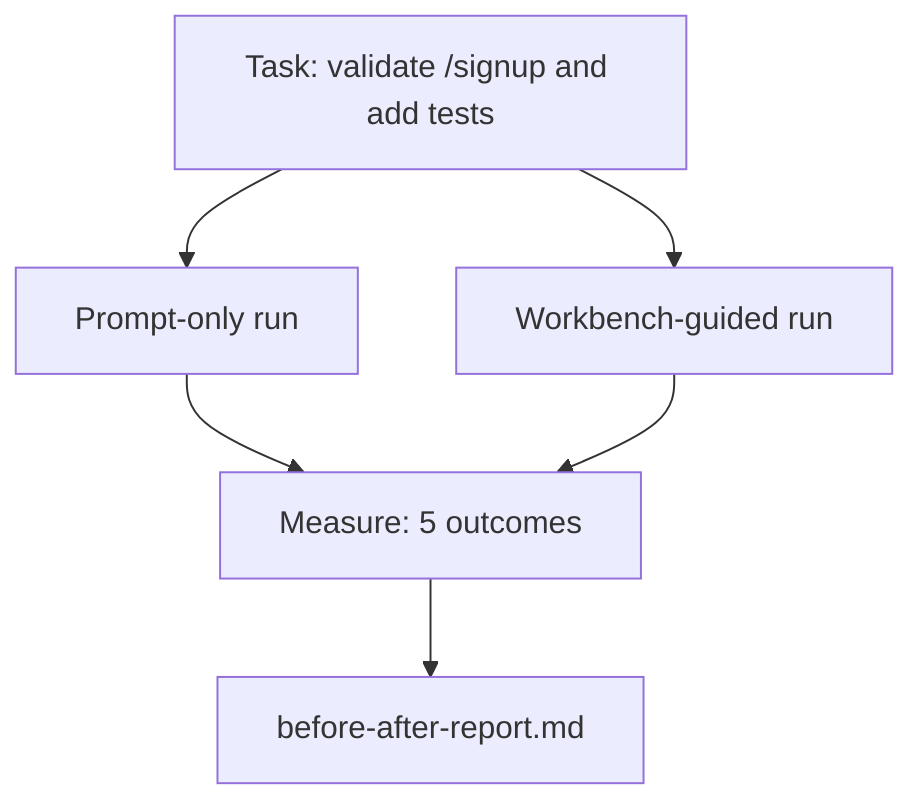

# The Workbench on a Real Repo

> Mười một bài học về các bề mặt (surfaces) sẽ chẳng có giá trị gì nếu chúng không tồn tại được khi tiếp xúc với một codebase thực tế. Bài học này thực hiện cùng một tác vụ hai lần trên một ứng dụng mẫu nhỏ: chỉ dùng prompt so với dùng workbench hỗ trợ. Các con số sẽ đưa ra lập luận.

**Type:** Build
**Languages:** Python (stdlib)
**Prerequisites:** Phases 14 · 32 to 14 · 40
**Time:** ~60 minutes

## Learning Objectives

- Kết hợp bảy bề mặt workbench lại với nhau trên một ứng dụng nhỏ.
- Chạy cùng một tác vụ hai lần (chỉ dùng prompt và dùng workbench hỗ trợ) và đo lường năm kết quả đầu ra.
- Đọc báo cáo trước/sau và quyết định bề mặt nào mang lại hiệu quả cao nhất.
- Bảo vệ workbench trước sự phản đối kiểu "nhưng model của tôi đã đủ tốt rồi".

## The Problem

Một bản demo trên một tác vụ đồ chơi không thuyết phục được ai cả. Giá trị của workbench được khẳng định khi một tác vụ có cảm giác thực tế trên một repo có cảm giác thực tế được đưa vào production với ít lỗi hơn, ít phải revert hơn và tạo ra một gói dữ liệu mà phiên làm việc tiếp theo có thể sử dụng.

Bài học này cung cấp repo có cảm giác thực tế đó và chạy cùng một tác vụ qua cả hai pipeline. Kết quả là một báo cáo trước/sau mà bạn có thể đưa cho những người hoài nghi.

## The Concept



### The sample app

Một handler tối giản theo phong cách FastAPI trong `sample_app/`:

- `app.py` với `/signup` (chưa có validation).
- `test_app.py` với một test cho happy-path.
- `README.md` và `scripts/release.sh` làm mồi nhử cho vùng cấm.

### The task

> Thêm input validation vào `/signup`: từ chối các mật khẩu ngắn hơn 8 ký tự, trả về mã 422 kèm theo một error envelope có kiểu dữ liệu rõ ràng. Thêm một test chứng minh hành vi mới này.

### The two pipelines

Prompt-only:

1. Đọc README.
2. Đọc `app.py`.
3. Chỉnh sửa file.
4. Khẳng định đã xong.

Workbench-guided:

1. Chạy script khởi tạo (Bài học 35).
2. Đọc hợp đồng phạm vi (Bài học 36).
3. Đọc trạng thái (Bài học 34).
4. Chỉ chỉnh sửa các file được cho phép.
5. Chạy lệnh acceptance thông qua feedback runner (Bài học 37).
6. Chạy cổng xác thực (verification gate) (Bài học 38).
7. Chạy reviewer (Bài học 39).
8. Tạo gói bàn giao (handoff) (Bài học 40).

### The five outcomes measured

| Outcome | Why it matters |
|---------|----------------|
| `tests_actually_run` | Hầu hết các khẳng định "test đã pass" đều không thể kiểm chứng |
| `acceptance_met` | Test chứng minh mục tiêu phải là test đã thực sự chạy |
| `files_outside_scope` | Scope creep (phạm vi bị mở rộng) là lỗi thầm lặng phổ biến nhất |
| `handoff_quality` | Phiên làm việc tiếp theo sẽ trả giá hoặc hưởng lợi từ điều này |
| `reviewer_total` | Đánh giá định tính dựa trên cổng xác thực |

```figure
wb-ab-runs
```

## Build It

`code/main.py` điều phối hai pipeline đối với cùng một fixture ứng dụng mẫu. Cả hai pipeline đều được viết script (không có LLM trong vòng lặp) để phép đo có thể tái lập. Script ghi lại kết quả so sánh vào `before-after-report.md` và `comparison.json`.

Chạy nó:

```
python3 code/main.py
```

Đầu ra: một bảng console hiển thị kết quả cho mỗi pipeline, báo cáo markdown được lưu cạnh script và JSON cho bất kỳ ai muốn vẽ biểu đồ.

## Production patterns in the wild

Câu hỏi của người hoài nghi là "workbench thực sự giúp ích được bao nhiêu?" Các con số năm 2026 nói lên nhiều điều hơn là lời giải thích.

**Terminal Bench Top-30 lên Top-5 trên cùng một model.** *Anatomy of an Agent Harness* của LangChain (tháng 4 năm 2026): một coding agent đã nhảy từ ngoài top 30 lên hạng 5 trên Terminal Bench 2.0 chỉ bằng cách thay đổi harness. Cùng một model. Các bề mặt khác nhau. Chênh lệch 25 bậc.

**Vercel từ 80% lên 100% bằng cách xóa bớt công cụ.** Vercel báo cáo rằng việc xóa 80% công cụ của agent đã giúp tỷ lệ thành công tăng từ 80% lên 100%. Bề mặt công cụ nhỏ hơn, phạm vi sắc bén hơn, ít cách để thất bại hơn. Khoảng không (negative space) chiến thắng.

**Harvey tăng gấp đôi độ chính xác chỉ nhờ harness.** Các legal agent đã tăng gấp đôi độ chính xác thông qua tối ưu hóa harness, không cần thay đổi model.

**88% các dự án AI agent doanh nghiệp thất bại trong việc đưa vào production.** Bài báo *Harness Engineering for Language Agents* trên preprints.org (tháng 3 năm 2026) truy vết các thất bại về runtime, không phải về suy luận: trạng thái cũ, retry giòn, context quá tải, khả năng phục hồi kém trước các lỗi trung gian.

**Long-context collapse.** Tỷ lệ thành công cơ sở của WebAgent là 40-50% giảm xuống dưới 10% trong điều kiện long-context, chủ yếu do vòng lặp vô hạn và mất mục tiêu. Ralph Loop và gói handoff tồn tại để hấp thụ điều đó.

**False negatives vẫn tồn tại.** Các tác vụ thực tế một bước, lint một dòng, chạy formatter, bất cứ thứ gì model đã ghi nhớ nguyên văn — những thứ này chạy nhanh hơn khi chỉ dùng prompt. Benchmark nên liệt kê chúng một cách trung thực để workbench không bị coi là quá mức cần thiết.

Kết luận không phải là "harness luôn thắng". Các model theo thời gian sẽ hấp thụ các thủ thuật của harness. Kết luận là ngày nay, tải trọng kỹ thuật nằm ở bảy bề mặt, và các con số chứng minh điều đó.

## Use It

Bài học này là hồ sơ vụ việc bạn trích dẫn khi:

- Ai đó hỏi tại sao mọi PR đều mang theo một `agent-rules.md` và một hợp đồng phạm vi.
- Một team muốn bỏ cổng xác thực "chỉ cho sprint này thôi".
- Một sản phẩm agent mới ra mắt và bạn cần một benchmark di động để xem liệu nó có thực sự tiết kiệm thời gian hay không.

Các con số đi xa hơn lời giải thích.

## Ship It

`outputs/skill-workbench-benchmark.md` là một harness đánh giá di động chạy bất kỳ sản phẩm agent nào qua cả hai pipeline đối với ứng dụng mẫu của dự án và báo cáo năm kết quả đầu ra.

## Exercises

1. Thêm kết quả thứ sáu: thời gian đến lần chỉnh sửa có ý nghĩa đầu tiên (time-to-first-meaningful-edit). Bạn đo lường nó một cách sạch sẽ như thế nào?
2. Chạy so sánh trên một tác vụ thực tế ngày thứ hai trong codebase của bạn. Các con số của workbench bị trượt ở đâu?
3. Thêm một lượt "false negative": các tác vụ mà chỉ dùng prompt sẽ nhanh hơn và chi phí overhead của workbench là chi phí thực. Hãy bảo vệ việc vẫn giữ workbench.
4. Thay thế "agent" dạng script bằng một lời gọi LLM thực tế. Kết quả nào trở nên nhiễu hơn?
5. Viết một bản tóm tắt một trang nhắm đến người không phải kỹ sư. Điều gì sẽ tồn tại sau khi cắt gọt?

## Key Terms

| Term | What people say | What it actually means |
|------|----------------|------------------------|
| Sample app | "Toy repo" | Nhỏ nhưng đủ thực tế để vận hành cả bảy bề mặt |
| Pipeline | "Workflow" | Chuỗi đọc/ghi bề mặt có thứ tự mà agent tuân theo |
| Before/after report | "The receipts" | Bằng chứng bạn đưa cho người hoài nghi |
| False negative | "Workbench overkill" | Các tác vụ mà prompt-only nhanh hơn; hữu ích để liệt kê trung thực |
| Workbench benchmark | "Reliability score" | Harness di động chạy so sánh trên codebase của bạn |

## Further Reading

- [LangChain, The Anatomy of an Agent Harness](https://blog.langchain.com/the-anatomy-of-an-agent-harness/) — Bằng chứng Terminal Bench từ Top-30 lên Top-5
- [MongoDB, The Agent Harness: Why the LLM Is the Smallest Part of Your Agent System](https://www.mongodb.com/company/blog/technical/agent-harness-why-llm-is-smallest-part-of-your-agent-system) — Các con số của Vercel + Harvey
- [preprints.org, Harness Engineering for Language Agents](https://www.preprints.org/manuscript/202603.1756) — Tỷ lệ thất bại 88% ở doanh nghiệp, nguyên nhân gốc rễ từ runtime
- [HN: Improving 15 LLMs at Coding in One Afternoon. Only the Harness Changed](https://news.ycombinator.com/item?id=46988596) — được tái lập trên 15 model
- [Cloudflare, Orchestrating AI Code Review at Scale](https://blog.cloudflare.com/ai-code-review/) — 131k lượt review / 30 ngày trong production
- [Anthropic, Building Effective Agents](https://www.anthropic.com/research/building-effective-agents)
- Phases 14 · 32 to 14 · 40 — các bề mặt mà bài học này vận hành end-to-end
- Phase 14 · 19 — SWE-bench, GAIA, AgentBench là các macro benchmark mà bài học này bổ sung
- Phase 14 · 30 — phát triển agent dựa trên eval mà cùng một harness này cắm vào