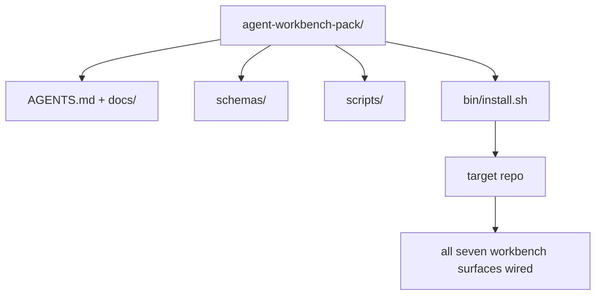

# Capstone: Ship a Reusable Agent Workbench Pack

> Mini-track này kết thúc với một gói (pack) mà bạn có thể thả vào bất kỳ repo nào. Mười một bài học về các bề mặt (surfaces) được nén lại thành một thư mục mà bạn có thể `cp -r` và giúp một agent hoạt động ổn định vào sáng hôm sau. Capstone này chính là sản phẩm mà chương trình đào tạo này hướng tới.

**Type:** Build
**Languages:** Python (stdlib)
**Prerequisites:** Phases 14 · 31 đến 14 · 41
**Time:** ~75 phút

## Mục tiêu học tập

- Đóng gói bảy bề mặt workbench vào một thư mục duy nhất.
- Cố định (pin) các schema, script và template để một repo mới có được một baseline chuẩn.
- Thêm một script cài đặt duy nhất giúp triển khai gói một cách idempotent (đẳng lũy).
- Quyết định những gì nên giữ lại trong gói và những gì nên loại bỏ, đồng thời đưa ra lý do cho từng quyết định.

## Vấn đề

Một workbench nằm rải rác trong Google Doc, lịch sử chat và ba script mà bạn chỉ nhớ mang máng là một workbench cần phải xây dựng lại mỗi quý. Giải pháp là một gói được đánh phiên bản: một repo hoặc thư mục chứa các bề mặt, schema, script và một trình cài đặt chỉ với một lệnh.

Bạn sẽ kết thúc bài học này với `outputs/agent-workbench-pack/` được triển khai trên đĩa và một `bin/install.sh` giúp đưa nó vào bất kỳ repo mục tiêu nào.

## Khái niệm



### Cấu trúc của gói

```
outputs/agent-workbench-pack/
├── AGENTS.md
├── docs/
│   ├── agent-rules.md
│   ├── reliability-policy.md
│   ├── handoff-protocol.md
│   └── reviewer-rubric.md
├── schemas/
│   ├── agent_state.schema.json
│   ├── task_board.schema.json
│   └── scope_contract.schema.json
├── scripts/
│   ├── init_agent.py
│   ├── run_with_feedback.py
│   ├── verify_agent.py
│   └── generate_handoff.py
├── bin/
│   └── install.sh
└── README.md
```

### Những gì nên giữ lại, những gì nên loại bỏ

Giữ lại:

- Các schema bề mặt. Chúng là hợp đồng (contract).
- Bốn script nêu trên. Chúng là runtime.
- Bốn tài liệu. Chúng là các quy tắc và tiêu chuẩn đánh giá.

Loại bỏ:

- Các tác vụ cụ thể của dự án. Tác vụ thuộc về bảng công việc của repo mục tiêu, không phải trong gói.
- Các lệnh gọi SDK của nhà cung cấp. Gói phải độc lập với framework.
- Văn bản hướng dẫn onboarding. Gói nên nằm cạnh tài liệu onboarding hiện có của nhóm, không phải bên trong đó.

### Trình cài đặt

Một `bin/install.sh` (hoặc `bin/install.py`) ngắn gọn:

1. Từ chối cài đặt đè lên một gói hiện có nếu không có `--force`.
2. Sao chép gói vào repo mục tiêu.
3. Thiết lập CI nếu `.github/workflows/` tồn tại.
4. In ra các bước tiếp theo: điền vào bảng công việc, thiết lập các lệnh chấp nhận (acceptance commands), chạy script khởi tạo.

### Đánh phiên bản

Gói mang theo một tệp `VERSION`. Các thay đổi về schema và script yêu cầu migration sẽ tăng phiên bản major. Các thay đổi chỉ liên quan đến tài liệu sẽ tăng phiên bản patch. Tệp `agent_state.json` của repo mục tiêu ghi lại phiên bản gói mà nó đã được khởi tạo ban đầu.

```figure
wb-pack-install
```

## Xây dựng

`code/main.py` tập hợp gói vào `outputs/agent-workbench-pack/` bên cạnh bài học, được nạp sẵn các schema và script từ các bài học trước trong mini-track này cùng với các tài liệu bạn đã viết.

Chạy nó:

```
python3 code/main.py
```

Script này sao chép và cố định các bề mặt, viết README, in ra cấu trúc cây của gói và thoát với mã 0. Việc chạy lại là idempotent.

## Các mô hình sản xuất trong thực tế

Một gói chỉ có giá trị nếu nó tồn tại được qua các lần fork, cập nhật và các thay đổi từ upstream không thân thiện. Bốn mô hình giúp điều đó trở nên khả thi.

**`VERSION` là hợp đồng, không phải marketing.** Các bản cập nhật major yêu cầu migration trạng thái. Các bản cập nhật minor yêu cầu chạy lại trình kiểm tra. Các bản cập nhật patch chỉ dành cho tài liệu. Trình cài đặt ghi `.workbench-version` vào repo mục tiêu trong mỗi lần cài đặt; `lint_pack.py` từ chối triển khai nếu lock của mục tiêu không khớp với `VERSION` của gói. Đây là cách `npm`, `Cargo` và `pyproject.toml` tồn tại qua 10 năm biến động; không có gì về agent làm thay đổi các quy tắc này.

**Nguồn duy nhất cho phân phối đa công cụ.** Nx xuất xưởng một `nx ai-setup` giúp thiết lập `AGENTS.md`, `CLAUDE.md`, `.cursor/rules/`, `.github/copilot-instructions.md` và một MCP server từ một cấu hình duy nhất. Gói cũng nên làm như vậy; trình cài đặt tạo ra các symlink (`ln -s AGENTS.md CLAUDE.md`) để một nguồn sự thật duy nhất lan tỏa đến mọi coding agent. Việc fork gói để hỗ trợ công cụ này thay vì công cụ khác là một thất bại.

**`uninstall.sh` từ chối thực hiện trên trạng thái không tầm thường.** Việc gỡ cài đặt gói không được xóa `agent_state.json`, `task_board.json` hoặc `outputs/` của người dùng. Trình gỡ cài đặt xóa các schema, script, tài liệu và `AGENTS.md` (với tùy chọn `--keep-agents-md`) và từ chối tiếp tục nếu các tệp trạng thái có bất kỳ thay đổi nào chưa được commit. Trạng thái thuộc về người dùng; gói không sở hữu nó.

**Skill-as-publishable. Phân phối theo kiểu SkillKit.** Gói được xuất xưởng như một SkillKit skill: `skillkit install agent-workbench-pack` triển khai nó trên 32 AI agent từ một nguồn duy nhất. Repo của gói là nguồn sự thật; SkillKit là kênh phân phối. Sự phụ thuộc vào nhà cung cấp (vendor lock-in) bị loại bỏ; bảy bề mặt vẫn giữ nguyên.

## Sử dụng

Ba nơi mà gói được triển khai:

- **Dưới dạng một thư mục bạn thả vào repo.** `cp -r outputs/agent-workbench-pack /path/to/repo`.
- **Dưới dạng một repo template công khai.** Fork-và-tùy chỉnh, với `VERSION` kiểm soát sự sai lệch.
- **Dưới dạng một SkillKit skill.** Được kết nối vào sản phẩm agent của bạn để một lệnh duy nhất có thể triển khai nó.

Gói là công thức. Mỗi lần cài đặt là một phần ăn.

## Triển khai

`outputs/skill-workbench-pack.md` tạo ra một gói được tinh chỉnh cho dự án: các quy tắc được làm sắc bén theo lịch sử của nhóm, các scope glob khớp với repo, các tiêu chuẩn đánh giá được mở rộng với một mục nhập cụ thể cho lĩnh vực.

## Bài tập

1. Quyết định tài liệu thứ năm tùy chọn nào xứng đáng được đưa vào gói chính thức. Bảo vệ quyết định của bạn.
2. Viết lại trình cài đặt bằng Python với cờ `--dry-run`. So sánh tính công thái học với bash.
3. Thêm một `bin/uninstall.sh` giúp xóa gói một cách an toàn và từ chối nếu các tệp trạng thái có lịch sử không tầm thường. Điều gì được coi là không tầm thường?
4. Thêm một `lint_pack.py` thất bại khi gói bị lệch khỏi `VERSION`. Kết nối nó vào CI cho chính repo của gói.
5. Viết sổ tay hướng dẫn migration từ một workbench thủ công sang gói này. Thứ tự các thao tác nào giúp giảm thiểu thời gian ngừng hoạt động?

## Thuật ngữ chính

| Thuật ngữ | Cách gọi thông thường | Ý nghĩa thực tế |
|------|----------------|------------------------|
| Workbench pack | "Bộ khởi đầu" | Một thư mục được đánh phiên bản chứa tất cả bảy bề mặt |
| Installer | "Script thiết lập" | `bin/install.sh` giúp triển khai gói một cách idempotent |
| Pack version | "VERSION" | Major cho thay đổi schema/script, patch cho thay đổi tài liệu |
| Drop-in pack | "cp -r và chạy" | Gói hoạt động ngay lập tức mà không cần tùy chỉnh theo từng repo |
| Forkable template | "GitHub template" | Repo công khai mà tính năng "Use this template" của GitHub có thể clone |

## Đọc thêm

- Phases 14 · 31 đến 14 · 41 — mọi bề mặt mà gói này đóng gói
- [SkillKit](https://github.com/rohitg00/skillkit) — cài đặt skill này trên 32 AI agent
- [Nx Blog, Teach Your AI Agent How to Work in a Monorepo](https://nx.dev/blog/nx-ai-agent-skills) — trình tạo nguồn duy nhất cho sáu công cụ
- [agents.md — the open spec](https://agents.md/) — những gì router của gói bạn phải triển khai
- [HKUDS/OpenHarness](https://github.com/HKUDS/OpenHarness) — triển khai tham chiếu của một gói tương đương
- [andrewgarst/agentic_harness](https://github.com/andrewgarst/agentic_harness) — tham chiếu dựa trên Redis với bộ eval
- [Augment Code, A good AGENTS.md is a model upgrade](https://www.augmentcode.com/blog/how-to-write-good-agents-dot-md-files) — tiêu chuẩn chất lượng tài liệu gói
- [Anthropic, Effective harnesses for long-running agents](https://www.anthropic.com/engineering/effective-harnesses-for-long-running-agents)
- [Anthropic, Harness design for long-running application development](https://www.anthropic.com/engineering/harness-design-long-running-apps)
- Phase 14 · 30 — phát triển agent dựa trên eval sử dụng cổng xác thực của gói
- Phase 14 · 41 — benchmark trước/sau mà gói này cải thiện