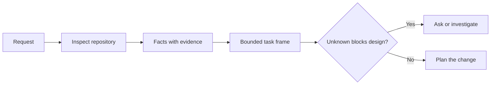

# Định hình tác vụ trước khi Agent viết code

> Một coding agent có thể thực hiện một tác vụ rõ ràng một cách nhanh chóng. Nó cũng có thể thực hiện một tác vụ không rõ ràng một cách nhanh chóng. Tốc độ là như nhau. Nhưng chi phí thì không.

**Type:** Learn + Build
**Languages:** Python (stdlib)
**Prerequisites:** Phase 14 lessons 31 và 36
**Time:** ~60 phút

## Mục tiêu học tập

- Chuyển đổi một yêu cầu thành một khung tác vụ (task frame) có giới hạn trước khi thực hiện chỉnh sửa.
- Phân tách các sự kiện thực tế trong repository khỏi các giả định và câu hỏi mở.
- Xác định các đường dẫn được phép, đường dẫn bị cấm và bằng chứng chấp nhận (acceptance evidence).
- Quyết định khi nào việc trinh sát (reconnaissance) là đủ để bắt đầu công việc.

## Sự thất bại đắt giá

“Thêm bảo vệ chống trùng lặp email” nghe có vẻ cụ thể. Nhưng thực tế thì không. Tính duy nhất thuộc về API, domain service, hay database? Việc so sánh có phân biệt chữ hoa chữ thường không? Hình dạng lỗi (error shape) nào đã được công khai? Có được phép migration không? Test nào chứng minh hành vi đó?

Một agent có năng lực sẽ lấp đầy những khoảng trống đó bằng các lựa chọn hợp lý. Đó là trường hợp nguy hiểm vì việc triển khai có thể sạch sẽ, đã được test, nhưng vẫn không tương thích với hệ thống.

Do đó, đơn vị công việc đầu tiên của coding agent không phải là chỉnh sửa. Đó là một khung tác vụ được hỗ trợ bởi bằng chứng từ repository.

## Khung tác vụ (The Task Frame)

Một khung hữu ích có sáu trường:

| Trường | Câu hỏi |
|---|---|
| Goal | Hành vi quan sát được nào cần thay đổi? |
| Repository facts | Bạn đã xác minh điều gì trong code, test, config hoặc lịch sử? |
| Allowed paths | Thay đổi có thể nằm ở đâu? |
| Forbidden paths | Những gì phải giữ nguyên không được chạm vào? |
| Acceptance evidence | Lệnh hoặc quan sát nào chứng minh mục tiêu đã đạt được? |
| Unknowns | Những quyết định nào vẫn cần bằng chứng hoặc sự phán đoán của con người? |

Các sự kiện cần có bằng chứng (receipts). “API sử dụng 409 cho các trường hợp trùng lặp” không phải là một sự kiện cho đến khi bạn có thể chỉ ra test hoặc handler hiện có. Một đường dẫn file và dòng code là đủ. Kết quả lệnh sẽ tốt hơn khi hành vi là yếu tố quan trọng.



## Trinh sát là quá trình tìm kiếm các ràng buộc

Đừng đọc toàn bộ repository. Hãy tìm kiếm các bề mặt ràng buộc thay đổi:

1. Hành vi hiện tại và các thành phần gọi nó.
2. Test hiện có gần nhất.
3. Hợp đồng công khai (public contract) hoặc hình dạng dữ liệu đã serialize.
4. Các hướng dẫn dự án quản lý đường dẫn đó.
5. Các lệnh build và xác minh.
6. Các thay đổi tương tự đã hoàn thành giúp tiết lộ các pattern cục bộ.

Dừng lại khi mọi quyết định dự kiến đều được hỗ trợ bởi bằng chứng, được ủy quyền rõ ràng hoặc được liệt kê là một ẩn số. Việc đọc thêm sau thời điểm đó thường là sự né tránh.

## Các ẩn số không phải là thất bại

Một ẩn số là một khoảng trống có kiểm soát. Một giả định là một câu trả lời không kiểm soát cho khoảng trống đó.

Phân loại từng ẩn số:

- **Discoverable (Có thể khám phá):** repository hoặc hệ thống đang chạy có thể trả lời nó.
- **Decidable (Có thể quyết định):** hợp đồng tác vụ cho phép agent quyền lựa chọn.
- **Human (Con người):** lựa chọn làm thay đổi hành vi sản phẩm, chi phí, rủi ro hoặc khả năng tương thích công khai.
- **Deferred (Trì hoãn):** lựa chọn nằm ngoài phạm vi này và thuộc về các mục tiêu không ưu tiên (non-goals).

Agent nên tiếp tục xử lý các ẩn số có thể khám phá và được ủy quyền. Nó nên tạm dừng ở các ẩn số thuộc về con người trước khi lựa chọn đó bị chôn vùi trong code.

## Chấp nhận trước khi triển khai

Viết bằng chứng trước khi viết bản vá. Bằng chứng có thể là:

- Một lệnh test đơn vị hoặc tích hợp tập trung;
- Một hành trình trình duyệt với viewport được đặt tên và trạng thái mong đợi;
- Một yêu cầu wire và hợp đồng phản hồi chính xác;
- Một phép đo hiệu năng với ngưỡng cụ thể;
- Một kiểm tra phạm vi xác nhận không có file không liên quan nào bị thay đổi.

“Tests pass” không phải là một kế hoạch chứng minh. Hãy nêu tên test có thẩm quyền và khẳng định mà nó hỗ trợ.

## Xây dựng nó

Phòng lab tạo ra một `TaskFrame`, xác thực các ranh giới và bằng chứng của nó, và viết `outputs/task-frame.md`.

Chạy từ thư mục bài học này:

```bash
python3 code/main.py
python3 -m unittest discover code/tests -v
```

Hãy phá vỡ ví dụ theo bốn cách: xóa mục tiêu, xóa bằng chứng sự kiện, làm chồng chéo đường dẫn được phép và bị cấm, và xóa lệnh chấp nhận. Trình xác thực sẽ từ chối mỗi khung vì một lý do khác nhau.

## Sử dụng nó trong một Repository thực tế

Trước khi yêu cầu agent chỉnh sửa:

1. Viết mục tiêu dưới dạng hành vi, không phải thay đổi file.
2. Ghi lại hai hoặc ba sự kiện với bằng chứng chính xác.
3. Đặt tên cho tập hợp đường dẫn được phép nhỏ nhất.
4. Đặt tên rõ ràng cho không gian phủ định (negative space).
5. Viết lệnh hoặc quan sát kết thúc tác vụ.
6. Liệt kê các quyết định bạn chưa có đủ cơ sở để đưa ra.

Khung này nên vừa vặn trên một màn hình. Nếu không, tác vụ có thể chứa nhiều thay đổi có thể xác minh độc lập.

## Bài tập

1. Định hình một bug thực tế từ một trong các repository của bạn mà không đề xuất giải pháp.
2. Tìm một khẳng định trong khung thực chất là một giả định. Thay thế nó bằng bằng chứng.
3. Thêm một ẩn số thuộc về con người mà câu trả lời của nó sẽ làm thay đổi hợp đồng công khai.
4. Chia một đường dẫn được phép rộng thành tập hợp an toàn nhỏ nhất.
5. Thêm một bằng chứng phạm vi (scope receipt) vào bằng chứng chấp nhận.

## Đọc thêm

- [Nuseibeh and Easterbrook, Requirements Engineering: A Roadmap](https://www.cs.toronto.edu/~sme/papers/2000/ICSE2000.pdf), để neo giữ việc triển khai vào các mục tiêu thực tế và các ràng buộc đang tiến hóa.
- [Yang et al., SWE-agent: Agent-Computer Interfaces Enable Automated Software Engineering](https://arxiv.org/abs/2405.15793), để thấy bằng chứng rằng giao diện xung quanh một coding agent làm thay đổi hiệu quả của nó.

## Những gì bạn giữ lại

Hãy giữ lại `outputs/task-frame.md`. Nó là đầu vào cho bài học tiếp theo, nơi khung tác vụ trở thành một kế hoạch thực thi được hỗ trợ bởi bằng chứng.