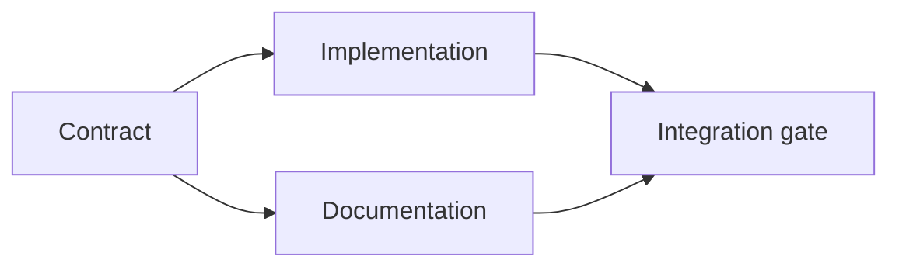

# Xây dựng kế hoạch thực thi dựa trên bằng chứng

> Một kế hoạch không phải là một danh sách việc cần làm (to-do list) được trình bày đẹp mắt hơn. Đó là một đồ thị phụ thuộc (dependency graph), trong đó mỗi thay đổi đều có lý do và mỗi nút cuối (terminal node) đều có bằng chứng.

**Type:** Learn + Build
**Languages:** Python (stdlib)
**Prerequisites:** Phase 14 lesson 43
**Time:** ~65 minutes

## Mục tiêu học tập

- Chuyển đổi khung nhiệm vụ (task frame) thành các hạng mục công việc kèm theo bằng chứng và minh chứng.
- Mô hình hóa thứ tự thực hiện dưới dạng các phụ thuộc thay vì trình tự văn bản.
- Phát hiện các dữ kiện còn thiếu, các phụ thuộc chưa xác định và các vòng lặp (cycles) trước khi chỉnh sửa.
- Tách biệt các bước có thể chạy song song với các bước bắt buộc phải chờ đợi.

## Tại sao kế hoạch của Agent lại thất bại

Các kế hoạch yếu kém thường lặp lại yêu cầu ở thì tương lai:

1. Cập nhật API.
2. Thêm các bài kiểm thử (tests).
3. Cập nhật tài liệu.

Không có gì trong danh sách đó nói rõ những gì đã được tìm thấy, tại sao các tệp đó là chính xác, hợp đồng (contract) nào thay đổi trước, hoặc những gì có thể xảy ra đồng thời. Một agent có thể làm theo từng bước nhưng vẫn tạo ra công việc thừa.

Một kế hoạch mạnh mẽ đưa ra năm cam kết cho mỗi hạng mục công việc:

| Cam kết | Mục đích |
|---|---|
| Định danh (Identifier) | Tham chiếu ổn định cho các phụ thuộc và bàn giao |
| Thay đổi (Change) | Thay đổi nhỏ nhất về hành vi hoặc hợp đồng |
| Bằng chứng (Evidence) | Các dữ kiện trong kho lưu trữ (repository) biện minh cho thay đổi |
| Phụ thuộc (Dependencies) | Công việc phải được hoàn thành trước |
| Minh chứng (Proof) | Kiểm tra chính xác để đóng hạng mục công việc |

## Lập kế hoạch cho hợp đồng trước khi triển khai

Khi nhiều bề mặt (surfaces) phụ thuộc vào cùng một hành vi, hãy xác định hành vi đó trước. Các bài kiểm thử, triển khai, tài liệu và tích hợp sau đó có thể chia sẻ chung một hợp đồng thay vì tạo ra bốn phiên bản khác nhau.



Đồ thị này làm lộ ra khả năng thực thi song song an toàn. Việc triển khai và tài liệu có thể tiến hành cùng lúc sau khi hợp đồng được chốt. Việc tích hợp sẽ chờ đợi cả hai.

## Bằng chứng làm thay đổi kế hoạch

Bằng chứng trong kho lưu trữ không phải là vật trang trí. Nó phải có khả năng thay đổi công việc:

- Một helper hiện có giúp loại bỏ một abstraction mới đã lên kế hoạch.
- Một bài kiểm thử tương thích buộc phải có bước di chuyển (migration).
- Một ràng buộc triển khai (deployment constraint) chuyển thay đổi schema sang một tác vụ khác.
- Một kiểu phản hồi công khai (public response type) làm thay đổi thứ tự triển khai và tài liệu.

Nếu bằng chứng không thể làm thay đổi kế hoạch, thì đó có lẽ không phải là bằng chứng cho quyết định đó.

## Thiết kế để có thể gián đoạn

Các phiên làm việc của coding-agent thường kết thúc bất ngờ. Một kế hoạch có thể tiếp tục (resumable) cần các hạng mục công việc đủ nhỏ để phiên làm việc khác có thể xác định:

- hạng mục nào đã hoàn thành;
- minh chứng nào đã chạy;
- các artifact nào đã thay đổi;
- các phụ thuộc nào hiện đã được giải phóng;
- hạng mục an toàn tiếp theo là gì.

Đừng chỉ mã hóa trạng thái vào các ô kiểm trong cuộc trò chuyện. Hãy lưu trữ kế hoạch ngay cạnh công việc.

## Kiểm chứng kế hoạch

Từ chối kế hoạch trước khi thực thi khi:

- định danh bị trùng lặp;
- hạng mục công việc không có bằng chứng;
- hạng mục công việc không có minh chứng;
- phụ thuộc trỏ đến một hạng mục không xác định;
- đồ thị chứa vòng lặp;
- hành động không thể đảo ngược đầu tiên xảy ra trước khi sự không chắc chắn liên quan được giải quyết.

Năm kiểm tra đầu tiên mang tính cơ học. Kiểm tra cuối cùng đòi hỏi sự phán đoán và cần được nêu rõ ràng.

## Xây dựng nó

`code/main.py` mô hình hóa các hạng mục công việc, xác thực biên nhận của chúng, tính toán các đợt thực thi (execution waves) bằng sắp xếp topo (topological sort) và ghi ra `outputs/evidence-plan.json`.

Chạy:

```bash
python3 code/main.py
python3 -m unittest discover code/tests -v
```

Ví dụ này tạo ra ba đợt. Định nghĩa hợp đồng chạy trước. Triển khai và tài liệu chạy cùng nhau. Cổng tích hợp chạy cuối cùng.

## Sử dụng với Coding Agent

Yêu cầu agent tạo kế hoạch trước khi thay đổi tệp. Xem xét kế hoạch dựa trên ba yếu tố:

1. Mọi đường dẫn và tuyên bố hành vi đều có biên nhận từ kho lưu trữ.
2. Mọi hạng mục đều có một minh chứng hoàn thành rõ ràng.
3. Đồ thị trì hoãn các công việc tốn kém hoặc không thể đảo ngược cho đến khi sự không chắc chắn mà nó phụ thuộc vào được giải quyết.

Hãy phê duyệt kế hoạch, không phải một lời hứa mơ hồ về việc "sẽ cẩn thận".

## Bài tập

1. Thêm một hạng mục di chuyển (migration) yêu cầu sự phê duyệt rõ ràng từ con người.
2. Tạo một vòng lặp và giải thích sự bất đồng về sản phẩm ẩn sau đó.
3. Tách một hạng mục có hai lệnh minh chứng.
4. Thêm một hạng mục công việc có thể chạy trong đợt thứ hai mà không chạm vào bất kỳ nhánh hiện có nào.
5. Hiển thị kế hoạch dưới dạng Markdown trong khi vẫn giữ JSON làm nguồn sự thật (source of truth).

## Đọc thêm

- [Nuseibeh and Easterbrook, Requirements Engineering: A Roadmap](https://www.cs.toronto.edu/~sme/papers/2000/ICSE2000.pdf), về mối quan hệ lặp đi lặp lại giữa mục tiêu, thông số kỹ thuật, thỏa thuận và sự tiến hóa.
- [Barry Boehm, A Spiral Model of Software Development and Enhancement](https://dl.acm.org/doi/10.1145/12944.12948), về việc sắp xếp phát triển dựa trên giải quyết rủi ro thay vì một trình tự tuyến tính cố định.

## Những gì bạn giữ lại

Hãy giữ lại `outputs/evidence-plan.json`. Nó sẽ trở thành hợp đồng ủy quyền trong bài học tiếp theo.