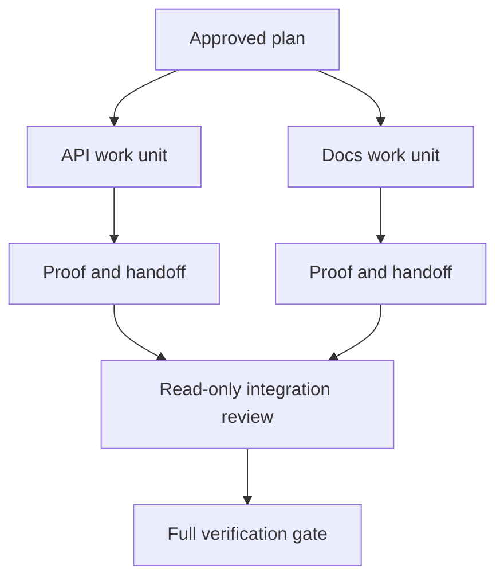

# Ủy quyền công việc cho Agent với sự cô lập và Hợp đồng hợp nhất (Merge Contracts)

> Các agent chạy song song chỉ tiết kiệm thời gian thực tế khi công việc hoàn toàn độc lập. Nếu không, chúng sẽ biến một nhiệm vụ rõ ràng thành một vấn đề điều phối với tỷ lệ thất bại cao hơn.

**Type:** Learn + Build
**Languages:** Python (stdlib)
**Prerequisites:** Phase 14 lessons 39 and 44
**Time:** ~70 minutes

## Mục tiêu học tập

- Quyết định xem việc ủy quyền có thực sự cần thiết dựa trên tính độc lập thực tế hay không.
- Cấp cho mỗi worker quyền sở hữu tệp độc quyền và bằng chứng rõ ràng.
- Tính toán các đợt thực thi (execution waves) từ các phụ thuộc.
- Thiết kế một hợp đồng hợp nhất (merge contract) để kết hợp công việc của các agent một cách an toàn.

## Kiểm tra tính song song

Đừng ủy quyền chỉ vì có nhiều agent sẵn sàng. Hãy ủy quyền khi ít nhất một trong các điều kiện sau là đúng:

- hai cuộc điều tra có thể trả lời các ẩn số khác nhau một cách độc lập;
- hai quá trình triển khai sở hữu các tệp và hợp đồng không chồng chéo;
- một người đánh giá có thể kiểm tra một artifact đã hoàn thành mà không cần thay đổi nó;
- một quá trình kiểm tra bên ngoài chậm có thể chạy trong khi công việc cục bộ vẫn tiếp tục.

Hãy giữ công việc ở dạng tuần tự khi các agent cần cùng một tệp, cùng một quyết định chưa được giải quyết, hoặc cùng một môi trường có thể thay đổi (mutable environment).

## Một đơn vị công việc là một Hợp đồng

Mỗi đơn vị được ủy quyền cần có:

| Trường | Ý nghĩa |
|---|---|
| Goal | Một kết quả có thể quan sát được |
| Owner | Một worker chịu trách nhiệm |
| Paths | Quyền sở hữu ghi độc quyền |
| Dependencies | Các đơn vị đã hoàn thành cần thiết trước khi bắt đầu |
| Proof | Bằng chứng chính xác được trả về cho người tích hợp |
| Handoff | Các tệp đã thay đổi, các quyết định đã đưa ra, rủi ro còn lại |

"Xử lý backend" không phải là một đơn vị công việc. "Triển khai kiểm tra trùng lặp trong `app/accounts.py` và chứng minh nó bằng bài kiểm tra tài khoản tập trung" mới là một đơn vị công việc.

## Sự cô lập có ba lớp

1. **Cô lập hệ thống tệp (Filesystem isolation):** các worktree hoặc sandbox riêng biệt ngăn chặn việc chỉnh sửa chung ngoài ý muốn.
2. **Cô lập quyền sở hữu (Ownership isolation):** các hợp đồng ngăn chặn hai worker cố ý chỉnh sửa cùng một đường dẫn.
3. **Cô lập trạng thái (State isolation):** các tệp log và đầu ra riêng biệt ngăn chặn việc một worker ghi đè lên bằng chứng của worker khác.

Cô lập hệ thống tệp không giải quyết được vấn đề quyền sở hữu. Hai worktree sạch vẫn có thể tạo ra các thiết kế xung đột. Hợp đồng hợp nhất phải giải quyết các giao diện chung trước khi công việc bắt đầu.



## Người tích hợp không xây dựng lại công việc

Người tích hợp nên:

1. xác nhận mỗi lần bàn giao (handoff) khớp với phạm vi được chỉ định;
2. đọc đầu ra bằng chứng, không chỉ bản tóm tắt của worker;
3. kết hợp các thay đổi theo thứ tự phụ thuộc;
4. chạy cổng kiểm soát (gate) toàn bộ đơn vị chéo;
5. từ chối việc mở rộng phạm vi ẩn;
6. ghi lại các xung đột dưới dạng các quyết định mới, không phải là các chỉnh sửa âm thầm.

Nếu việc tích hợp đòi hỏi phải viết lại phần lớn kết quả của một worker, thì việc phân tách ban đầu đã sai.

## Vai trò của con người và Agent

Ủy quyền không loại bỏ sự phán đoán của con người. Con người vẫn sở hữu các lựa chọn làm thay đổi hành vi công khai, rủi ro, thẩm quyền hoặc chi phí không thể đảo ngược. Các agent có thể sở hữu các phần việc điều tra, triển khai, xác minh và đánh giá có giới hạn.

Đây là sự tự chủ được hiệu chỉnh: hệ thống cấp quyền tự do ở nơi có bằng chứng và khả năng khôi phục mạnh mẽ, và yêu cầu một điểm kiểm tra (checkpoint) ở nơi có hậu quả cao.

## Xây dựng

Lab này kiểm tra sự chồng chéo đường dẫn, xác thực các phụ thuộc, tính toán các đợt thực thi an toàn và viết `outputs/delegation-plan.json`.

Chạy:

```bash
python3 code/main.py
python3 -m unittest discover code/tests -v
```

Thay đổi đơn vị tài liệu (docs unit) để sở hữu `app/`. Kế hoạch sẽ bị chặn vì đường dẫn cha đó chồng chéo với đơn vị API.

## Bài tập

1. Phân tách một thay đổi thực tế thành hai đơn vị công việc độc lập và một người tích hợp.
2. Tìm một đề xuất chia tách song song chỉ trông có vẻ độc lập. Nêu rõ quyết định chung.
3. Thêm một worker nghiên cứu chỉ đọc (read-only) có đầu ra là một bảng dữ kiện.
4. Thêm một cổng hợp nhất (merge gate) kiểm tra tập hợp tệp đã thay đổi cuối cùng so với tất cả các hợp đồng đơn vị.
5. Xác định quy tắc hủy bỏ cho một worker có phụ thuộc trở nên không hợp lệ.

## Đọc thêm

- [Reid Smith, The Contract Net Protocol](https://doi.org/10.1109/TC.1980.1675516), cho một phương pháp xử lý chính thức sớm về phân bổ nhiệm vụ phân tán và báo cáo kết quả.
- [Eric Horvitz, Principles of Mixed-Initiative User Interfaces](https://dl.acm.org/doi/10.1145/302979.303030), để quyết định khi nào tự động hóa nên hành động và khi nào nên trả lại quyền kiểm soát cho con người.

## Những gì bạn cần giữ lại

Hãy giữ `outputs/delegation-plan.json`. Nó ghi lại lý do tại sao việc chia tách là an toàn, ai sở hữu mỗi đường dẫn và những bằng chứng nào mà quá trình tích hợp phải nhận được.