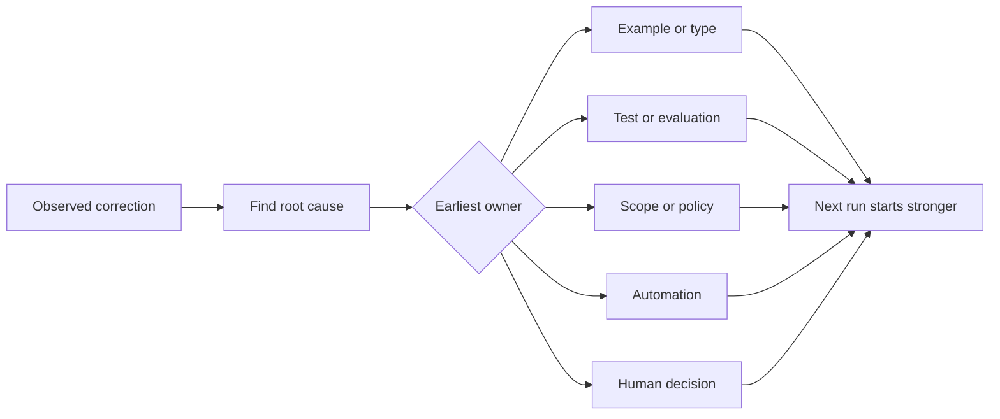

# Biến mọi chỉnh sửa của Agent thành cải tiến hệ thống

> Một chỉnh sửa chỉ tồn tại trong khung chat chỉ khắc phục được một lần chạy. Một chỉnh sửa được nâng cấp thành bài kiểm tra (test), ranh giới (boundary), ví dụ (example) hoặc công cụ (tool) sẽ cải thiện mọi lần chạy sau đó.

**Type:** Learn + Build
**Languages:** Python (stdlib)
**Prerequisites:** Phase 14 lessons 37 to 41
**Time:** ~65 minutes

## Mục tiêu học tập

- Chuyển đổi các chỉnh sửa của agent thành các kiểm soát bền vững.
- Đặt mỗi kiểm soát vào lớp sớm nhất có thể ngăn chặn sự tái diễn.
- Khử trùng lặp các bài học lặp lại bằng các dấu vân tay (fingerprint) ổn định.
- Loại bỏ các kiểm soát không còn bảo vệ trước rủi ro thực tế.

## Chỉnh sửa là bằng chứng

Khi bạn nói với agent “đừng chỉnh sửa tệp đó”, bạn đã học được rằng ranh giới phạm vi (scope boundary) chưa được thực thi. Khi bạn nói “hình dạng đầu ra này sai”, bạn đã học được rằng một ví dụ hoặc bài kiểm tra đã bị thiếu. Khi quá trình thiết lập (setup) thất bại lần nữa, bạn đã học được rằng kiến thức về môi trường thuộc về tự động hóa.

Hãy coi chỉnh sửa là một quan sát về hệ thống làm việc, không phải là lỗi viết prompt.

## Nâng cấp lên lớp hiệu quả sớm nhất

Sử dụng thứ tự này:

| Lỗi tái diễn | Đích đến bền vững |
|---|---|
| Kết quả sai hoặc hồi quy (regression) | Test hoặc evaluation |
| Hành động ngoài phạm vi hoặc không an toàn | Chính sách phạm vi hoặc quyền hạn |
| Lỗi thiết lập hoặc lệnh lặp lại | Tự động hóa hoặc công cụ |
| Lỗi định dạng đầu ra lặp lại | Ví dụ chuẩn (canonical example) cộng với validator |
| Quy ước cục bộ mơ hồ | Hướng dẫn kèm kiểm tra kịch bản |
| Bất đồng về sản phẩm | Bản ghi quyết định của con người |

Các kiểm soát sớm hơn sẽ rẻ hơn. Một kiểu dữ liệu (type) ngăn chặn trạng thái không hợp lệ sẽ mạnh hơn một bình luận đánh giá (review comment) bắt lỗi đó sau này. Một bài kiểm tra tập trung sẽ mạnh hơn một đoạn văn yêu cầu agent ghi nhớ.



## Bản ghi Ratchet

Ghi lại:

- triệu chứng;
- nguyên nhân gốc rễ;
- hậu quả;
- số lần tái diễn;
- kiểm soát đã chọn;
- xác minh cho kiểm soát đó;
- người sở hữu;
- ngày xem xét hoặc loại bỏ nó.

Đừng nâng cấp mọi sở thích nhất thời. Hãy nâng cấp một chỉnh sửa khi sự tái diễn hoặc hậu quả biện minh cho sự phức tạp vĩnh viễn.

## Tách biệt nguyên nhân khỏi triệu chứng

“Agent đã chỉnh sửa README” là một triệu chứng. Các nguyên nhân có thể bao gồm:

- tác vụ cho phép truy cập thư mục gốc của repository;
- tài liệu được coi là an toàn một cách mặc định;
- kế hoạch gộp chung việc triển khai và tài liệu;
- hai worker có quyền sở hữu chồng chéo.

Mỗi nguyên nhân thuộc về một kiểm soát khác nhau. Một quy tắc chỉ lặp lại triệu chứng sẽ thất bại trong trường hợp tiếp theo dù chỉ khác biệt đôi chút.

## Kiểm soát cũng bị suy thoái

Các kiểm soát cũ có thể gây xung đột, làm cồng kềnh ngữ cảnh và mã hóa một hệ thống không còn tồn tại. Mọi quy tắc được nâng cấp đều cần một bước kiểm tra loại bỏ. Hãy xóa hoặc viết lại nó khi:

- kiến trúc cơ bản đã thay đổi;
- một kiểm soát thực thi mạnh mẽ hơn đã thay thế nó;
- lỗi không tái diễn trong một khoảng thời gian đáng kể;
- kiểm soát tạo ra nhiều ma sát hơn là rủi ro mà nó ngăn chặn.

Mục tiêu không phải là tệp hướng dẫn dài nhất. Đó là hệ thống nhỏ nhất bảo tồn được những đánh giá khó khăn mới đạt được.

## Xây dựng

Phòng thí nghiệm phân loại các chỉnh sửa, nâng cấp chúng thành các kiểm soát, tạo dấu vân tay cho các bản sao và viết `outputs/feedback-ratchet.json`.

Chạy:

```bash
python3 code/main.py
python3 -m unittest discover code/tests -v
```

Thêm hai chỉnh sửa có cách diễn đạt khác nhau nhưng cùng một nguyên nhân. Cải thiện quá trình chuẩn hóa cho đến khi chúng hợp nhất thành một kiểm soát mà không làm sụp đổ các lỗi không liên quan.

## Bài tập

1. Lấy năm chỉnh sửa từ một phiên lập trình gần đây và phân loại người sở hữu thực sự của chúng.
2. Thay thế một quy tắc văn bản bằng một bài kiểm tra có thể thực thi.
3. Thêm trọng số hậu quả để một lần xuất hiện nghiêm trọng đầu tiên có thể được nâng cấp ngay lập tức.
4. Thêm người sở hữu và ngày loại bỏ vào đầu ra của phòng thí nghiệm.
5. Xem xét một hướng dẫn agent hiện có và chỉ xóa nó sau khi chứng minh được một kiểm soát mạnh mẽ hơn đã tồn tại.

## Đọc thêm

- [Basili, Caldiera, and Rombach, The Goal Question Metric Approach](https://www.cs.toronto.edu/~sme/CSC444F/handouts/GQM-paper.pdf), để chuyển đổi mục tiêu thành câu hỏi và các phép đo vận hành.
- [Shinn et al., Reflexion](https://arxiv.org/abs/2303.11366), để sử dụng các dấu vết phản hồi nhằm cải thiện các quyết định sau này mà không cần thay đổi trọng số mô hình.
- [Madaan et al., Self-Refine](https://arxiv.org/abs/2303.17651), để phản hồi và sửa đổi lặp đi lặp lại bên trong một vòng lặp tác vụ.

## Những gì bạn giữ lại

Hãy giữ `outputs/feedback-ratchet.json`. Đó là điểm kết thúc bền vững của lộ trình Kỹ thuật hỗ trợ bởi Agent (Agent-Assisted Engineering) và là đầu vào cho các thay đổi workbench trong tương lai.