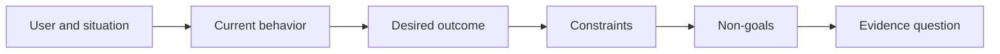

# Xác định Kết quả trước khi chọn Đầu ra

> Việc triển khai nhanh chóng sẽ làm tăng cái giá phải trả nếu chọn sai vấn đề. Hãy định hình kết quả trước để tốc độ hướng về đúng mục tiêu.

**Type:** Learn + Build
**Languages:** Python (stdlib)
**Prerequisites:** None
**Time:** ~60 minutes

## Mục tiêu học tập

- Viết một khung kết quả (outcome frame) mà không cần nêu tên giải pháp.
- Xác định người dùng, tình huống, hành vi hiện tại và thay đổi mong muốn.
- Làm rõ các ràng buộc và những mục tiêu không hướng tới (non-goals).
- Phát hiện sự rò rỉ giải pháp (solution leakage) trước khi nó trở thành phạm vi công việc cố định.

## Đầu ra không phải là Kết quả

“Xây dựng một trợ lý sự cố” là nêu tên một đầu ra. Nó không nói rõ ai cần nó, điều gì sẽ tốt hơn, hoặc điều gì phải được giữ an toàn.

Một khung kết quả sẽ nói:

> Khi có cảnh báo hệ thống (production alert), kỹ sư trực ca xác định được dịch vụ lỗi và hành động tiếp theo an toàn trong vòng hai phút, trong khi quá trình chẩn đoán vẫn ở chế độ chỉ đọc (read-only) và có thể kiểm tra (auditable).

Câu đó có thể được đáp ứng bằng phần mềm, runbook, sửa lỗi dữ liệu hoặc một thay đổi giao diện nhỏ hơn. Nó giúp đội ngũ gắn kết với kết quả thay vì sản phẩm đầu tiên mà ai đó tưởng tượng ra.

## Khung sáu phần

| Phần | Câu hỏi |
|---|---|
| Người dùng | Ai là người trực tiếp trải nghiệm vấn đề? |
| Tình huống | Nó xảy ra khi nào và ở đâu? |
| Hành vi hiện tại | Điều gì đang xảy ra hiện nay, bao gồm cả các giải pháp tạm thời? |
| Kết quả mong muốn | Trạng thái quan sát được nào cần cải thiện? |
| Ràng buộc | Những giới hạn nào về an toàn, chính sách, chi phí hoặc khả năng tương thích là cố định? |
| Mục tiêu không hướng tới | Công việc liên quan nào hấp dẫn nhưng bị loại trừ? |



## Tìm sự rò rỉ giải pháp

Các tuyên bố về kết quả sẽ bị rò rỉ giải pháp khi chúng chứa đựng hình thức sản phẩm, giao diện, lựa chọn model, framework hoặc kiến trúc chưa được chứng minh bằng bằng chứng.

- “Người dùng nhận được bản tóm tắt AI hàng tuần” làm rò rỉ hình thức tóm tắt và tần suất.
- “Người dùng hiểu các thay đổi tài khoản trước khi phê duyệt” nêu rõ kết quả.
- “Triển khai một vector database” làm rò rỉ hạ tầng.
- “Bằng chứng chính sách liên quan có sẵn trong quá trình đánh giá” nêu rõ một khả năng.

Các ràng buộc có thể nêu tên công nghệ khi khả năng tương thích thực sự yêu cầu điều đó. Hãy ghi lại lý do tại sao nó lại cố định.

## Các ràng buộc bảo vệ Kết quả

Các ràng buộc không phải là chi tiết triển khai. Chúng là một phần của mục tiêu thực tế:

- không ghi vào hệ thống production trong quá trình chẩn đoán;
- phản hồi trong ngân sách thời gian xử lý sự cố;
- các sự kiện kiểm toán hiện có vẫn giữ nguyên tính xác thực;
- không có phụ thuộc runtime mới;
- hành vi hỗ trợ tiếp cận (accessibility) vẫn được giữ nguyên.

Một bản build đạt được kết quả nhưng vi phạm ràng buộc thì chưa thực sự đạt được kết quả.

## Mục tiêu không hướng tới tạo ra ranh giới

Các mục tiêu không hướng tới (non-goals) ngăn cản một phần việc hữu ích biến thành một nền tảng cồng kềnh. Các non-goals tốt đủ cụ thể để từ chối công việc:

- không tự động khắc phục;
- không có hệ thống định tuyến cảnh báo mới;
- không thay thế người chỉ huy sự cố;
- không có phân tích lịch sử trong phần việc này.

## Xây dựng

Lab này xác thực một `OutcomeFrame` và viết `outputs/outcome-frame.json`.

```bash
python3 code/main.py
python3 -m unittest discover code/tests -v
```

Hãy thay thế kết quả mong muốn bằng “sử dụng trợ lý sự cố”. Trình xác thực sẽ gắn cờ rằng đầu ra được đề xuất đã rò rỉ vào kết quả.

## Bài tập

1. Viết lại một yêu cầu tính năng từ backlog của bạn thành một khung kết quả.
2. Thêm một ràng buộc làm thay đổi các giải pháp khả thi.
3. Thêm hai mục tiêu không hướng tới để giữ cho phần việc đầu tiên nhỏ gọn.
4. Xác định quan sát sớm nhất có thể bác bỏ kết quả mong muốn.
5. Viết ba đầu ra khác nhau có thể đáp ứng cùng một kết quả.

## Đọc thêm

- [Nuseibeh and Easterbrook, Requirements Engineering: A Roadmap](https://www.cs.toronto.edu/~sme/papers/2000/ICSE2000.pdf), để coi các mục tiêu thực tế là mỏ neo cho công việc phần mềm.
- [Dardenne, van Lamsweerde, and Fickas, Goal-Directed Requirements Acquisition](https://doi.org/10.1016/0167-6423(93)90021-G), để tinh chỉnh các mục tiêu cấp cao thành các ràng buộc và yêu cầu vận hành.

## Những gì bạn giữ lại

Hãy giữ `outputs/outcome-frame.json`. Bài học tiếp theo sẽ kiểm tra nó dựa trên quy trình làm việc mà mọi người thực sự thực hiện.