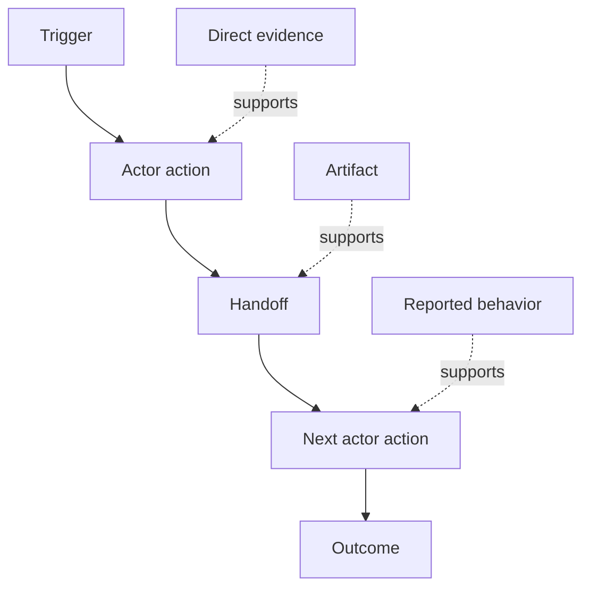

# Khám phá quy trình làm việc thực tế của người dùng

> Các yêu cầu không nằm chờ sẵn trong một cuộc họp để được thu thập. Chúng nằm rải rác trong các hành động, giải pháp tình thế, hồ sơ và những bất đồng.

**Type:** Learn + Build
**Languages:** Python (stdlib)
**Prerequisites:** Phase 14 lesson 47
**Time:** ~70 minutes

## Mục tiêu học tập

- Mô hình hóa quy trình làm việc hiện tại dưới dạng các hành động có thứ tự kèm theo bằng chứng.
- Phân biệt giữa quan sát trực tiếp với hành vi được báo cáo hoặc suy luận.
- Xác định các điểm ma sát (friction), bàn giao (handoffs), thẩm quyền (authority) và trạng thái ẩn (hidden state).
- Giữ cho các tuyên bố chưa chắc chắn luôn hiển thị thay vì biến chúng thành các yêu cầu cứng nhắc.

## Bắt đầu với hệ thống hiện tại

Đừng bắt đầu bằng việc hỏi người dùng muốn có những tính năng gì. Hãy bắt đầu bằng việc tái cấu trúc những gì đang thực sự diễn ra.

Với mỗi bước, hãy ghi lại:

| Trường thông tin | Ví dụ |
|---|---|
| Tác nhân (Actor) | Kỹ sư trực ca |
| Kích hoạt (Trigger) | Cảnh báo hệ thống (Production alert) xuất hiện |
| Hành động (Action) | Mở cảnh báo, sau đó tìm kiếm trên các dashboard |
| Đầu vào (Input) | Payload cảnh báo và bản ghi triển khai (deployment record) |
| Đầu ra (Output) | Dịch vụ ứng viên và người sở hữu |
| Ma sát (Friction) | Chuyển đổi ngữ cảnh giữa ba công cụ |
| Thẩm quyền (Authority) | Chỉ huy sự cố phê duyệt quyền ghi |
| Bằng chứng (Evidence) | Quay màn hình, nhật ký sự cố, runbook |

Quy trình làm việc lớn hơn những gì hiển thị trên màn hình. Nó bao gồm thời gian chờ đợi, thao tác copy-paste, các kênh liên lạc phụ, phê duyệt, phục hồi lỗi và các bước mà mọi người đã dần không còn để ý tới.

## Bằng chứng có cấp độ tin cậy

Hãy sử dụng thang đo bằng chứng đơn giản:

1. **Hành vi trực tiếp:** quan sát, dấu vết (trace), bản ghi hoặc sự kiện hệ thống.
2. **Hiện vật (Artifact):** ticket, runbook, nhật ký (log), biểu mẫu hoặc kết quả đầu ra đã hoàn thành.
3. **Hành vi được báo cáo:** một người mô tả những gì họ làm.
4. **Suy luận:** nhóm kết luận về những gì có khả năng xảy ra.

Cả bốn loại đều hữu ích. Chỉ có hai loại đầu tiên mới chứng minh trực tiếp hành vi hiện tại. Hãy dán nhãn các loại còn lại để mức độ tin cậy không bị thổi phồng một cách âm thầm.



## Tìm kiếm bốn yếu tố

- **Ma sát (Friction):** nỗ lực lặp lại, sự chậm trễ, nhập liệu lại hoặc phục hồi.
- **Trạng thái ẩn (Hidden state):** các dữ kiện được lưu giữ trong trí nhớ, tin nhắn chat hoặc ghi chú cá nhân.
- **Thẩm quyền (Authority):** cá nhân hoặc hệ thống được phép thực hiện thay đổi có tính hệ quả.
- **Ngoại lệ (Exceptions):** trường hợp mà quy trình làm việc bình thường không còn diễn ra như bình thường.

Các tính năng AI thường thất bại ở các điểm bàn giao và ngoại lệ vì chúng chỉ được thiết kế dựa trên "happy path" (luồng lý tưởng).

## Đừng làm trung bình hóa các bất đồng

Hai người dùng có thể thực hiện các quy trình làm việc khác nhau vì những lý do chính đáng. Hãy giữ lại các biến thể cho đến khi bạn hiểu liệu chúng có đại diện cho:

- các vai trò khác nhau;
- các mức độ rủi ro khác nhau;
- quy trình cũ và quy trình hiện tại;
- sự khác biệt về chuyên môn;
- một sự bất đồng thực sự về chính sách.

Một quy trình làm việc đã được làm trung bình hóa có thể không mô tả chính xác bất kỳ ai.

## Xây dựng hệ thống

Phòng lab lưu trữ bằng chứng trên từng bước của quy trình làm việc, xác thực thứ tự và độ tin cậy, tính toán tỷ lệ bằng chứng trực tiếp và viết `outputs/workflow-evidence.json`.

```bash
python3 code/main.py
python3 -m unittest discover code/tests -v
```

Thêm một luồng ngoại lệ trong trường hợp bản ghi triển khai bị thiếu. Giữ nguyên thứ tự chính và ghi lại nơi nhánh bắt đầu.

## Bài tập

1. Tái cấu trúc một quy trình làm việc từ nhật ký (log) mà không cần phỏng vấn bất kỳ ai.
2. Phỏng vấn một người dùng và đánh dấu mọi tuyên bố vẫn thiếu bằng chứng trực tiếp.
3. Thêm một ranh giới thẩm quyền và một bước phục hồi lỗi.
4. Mô hình hóa hai biến thể quy trình làm việc mà không gộp chúng lại.
5. Xác định một tính năng được đề xuất giúp loại bỏ một bước hiển thị nhưng vẫn để lại các công việc ẩn không được giải quyết.

## Đọc thêm

- [Nuseibeh and Easterbrook, Requirements Engineering: A Roadmap](https://www.cs.toronto.edu/~sme/papers/2000/ICSE2000.pdf), đặc biệt là cách tiếp cận việc khơi gợi yêu cầu như một quá trình diễn giải, mô hình hóa và xác thực thay vì chỉ thu thập đơn thuần.
- [Gotel and Finkelstein, An Analysis of the Requirements Traceability Problem](https://doi.org/10.1109/ICRE.1994.292398), về sự khó khăn trong việc duy trì mối quan hệ giữa các yêu cầu và nguồn gốc của chúng.

## Những gì bạn cần giữ lại

Hãy giữ lại `outputs/workflow-evidence.json`. Nó sẽ chuyển đổi các ma sát và sự không chắc chắn đã quan sát được thành một bản đồ giả định (assumption map) trong bài học tiếp theo.