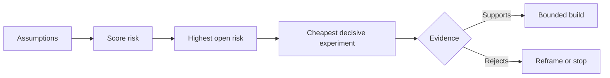

# Ánh xạ các giả định và giải quyết rủi ro lớn nhất trước tiên

> Một lộ trình (roadmap) thường che giấu sự không chắc chắn bên trong các tính năng. Một bản đồ giả định (assumption map) sẽ phơi bày những điều cần phải đúng trước khi các tính năng đó xứng đáng được tồn tại.

**Type:** Learn + Build
**Languages:** Python (stdlib)
**Prerequisites:** Phase 14 lesson 48
**Time:** ~65 minutes

## Mục tiêu học tập

- Chuyển đổi công việc đề xuất thành các giả định rõ ràng.
- Đánh giá riêng biệt tác động, mức độ không chắc chắn và tính không thể đảo ngược.
- Chọn thử nghiệm tiếp theo dựa trên rủi ro, không phải dựa trên sự nhiệt tình.
- Thay thế các giả định đã được kiểm chứng bằng bằng chứng và quyết định.

## Mọi bản dựng đều chứa đựng các khoản đặt cược

Một công cụ xử lý sự cố có thể phụ thuộc vào việc tất cả những điều sau đây là đúng:

- ngữ cảnh cảnh báo chứa đủ thông tin để xác định dịch vụ;
- các kỹ sư tin tưởng vào một đề xuất mà họ không tự mình rút ra;
- thời gian phản hồi mong muốn có ý nghĩa về mặt vận hành;
- dữ liệu cần thiết có thể được truy cập mà không cần quyền hạn không an toàn;
- quy trình làm việc diễn ra đủ thường xuyên để biện minh cho việc bảo trì.

Đây không phải là các tác vụ triển khai. Đây là các điều kiện để bản dựng có giá trị, khả dụng, khả thi và an toàn.

## Các loại giả định

| Loại | Câu hỏi |
|---|---|
| Giá trị | Kết quả có đủ quan trọng không? |
| Khả dụng | Người dùng có thể hiểu và hành động dựa trên nó không? |
| Khả thi | Hệ thống có thể tạo ra nó với dữ liệu và ràng buộc hiện có không? |
| Tính bền vững | Tổ chức có thể duy trì chi phí, quyền sở hữu và vận hành không? |
| An toàn | Nó có thể thất bại mà không gây ra hậu quả không thể chấp nhận được không? |

Hãy viết các giả định dưới dạng các tuyên bố có thể kiểm chứng sai. "Tính năng này hữu ích" là không thể kiểm tra được. "Tám trong số mười kỹ sư trực ca xác định dịch vụ chính xác nhanh hơn với kết quả chỉ đọc (read-only)" thì có thể.

## Rủi ro không phải là một con số duy nhất

Phòng thí nghiệm sử dụng ba chiều từ một đến năm:

- **Tác động:** thiệt hại nếu giả định là sai.
- **Không chắc chắn:** sự yếu kém của bằng chứng hiện tại.
- **Tính không thể đảo ngược:** chi phí học hỏi sau khi đã cam kết.

Điểm số ví dụ nhân tác động với mức độ không chắc chắn, sau đó cộng với tính không thể đảo ngược. Công thức này không phổ quát. Mục đích của nó là buộc nhóm phải nêu rõ lý do tại sao một ẩn số cần được giải quyết trước ẩn số khác.



## Thiết kế một thử nghiệm, không phải một nghi thức xác nhận

Một bài kiểm tra hữu ích cần có:

- một tuyên bố có thể sai;
- một quần thể hoặc mẫu thực tế;
- một kết quả có thể quan sát được;
- một ngưỡng được quyết định trước khi có kết quả;
- một quyết định tiếp theo cho các bằng chứng đạt, không đạt và mơ hồ.

Tránh các bài kiểm tra chỉ chứng minh rằng nhóm có thể xây dựng ý tưởng đó.

## Tính đảo ngược thay đổi thứ tự

Các lựa chọn có hậu quả lớn, không thể đảo ngược cần có bằng chứng sớm hơn. Một lần phát lại chỉ đọc (read-only replay) có thể đi trước một tích hợp sản xuất. Một bộ chuyển đổi tạm thời có thể đi trước một quá trình di chuyển dữ liệu. Một đề xuất được con người phê duyệt có thể đi trước một hành động tự động.

Hình dạng của bản dựng nên tuân theo hình dạng của sự không chắc chắn.

## Xây dựng nó

Phòng thí nghiệm xếp hạng các giả định, phân biệt các tuyên bố đã được kiểm chứng với các tuyên bố mở, chọn rủi ro mở cao nhất và viết `outputs/assumption-map.json`.

```bash
python3 code/main.py
python3 -m unittest discover code/tests -v
```

Thay đổi bằng chứng trên giả định có rủi ro cao nhất và quan sát cách thử nghiệm tiếp theo thay đổi.

## Bài tập

1. Viết năm giả định cho một tính năng bạn muốn xây dựng.
2. Thêm một giả định an toàn mà danh sách tính năng của bạn đã bỏ sót.
3. Xác định một ngưỡng khiến bạn phải dừng việc xây dựng.
4. Thay thế một thử nghiệm lớn bằng một bài kiểm tra quyết định rẻ hơn.
5. So sánh xếp hạng rủi ro với ưu tiên lộ trình và giải thích sự không khớp.

## Đọc thêm

- [Barry Boehm, A Spiral Model of Software Development and Enhancement](https://dl.acm.org/doi/10.1145/12944.12948), cho một chu kỳ phát triển dựa trên rủi ro giúp giải quyết sự không chắc chắn trước khi cam kết sâu hơn.
- [Dardenne, van Lamsweerde, and Fickas, Goal-Directed Requirements Acquisition](https://doi.org/10.1016/0167-6423(93)90021-G), để tinh chỉnh các mục tiêu trong khi làm nổi bật các trở ngại và ràng buộc.

## Những gì bạn giữ lại

Hãy giữ lại `outputs/assumption-map.json`. Bài học tiếp theo sử dụng nó để chọn ra lát cắt nhỏ nhất có thể tạo ra bằng chứng quyết định.