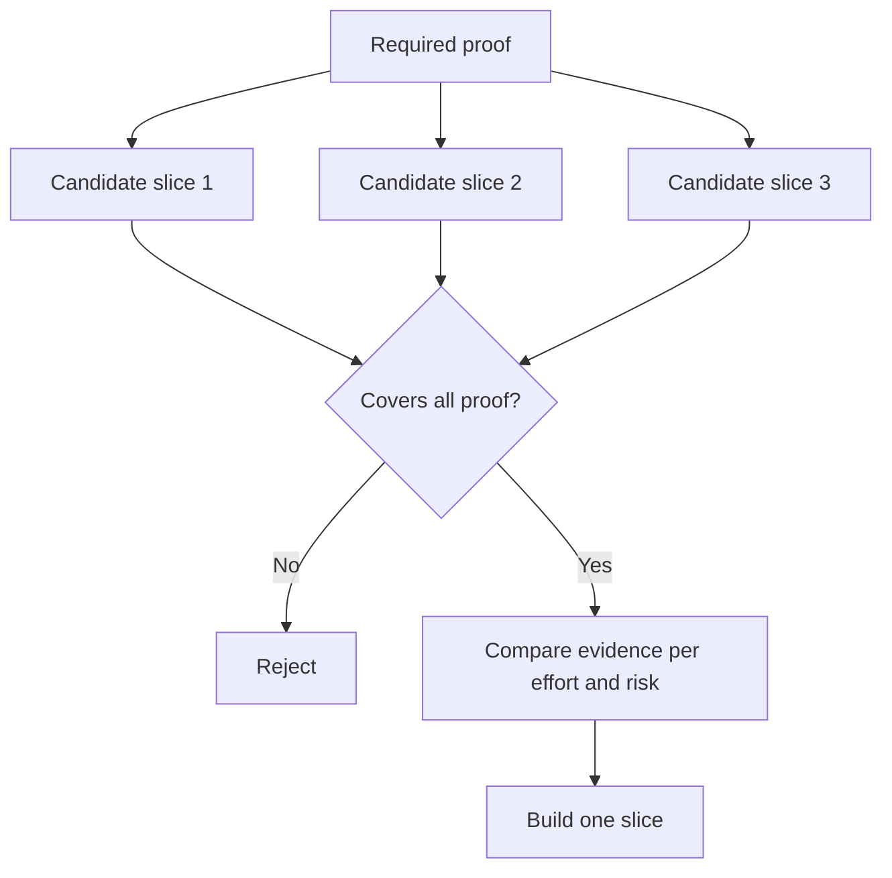

# Chọn lát cắt nhỏ nhất có thể thay đổi quyết định

> Sự nhỏ gọn chỉ hữu ích khi nó chứng minh được điều gì đó quan trọng. Một bản build tí hon mà không thể thay đổi quyết định tiếp theo thì chỉ đơn thuần là chưa hoàn thiện.

**Type:** Learn + Build
**Languages:** Python (stdlib)
**Prerequisites:** Phase 14 lesson 49
**Time:** ~65 minutes

## Mục tiêu học tập

- Xác định một lát cắt (slice) dựa trên các giả định mà nó chứng minh.
- Cân bằng giữa giá trị kết quả, mức độ giảm thiểu sự không chắc chắn, nỗ lực và hệ quả.
- Ưu tiên bằng chứng có thể đảo ngược hơn là cam kết đưa vào production quá sớm.
- Loại bỏ các lát cắt bỏ qua phần rủi ro nhất của quy trình làm việc.

## Vertical Means Evidence End to End

Một lát cắt hữu ích phải đi qua quy trình làm việc thực tế tối thiểu cần thiết để quan sát một kết quả. Nó có thể hẹp về người dùng, dữ liệu, thời gian và khả năng. Nó không nên bị thu hẹp bằng cách loại bỏ chính phần không chắc chắn mà bạn cần kiểm thử.

Ví dụ:

- Một bản replay chỉ đọc (read-only) trên mười sự cố thực tế sẽ kiểm thử khả năng nhận diện dịch vụ và sự tin tưởng của người vận hành.
- Một dashboard bóng bẩy trên dữ liệu tổng hợp (synthetic data) có thể kiểm thử khả năng hiểu, nhưng không kiểm thử được tính khả thi của dữ liệu.
- Một công cụ tự động khắc phục (auto-remediator) trên production kiểm thử mọi thứ cùng lúc với hệ quả không thể chấp nhận được.

## Xác định bằng chứng cần thiết trước tiên

Lấy các giả định mở có rủi ro cao nhất và biến chúng thành một tập hợp bằng chứng bắt buộc. Một lát cắt ứng viên chỉ đủ điều kiện nếu nó bao phủ được tập hợp đó.

Sau đó, so sánh các lát cắt đủ điều kiện dựa trên:

| Chiều đo | Hướng |
|---|---|
| Giá trị kết quả | Càng nhiều càng tốt |
| Sự không chắc chắn được giảm thiểu | Càng nhiều càng tốt |
| Nỗ lực | Càng ít càng tốt |
| Hệ quả | Càng ít càng tốt |
| Khả năng đảo ngược | Càng nhiều càng tốt |

Điểm số của lab này được thiết kế đơn giản một cách có chủ đích. Cổng kiểm tra tính đủ điều kiện quan trọng hơn các phép tính số học.



## Các mức tối thiểu sai lầm phổ biến

- **Mức tối thiểu chỉ có UI:** loại bỏ sự không chắc chắn về dữ liệu và vận hành.
- **Mức tối thiểu chỉ có hạ tầng:** chứng minh tính khả thi về kỹ thuật mà không có giá trị cho người dùng.
- **Mức tối thiểu "happy-path":** bỏ qua các ngoại lệ tạo ra phần lớn rủi ro.
- **Mức tối thiểu dạng demo:** tạo ra một sản phẩm thuyết phục nhưng không có phép đo lường có thể lặp lại.
- **Mức tối thiểu dạng nền tảng:** xây dựng các bộ máy có thể tái sử dụng trước khi có bất kỳ quy trình làm việc nào chứng minh được giá trị của nó.

## Thêm quy tắc dừng (Stop Rule)

Trước khi triển khai, hãy viết ra điều gì sẽ xảy ra nếu lát cắt thất bại:

- từ bỏ kết quả;
- thay đổi người dùng mục tiêu hoặc tình huống;
- kiểm thử một cơ chế khác;
- thu thập bằng chứng tốt hơn;
- thu hẹp phạm vi thẩm quyền hơn nữa.

Nếu mọi kết quả đều dẫn đến việc "tiếp tục xây dựng", thì lát cắt đó không phải là một thử nghiệm.

## Xây dựng

Lab này lọc các ứng viên dựa trên bằng chứng bắt buộc, chấm điểm các lát cắt đủ điều kiện và viết `outputs/slice-decision.json`.

```bash
python3 code/main.py
python3 -m unittest discover code/tests -v
```

Thêm một ứng viên rẻ hơn chỉ chứng minh một giả định bắt buộc. Nó vẫn nên bị coi là không đủ điều kiện ngay cả khi điểm số của nó cao.

## Bài tập

1. Thiết kế ba lát cắt cho cùng một kết quả ở các mức độ hệ quả khác nhau.
2. Nêu tập hợp bằng chứng bắt buộc trước khi chấm điểm chúng.
3. Loại bỏ một khả năng trong khi vẫn giữ lại bằng chứng mang tính quyết định.
4. Thêm một quy tắc dừng cho một dự án thí điểm thất bại.
5. Xác định một thành phần nền tảng có thể tái sử dụng mà nên chờ đợi cho đến sau khi lát cắt hoàn thành.

## Đọc thêm

- [Barry Boehm, A Spiral Model of Software Development and Enhancement](https://dl.acm.org/doi/10.1145/12944.12948), để khớp mỗi chu kỳ phát triển với các rủi ro mà nó cần giải quyết.
- [Lenarduzzi and Taibi, MVP Explained: A Systematic Mapping Study on the Definitions of Minimal Viable Product](https://arxiv.org/abs/1609.07592), về sự mơ hồ xung quanh khái niệm "tối thiểu" (minimum) và "khả thi" (viable) trong thực tiễn sản phẩm phần mềm.

## Những gì bạn giữ lại

Hãy giữ lại `outputs/slice-decision.json`. Nó ghi lại lý do tại sao lát cắt này là lát cắt nhỏ nhất có thể thay đổi quyết định.