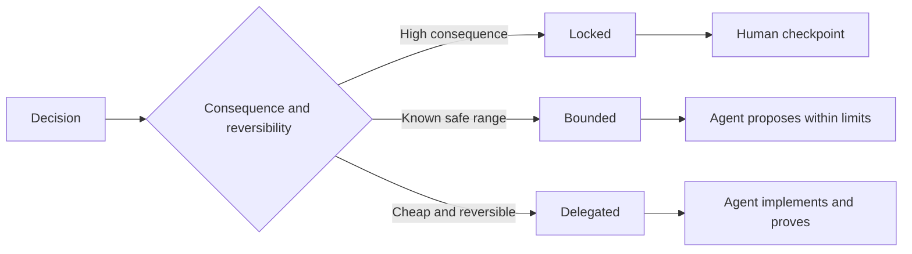

# Viết các đặc tả bảo toàn khả năng phán đoán

> Một đặc tả hữu ích sẽ cố định các bất biến (invariants) và bằng chứng, đồng thời để ngỏ các lựa chọn triển khai có thể đảo ngược. Đó là một ranh giới quyết định, không phải là một kịch bản chi tiết.

**Type:** Learn + Build
**Languages:** Python (stdlib)
**Prerequisites:** Phase 14 lesson 50
**Time:** ~75 minutes

## Mục tiêu học tập

- Phân tách kết quả, bất biến, ví dụ, các mục tiêu không hướng tới (non-goals) và bằng chứng.
- Đánh dấu các quyết định là bị khóa (locked), bị giới hạn (bounded) hoặc được ủy quyền (delegated).
- Bảo toàn khả năng phán đoán của agent ở những nơi các lựa chọn có chi phí thấp và có thể đảo ngược.
- Yêu cầu các điểm kiểm tra của con người ở những nơi có hậu quả hoặc thay đổi hành vi công khai.

## Hai thái cực tồi tệ

Một tác vụ thiếu đặc tả yêu cầu agent phải đoán hệ thống. Một tác vụ quá chi tiết yêu cầu nó phải sao chép lại một thiết kế có thể đã sai ngay từ đầu.

Điểm giữa hữu ích là một hợp đồng có thể thực thi:

| Bề mặt | Mục đích |
|---|---|
| Outcome | Kết quả có thể quan sát được |
| Invariants | Các điều kiện phải luôn đúng |
| Examples | Các trường hợp cụ thể làm rõ ý định |
| Non-goals | Hành vi lân cận bị loại trừ một cách có chủ đích |
| Decision policy | Các lựa chọn nào bị khóa, bị giới hạn hoặc được ủy quyền |
| Proof | Bằng chứng cần thiết trước khi hoàn thành |

## Ba chế độ quyết định

- **Locked:** agent không được phép chọn. Sử dụng cho khả năng tương thích công khai, thẩm quyền, an toàn, chi phí không thể đảo ngược hoặc cam kết sản phẩm.
- **Bounded:** agent có thể chọn trong các giới hạn rõ ràng. Sử dụng cho ngân sách tìm kiếm, số lần thử lại, các phụ thuộc được phép hoặc một họ giao diện đã biết.
- **Delegated:** agent sở hữu lựa chọn và phải giải trình về nó. Sử dụng cho cấu trúc cục bộ, tên gọi, các refactor có thể đảo ngược và chi tiết triển khai.



## Đặc tả hành vi thông qua ví dụ

Các ví dụ nén ý định tốt hơn các tính từ. "Hữu ích", "mạnh mẽ" và "sẵn sàng cho sản xuất" không phải là những thứ có thể thực thi. Một tập hợp nhỏ các ví dụ về trường hợp bình thường, trường hợp biên, trường hợp lỗi và trường hợp bị cấm cung cấp cho cả người xây dựng và người kiểm chứng những thứ cụ thể.

Ví dụ không thay thế cho các bất biến. Một trường hợp vượt qua kiểm thử không thể chứng minh một quy tắc an toàn phổ quát.

## Bằng chứng phải khớp với tuyên bố

- Một unit test chứng minh hợp đồng hàm cục bộ.
- Một wire test chứng minh hành vi tuần tự hóa và truyền tải.
- Một browser journey chứng minh đường dẫn giao diện.
- Một tập hợp replay chứng minh hành vi qua các trường hợp đại diện.
- Một audit log chứng minh rằng các ranh giới thẩm quyền được giữ vững.

Đừng chấp nhận một lớp thấp hơn làm bằng chứng cho một tuyên bố ở lớp cao hơn.

## Bảo toàn các ẩn số một cách có chủ đích

Một đặc tả có thể nói "việc triển khai có thể chọn bất kỳ nguồn chỉ đọc nào trả về kết quả trong ngân sách thời gian". Đó không phải là sự mơ hồ. Đó là một quyết định được ủy quyền có chủ đích với một ranh giới và bằng chứng.

Các đặc tả nên phát triển khi bằng chứng thay đổi. Hãy bảo toàn lý do đằng sau các lựa chọn bị khóa và bị giới hạn để các nhóm sau này có thể sửa đổi chúng mà không cần phải "khảo cổ" lại.

## Xây dựng

Phòng lab xác thực mọi bề mặt hợp đồng, kiểm tra các chế độ quyết định và viết `outputs/executable-specification.json`.

```bash
python3 code/main.py
python3 -m unittest discover code/tests -v
```

Di chuyển quyết định ghi vào production từ trạng thái bị khóa sang được ủy quyền. Giải thích lý do tại sao schema chấp nhận giá trị đó nhưng rủi ro sản phẩm thì không.

## Bài tập

1. Chuyển đổi một ticket backlog thành sáu bề mặt đặc tả.
2. Thay thế ba hướng dẫn triển khai bằng một bất biến và hai ví dụ.
3. Đánh dấu mọi quyết định và biện minh cho từng lựa chọn bị khóa hoặc bị giới hạn.
4. Thêm một biên nhận bằng chứng cho mỗi bất biến.
5. Loại bỏ một ràng buộc không có bằng chứng hoặc lý do rủi ro.

## Đọc thêm

- [Nuseibeh and Easterbrook, Requirements Engineering: A Roadmap](https://www.cs.toronto.edu/~sme/papers/2000/ICSE2000.pdf), về mối quan hệ giữa các mục tiêu, đặc tả chính xác, xác thực, thỏa thuận và sự phát triển.
- [Zave and Jackson, Four Dark Corners of Requirements Engineering](https://doi.org/10.1145/267895.267896), về việc tách biệt các giả định môi trường, yêu cầu và đặc tả.
- [Gotel and Finkelstein, An Analysis of the Requirements Traceability Problem](https://doi.org/10.1109/ICRE.1994.292398), về việc bảo toàn lý do tại sao một yêu cầu tồn tại và nó đến từ đâu.

## Những gì bạn giữ lại

Hãy giữ lại `outputs/executable-specification.json`. Nó trở thành hợp đồng mà các agent lập trình và người đánh giá là con người cùng chia sẻ.