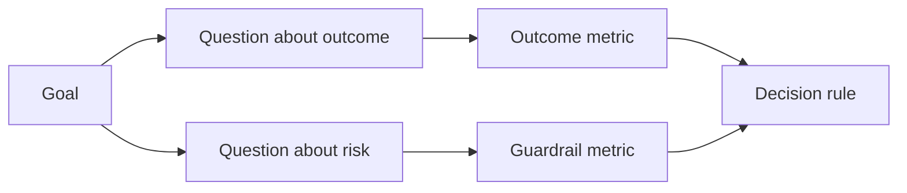

# Thiết kế các chỉ số thành công trước khi có kết quả

> Việc đo lường nên phục vụ cho một quyết định, chứ không phải để trang trí bảng điều khiển (dashboard). Hãy bắt đầu với mục tiêu, rút ra các câu hỏi, sau đó chọn những chỉ số tối giản nhất để trả lời chúng.

**Type:** Learn + Build
**Languages:** Python (stdlib)
**Prerequisites:** Phase 14 lessons 47 and 51
**Time:** ~70 minutes

## Mục tiêu học tập

- Rút ra các câu hỏi và chỉ số từ một mục tiêu kết quả.
- Xác định ngưỡng (threshold), cửa sổ (window), nguồn dữ liệu (source) và hướng (direction) trước khi quan sát kết quả.
- Kết hợp các chỉ số kết quả (outcome metrics) với các chỉ số bảo vệ (guardrails) và chỉ số đối trọng (counter-metrics).
- Đối chiếu bằng chứng đánh giá với quyết định mà bản build cần hỗ trợ.

## Mục tiêu, Câu hỏi, Chỉ số

Bắt đầu với một mục tiêu:

> Giảm thời gian xác định dịch vụ bị ảnh hưởng mà không làm tăng các hành động không an toàn.

Rút ra các câu hỏi:

- Dịch vụ chính xác được xác định nhanh như thế nào?
- Tần suất xác định đúng dịch vụ là bao nhiêu?
- Việc chẩn đoán có duy trì ở chế độ chỉ đọc (read-only) không?
- Quy trình làm việc có làm tăng việc bỏ qua cảnh báo hoặc khối lượng công việc của người vận hành không?

Sau đó, chọn các chỉ số để cụ thể hóa những câu hỏi đó.



## Một chỉ số cần có một hợp đồng

Mỗi chỉ số cần có:

| Trường | Ví dụ |
|---|---|
| Tên | `median_identification_seconds` |
| Hướng | tối đa |
| Ngưỡng | 120 |
| Cửa sổ | mười lần phát lại sự cố |
| Nguồn | nhật ký sự kiện phát lại |
| Đối tượng | kỹ sư trực ca trong giai đoạn thí điểm |
| Loại | kết quả hoặc bảo vệ |

Nếu không có nguồn và cửa sổ, một con số không thể được tái lập. Nếu không có ngưỡng, nó không thể thúc đẩy một quyết định.

## Chỉ số kết quả, Chỉ số bảo vệ và Chỉ số đối trọng

- **Chỉ số kết quả (Outcome metric):** trạng thái mong muốn có cải thiện không?
- **Chỉ số bảo vệ (Guardrail):** một ràng buộc cố định có còn đúng không?
- **Chỉ số đối trọng (Counter-metric):** sự cải thiện cục bộ có làm chuyển dịch chi phí hoặc gây hại ở nơi khác không?

Đối với quy trình xử lý sự cố, tốc độ là chưa đủ. Độ chính xác, các lệnh ghi vào production, khối lượng công việc của người vận hành và các cảnh báo bị bỏ lỡ là những yếu tố bảo vệ chống lại một kết quả nhanh nhưng không an toàn.

## Bằng chứng Offline và Online

Phát lại offline (offline replay) hữu ích cho tính lặp lại và độ bao phủ các trường hợp biên. Một giai đoạn thí điểm có giới hạn hữu ích cho hành vi thực tế, sự tin tưởng và tác động đến quy trình làm việc. Không cái nào thay thế được cái kia.

Hãy sử dụng bằng chứng rẻ nhất có thể trả lời cho quyết định hiện tại. Đừng để người dùng thực tiếp xúc chỉ vì bản triển khai đã sẵn sàng.

## Quyết định trước khi đo lường

Hãy viết ra các kịch bản đạt (pass), trượt (fail) và mơ hồ (ambiguous) trước khi nhìn thấy kết quả. Nếu không, nhóm sẽ thay đổi ngưỡng để bảo vệ bản build.

Ví dụ:

- đạt: tỷ lệ dịch vụ chính xác ít nhất 0.9 và thời gian trung vị tối đa 120 giây;
- trượt: bất kỳ lệnh ghi nào vào production hoặc tỷ lệ chính xác dưới 0.75;
- mơ hồ: cải thiện nhỏ với phương sai lớn, đòi hỏi tập hợp phát lại lớn hơn.

## Xây dựng

Phòng lab này xác thực một kế hoạch đo lường, đánh giá các ngưỡng bao hàm, ghi lại các giá trị thiếu và viết `outputs/measurement-report.json`.

```bash
python3 code/main.py
python3 -m unittest discover code/tests -v
```

Hãy loại bỏ chỉ số bảo vệ và quan sát lý do tại sao kế hoạch trở nên không hợp lệ ngay cả khi các chỉ số kết quả vẫn giữ nguyên.

## Bài tập

1. Rút ra ba câu hỏi từ một mục tiêu kết quả.
2. Thêm một chỉ số đối trọng để phát hiện chi phí bị chuyển dịch sang một vai trò khác.
3. Xác định nguồn, đối tượng và cửa sổ cho mỗi chỉ số.
4. Viết các quyết định đạt, trượt và mơ hồ trước khi tạo ra các giá trị.
5. Xác định một chỉ số dễ thu thập nhưng không thể thay đổi quyết định. Hãy loại bỏ nó.

## Đọc thêm

- [Basili, Software Modeling and Measurement: The Goal/Question/Metric Paradigm](https://drum.lib.umd.edu/items/8119803a-362b-42ec-b6ce-2311713e7236), để rút ra các phép đo vận hành từ các mục tiêu rõ ràng.
- [Basili, Caldiera, and Rombach, The Goal Question Metric Approach](https://www.cs.toronto.edu/~sme/CSC444F/handouts/GQM-paper.pdf), để áp dụng phương pháp này như một hệ thống phản hồi và cải tiến.

## Những gì bạn giữ lại

Hãy giữ lại `outputs/measurement-report.json`. Nó xác định cổng bằng chứng cho giai đoạn nguyên mẫu, thí điểm hoặc sản xuất.