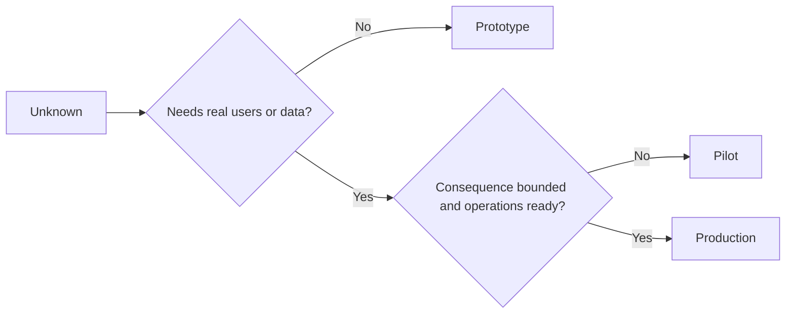

# Chọn Prototype, Pilot hoặc Production một cách có chủ đích

> Đây là các môi trường học tập khác nhau, không phải là các cấp độ hoàn thiện. Hãy chọn giai đoạn giải quyết vấn đề chưa biết hiện tại với ít hậu quả không cần thiết nhất.

**Type:** Learn + Build
**Languages:** Python (stdlib)
**Prerequisites:** Phase 14 lessons 50 to 52
**Time:** ~70 minutes

## Mục tiêu học tập

- Chọn giai đoạn xây dựng dựa trên các yếu tố: điều chưa biết, đối tượng người dùng, dữ liệu, hậu quả và mức độ sẵn sàng.
- Xác định các kiểm soát và tiêu chí thoát (exit criteria) cụ thể cho từng giai đoạn.
- Ngăn chặn việc các prototype âm thầm trở thành hệ thống production.
- Trì hoãn quyền hạn thực sự cho đến khi bằng chứng và hoạt động vận hành chứng minh được sự hợp lý.

## Ba câu hỏi khác biệt

| Giai đoạn | Câu hỏi chính |
|---|---|
| Prototype | Cơ chế này có thể tạo ra bằng chứng hay không? |
| Pilot | Nó có hoạt động an toàn với đối tượng người dùng thực và điều kiện thực tế bị giới hạn không? |
| Production | Chúng ta có thể sở hữu nó liên tục với mức độ tin cậy và rủi ro đã cam kết không? |

Một prototype có thể hoàn thiện về mặt kỹ thuật nhưng vẫn là thứ có thể loại bỏ. Một pilot có thể sử dụng dữ liệu production trong khi vẫn giới hạn về đối tượng người dùng và quyền hạn. Production bắt đầu khi tổ chức chấp nhận trách nhiệm vận hành liên tục.

## Prototype

Sử dụng prototype khi điều chưa biết không yêu cầu người dùng thực hoặc dữ liệu thực. Hãy giữ cho nó:

- có thể loại bỏ;
- cô lập;
- hành vi hẹp;
- rõ ràng về câu hỏi cần học hỏi;
- không có các đảm bảo vận hành sai lệch.

Đừng tối ưu hóa kiến trúc trước khi cơ chế đó đạt được giai đoạn tiếp theo.

## Pilot

Sử dụng pilot khi điều chưa biết yêu cầu hành vi thực, dữ liệu thực tế hoặc quy trình làm việc thực, nhưng hậu quả hoặc mức độ sẵn sàng chưa tương thích với việc phát hành rộng rãi.

Một pilot cần:

- đối tượng người dùng được chỉ định;
- người chịu trách nhiệm chính (human owner);
- thời hạn và quyền hạn giới hạn;
- kiểm toán và khả năng rollback;
- ngưỡng kết quả và các rào cản bảo vệ (guardrail);
- tiêu chí thoát để mở rộng, sửa đổi hoặc dừng lại.

## Production

Production cần nhiều hơn là việc triển khai:

- mục tiêu mức độ dịch vụ (service level objective);
- trách nhiệm trực ca và xử lý sự cố;
- đánh giá bảo mật và quyền riêng tư;
- kiểm soát chi phí và năng lực;
- rollback và phục hồi;
- giám sát liên tục;
- lộ trình ngừng hoạt động (retirement path).



## Trôi dạt giai đoạn (Stage Drift)

Mã nguồn prototype trở nên nguy hiểm khi nó thu hút người dùng, dữ liệu hoặc quyền hạn mà không đi kèm với trách nhiệm sở hữu. Hãy đánh dấu ranh giới giữa prototype và pilot trong cấu hình, kiểm soát truy cập, telemetry và tài liệu. Một biểu ngữ cảnh báo là không đủ.

Giai đoạn phải có thể quan sát được từ chính hệ thống.

## Xây dựng

Lab này chọn một giai đoạn từ bối cảnh quyết định, trả về các kiểm soát bắt buộc và viết `outputs/stage-decisions.json`.

```bash
python3 code/main.py
python3 -m unittest discover code/tests -v
```

Thay đổi ví dụ về pilot thành loại có hậu quả thấp với mức độ sẵn sàng vận hành. Giải thích bằng chứng bổ sung nào sẽ biện minh cho việc chuyển sang production.

## Bài tập

1. Phân loại ba dự án hiện tại theo giai đoạn học tập, không phải theo trạng thái triển khai.
2. Viết tiêu chí thoát cho pilot bao gồm cả quyết định dừng lại.
3. Thêm một kiểm soát kỹ thuật ngăn prototype tiếp cận dữ liệu production.
4. Xác định trách nhiệm vận hành đầu tiên khiến bản build trở thành production.
5. Thiết kế biên lai rollback cho pilot có giới hạn.

## Đọc thêm

- [Barry Boehm, A Spiral Model of Software Development and Enhancement](https://dl.acm.org/doi/10.1145/12944.12948), để khớp cam kết của mỗi lần lặp với rủi ro đã được giải quyết.
- [Fagerholm et al., Building Blocks for Continuous Experimentation](https://doi.org/10.1145/2601248.2601276), về các điều kiện tổ chức và kỹ thuật cần thiết để chạy thử nghiệm liên tục.

## Những gì bạn giữ lại

Hãy giữ `outputs/stage-decisions.json`. Nó ghi lại lý do tại sao mỗi giai đoạn được biện minh và những kiểm soát nào phải tồn tại trước khi chuyển sang giai đoạn tiếp theo.