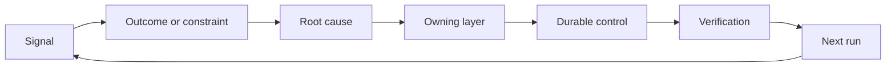

# Xây dựng cơ chế Feedback Ratchet với Quyền sở hữu và Hết hạn

> Việc phát hành (shipping) khép lại một vòng lặp xây dựng và mở ra vòng lặp học tập. Bằng chứng phải thay đổi được hệ thống, nếu không nó chỉ trở thành dữ liệu đo lường (telemetry) mà không ai chịu trách nhiệm.

**Type:** Learn + Build
**Languages:** Python (stdlib)
**Prerequisites:** Phase 14 lessons 46 and 53
**Time:** ~75 minutes

## Mục tiêu học tập

- Chuyển đổi các sự cố, đánh giá, hành vi người dùng và các chỉnh sửa thành những hành động có chủ sở hữu.
- Định tuyến từng tín hiệu đến ngữ cảnh, đánh giá, chính sách, runtime hoặc backlog.
- Ưu tiên xử lý sự tái diễn dựa trên mức độ nghiêm trọng và tần suất.
- Thiết lập điều kiện hết hạn (retirement condition) cho mọi cơ chế kiểm soát.

## Feedback là hạ tầng

Một đội ngũ có thể thu thập các trace, đánh giá, ticket hỗ trợ và nhật ký sự cố mà không học hỏi được gì từ chúng. Cơ chế còn thiếu ở đây là sự thúc đẩy (promotion): một lộ trình xác định từ quan sát đến thay đổi bền vững với người chịu trách nhiệm và bằng chứng cụ thể.

Vòng lặp bao gồm:

1. quan sát một tín hiệu cụ thể;
2. kết nối nó với một kết quả, ràng buộc hoặc giả định;
3. xác định lớp hệ thống sớm nhất chịu trách nhiệm cho nguyên nhân đó;
4. tạo ra một thay đổi có giới hạn;
5. xác minh rằng khả năng tái diễn trở nên thấp hơn;
6. xem xét liệu cơ chế kiểm soát đó có nên được duy trì hay không.

## Định tuyến đến lớp chịu trách nhiệm

| Tín hiệu | Đích đến |
|---|---|
| False positive, regression, kết quả sai | Đánh giá hoặc kiểm thử (Evaluation or test) |
| Thiếu ngữ cảnh, công việc trùng lặp, dữ liệu cũ | Nguồn ngữ cảnh hoặc lộ trình truy xuất |
| Hành động không an toàn hoặc thiếu quyền hạn | Chính sách hoặc ranh giới phân quyền |
| Timeout, retry storm, dependency không khả dụng | Kiểm soát Runtime |
| Nhu cầu sản phẩm mới hoặc đánh đổi chưa giải quyết | Mục backlog đã được định hình |

Hãy sửa lỗi tại lớp hiệu quả sớm nhất. Đừng thêm một đoạn prompt khác khi một bài kiểm thử hoặc phân quyền có thể khiến lỗi đó không thể xảy ra.



## Quyền sở hữu là một phần của cơ chế kiểm soát

Mỗi hành động ratchet cần có:

- một chủ sở hữu;
- mức độ ưu tiên dựa trên hậu quả và tần suất tái diễn;
- artifact cần thay đổi;
- xác minh chứng minh cho thay đổi đó;
- cửa sổ xem xét hoặc thời hạn hết hiệu lực;
- điều kiện hết hạn.

Một cải tiến không có chủ sở hữu chỉ là một quan sát được định dạng đẹp hơn mà thôi.

## Loại bỏ các cơ chế kiểm soát lỗi thời

Các hệ thống feedback tích lũy chính sách theo thời gian. Chính sách đó có thể trở nên mâu thuẫn và tốn kém. Hãy xem xét lại các cơ chế kiểm soát khi:

- kiến trúc hoặc quy trình làm việc thay đổi;
- một bất biến (invariant) ở cấp thấp hơn thay thế cho một chỉ dẫn ở cấp cao hơn;
- lỗi được bảo vệ không còn xuất hiện trong khoảng thời gian đã chọn;
- cơ chế kiểm soát gây cản trở công việc hợp lệ nhiều hơn là ngăn chặn tác hại.

Việc loại bỏ cũng cần có bằng chứng. Đừng xóa một cơ chế kiểm soát chỉ vì cảm thấy nó đã cũ.

## Kết nối Feedback giữa Build và Coding-Agent

Cùng một cơ chế ratchet phục vụ cho cả hai lộ trình:

- Bằng chứng sản phẩm thay đổi khung kết quả, giả định, slice hoặc kế hoạch đo lường.
- Các chỉnh sửa của coding-agent thay đổi các bài kiểm thử, ngữ cảnh, phạm vi, tự động hóa hoặc quy trình bàn giao.
- Các sự cố có thể thay đổi cả ranh giới sản phẩm và môi trường làm việc của agent.

Đây là lý do tại sao việc định hình quá trình xây dựng không phải là một giai đoạn kết thúc trước khi lập trình. Nó tiếp diễn qua mọi thay đổi được chấp nhận.

## Thực hiện xây dựng

Phòng lab này phân loại các tín hiệu, tạo ra các hành động ratchet có chủ sở hữu, ưu tiên chúng và viết `outputs/feedback-backlog.json`.

```bash
python3 code/main.py
python3 -m unittest discover code/tests -v
```

Thêm một tín hiệu runtime timeout và xác nhận rằng nó được định tuyến đến runtime thay vì backlog chung.

## Bài tập

1. Chuyển đổi một sự cố và một khiếu nại của người dùng thành các hành động ratchet.
2. Gọi tên lớp sớm nhất có thể ngăn chặn mỗi lần tái diễn.
3. Thêm các lệnh xác minh hoặc quan sát vào đầu ra của lab.
4. Xác định điều kiện hết hạn cho một quy tắc chính sách.
5. Truy vết một chỉnh sửa đã được chấp nhận vào khung tác vụ tiếp theo.

## Đọc thêm

- [Basili, Caldiera, and Rombach, The Goal Question Metric Approach](https://www.cs.toronto.edu/~sme/CSC444F/handouts/GQM-paper.pdf), về học tập tổ chức thông qua đo lường định hướng mục tiêu.
- [Fagerholm et al., Building Blocks for Continuous Experimentation](https://doi.org/10.1145/2601248.2601276), về vòng lặp kỹ thuật và tổ chức kết nối bằng chứng với sự phát triển sản phẩm liên tục.
- [Nuseibeh and Easterbrook, Requirements Engineering: A Roadmap](https://www.cs.toronto.edu/~sme/papers/2000/ICSE2000.pdf), về việc coi các yêu cầu là những thứ tiến hóa trong suốt vòng đời hệ thống.

## Những gì bạn giữ lại

Hãy giữ lại `outputs/feedback-backlog.json`. Đây là artifact kết thúc của lộ trình Product Judgment and Delivery và là đầu vào cho khung kết quả tiếp theo.