# Giao thức truyền thông (Communication Protocols)

> Các tác nhân (agent) không thể nói cùng một ngôn ngữ thì không phải là một đội. Chúng chỉ là những kẻ xa lạ đang gào thét vào hư không.

**Type:** Build
**Languages:** TypeScript
**Prerequisites:** Phase 14 (Agent Engineering), Lesson 16.01 (Why Multi-Agent)
**Time:** ~120 phút

## Mục tiêu học tập

- Triển khai khám phá và gọi công cụ (tool discovery and invocation) theo chuẩn MCP để các tác nhân có thể sử dụng công cụ từ các server bên ngoài.
- Xây dựng Agent Card và endpoint tác vụ (task endpoint) theo chuẩn A2A cho phép một tác nhân ủy quyền công việc cho tác nhân khác qua HTTP.
- So sánh MCP (truy cập công cụ), A2A (tác nhân với tác nhân), ACP (kiểm toán doanh nghiệp) và ANP (tin cậy phi tập trung) và giải thích giao thức nào giải quyết vấn đề gì.
- Kết nối nhiều giao thức trong một hệ thống duy nhất, nơi các tác nhân khám phá công cụ qua MCP và ủy quyền tác vụ qua A2A.

## Vấn đề

Bạn chia hệ thống của mình thành nhiều tác nhân: một tác nhân nghiên cứu, một tác nhân lập trình, một tác nhân đánh giá. Chúng làm tốt công việc riêng lẻ của mình. Nhưng bây giờ bạn cần chúng thực sự giao tiếp với nhau.

Nỗ lực đầu tiên của bạn rất hiển nhiên: truyền các chuỗi ký tự (strings). Tác nhân nghiên cứu trả về một khối văn bản, tác nhân lập trình phân tích nó theo cách có thể. Nó hoạt động cho đến khi tác nhân lập trình hiểu sai bản tóm tắt nghiên cứu, hoặc hai tác nhân rơi vào trạng thái bế tắc (deadlock) khi chờ đợi lẫn nhau, hoặc bạn cần các tác nhân do các đội ngũ khác nhau xây dựng phải cộng tác. Đột nhiên, việc "chỉ truyền chuỗi" trở nên thất bại.

Đây là vấn đề về giao thức truyền thông. Nếu không có một hợp đồng chung về cách các tác nhân trao đổi thông tin, các hệ thống đa tác nhân sẽ trở nên mong manh, không thể kiểm toán và không thể mở rộng ngoài một vài tác nhân mà chính bạn viết ra.

Hệ sinh thái AI đã phản hồi bằng bốn giao thức, mỗi giao thức giải quyết một phần khác nhau của vấn đề:

- **MCP** cho việc truy cập công cụ
- **A2A** cho sự cộng tác giữa các tác nhân
- **ACP** cho khả năng kiểm toán doanh nghiệp
- **ANP** cho định danh và tin cậy phi tập trung

Bài học này sẽ đi sâu vào chi tiết. Bạn sẽ đọc các định dạng truyền tin thực tế từ mỗi đặc tả, xây dựng các triển khai hoạt động và kết nối cả bốn vào một hệ thống thống nhất.

## Khái niệm

### Bối cảnh giao thức

Hãy coi bốn giao thức này như các lớp, mỗi lớp giải quyết một câu hỏi khác nhau:

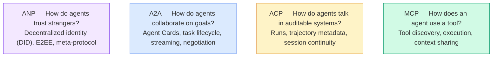

Chúng không phải là đối thủ cạnh tranh. Chúng giải quyết các vấn đề khác nhau ở các cấp độ khác nhau.

### MCP (Nhắc lại)

MCP đã được đề cập chuyên sâu trong Phase 13. Tóm tắt nhanh: MCP chuẩn hóa cách một LLM kết nối với các công cụ và nguồn dữ liệu bên ngoài. Đây là giao thức **client-server**, nơi tác nhân (client) khám phá và gọi các công cụ được cung cấp bởi một server.

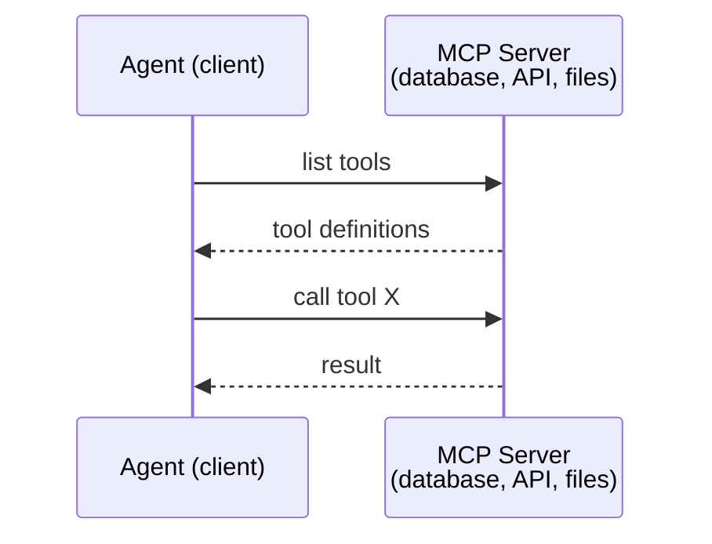

MCP là giao tiếp **tác nhân-với-công cụ**. Nó không giúp các tác nhân nói chuyện với nhau.

### A2A (Agent2Agent Protocol)

**Được tạo bởi:** Google (hiện thuộc Linux Foundation dưới tên `lf.a2a.v1`)
**Phiên bản đặc tả:** 1.0.0
**Vấn đề:** Làm thế nào để các tác nhân tự chủ cộng tác, đàm phán và ủy quyền tác vụ cho nhau?

A2A là giao thức cho **sự cộng tác ngang hàng giữa các tác nhân**. Trong khi MCP kết nối tác nhân với công cụ, A2A kết nối tác nhân với các tác nhân khác. Mỗi tác nhân xuất bản một **Agent Card** tại một URL cố định, và các tác nhân khác sẽ khám phá, đàm phán và ủy quyền tác vụ cho nó.

#### A2A hoạt động như thế nào

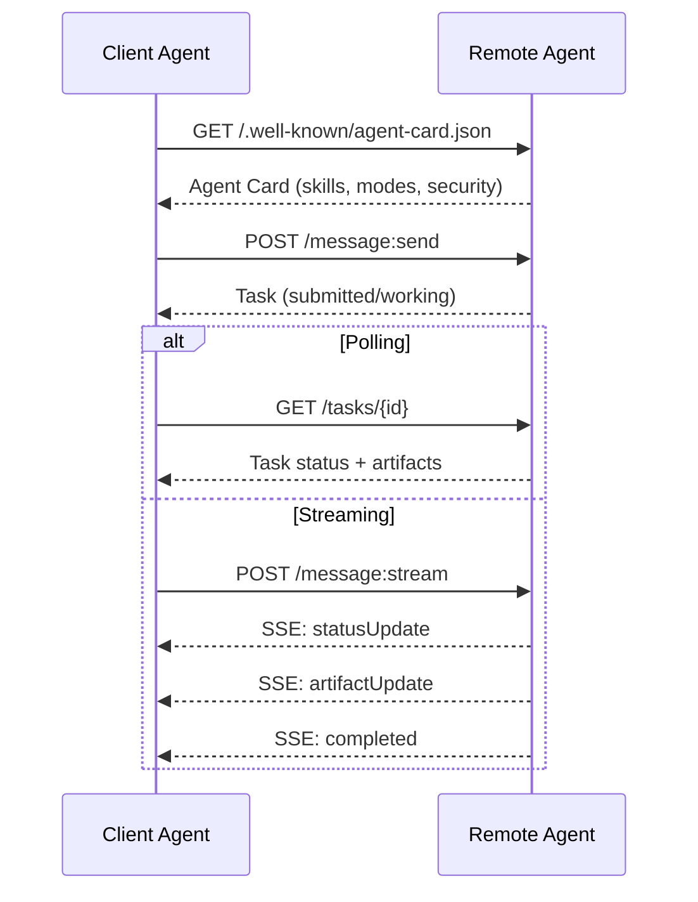

#### Agent Card thực tế

Đây là hình dáng thực tế của một A2A Agent Card. Được phục vụ tại `GET /.well-known/agent-card.json`:

```json
{
  "name": "Research Agent",
  "description": "Searches documentation and summarizes findings",
  "version": "1.0.0",
  "supportedInterfaces": [
    {
      "url": "https://research-agent.example.com/a2a/v1",
      "protocolBinding": "JSONRPC",
      "protocolVersion": "1.0"
    },
    {
      "url": "https://research-agent.example.com/a2a/rest",
      "protocolBinding": "HTTP+JSON",
      "protocolVersion": "1.0"
    }
  ],
  "provider": {
    "organization": "Your Company",
    "url": "https://example.com"
  },
  "capabilities": {
    "streaming": true,
    "pushNotifications": false
  },
  "defaultInputModes": ["text/plain", "application/json"],
  "defaultOutputModes": ["text/plain", "application/json"],
  "skills": [
    {
      "id": "web-research",
      "name": "Web Research",
      "description": "Searches the web and synthesizes findings",
      "tags": ["research", "search", "summarization"],
      "examples": ["Research the latest changes in React 19"]
    },
    {
      "id": "doc-analysis",
      "name": "Documentation Analysis",
      "description": "Reads and analyzes technical documentation",
      "tags": ["docs", "analysis"],
      "inputModes": ["text/plain", "application/pdf"],
      "outputModes": ["application/json"]
    }
  ],
  "securitySchemes": {
    "bearer": {
      "httpAuthSecurityScheme": {
        "scheme": "Bearer",
        "bearerFormat": "JWT"
      }
    }
  },
  "security": [{ "bearer": [] }]
}
```

Những điểm chính cần lưu ý:
- **Skills** là những gì tác nhân có thể làm. Mỗi kỹ năng có một ID, các thẻ (tags) và các kiểu MIME đầu vào/đầu ra được hỗ trợ. Đây là cách tác nhân client quyết định liệu tác nhân từ xa này có thể xử lý yêu cầu của nó hay không.
- **supportedInterfaces** liệt kê nhiều ràng buộc giao thức. Một tác nhân duy nhất có thể nói JSON-RPC, REST và gRPC cùng lúc.
- **Security** được tích hợp vào thẻ. Client biết cần xác thực gì trước khi thực hiện bất kỳ yêu cầu nào.

#### Vòng đời tác vụ (Task Lifecycle)

Tác vụ là đơn vị công việc cốt lõi trong A2A. Chúng di chuyển qua các trạng thái xác định:

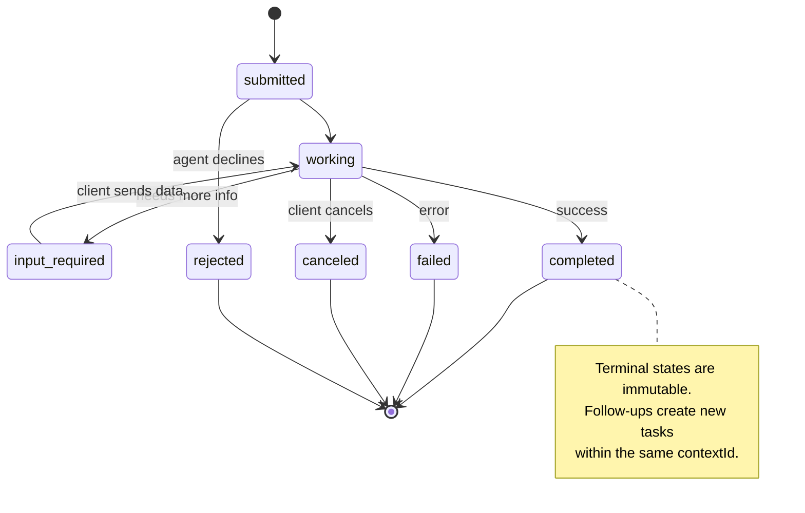

Tất cả 8 trạng thái (đặc tả cũng định nghĩa `UNSPECIFIED` như một sentinel, ở đây được lược bỏ):

| Trạng thái | Kết thúc? | Ý nghĩa |
|---|---|---|
| `TASK_STATE_SUBMITTED` | Không | Đã xác nhận, chưa xử lý |
| `TASK_STATE_WORKING` | Không | Đang được xử lý tích cực |
| `TASK_STATE_INPUT_REQUIRED` | Không | Tác nhân cần thêm thông tin từ client |
| `TASK_STATE_AUTH_REQUIRED` | Không | Cần xác thực |
| `TASK_STATE_COMPLETED` | Có | Hoàn thành thành công |
| `TASK_STATE_FAILED` | Có | Hoàn thành với lỗi |
| `TASK_STATE_CANCELED` | Có | Đã hủy trước khi hoàn thành |
| `TASK_STATE_REJECTED` | Có | Tác nhân từ chối tác vụ |

Khi một tác vụ đạt đến trạng thái kết thúc, nó trở nên bất biến. Không có thông điệp nào thêm. Các bước tiếp theo sẽ tạo ra một tác vụ mới trong cùng một `contextId`.

#### Định dạng truyền tin (Wire Format)

A2A sử dụng JSON-RPC 2.0. Đây là cách một trao đổi thông điệp thực tế trông như thế nào:

**Client gửi một tác vụ:**
```json
{
  "jsonrpc": "2.0",
  "id": 1,
  "method": "SendMessage",
  "params": {
    "message": {
      "messageId": "msg-001",
      "role": "ROLE_USER",
      "parts": [{ "text": "Research React 19 compiler features" }]
    },
    "configuration": {
      "acceptedOutputModes": ["text/plain", "application/json"],
      "historyLength": 10
    }
  }
}
```

**Tác nhân phản hồi với một tác vụ:**
```json
{
  "jsonrpc": "2.0",
  "id": 1,
  "result": {
    "task": {
      "id": "task-abc-123",
      "contextId": "ctx-xyz-789",
      "status": {
        "state": "TASK_STATE_COMPLETED",
        "timestamp": "2026-03-27T10:30:00Z"
      },
      "artifacts": [
        {
          "artifactId": "art-001",
          "name": "research-results",
          "parts": [{
            "data": {
              "findings": [
                "React 19 compiler auto-memoizes components",
                "No more manual useMemo/useCallback needed",
                "Compiler runs at build time, not runtime"
              ]
            },
            "mediaType": "application/json"
          }]
        }
      ]
    }
  }
}
```

**Streaming qua SSE:**
```text
POST /message:stream HTTP/1.1
Content-Type: application/json
A2A-Version: 1.0

data: {"task":{"id":"task-123","status":{"state":"TASK_STATE_WORKING"}}}

data: {"statusUpdate":{"taskId":"task-123","status":{"state":"TASK_STATE_WORKING","message":{"role":"ROLE_AGENT","parts":[{"text":"Searching documentation..."}]}}}}

data: {"artifactUpdate":{"taskId":"task-123","artifact":{"artifactId":"art-1","parts":[{"text":"partial findings..."}]},"append":true,"lastChunk":false}}

data: {"statusUpdate":{"taskId":"task-123","status":{"state":"TASK_STATE_COMPLETED"}}}
```

### ACP (Agent Communication Protocol)

**Được tạo bởi:** IBM / BeeAI
**Phiên bản đặc tả:** 0.2.0 (OpenAPI 3.1.1)
**Trạng thái:** Đang sáp nhập vào A2A dưới Linux Foundation
**Vấn đề:** Làm thế nào để các tác nhân giao tiếp với khả năng kiểm toán đầy đủ, tính liên tục của phiên và theo dõi quỹ đạo (trajectory tracking)?

ACP là **giao thức doanh nghiệp**. Trái với nhiều tóm tắt, ACP **không** sử dụng JSON-LD. Nó là một API REST/JSON đơn giản được định nghĩa qua OpenAPI. Điều làm cho nó đặc biệt là **TrajectoryMetadata**: mỗi phản hồi của tác nhân có thể mang theo một nhật ký chi tiết về các bước suy luận và các lệnh gọi công cụ đã tạo ra nó.

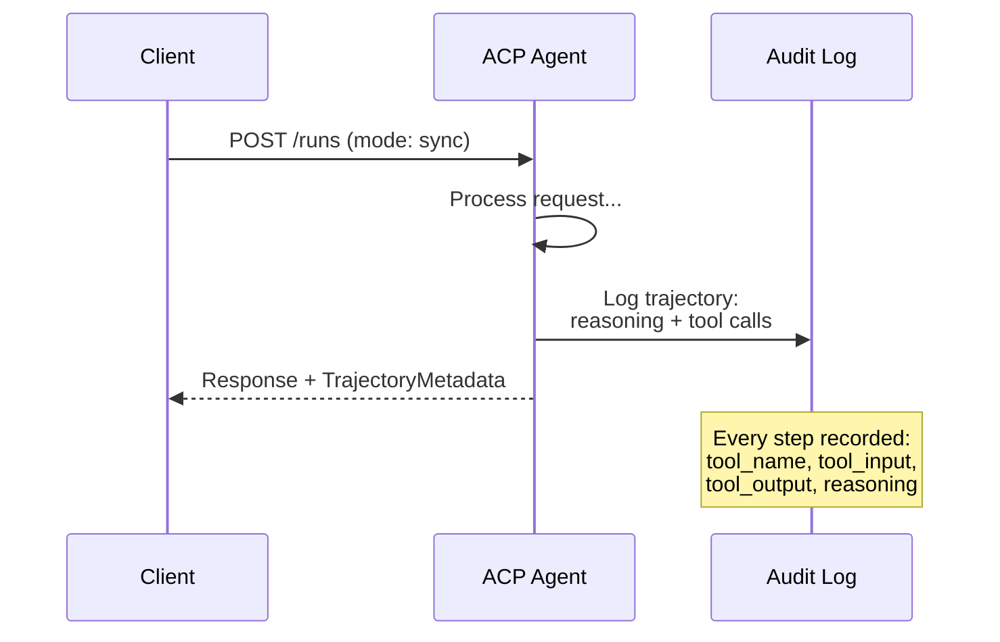

#### Khám phá tác nhân trong ACP

ACP định nghĩa bốn phương thức khám phá:

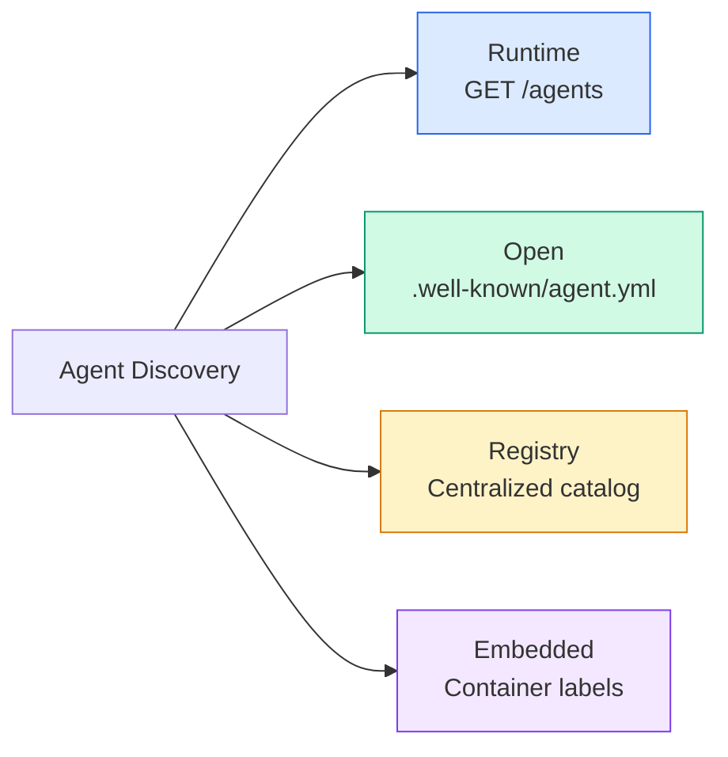

**AgentManifest** đơn giản hơn Agent Card của A2A:

```json
{
  "name": "summarizer",
  "description": "Summarizes documents with source citations",
  "input_content_types": ["text/plain", "application/pdf"],
  "output_content_types": ["text/plain", "application/json"],
  "metadata": {
    "tags": ["summarization", "RAG"],
    "framework": "BeeAI",
    "capabilities": [
      {
        "name": "Document Summarization",
        "description": "Condenses long documents into key points"
      }
    ],
    "recommended_models": ["llama3.3:70b-instruct-fp16"],
    "license": "Apache-2.0",
    "programming_language": "Python"
  }
}
```

#### Vòng đời chạy (Run Lifecycle)

ACP sử dụng "Runs" thay vì "Tasks". Một Run là một lần thực thi tác nhân với ba chế độ:

| Chế độ | Hành vi |
|---|---|
| `sync` | Chặn (Blocking). Phản hồi chứa kết quả hoàn chỉnh. |
| `async` | Trả về 202 ngay lập tức. Poll `GET /runs/{id}` để lấy trạng thái. |
| `stream` | SSE stream. Các sự kiện kích hoạt khi tác nhân làm việc. |

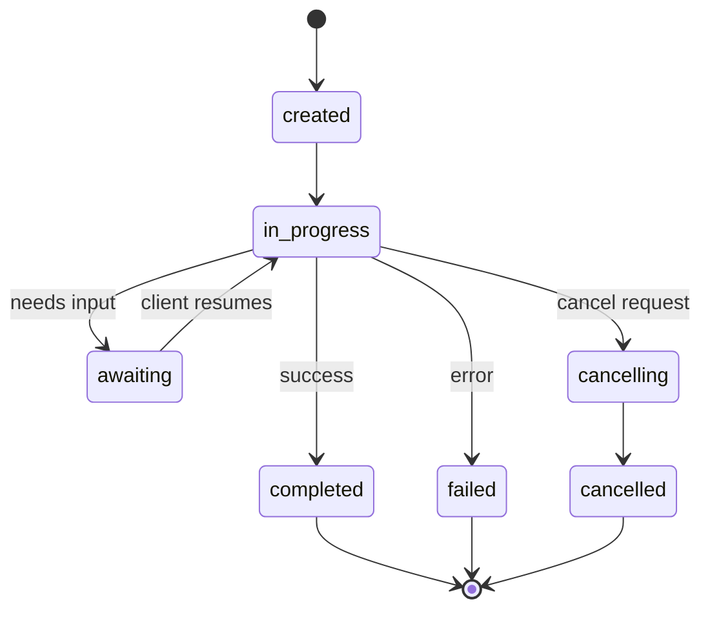

#### TrajectoryMetadata (Dấu vết kiểm toán)

Đây là điểm khác biệt chính của ACP. Mỗi phần thông điệp có thể bao gồm metadata hiển thị chính xác những gì tác nhân đã làm:

```json
{
  "role": "agent/researcher",
  "parts": [
    {
      "content_type": "text/plain",
      "content": "The weather in San Francisco is 72F and sunny.",
      "metadata": {
        "kind": "trajectory",
        "message": "I need to check the weather for this location",
        "tool_name": "weather_api",
        "tool_input": { "location": "San Francisco, CA" },
        "tool_output": { "temperature": 72, "condition": "sunny" }
      }
    }
  ]
}
```

Đối với các ngành được quản lý chặt chẽ, đây là "vàng". Mỗi câu trả lời đi kèm với một chuỗi suy luận có thể chứng minh: công cụ nào đã được gọi, đầu vào nào được sử dụng, đầu ra nào nhận được. Không có "hộp đen".

ACP cũng hỗ trợ **CitationMetadata** để ghi nhận nguồn:

```json
{
  "kind": "citation",
  "start_index": 0,
  "end_index": 47,
  "url": "https://weather.gov/sf",
  "title": "NWS San Francisco Forecast"
}
```

### ANP (Agent Network Protocol)

**Được tạo bởi:** Cộng đồng mã nguồn mở (do GaoWei Chang sáng lập)
**Repo:** [github.com/agent-network-protocol/AgentNetworkProtocol](https://github.com/agent-network-protocol/AgentNetworkProtocol)
**Vấn đề:** Làm thế nào để các tác nhân từ các tổ chức khác nhau tin tưởng lẫn nhau mà không cần cơ quan trung ương?

ANP là **giao thức định danh phi tập trung**. Nó xây dựng niềm tin bằng cách sử dụng W3C Decentralized Identifiers (DIDs) và mã hóa đầu cuối (E2EE). Không giống như A2A nơi bạn khám phá tác nhân qua các endpoint đã biết, ANP cho phép các tác nhân chứng minh danh tính của chúng bằng mật mã.

ANP có ba lớp:

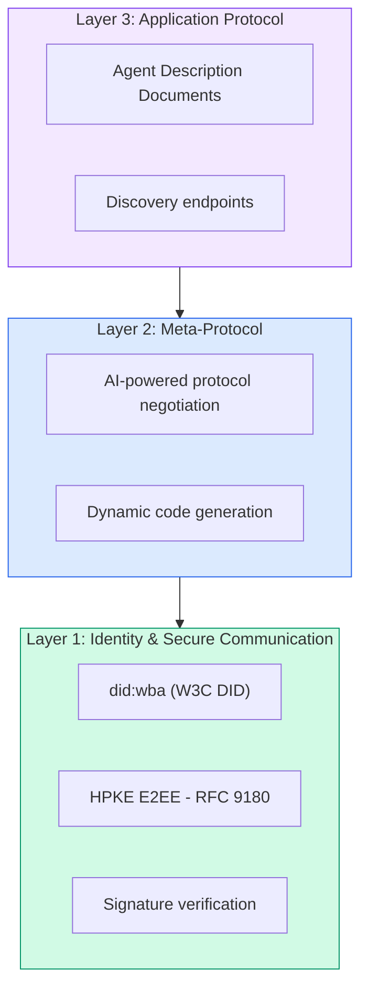

#### Tài liệu DID (Cấu trúc thực tế)

ANP sử dụng một phương thức DID tùy chỉnh gọi là `did:wba` (Web-Based Agent). DID `did:wba:example.com:user:alice` phân giải thành `https://example.com/user/alice/did.json`:

```json
{
  "@context": [
    "https://www.w3.org/ns/did/v1",
    "https://w3id.org/security/suites/jws-2020/v1",
    "https://w3id.org/security/suites/secp256k1-2019/v1"
  ],
  "id": "did:wba:example.com:user:alice",
  "verificationMethod": [
    {
      "id": "did:wba:example.com:user:alice#key-1",
      "type": "EcdsaSecp256k1VerificationKey2019",
      "controller": "did:wba:example.com:user:alice",
      "publicKeyJwk": {
        "crv": "secp256k1",
        "x": "NtngWpJUr-rlNNbs0u-Aa8e16OwSJu6UiFf0Rdo1oJ4",
        "y": "qN1jKupJlFsPFc1UkWinqljv4YE0mq_Ickwnjgasvmo",
        "kty": "EC"
      }
    },
    {
      "id": "did:wba:example.com:user:alice#key-x25519-1",
      "type": "X25519KeyAgreementKey2019",
      "controller": "did:wba:example.com:user:alice",
      "publicKeyMultibase": "z9hFgmPVfmBZwRvFEyniQDBkz9LmV7gDEqytWyGZLmDXE"
    }
  ],
  "authentication": [
    "did:wba:example.com:user:alice#key-1"
  ],
  "keyAgreement": [
    "did:wba:example.com:user:alice#key-x25519-1"
  ],
  "humanAuthorization": [
    "did:wba:example.com:user:alice#key-1"
  ],
  "service": [
    {
      "id": "did:wba:example.com:user:alice#agent-description",
      "type": "AgentDescription",
      "serviceEndpoint": "https://example.com/agents/alice/ad.json"
    }
  ]
}
```

Những điểm chính cần lưu ý:
- **Tách biệt khóa** được thực thi. Khóa ký (secp256k1) tách biệt với khóa mã hóa (X25519).
- **`humanAuthorization`** là duy nhất cho ANP. Các khóa này yêu cầu sự phê duyệt rõ ràng của con người (sinh trắc học, mật khẩu, HSM) trước khi sử dụng. Các hoạt động rủi ro cao như chuyển tiền sẽ đi qua con đường này.
- Khóa **`keyAgreement`** được sử dụng cho mã hóa đầu cuối HPKE (RFC 9180).
- Phần **service** liên kết đến tài liệu mô tả tác nhân.

#### Niềm tin hoạt động như thế nào trong ANP

ANP **không** sử dụng mạng lưới tin cậy (web-of-trust) hay đồ thị chứng thực. Niềm tin là song phương và được xác minh trên mỗi tương tác:

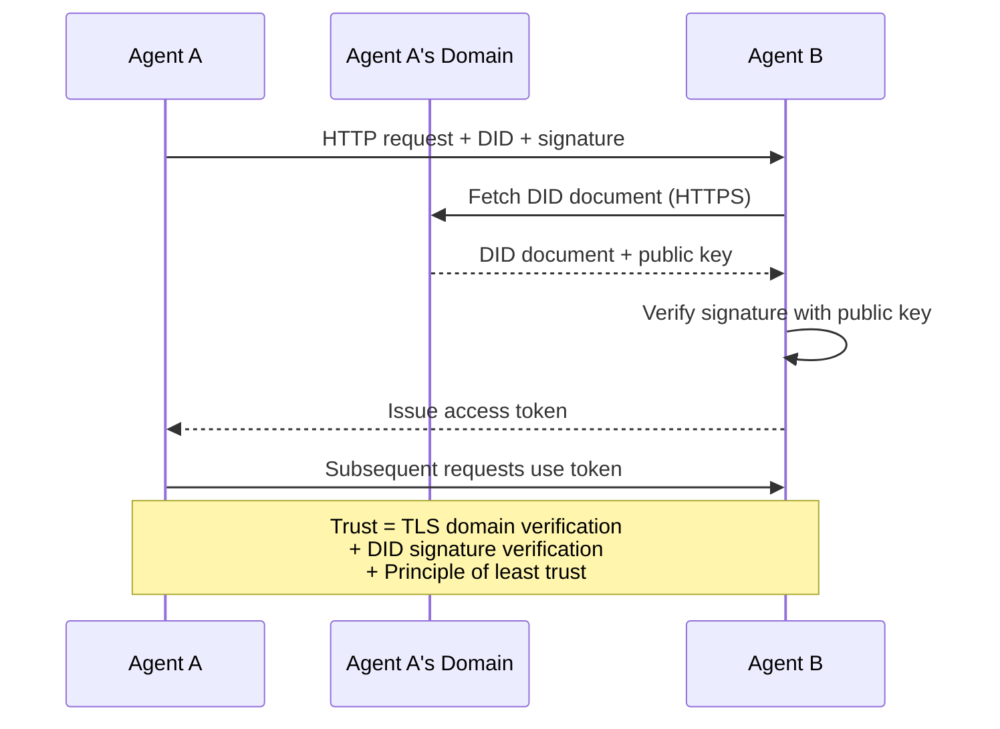

Niềm tin đến từ ba nguồn:
1. **TLS cấp tên miền** xác minh máy chủ tài liệu DID
2. **Chữ ký mật mã DID** xác minh danh tính tác nhân
3. **Nguyên tắc tin cậy tối thiểu** chỉ cấp quyền tối thiểu

Không có sự lan truyền niềm tin dựa trên tin đồn hay điểm số PageRank. Bạn xác minh trực tiếp từng tác nhân thông qua DID của nó.

#### Đàm phán Meta-Protocol

Đây là tính năng mới lạ nhất của ANP. Khi hai tác nhân từ các hệ sinh thái khác nhau gặp nhau, chúng không cần các định dạng dữ liệu đã thỏa thuận trước. Chúng đàm phán bằng ngôn ngữ tự nhiên:

```json
{
  "action": "protocolNegotiation",
  "sequenceId": 0,
  "candidateProtocols": "I can communicate using:\n1. JSON-RPC with hotel booking schema\n2. REST with OpenAPI 3.1 spec\n3. Natural language over HTTP",
  "modificationSummary": "Initial proposal",
  "status": "negotiating"
}
```

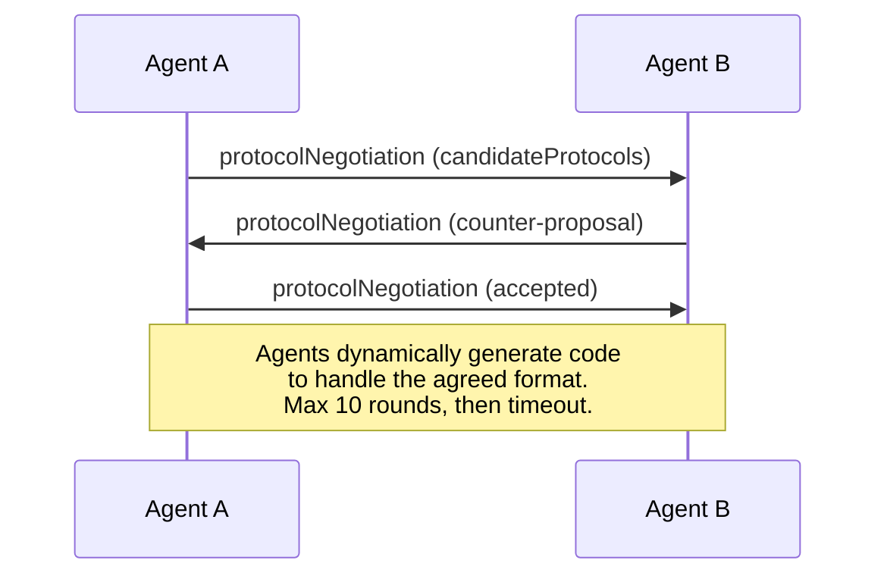

Các tác nhân trao đổi qua lại (tối đa 10 vòng) cho đến khi chúng đồng ý về một định dạng, sau đó tự động tạo mã để xử lý nó. Các giá trị trạng thái: `negotiating`, `rejected`, `accepted`, `timeout`.

Điều này có nghĩa là hai tác nhân chưa từng gặp nhau trước đây có thể tìm ra cách giao tiếp mà không cần ai định nghĩa trước một lược đồ chung.

### So sánh (Đã hiệu chỉnh)

| | MCP | A2A | ACP | ANP |
|---|---|---|---|---|
| **Tạo bởi** | Anthropic | Google / Linux Foundation | IBM / BeeAI | Cộng đồng |
| **Định dạng đặc tả** | JSON-RPC | JSON-RPC / REST / gRPC | OpenAPI 3.1 (REST) | JSON-RPC |
| **Sử dụng chính** | Tác nhân với Công cụ | Tác nhân với Tác nhân | Tác nhân với Tác nhân | Tác nhân với Tác nhân |
| **Khám phá** | Liệt kê công cụ | `/.well-known/agent-card.json` | `GET /agents`, `/.well-known/agent.yml` | `/.well-known/agent-descriptions`, DID service endpoints |
| **Định danh** | Ngầm định (cục bộ) | Các lược đồ bảo mật (OAuth, mTLS) | Cấp server | W3C DID (`did:wba`) với E2EE |
| **Dấu vết kiểm toán** | N/A | Cơ bản (lịch sử tác vụ) | TrajectoryMetadata (gọi công cụ, suy luận) | Không quy định chính thức |
| **Máy trạng thái** | N/A | 9 trạng thái tác vụ | 7 trạng thái chạy | N/A |
| **Streaming** | N/A | SSE | SSE | Không phụ thuộc vận chuyển |
| **Tính năng độc đáo** | Lược đồ công cụ | Agent Cards + Kỹ năng | Dấu vết kiểm toán quỹ đạo | Đàm phán meta-protocol |
| **Tốt nhất cho** | Công cụ & dữ liệu | Cộng tác động | Ngành được quản lý | Tin cậy liên tổ chức |
| **Trạng thái** | Ổn định | Ổn định (v1.0) | Sáp nhập vào A2A | Đang phát triển |

### Cách chúng hoạt động cùng nhau

Các giao thức này không loại trừ lẫn nhau. Một hệ thống doanh nghiệp thực tế sử dụng nhiều giao thức:

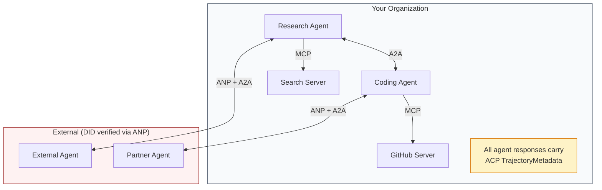

- **MCP** kết nối mỗi tác nhân với các công cụ của nó
- **A2A** xử lý sự cộng tác giữa các tác nhân (nội bộ và bên ngoài)
- **ACP** bao bọc các phản hồi trong metadata quỹ đạo để kiểm toán
- **ANP** cung cấp xác minh danh tính cho các tác nhân bạn không kiểm soát

```figure
swarm-message-bus
```

## Xây dựng

### Bước 1: Các kiểu thông điệp cốt lõi

Mỗi hệ thống đa tác nhân bắt đầu bằng một định dạng thông điệp. Chúng ta định nghĩa các kiểu ánh xạ tới những gì các giao thức thực tế sử dụng:

```typescript
import crypto from "node:crypto";

type MessageRole = "user" | "agent";

type MessagePart =
  | { kind: "text"; text: string }
  | { kind: "data"; data: unknown; mediaType: string }
  | { kind: "file"; name: string; url: string; mediaType: string };

type TrajectoryEntry = {
  reasoning: string;
  toolName?: string;
  toolInput?: unknown;
  toolOutput?: unknown;
  timestamp: number;
};

type AgentMessage = {
  id: string;
  role: MessageRole;
  parts: MessagePart[];
  trajectory?: TrajectoryEntry[];
  replyTo?: string;
  timestamp: number;
};

function createMessage(
  role: MessageRole,
  parts: MessagePart[],
  replyTo?: string
): AgentMessage {
  return {
    id: crypto.randomUUID(),
    role,
    parts,
    replyTo,
    timestamp: Date.now(),
  };
}

function textMessage(role: MessageRole, text: string): AgentMessage {
  return createMessage(role, [{ kind: "text", text }]);
}
```

Lưu ý: `MessagePart` là đa phương thức (văn bản, dữ liệu cấu trúc, tệp) giống như các đặc tả A2A và ACP thực tế. `TrajectoryEntry` nắm bắt chuỗi suy luận, khớp với TrajectoryMetadata của ACP.

### Bước 2: A2A Agent Card và Registry

Xây dựng khám phá tác nhân khớp với đặc tả A2A thực tế:

```typescript
type Skill = {
  id: string;
  name: string;
  description: string;
  tags: string[];
  inputModes: string[];
  outputModes: string[];
};

type AgentCard = {
  name: string;
  description: string;
  version: string;
  url: string;
  capabilities: {
    streaming: boolean;
    pushNotifications: boolean;
  };
  defaultInputModes: string[];
  defaultOutputModes: string[];
  skills: Skill[];
};

class AgentRegistry {
  private cards: Map<string, AgentCard> = new Map();

  register(card: AgentCard) {
    this.cards.set(card.name, card);
  }

  discoverBySkillTag(tag: string): AgentCard[] {
    return [...this.cards.values()].filter((card) =>
      card.skills.some((skill) => skill.tags.includes(tag))
    );
  }

  discoverByInputMode(mimeType: string): AgentCard[] {
    return [...this.cards.values()].filter(
      (card) =>
        card.defaultInputModes.includes(mimeType) ||
        card.skills.some((skill) => skill.inputModes.includes(mimeType))
    );
  }

  resolve(name: string): AgentCard | undefined {
    return this.cards.get(name);
  }

  listAll(): AgentCard[] {
    return [...this.cards.values()];
  }
}
```

Điều này phong phú hơn đáng kể so với một bản đồ tên-đến-khả năng đơn giản. Bạn có thể khám phá các tác nhân theo thẻ kỹ năng, theo kiểu MIME đầu vào hoặc theo tên, giống như đặc tả A2A thực tế hỗ trợ.

### Bước 3: Vòng đời tác vụ A2A

Xây dựng máy trạng thái tác vụ đầy đủ:

```typescript
type TaskState =
  | "submitted"
  | "working"
  | "input-required"
  | "auth-required"
  | "completed"
  | "failed"
  | "canceled"
  | "rejected";

const TERMINAL_STATES: TaskState[] = [
  "completed",
  "failed",
  "canceled",
  "rejected",
];

type TaskStatus = {
  state: TaskState;
  message?: AgentMessage;
  timestamp: number;
};

type Artifact = {
  id: string;
  name: string;
  parts: MessagePart[];
};

type Task = {
  id: string;
  contextId: string;
  status: TaskStatus;
  artifacts: Artifact[];
  history: AgentMessage[];
};

type TaskEvent =
  | { kind: "statusUpdate"; taskId: string; status: TaskStatus }
  | {
      kind: "artifactUpdate";
      taskId: string;
      artifact: Artifact;
      append: boolean;
      lastChunk: boolean;
    };

type TaskHandler = (
  task: Task,
  message: AgentMessage
) => AsyncGenerator<TaskEvent>;

class TaskManager {
  private tasks: Map<string, Task> = new Map();
  private handlers: Map<string, TaskHandler> = new Map();
  private listeners: Map<string, ((event: TaskEvent) => void)[]> = new Map();

  registerHandler(agentName: string, handler: TaskHandler) {
    this.handlers.set(agentName, handler);
  }

  subscribe(taskId: string, listener: (event: TaskEvent) => void) {
    const existing = this.listeners.get(taskId) ?? [];
    existing.push(listener);
    this.listeners.set(taskId, existing);
  }

  async sendMessage(
    agentName: string,
    message: AgentMessage,
    contextId?: string
  ): Promise<Task> {
    const handler = this.handlers.get(agentName);
    if (!handler) {
      const task = this.createTask(contextId);
      task.status = {
        state: "rejected",
        timestamp: Date.now(),
        message: textMessage("agent", `No handler for ${agentName}`),
      };
      return task;
    }

    const task = this.createTask(contextId);
    task.history.push(message);
    task.status = { state: "submitted", timestamp: Date.now() };

    this.processTask(task, handler, message).catch((err) => {
      task.status = {
        state: "failed",
        timestamp: Date.now(),
        message: textMessage("agent", String(err)),
      };
    });
    return task;
  }

  getTask(taskId: string): Task | undefined {
    return this.tasks.get(taskId);
  }

  cancelTask(taskId: string): boolean {
    const task = this.tasks.get(taskId);
    if (!task || TERMINAL_STATES.includes(task.status.state)) return false;
    task.status = { state: "canceled", timestamp: Date.now() };
    this.emit(taskId, {
      kind: "statusUpdate",
      taskId,
      status: task.status,
    });
    return true;
  }

  private createTask(contextId?: string): Task {
    const task: Task = {
      id: crypto.randomUUID(),
      contextId: contextId ?? crypto.randomUUID(),
      status: { state: "submitted", timestamp: Date.now() },
      artifacts: [],
      history: [],
    };
    this.tasks.set(task.id, task);
    return task;
  }

  private async processTask(
    task: Task,
    handler: TaskHandler,
    message: AgentMessage
  ) {
    task.status = { state: "working", timestamp: Date.now() };
    this.emit(task.id, {
      kind: "statusUpdate",
      taskId: task.id,
      status: task.status,
    });

    try {
      for await (const event of handler(task, message)) {
        if (TERMINAL_STATES.includes(task.status.state)) break;

        if (event.kind === "statusUpdate") {
          task.status = event.status;
        }
        if (event.kind === "artifactUpdate") {
          const existing = task.artifacts.find(
            (a) => a.id === event.artifact.id
          );
          if (existing && event.append) {
            existing.parts.push(...event.artifact.parts);
          } else {
            task.artifacts.push(event.artifact);
          }
        }
        this.emit(task.id, event);
      }
    } catch (err) {
      task.status = {
        state: "failed",
        timestamp: Date.now(),
        message: textMessage("agent", String(err)),
      };
      this.emit(task.id, {
        kind: "statusUpdate",
        taskId: task.id,
        status: task.status,
      });
    }
  }

  private emit(taskId: string, event: TaskEvent) {
    for (const listener of this.listeners.get(taskId) ?? []) {
      listener(event);
    }
  }
}
```

Điều này triển khai vòng đời tác vụ A2A thực tế: đã gửi, đang làm việc, cần đầu vào, các trạng thái kết thúc. Các trình xử lý là các async generator tạo ra các sự kiện (cập nhật trạng thái và các phần artifact) khớp với mô hình streaming SSE.

### Bước 4: Dấu vết kiểm toán kiểu ACP

Bao bọc giao tiếp với theo dõi quỹ đạo:

```typescript
type AuditEntry = {
  runId: string;
  agentName: string;
  input: AgentMessage[];
  output: AgentMessage[];
  trajectory: TrajectoryEntry[];
  status: "created" | "in-progress" | "completed" | "failed" | "awaiting";
  startedAt: number;
  completedAt?: number;
  sessionId?: string;
};

class AuditableRunner {
  private log: AuditEntry[] = [];
  private handlers: Map<
    string,
    (input: AgentMessage[]) => Promise<{
      output: AgentMessage[];
      trajectory: TrajectoryEntry[];
    }>
  > = new Map();

  registerAgent(
    name: string,
    handler: (input: AgentMessage[]) => Promise<{
      output: AgentMessage[];
      trajectory: TrajectoryEntry[];
    }>
  ) {
    this.handlers.set(name, handler);
  }

  async run(
    agentName: string,
    input: AgentMessage[],
    sessionId?: string
  ): Promise<AuditEntry> {
    const entry: AuditEntry = {
      runId: crypto.randomUUID(),
      agentName,
      input: structuredClone(input),
      output: [],
      trajectory: [],
      status: "created",
      startedAt: Date.now(),
      sessionId,
    };
    this.log.push(entry);

    const handler = this.handlers.get(agentName);
    if (!handler) {
      entry.status = "failed";
      return entry;
    }

    entry.status = "in-progress";
    try {
      const result = await handler(input);
      entry.output = structuredClone(result.output);
      entry.trajectory = structuredClone(result.trajectory);
      entry.status = "completed";
      entry.completedAt = Date.now();
    } catch (err) {
      entry.status = "failed";
      entry.trajectory.push({
        reasoning: `Error: ${String(err)}`,
        timestamp: Date.now(),
      });
      entry.completedAt = Date.now();
    }
    return entry;
  }

  getFullAuditLog(): AuditEntry[] {
    return structuredClone(this.log);
  }

  getAuditLogForAgent(agentName: string): AuditEntry[] {
    return structuredClone(
      this.log.filter((e) => e.agentName === agentName)
    );
  }

  getAuditLogForSession(sessionId: string): AuditEntry[] {
    return structuredClone(
      this.log.filter((e) => e.sessionId === sessionId)
    );
  }

  getTrajectoryForRun(runId: string): TrajectoryEntry[] {
    const entry = this.log.find((e) => e.runId === runId);
    return entry ? structuredClone(entry.trajectory) : [];
  }
}
```

Mỗi lần thực thi tác nhân tạo ra một mục kiểm toán đầy đủ: cái gì đi vào, cái gì đi ra và quỹ đạo hoàn chỉnh của các lệnh gọi công cụ và các bước suy luận ở giữa. Bạn có thể truy vấn theo tác nhân, theo phiên hoặc theo từng lần chạy.

### Bước 5: Xác minh danh tính kiểu ANP

Xây dựng định danh và xác minh dựa trên DID:

```typescript
type VerificationMethod = {
  id: string;
  type: string;
  controller: string;
  publicKeyDer: string;
};

type DIDDocument = {
  id: string;
  verificationMethod: VerificationMethod[];
  authentication: string[];
  keyAgreement: string[];
  humanAuthorization: string[];
  service: { id: string; type: string; serviceEndpoint: string }[];
};

type AgentIdentity = {
  did: string;
  document: DIDDocument;
  privateKey: crypto.KeyObject;
  publicKey: crypto.KeyObject;
};

class IdentityRegistry {
  private documents: Map<string, DIDDocument> = new Map();

  publish(doc: DIDDocument) {
    this.documents.set(doc.id, doc);
  }

  resolve(did: string): DIDDocument | undefined {
    return this.documents.get(did);
  }

  verify(did: string, signature: string, payload: string): boolean {
    const doc = this.documents.get(did);
    if (!doc) return false;

    const authKeyIds = doc.authentication;
    const authKeys = doc.verificationMethod.filter((vm) =>
      authKeyIds.includes(vm.id)
    );

    for (const key of authKeys) {
      const publicKey = crypto.createPublicKey({
        key: Buffer.from(key.publicKeyDer, "base64"),
        format: "der",
        type: "spki",
      });
      const isValid = crypto.verify(
        null,
        Buffer.from(payload),
        publicKey,
        Buffer.from(signature, "hex")
      );
      if (isValid) return true;
    }
    return false;
  }

  requiresHumanAuth(did: string, operationKeyId: string): boolean {
    const doc = this.documents.get(did);
    if (!doc) return false;
    return doc.humanAuthorization.includes(operationKeyId);
  }
}

function createIdentity(domain: string, agentName: string): AgentIdentity {
  const did = `did:wba:${domain}:agent:${agentName}`;
  const { publicKey, privateKey } = crypto.generateKeyPairSync("ed25519");

  const publicKeyDer = publicKey
    .export({ format: "der", type: "spki" })
    .toString("base64");

  const keyId = `${did}#key-1`;
  const encKeyId = `${did}#key-x25519-1`;

  const document: DIDDocument = {
    id: did,
    verificationMethod: [
      {
        id: keyId,
        type: "Ed25519VerificationKey2020",
        controller: did,
        publicKeyDer,
      },
      {
        id: encKeyId,
        type: "X25519KeyAgreementKey2019",
        controller: did,
        publicKeyDer,
      },
    ],
    authentication: [keyId],
    keyAgreement: [encKeyId],
    humanAuthorization: [],
    service: [
      {
        id: `${did}#agent-description`,
        type: "AgentDescription",
        serviceEndpoint: `https://${domain}/agents/${agentName}/ad.json`,
      },
    ],
  };

  return { did, document, privateKey, publicKey };
}

function signPayload(identity: AgentIdentity, payload: string): string {
  return crypto
    .sign(null, Buffer.from(payload), identity.privateKey)
    .toString("hex");
}
```

Điều này phản ánh mô hình định danh ANP thực tế: các tác nhân có tài liệu DID với các khóa xác thực, thỏa thuận khóa và ủy quyền con người riêng biệt. `IdentityRegistry` mô phỏng việc phân giải DID (trong sản xuất, đây sẽ là các lệnh gọi HTTP đến tên miền của tác nhân).

### Bước 6: Cổng giao thức (Protocol Gateway)

Kết nối cả bốn giao thức vào một hệ thống thống nhất:

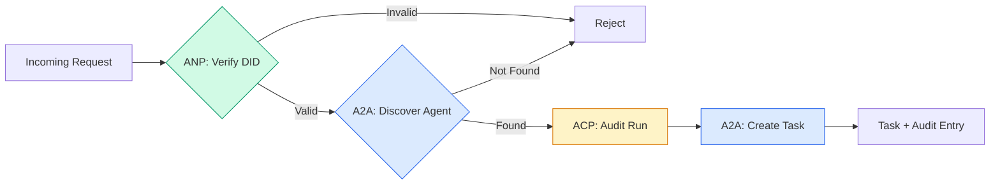

```typescript
class ProtocolGateway {
  private registry: AgentRegistry;
  private taskManager: TaskManager;
  private auditRunner: AuditableRunner;
  private identityRegistry: IdentityRegistry;

  constructor(
    registry: AgentRegistry,
    taskManager: TaskManager,
    auditRunner: AuditableRunner,
    identityRegistry: IdentityRegistry
  ) {
    this.registry = registry;
    this.taskManager = taskManager;
    this.auditRunner = auditRunner;
    this.identityRegistry = identityRegistry;
  }

  async delegateTask(
    fromDid: string,
    signature: string,
    targetAgent: string,
    message: AgentMessage,
    sessionId?: string
  ): Promise<{ task: Task; audit: AuditEntry } | { error: string }> {
    if (!this.identityRegistry.verify(fromDid, signature, message.id)) {
      return { error: "Identity verification failed" };
    }

    const card = this.registry.resolve(targetAgent);
    if (!card) {
      return { error: `Agent ${targetAgent} not found in registry` };
    }

    const audit = await this.auditRunner.run(
      targetAgent,
      [message],
      sessionId
    );
    const task = await this.taskManager.sendMessage(targetAgent, message);

    return { task, audit };
  }

  discoverAndDelegate(
    fromDid: string,
    signature: string,
    skillTag: string,
    message: AgentMessage
  ): Promise<{ task: Task; audit: AuditEntry } | { error: string }> {
    const candidates = this.registry.discoverBySkillTag(skillTag);
    if (candidates.length === 0) {
      return Promise.resolve({
        error: `No agents found with skill tag: ${skillTag}`,
      });
    }
    return this.delegateTask(
      fromDid,
      signature,
      candidates[0].name,
      message
    );
  }
}
```

Cổng giao thức thực hiện bốn việc trong một lệnh gọi:
1. **ANP**: Xác minh danh tính của người gọi qua chữ ký DID
2. **A2A**: Khám phá tác nhân mục tiêu và kiểm tra khả năng
3. **ACP**: Bao bọc việc thực thi trong một dấu vết kiểm toán với quỹ đạo
4. **A2A**: Tạo một tác vụ với theo dõi vòng đời đầy đủ

### Bước 7: Kết nối tất cả lại với nhau

```typescript
async function protocolDemo() {
  const registry = new AgentRegistry();
  registry.register({
    name: "researcher",
    description: "Searches and summarizes findings",
    version: "1.0.0",
    url: "https://researcher.local/a2a/v1",
    capabilities: { streaming: true, pushNotifications: false },
    defaultInputModes: ["text/plain"],
    defaultOutputModes: ["text/plain", "application/json"],
    skills: [
      {
        id: "web-research",
        name: "Web Research",
        description: "Searches the web",
        tags: ["research", "search", "summarization"],
        inputModes: ["text/plain"],
        outputModes: ["application/json"],
      },
    ],
  });
  registry.register({
    name: "coder",
    description: "Writes code from specs",
    version: "1.0.0",
    url: "https://coder.local/a2a/v1",
    capabilities: { streaming: false, pushNotifications: false },
    defaultInputModes: ["text/plain", "application/json"],
    defaultOutputModes: ["text/plain"],
    skills: [
      {
        id: "code-gen",
        name: "Code Generation",
        description: "Generates code",
        tags: ["coding", "generation"],
        inputModes: ["text/plain", "application/json"],
        outputModes: ["text/plain"],
      },
    ],
  });

  const taskManager = new TaskManager();
  const auditRunner = new AuditableRunner();

  const researchTrajectory: TrajectoryEntry[] = [];

  taskManager.registerHandler(
    "researcher",
    async function* (task, message) {
      yield {
        kind: "statusUpdate" as const,
        taskId: task.id,
        status: { state: "working" as const, timestamp: Date.now() },
      };

      researchTrajectory.push({
        reasoning: "Searching for React 19 documentation",
        toolName: "web_search",
        toolInput: { query: "React 19 compiler features" },
        toolOutput: {
          results: ["react.dev/blog/react-19", "github.com/react/react"],
        },
        timestamp: Date.now(),
      });

      researchTrajectory.push({
        reasoning: "Extracting key findings from search results",
        toolName: "doc_analysis",
        toolInput: { url: "react.dev/blog/react-19" },
        toolOutput: {
          summary:
            "React 19 compiler auto-memoizes, no manual useMemo needed",
        },
        timestamp: Date.now(),
      });

      yield {
        kind: "artifactUpdate" as const,
        taskId: task.id,
        artifact: {
          id: crypto.randomUUID(),
          name: "research-results",
          parts: [
            {
              kind: "data" as const,
              data: {
                findings: [
                  "React 19 compiler auto-memoizes components",
                  "No more manual useMemo/useCallback needed",
                  "Compiler runs at build time, not runtime",
                ],
                sources: ["react.dev/blog/react-19"],
              },
              mediaType: "application/json",
            },
          ],
        },
        append: false,
        lastChunk: true,
      };

      yield {
        kind: "statusUpdate" as const,
        taskId: task.id,
        status: { state: "completed" as const, timestamp: Date.now() },
      };
    }
  );

  auditRunner.registerAgent("researcher", async () => ({
    output: [
      textMessage("agent", "React 19 compiler auto-memoizes components"),
    ],
    trajectory: researchTrajectory,
  }));

  const identityRegistry = new IdentityRegistry();

  const coderIdentity = createIdentity("coder.local", "coder");
  const researcherIdentity = createIdentity("researcher.local", "researcher");

  identityRegistry.publish(coderIdentity.document);
  identityRegistry.publish(researcherIdentity.document);

  const gateway = new ProtocolGateway(
    registry,
    taskManager,
    auditRunner,
    identityRegistry
  );

  console.log("=== Protocol Demo ===\n");

  console.log("1. Agent Discovery (A2A)");
  const researchAgents = registry.discoverBySkillTag("research");
  console.log(
    `   Found ${researchAgents.length} agent(s):`,
    researchAgents.map((a) => a.name)
  );

  console.log("\n2. Identity Verification (ANP)");
  const message = textMessage("user", "Research React 19 compiler features");
  const signature = signPayload(coderIdentity, message.id);
  const verified = identityRegistry.verify(
    coderIdentity.did,
    signature,
    message.id
  );
  console.log(`   Coder DID: ${coderIdentity.did}`);
  console.log(`   Signature verified: ${verified}`);

  console.log("\n3. Task Delegation (A2A + ACP + ANP)");
  const result = await gateway.delegateTask(
    coderIdentity.did,
    signature,
    "researcher",
    message,
    "session-001"
  );

  if ("error" in result) {
    console.log(`   Error: ${result.error}`);
    return;
  }

  console.log(`   Task ID: ${result.task.id}`);
  console.log(`   Task state: ${result.task.status.state}`);
  console.log(`   Artifacts: ${result.task.artifacts.length}`);

  console.log("\n4. Audit Trail (ACP)");
  console.log(`   Run ID: ${result.audit.runId}`);
  console.log(`   Status: ${result.audit.status}`);
  console.log(`   Trajectory steps: ${result.audit.trajectory.length}`);
  for (const step of result.audit.trajectory) {
    console.log(`     - ${step.reasoning}`);
    if (step.toolName) {
      console.log(`       Tool: ${step.toolName}`);
    }
  }

  console.log("\n5. Full Audit Log");
  const fullLog = auditRunner.getFullAuditLog();
  console.log(`   Total runs: ${fullLog.length}`);
  for (const entry of fullLog) {
    const duration = entry.completedAt
      ? `${entry.completedAt - entry.startedAt}ms`
      : "in-progress";
    console.log(`   ${entry.agentName}: ${entry.status} (${duration})`);
  }
}

protocolDemo().catch((err) => {
  console.error("Protocol demo failed:", err);
  process.exitCode = 1;
});
```

## Những gì có thể sai sót

Các giao thức giải quyết "happy path". Đây là những gì bị hỏng trong sản xuất:

**Lệch lược đồ (Schema drift).** Tác nhân A xuất bản một Agent Card quảng cáo đầu ra `application/json`. Nhưng lược đồ JSON thay đổi giữa các phiên bản. Tác nhân B phân tích định dạng cũ và nhận được dữ liệu rác. Khắc phục: đánh phiên bản các kỹ năng và lược đồ đầu ra của bạn. Đặc tả A2A hỗ trợ `version` trên Agent Cards vì lý do này.

**Vi phạm máy trạng thái.** Một trình xử lý tác nhân tạo ra sự kiện `completed`, sau đó cố gắng tạo thêm các artifact. Tác vụ là bất biến. Mã của bạn âm thầm loại bỏ các cập nhật hoặc ném lỗi. Khắc phục: kiểm tra trạng thái kết thúc trước khi tạo ra. `TaskManager` ở trên thực thi điều này với `break` sau các trạng thái kết thúc.

**Lỗi phân giải tin cậy.** Tác nhân A cố gắng xác minh DID của Tác nhân B, nhưng tên miền của Tác nhân B bị sập. Tài liệu DID không thể được lấy. Bạn chọn "fail open" (chấp nhận các tác nhân chưa xác minh) hay "fail closed" (từ chối mọi thứ)? ANP khuyến nghị "fail closed" với nguyên tắc tin cậy tối thiểu.

**Phình to quỹ đạo.** Ghi nhật ký quỹ đạo ACP rất mạnh mẽ nhưng đắt đỏ. Một tác nhân phức tạp thực hiện 200 lệnh gọi công cụ mỗi lần chạy sẽ tạo ra các mục kiểm toán khổng lồ. Khắc phục: ghi nhật ký quỹ đạo ở các mức độ chi tiết có thể cấu hình. Ghi lại tên công cụ và IO để tuân thủ, bỏ qua các bước suy luận cho các khối lượng công việc không được quản lý.

**Thundering herd khi khám phá.** 50 tác nhân cùng truy vấn `GET /agents` đồng thời khi khởi động. Khắc phục: cache Agent Cards với TTL, làm lệch khoảng thời gian khám phá hoặc sử dụng đăng ký dựa trên đẩy (push-based) thay vì polling.

## Sử dụng

### Các triển khai thực tế

**A2A** là trưởng thành nhất. [Đặc tả chính thức](https://github.com/google/A2A) của Google là mã nguồn mở dưới Linux Foundation. Có SDK cho Python và TypeScript. Nếu các tác nhân của bạn cần khám phá và cộng tác động, hãy bắt đầu từ đây.

**ACP** đang sáp nhập vào A2A. [Dự án BeeAI](https://github.com/i-am-bee/acp) của IBM đã tạo ra ACP như một giải pháp thay thế ưu tiên REST, nhưng khái niệm metadata quỹ đạo đang được hấp thụ vào hệ sinh thái A2A. Hãy sử dụng các mô hình ACP (ghi nhật ký quỹ đạo, vòng đời chạy) ngay cả khi bạn sử dụng A2A làm phương tiện vận chuyển.

**ANP** là thử nghiệm nhất. [Repo cộng đồng](https://github.com/agent-network-protocol/AgentNetworkProtocol) có một SDK Python (AgentConnect). Khái niệm đàm phán meta-protocol thực sự mới lạ. Đáng để theo dõi cho các triển khai tác nhân liên tổ chức.

**MCP** đã được đề cập trong Phase 13. Nếu bạn muốn các tác nhân sử dụng công cụ, MCP là tiêu chuẩn.

### Chọn giao thức phù hợp

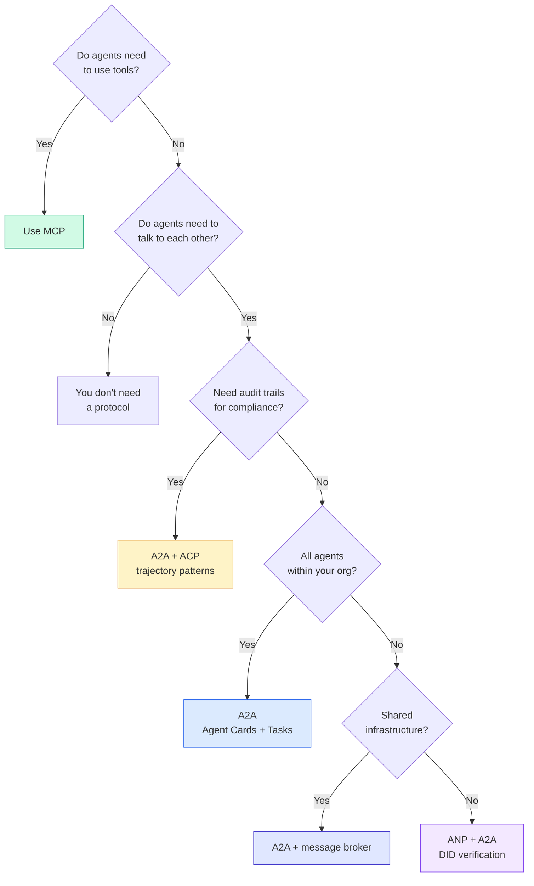

## Ship It

Bài học này tạo ra:
- `code/main.ts` -- triển khai hoàn chỉnh của cả bốn mô hình giao thức
- `outputs/prompt-protocol-selector.md` -- một prompt giúp bạn chọn giao thức cho hệ thống của mình

## Bài tập

1. **Ủy quyền tác vụ đa chặng.** Mở rộng `TaskManager` để một trình xử lý tác nhân có thể ủy quyền các tác vụ con cho các tác nhân khác. Tác nhân nghiên cứu nhận một tác vụ, ủy quyền các tác vụ con "tìm kiếm" và "tóm tắt" cho hai tác nhân chuyên gia, chờ cả hai hoàn thành, sau đó hợp nhất kết quả vào các artifact của chính nó.

2. **Dấu vết kiểm toán streaming.** Sửa đổi `AuditableRunner` để hỗ trợ chế độ streaming. Thay vì chờ kết quả đầy đủ, hãy tạo ra các cập nhật `AuditEntry` trong thời gian thực khi các mục quỹ đạo được thêm vào. Sử dụng một async generator tạo ra các snapshot kiểm toán.

3. **Xoay vòng DID.** Thêm xoay vòng khóa vào `IdentityRegistry`. Một tác nhân sẽ có thể xuất bản một tài liệu DID mới với các khóa đã cập nhật trong khi vẫn duy trì tham chiếu `previousDid`. Các bên xác minh nên chấp nhận chữ ký từ cả khóa hiện tại và khóa trước đó trong thời gian ân hạn.

4. **Đàm phán giao thức.** Triển khai khái niệm meta-protocol của ANP. Hai tác nhân trao đổi các thông điệp `protocolNegotiation` với các định dạng ứng viên (ví dụ: "Tôi có thể nói JSON-RPC" so với "Tôi thích REST"). Sau tối đa 3 vòng, chúng đồng ý về một định dạng hoặc timeout. Định dạng đã thỏa thuận xác định `TaskManager` hoặc `AuditableRunner` nào chúng sử dụng.

5. **Khám phá giới hạn tốc độ.** Thêm một wrapper `RateLimitedRegistry` để cache các tra cứu Agent Card với TTL có thể cấu hình và giới hạn các truy vấn khám phá mỗi tác nhân mỗi giây. Mô phỏng một "thundering herd" gồm 100 tác nhân khám phá lẫn nhau khi khởi động và đo lường sự khác biệt.

## Thuật ngữ chính

| Thuật ngữ | Mọi người nói | Ý nghĩa thực tế |
|------|----------------|----------------------|
| MCP | "Giao thức cho công cụ AI" | Một giao thức client-server để các tác nhân khám phá và sử dụng công cụ. Tác nhân-với-công cụ, không phải tác nhân-với-tác nhân. |
| A2A | "Giao thức tác nhân của Google" | Một giao thức ngang hàng cho sự cộng tác tác nhân dưới Linux Foundation. Khám phá qua Agent Cards, vòng đời tác vụ 9 trạng thái, streaming qua SSE. Hỗ trợ các ràng buộc JSON-RPC, REST và gRPC. |
| ACP | "Giao tiếp tác nhân doanh nghiệp" | API REST của IBM/BeeAI cho các lần chạy tác nhân với TrajectoryMetadata: mỗi phản hồi mang theo chuỗi suy luận và lệnh gọi công cụ đầy đủ. Đang sáp nhập vào A2A. |
| ANP | "Định danh tác nhân phi tập trung" | Một giao thức cộng đồng sử dụng `did:wba` (DID) cho định danh mật mã, HPKE cho E2EE và đàm phán meta-protocol dựa trên AI cho các tác nhân chưa từng gặp nhau. |
| Agent Card | "Danh thiếp của tác nhân" | Một tài liệu JSON tại `/.well-known/agent-card.json` mô tả các kỹ năng, kiểu MIME được hỗ trợ, lược đồ bảo mật và ràng buộc giao thức. |
| DID | "Định danh phi tập trung" | Tiêu chuẩn W3C cho các định danh có thể xác minh bằng mật mã được lưu trữ trên tên miền riêng của tác nhân. ANP sử dụng phương thức `did:wba`. |
| TrajectoryMetadata | "Biên lai kiểm toán" | Cơ chế của ACP để đính kèm các bước suy luận, lệnh gọi công cụ và đầu vào/đầu ra của chúng vào mỗi phản hồi của tác nhân. |
| Meta-protocol | "Tác nhân đàm phán cách nói chuyện" | Cách tiếp cận của ANP nơi các tác nhân sử dụng ngôn ngữ tự nhiên để đồng ý động về các định dạng dữ liệu, sau đó tạo mã để xử lý chúng. |
| Task | "Đơn vị công việc" | Đối tượng có trạng thái của A2A theo dõi công việc từ khi gửi đến khi hoàn thành. Bất biến khi đã kết thúc. |

## Đọc thêm

- [Đặc tả A2A của Google](https://github.com/google/A2A) -- đặc tả chính thức và SDK (v1.0.0, Linux Foundation)
- [Đặc tả ACP của IBM/BeeAI](https://github.com/i-am-bee/acp) -- đặc tả OpenAPI 3.1 cho các lần chạy tác nhân và metadata quỹ đạo
- [Agent Network Protocol](https://github.com/agent-network-protocol/AgentNetworkProtocol) -- định danh dựa trên DID, E2EE, đàm phán meta-protocol
- [Tài liệu Model Context Protocol](https://modelcontextprotocol.io/) -- đặc tả MCP của Anthropic (đã đề cập trong Phase 13)
- [W3C Decentralized Identifiers](https://www.w3.org/TR/did-core/) -- tiêu chuẩn định danh làm nền tảng cho ANP
- [RFC 9180 (HPKE)](https://www.rfc-editor.org/rfc/rfc9180) -- lược đồ mã hóa mà ANP sử dụng cho E2EE
- [FIPA Agent Communication Language](http://www.fipa.org/specs/fipa00061/SC00061G.html) -- tiền thân học thuật của các giao thức tác nhân hiện đại