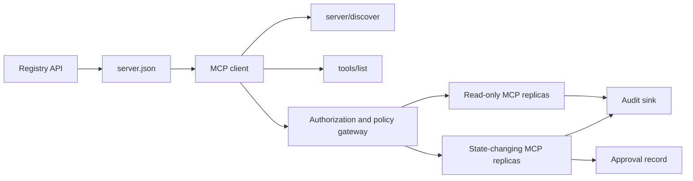

# Capstone 13: Stateless MCP Server with Registry and Governance

> Production MCP không phải là một tiến trình máy chủ đơn lẻ. Đó là một chuỗi các hợp đồng: metadata có thể công bố, khám phá trực tiếp (live discovery), phong bì yêu cầu không trạng thái (stateless request envelope), ủy quyền, chính sách, kiểm toán và bằng chứng triển khai.

**Type:** Capstone
**Languages:** Các mô hình tham chiếu Python và TypeScript; bất kỳ ngôn ngữ sản xuất nào
**Prerequisites:** Phase 11, Phase 13, Phase 14, Phase 17, và Phase 18
**Required MCP deep dives:** [Lesson 28: Tool Contracts](../../../13-tools-and-protocols/28-mcp-tool-contracts-and-content/docs/en.md), [Lesson 29: Reliability](../../../13-tools-and-protocols/29-mcp-reliability-cancellation-and-flow-control/docs/en.md), [Lesson 30: Registry Supply Chain](../../../13-tools-and-protocols/30-mcp-registry-supply-chain-and-drift/docs/en.md), và [Lesson 31: Conformance Operations](../../../13-tools-and-protocols/31-mcp-conformance-versioning-and-operations/docs/en.md)
**Protocol target:** MCP `2026-07-28`
**Time:** ~25 giờ

## Mục tiêu học tập

- Triển khai phong bì yêu cầu và kết quả MCP không trạng thái.
- Giữ metadata của Registry tách biệt với việc khám phá giao thức trực tiếp.
- Xây dựng cơ chế khám phá công cụ (tool discovery) có tính xác định và nhận biết bộ nhớ đệm (cache-aware).
- Thực thi chính sách về nhà phát hành (issuer), đối tượng (audience), phạm vi (scope) và phê duyệt cho mỗi lần gọi công cụ.
- Triển khai Streamable HTTP mà không cần session affinity (gắn kết phiên).
- Chứng minh hành vi tại các ranh giới: wire, ủy quyền, chính sách, registry và kiểm toán.

## Lộ trình tiên quyết MCP bắt buộc

Hoàn thành bốn bài học Phase 13 được liên kết theo thứ tự trước khi coi capstone này là sẵn sàng cho sản xuất:

1. [Lesson 28](../../../13-tools-and-protocols/28-mcp-tool-contracts-and-content/docs/en.md) định nghĩa các hợp đồng về công cụ, schema, nội dung, phân trang, hoàn thành, định tuyến và lỗi mà máy chủ này phải hiển thị.
2. [Lesson 29](../../../13-tools-and-protocols/29-mcp-reliability-cancellation-and-flow-control/docs/en.md) định nghĩa các hành vi về hủy bỏ, thời hạn, tính lũy đẳng (idempotency), backpressure, thử lại và kết nối lại.
3. [Lesson 30](../../../13-tools-and-protocols/30-mcp-registry-supply-chain-and-drift/docs/en.md) định nghĩa namespace, nguồn gốc, admission pin, trạng thái Registry, drift, sổ cái và bằng chứng rollback.
4. [Lesson 31](../../../13-tools-and-protocols/31-mcp-conformance-versioning-and-operations/docs/en.md) định nghĩa các bản ghi golden và negative, các kỷ nguyên phiên bản nghiêm ngặt, kiểm tra sai biệt SDK, bằng chứng proxy, che giấu dữ liệu (redaction), sức khỏe và cổng phát hành.

Capstone này tích hợp các thành phần đó. Nó không thay thế chúng bằng một bài kiểm tra SDK "happy-path" duy nhất.

## Vấn đề

Một nền tảng nội bộ cần các công cụ dữ liệu chỉ đọc và một tập hợp nhỏ các công cụ thay đổi trạng thái. Các nhà phát triển phải có khả năng khám phá máy chủ, hiểu cách kết nối, kiểm tra các khả năng trực tiếp của nó và chỉ gọi các thao tác mà họ được ủy quyền sử dụng.

Phần khó không phải là đăng ký một hàm. Phần khó là giữ cho sáu sự thật khác nhau được đồng bộ:

1. `server.json` cho biết nơi máy chủ có thể được cài đặt hoặc truy cập.
2. `server/discover` cho biết tiến trình trực tiếp hỗ trợ những gì hiện tại.
3. Mỗi yêu cầu cho biết phiên bản giao thức và khả năng của client mà nó sử dụng.
4. Ủy quyền ràng buộc người gọi với đúng nhà phát hành, tài nguyên và phạm vi.
5. Chính sách quyết định xem hành động cụ thể này có được phép chạy hay không.
6. Bằng chứng kiểm toán ghi lại những gì đã vượt qua ranh giới mà không làm rò rỉ bí mật hoặc payload nhạy cảm.

Nếu bất kỳ yếu tố nào trong số này bị lệch (drift), nền tảng có thể liệt kê một máy chủ không thể truy cập, định tuyến một client không tương thích, chấp nhận một token được cấp cho tài nguyên khác hoặc hiển thị một hành động phá hoại mà không có sự xem xét cần thiết.

## Hai lớp khám phá

Registry và máy chủ MCP trực tiếp trả lời các câu hỏi khác nhau.

| Lớp | Hợp đồng | Câu hỏi trả lời |
|---|---|---|
| Publication | `server.json` và Registry API | Máy chủ này là gì, gói hoặc endpoint từ xa của nó ở đâu và nó được cấu hình như thế nào? |
| Runtime | `server/discover` | Tiến trình này hỗ trợ các phiên bản giao thức, khả năng, phần mở rộng và danh tính máy chủ nào? |

Registry chính thức sử dụng schema `server.json` có phiên bản. Một mục nhập từ xa có thể đặt tên cho một URL Streamable HTTP:

```json
{
  "$schema": "https://static.modelcontextprotocol.io/schemas/2025-12-11/server.schema.json",
  "name": "com.example/internal-readonly",
  "title": "Internal Read-Only Tools",
  "description": "Read-only incident and data lookup tools.",
  "version": "1.0.0",
  "remotes": [
    {
      "type": "streamable-http",
      "url": "https://mcp.internal.example.com/readonly"
    }
  ]
}
```

Phiên bản schema của Registry và phiên bản giao thức MCP là độc lập. Đừng viết lại ngày tháng của cái này để khớp với cái kia. Hãy xác thực từng tài liệu dựa trên hợp đồng riêng của nó.

Tính hợp lệ của schema không chứng minh quyền sở hữu namespace. Một nhà phát hành đã xác minh cho `example.com` sử dụng namespace reverse-DNS `com.example/*` hoặc một trong các namespace con của nó. Luồng xác thực của Registry chứng minh quyền sở hữu đó. Việc giữ các nhãn tên miền theo thứ tự thông thường sẽ đặt tên cho một namespace khác.

Hàm `validate_registry_document` của mô hình stdlib cố tình là một trình xác thực remote-profile một phần. Nó kiểm tra các trường `name`, `description` và `version` bắt buộc chính thức; `title` tùy chọn; các ràng buộc về tên và độ dài đã công bố; hình dạng phiên bản cụ thể; và hình dạng URL HTTP(S) của mỗi `streamable-http` hoặc `sse` từ xa. Nó cũng yêu cầu một danh sách `remotes` không trống vì capstone này luôn thăm dò trực tiếp một remote. `validate_publisher_namespace` kiểm tra riêng tên so với tên miền nhà phát hành đã xác minh, trong khi `validate_runtime_alignment` so sánh tên và phiên bản công bố với `serverInfo` trực tiếp. Schema chính thức cũng hỗ trợ các bản ghi chỉ dành cho gói và nhiều trường từ xa hơn. Trước khi công bố, hãy xác thực toàn bộ tài liệu bằng JSON Schema chính thức được ghim hoặc `mcp-publisher`; đừng trình bày tập hợp con không phụ thuộc này như là xác thực schema đầy đủ.

Máy chủ phải triển khai `server/discover`; một client có thể gọi nó trước các phương thức khác. Client trong capstone này thực hiện điều đó sau khi phân giải endpoint và nhận được phiên bản giao thức hiện tại cùng các khả năng trực tiếp:

```json
{
  "resultType": "complete",
  "supportedVersions": ["2026-07-28"],
  "capabilities": {
    "tools": {
      "listChanged": false
    }
  },
  "_meta": {
    "io.modelcontextprotocol/serverInfo": {
      "name": "com.example/internal-readonly",
      "version": "1.0.0"
    }
  },
  "ttlMs": 3600000,
  "cacheScope": "public"
}
```

Một danh mục riêng tư có thể lập chỉ mục thêm dữ liệu về quyền sở hữu, đánh giá hoặc vòng đời, nhưng nó không được tự ý tạo ra dữ liệu đó dưới dạng các trường wire MCP hoặc các trường `server.json` gốc. Lưu trữ chính sách tổ chức bên cạnh bản ghi đã công bố. Khi cần metadata tùy chỉnh công khai, hãy sử dụng phần mở rộng `_meta.io.modelcontextprotocol.registry/publisher-provided` của Registry và giữ trong giới hạn 4 KB của nó.

## Stateless MCP Core

Phiên bản MCP `2026-07-28` loại bỏ các phiên giao thức và handshake `initialize` / `notifications/initialized`. Nó cũng loại bỏ `Mcp-Session-Id`.

Mỗi yêu cầu mang theo ngữ cảnh giao thức trong `params._meta`:

```json
{
  "io.modelcontextprotocol/protocolVersion": "2026-07-28",
  "io.modelcontextprotocol/clientCapabilities": {},
  "io.modelcontextprotocol/clientInfo": {
    "name": "internal-platform-client",
    "version": "1.0.0"
  }
}
```

Phiên bản và khả năng là các sự kiện của yêu cầu, không phải sự kiện của kết nối. Một bộ cân bằng tải có thể gửi các yêu cầu liên tiếp đến các bản sao (replica) khỏe mạnh khác nhau vì bất kỳ bản sao nào cũng có thể xác thực yêu cầu từ chính thông điệp đó.

Các kết quả thông thường bao gồm `resultType: "complete"`. Máy chủ nên đặt danh tính của chúng vào `_meta.io.modelcontextprotocol/serverInfo` trên mỗi kết quả. Phiên bản giao thức bị thiếu hoặc không phải là chuỗi là lỗi `-32602` params. Lỗi `-32022` chỉ dành cho một chuỗi được cung cấp không được hỗ trợ, với chính xác `{"supported": ["2026-07-28"], "requested": "..."}` là dữ liệu của nó.

### Khám phá có thể lưu vào bộ nhớ đệm (Cacheable discovery)

`tools/list` phải có tính xác định cho cùng một tập hợp công cụ hiệu dụng. Kết quả bao gồm:

- `ttlMs`, một gợi ý về độ tươi mới cho client;
- `cacheScope`, hoặc `public` hoặc `private`;
- thứ tự công cụ ổn định để các danh sách giống hệt nhau có thể tái sử dụng bộ nhớ đệm prompt;
- `resultType: "complete"` và metadata danh tính máy chủ.

Ủy quyền theo người dùng thường tạo ra `cacheScope: "private"`. Đừng đặt khả năng hiển thị công cụ dành riêng cho người dùng đằng sau một bộ nhớ đệm công khai dùng chung.

## Streamable HTTP

Một máy chủ mạng hiển thị một endpoint MCP chấp nhận POST. Mỗi yêu cầu hoặc thông báo JSON-RPC nhận được một POST riêng.

Đối với một yêu cầu, máy chủ trả về một đối tượng JSON hoặc một luồng SSE được giới hạn trong yêu cầu đó. Một yêu cầu `subscriptions/listen` tồn tại lâu mang theo các thông báo thay đổi đã chọn. Không có luồng GET độc lập, session DELETE, tiêu đề phiên hoặc phát lại `Last-Event-ID` trong giao thức truyền tải hiện tại.

Mỗi yêu cầu bao gồm:

- `MCP-Protocol-Version`, khớp với metadata của body;
- `Mcp-Method`, khớp với phương thức JSON-RPC;
- `Mcp-Name` cho `tools/call`, `resources/read` và `prompts/get`;
- `Accept: application/json, text/event-stream`.

Từ chối các tiêu đề phản chiếu không khớp với lỗi `-32020` được chỉ định. Xác thực `Origin`, ràng buộc các máy chủ phát triển cục bộ với loopback, xác thực các client từ xa và coi phản hồi SSE có phạm vi yêu cầu đã đóng là sự hủy bỏ.



```figure
cf-mcp-gate
```

## Ủy quyền và Chính sách

Metadata truyền tải không phải là ủy quyền. Hãy xác thực ủy quyền trên mỗi lần gọi.

Đối với các máy chủ từ xa:

1. Khám phá metadata tài nguyên được bảo vệ.
2. Chọn máy chủ ủy quyền cho tài nguyên đó.
3. Ưu tiên các Tài liệu Metadata Client ID để đăng ký client. Coi Đăng ký Client Động (Dynamic Client Registration) là hỗ trợ tương thích.
4. Gửi chỉ báo tài nguyên trong quá trình ủy quyền.
5. Xác thực giá trị `iss` được trả về so với máy chủ ủy quyền đã ghi lại cho luồng đó.
6. Khóa thông tin xác thực client theo nhà phát hành. Không bao giờ tái sử dụng dữ liệu đăng ký giữa các nhà phát hành.
7. Xác thực nhà phát hành token, đối tượng hoặc tài nguyên, thời hạn và phạm vi tại máy chủ MCP.
8. Áp dụng quyết định chính sách thứ hai cho công cụ và đối số cụ thể.

Các chú thích công cụ như `readOnlyHint` và `destructiveHint` giúp client trình bày rủi ro. Chúng không phải là các kiểm soát ủy quyền đáng tin cậy.

### Phê duyệt là một bản ghi, không phải là một phạm vi ma thuật

Một cuộc gọi thay đổi trạng thái cần một bản ghi phê duyệt ràng buộc với tác nhân, công cụ, đối số chuẩn hóa hoặc digest, môi trường mục tiêu, thời hạn và chính sách sử dụng một lần hoặc nhiều lần. Một tin nhắn chat đơn thuần không phải là bằng chứng phê duyệt.

Mô hình Python băm JSON chuẩn hóa với các khóa được sắp xếp, sau đó ràng buộc digest đó với chủ thể token, tên công cụ, URL máy chủ và thời hạn. Việc phát lại bản ghi sau khi thay đổi dù chỉ một đối số sẽ thất bại trước khi trình xử lý chạy. Phê duyệt là bằng chứng riêng biệt, không phải là một phạm vi được thêm vào access token.

Giữ các công cụ rủi ro cao trên một bề mặt có thể xem xét riêng biệt khi điều đó làm giảm đáng kể phạm vi ảnh hưởng (blast radius). Sự tách biệt chỉ hữu ích nếu thông tin xác thực, chính sách, danh tính triển khai và kiểm soát kiểm toán cũng tách biệt.

## Xây dựng

### 1. Metadata công bố mô hình

Tạo và xác thực schema `server.json`. Bao gồm một tên ổn định bên trong namespace đã xác thực cho nhà phát hành, cộng với phiên bản, mô tả, metadata `repository` hoặc `packages` chính thức khi áp dụng và phương thức truyền tải remote hoặc stdio. Giữ bí mật dưới dạng các đầu vào biến môi trường đã khai báo, không bao giờ là giá trị văn bản.

### 2. Triển khai khám phá trực tiếp

Triển khai `server/discover` trước bất kỳ RPC tính năng nào. Quảng bá các phiên bản giao thức, khả năng, phần mở rộng và danh tính máy chủ được hỗ trợ. Thêm trường hợp từ chối phiên bản sử dụng `-32022`.

### 3. Triển khai phong bì không trạng thái

Yêu cầu phiên bản giao thức và khả năng của client trong mỗi yêu cầu. Trả về `resultType` và danh tính máy chủ trong mỗi kết quả. Loại bỏ trạng thái khởi tạo, bộ nhớ đệm khả năng theo phiên kết nối và định danh phiên.

### 4. Xây dựng bề mặt công cụ

Bắt đầu với hai công cụ chỉ đọc và một công cụ thay đổi trạng thái. Cung cấp cho mỗi công cụ một JSON Schema giới hạn, mô tả chính xác, hình dạng kết quả có tính xác định và các chú thích trung thực. Thêm schema đầu ra khi client dựa vào các kết quả có cấu trúc.

### 5. Thêm danh sách nhận biết bộ nhớ đệm

Trả về các công cụ theo thứ tự ổn định với `ttlMs` và `cacheScope`. Thực hiện kiểm tra hết hạn bộ nhớ đệm và hành vi thông báo thay đổi danh sách một cách riêng biệt.

### 6. Thêm ủy quyền và chính sách

Xác thực nhà phát hành, đối tượng, thời hạn và phạm vi. Chạy quyết định chính sách cho mỗi lần gọi công cụ. Ràng buộc phê duyệt với các hành động rủi ro cao chính xác. Từ chối các phê duyệt bị thiếu hoặc cũ trước khi thực thi trình xử lý.

### 7. Tách biệt xác thực registry và runtime

Xác thực bản ghi `server.json` tĩnh, sau đó thăm dò endpoint từ xa với `server/discover`. Báo cáo drift khi remote, danh tính, phiên bản hoặc các khả năng bắt buộc đã công bố không khớp với tiến trình trực tiếp.

### 8. Thêm bằng chứng kiểm toán

Ghi lại tác nhân, nhà phát hành, tài nguyên, công cụ, quyết định chính sách, định danh yêu cầu, ngữ cảnh trace, độ trễ và kết quả. Che giấu hoặc digest các đối số và kết quả nhạy cảm trước khi lưu trữ. Giữ bộ thu thập kiểm toán bên ngoài ngữ cảnh mà mô hình có thể nhìn thấy.

### 9. Thực hiện mở rộng theo chiều ngang (horizontal scaling)

Đặt hai bản sao không trạng thái đằng sau một bộ cân bằng tải. Gửi ít nhất 100 yêu cầu đồng thời. Chứng minh rằng tính đúng đắn không phụ thuộc vào sự gắn kết (affinity). Nếu một công cụ cần trạng thái giữa các lần gọi, hãy tạo một handle mờ (opaque handle) rõ ràng và lưu trữ nó trong một hệ thống bền vững dùng chung.

### 10. Vượt qua wire thực tế

Chạy các kiểm tra tuân thủ so với binary máy chủ thực tế. Ghi lại các tiêu đề yêu cầu và body JSON, không chỉ các đối tượng SDK. Thực hiện các trường hợp sai phiên bản, tiêu đề không khớp, thiếu phạm vi, sai đối tượng, đối số sai định dạng, lỗi trình xử lý, hủy bỏ và hết hạn bộ nhớ đệm.

## Gói bằng chứng bắt buộc

Một bài nộp là không đầy đủ cho đến khi nó chứa tất cả năm loại bằng chứng:

| Bằng chứng | Bằng chứng tối thiểu | Bài học nguồn |
|---|---|---|
| Wire | Tiêu đề thô đã che giấu và body JSON-RPC cho các trường hợp golden và negative, bao gồm lỗi loại metadata, tiêu đề không khớp, phiên bản không được hỗ trợ, `resultType` bị thiếu hoặc không xác định, thông báo không phản hồi và khớp ID phản hồi | [Lesson 31](../../../13-tools-and-protocols/31-mcp-conformance-versioning-and-operations/docs/en.md) |
| Proxy | Cùng một trường hợp ổn định chạy trực tiếp và thông qua trung gian đã triển khai, với trạng thái ingress, origin, egress và digest body; chứng minh lỗi giao thức không bị gộp vào phản hồi 500 chung và luồng không bị đệm | [Lessons 29](../../../13-tools-and-protocols/29-mcp-reliability-cancellation-and-flow-control/docs/en.md) và [31](../../../13-tools-and-protocols/31-mcp-conformance-versioning-and-operations/docs/en.md) |
| Admission | Namespace nhà phát hành đã xác minh, digest bản ghi Registry bất biến, nguồn gốc artifact hoặc remote, quan sát danh tính và khả năng `server/discover` trực tiếp, descriptor pin, trạng thái Registry hiện tại và sự kiện sổ cái admission | [Lesson 30](../../../13-tools-and-protocols/30-mcp-registry-supply-chain-and-drift/docs/en.md) |
| Retry | Một cuộc đua hủy bỏ-so-với-hoàn thành, timeout rõ ràng, thử lại đọc an toàn, khóa lũy đẳng đột biến, refetch kết nối lại và bằng chứng rằng việc hủy yêu cầu không thể âm thầm trở thành hủy tác vụ bền vững | [Lesson 29](../../../13-tools-and-protocols/29-mcp-reliability-cancellation-and-flow-control/docs/en.md) |
| Rollback | Phiên bản trước chính xác, digest admission và artifact, descriptor pin, trạng thái Registry hoạt động, cửa sổ sức khỏe hiện tại, kết quả khôi phục tuyến đường và bằng chứng quyết định đã che giấu | [Lessons 30](../../../13-tools-and-protocols/30-mcp-registry-supply-chain-and-drift/docs/en.md) và [31](../../../13-tools-and-protocols/31-mcp-conformance-versioning-and-operations/docs/en.md) |

Lưu trữ một digest của gói đã che giấu cùng với bản phát hành. Nếu thiếu bất kỳ loại nào, hãy giữ lại bản phát hành. Đừng suy luận hành vi proxy từ một dispatcher trong tiến trình, admission từ sự hiện diện của Registry, tính an toàn khi thử lại từ một id JSON-RPC mới hoặc sự sẵn sàng rollback từ "lần triển khai trước".

## Các mô hình tham chiếu cục bộ

Mô hình Python chứng minh metadata registry, xác thực namespace nhà phát hành reverse-DNS, kiểm tra danh tính từ công bố đến runtime, khám phá trực tiếp, liệt kê công cụ có tính xác định, metadata mỗi yêu cầu, nhà phát hành tin cậy, đối tượng, thời hạn và kiểm tra phạm vi, phê duyệt ràng buộc hành động, trình xác thực Registry một phần có tài liệu, chính sách và kiểm toán mà không mở socket mạng:

```bash
cd phases/19-capstone-projects/13-mcp-server-with-registry
python3 code/main.py
python3 -m unittest discover -s code/tests -v
```

Dự án TypeScript hiển thị hình dạng JSON-RPC không trạng thái qua stdio mà không cần MCP SDK. Đường dẫn `tools/call` của nó thực thi các schema đầu vào giới hạn giống như được quảng bá bởi `tools/list`; các đối số không hợp lệ cho một công cụ đã biết trả về một kết quả hoàn chỉnh với `isError: true` mà không gọi trình thực thi:

```bash
cd phases/19-capstone-projects/13-mcp-server-with-registry/code/ts
npm install
npm run typecheck
npm test
npm run demo
```

Các mô hình này chứng minh logic hợp đồng cục bộ. Chúng không chứng minh tiêu đề HTTP, trao đổi OAuth, công bố Registry, tích hợp OPA, cân bằng tải hoặc biên nhận của bộ thu thập.

## Ví dụ Wire

```http
POST /mcp HTTP/1.1
Host: mcp.internal.example.com
Content-Type: application/json
Accept: application/json, text/event-stream
MCP-Protocol-Version: 2026-07-28
Mcp-Method: tools/call
Mcp-Name: postgres.readonly
Authorization: Bearer REDACTED

{
  "jsonrpc": "2.0",
  "id": 42,
  "method": "tools/call",
  "params": {
    "name": "postgres.readonly",
    "arguments": {"sql": "SELECT 1"},
    "_meta": {
      "io.modelcontextprotocol/protocolVersion": "2026-07-28",
      "io.modelcontextprotocol/clientCapabilities": {},
      "io.modelcontextprotocol/clientInfo": {
        "name": "internal-platform-client",
        "version": "1.0.0"
      }
    }
  }
}
```

## Ship It

Gửi một kho lưu trữ chứa:

- một `server.json` hợp lệ schema;
- các bề mặt máy chủ chỉ đọc và thay đổi trạng thái;
- `server/discover`, `tools/list` có tính xác định và `tools/call` được kiểm soát bởi chính sách;
- một triển khai Streamable HTTP với hai bản sao có thể thay thế cho nhau;
- tích hợp ủy quyền và phê duyệt;
- một nhà phát hành Registry hoặc bộ chuyển đổi API Registry riêng tư;
- các định nghĩa chính sách và bản ghi phê duyệt ràng buộc hành động;
- đầu ra kiểm toán đã che giấu và lan truyền trace;
- bằng chứng lỗi wire và proxy;
- bằng chứng admission, thử lại, sức khỏe và rollback với một digest của gói đã che giấu.

| Trọng số | Tiêu chí | Bằng chứng |
|---:|---|---|
| 25 | Tính đúng đắn của giao thức | Metadata yêu cầu không trạng thái, khám phá, kết quả, tiêu đề và các trường hợp negative |
| 20 | Ủy quyền | Nhà phát hành, đối tượng, thời hạn, phạm vi và các trường hợp phê duyệt ràng buộc hành động |
| 15 | Tính toàn vẹn của Registry | `server.json` hợp lệ, bản ghi công bố, thăm dò khám phá trực tiếp và báo cáo drift |
| 15 | Chính sách và an toàn | Các trường hợp cho phép, từ chối, sai định dạng, phê duyệt cũ và dữ liệu nhạy cảm |
| 15 | Quy mô và độ tin cậy | Hai bản sao, không phụ thuộc vào affinity, hủy bỏ, timeout và phục hồi |
| 10 | Khả năng kiểm toán | Bằng chứng kiểm toán và trace phía người nhận đã che giấu |

## Bài tập

1. Thay đổi URL từ xa đã công bố trong khi vẫn giữ nguyên máy chủ trực tiếp. Làm cho xác thực registry báo cáo chính xác sự lệch (drift).
2. Gửi `tools/list` hai lần với các đầu vào giống hệt nhau và chứng minh thứ tự công cụ ổn định theo byte. Sau đó làm hết hạn `ttlMs` và làm mới.
3. Gửi một body hợp lệ với tiêu đề `MCP-Protocol-Version` khác. Trả về `-32020` và không gọi chính sách hoặc công cụ.
4. Tạo một token cho máy chủ chỉ đọc và trình bày nó cho máy chủ thay đổi trạng thái. Chứng minh xác thực đối tượng thất bại trước khi trình xử lý chạy.
5. Ràng buộc một phê duyệt với một digest đối số chuẩn hóa. Thay đổi một trường và chứng minh phê duyệt không thể được phát lại.
6. Định tuyến các cuộc gọi liên tiếp đến các bản sao xen kẽ. Thay thế bộ nhớ tiến trình ẩn bằng một handle dùng chung rõ ràng bất cứ nơi nào quy trình làm việc cần tính bền vững.
7. Ngắt kết nối SSE có phạm vi yêu cầu và thử lại với một ID yêu cầu JSON-RPC mới. Xác minh rằng không có đường dẫn phục hồi `Last-Event-ID` nào được sử dụng.

## Thuật ngữ chính

| Thuật ngữ | Mọi người nói | Ý nghĩa thực tế |
|---|---|---|
| Stateless MCP | "Không có trạng thái ở bất cứ đâu" | Không có phiên giao thức; trạng thái giữa các cuộc gọi là rõ ràng và do máy chủ quản lý |
| `server.json` | "Manifest công cụ" | Metadata Registry để đặt tên, đóng gói, cấu hình và truyền tải |
| `server/discover` | "Handshake" | Một RPC bắt buộc bình thường cho các phiên bản và khả năng trực tiếp, không phải trình khởi tạo phiên |
| Cache scope | "Tôi có thể lưu vào bộ nhớ đệm không?" | Liệu một kết quả có thể lưu vào bộ nhớ đệm có an toàn để tái sử dụng chung hay riêng tư |
| Policy decision | "Token cho phép điều đó" | Một quyết định riêng biệt về tác nhân, công cụ, mục tiêu, đối số và ngữ cảnh |
| Approval record | "Con người đã nhấp vào có" | Bằng chứng ràng buộc với một tác nhân và hành động hệ quả theo chính sách thời hạn |
| Explicit handle | "ID phiên" | Dữ liệu ứng dụng thông thường cho trạng thái do máy chủ quản lý được đặt tên, không phải trạng thái kết nối giao thức |

## Đọc thêm

- [MCP 2026-07-28 các thay đổi chính](https://modelcontextprotocol.io/specification/2026-07-28/changelog)
- [Streamable HTTP](https://modelcontextprotocol.io/specification/2026-07-28/basic/transports/streamable-http)
- [Khám phá máy chủ](https://modelcontextprotocol.io/specification/2026-07-28/server/discover)
- [Ủy quyền MCP](https://modelcontextprotocol.io/specification/2026-07-28/basic/authorization)
- [Yêu cầu server.json của Registry chính thức](https://github.com/modelcontextprotocol/registry/blob/main/docs/reference/server-json/official-registry-requirements.md)
- [Hợp đồng OpenAPI của Registry chính thức](https://registry.modelcontextprotocol.io/openapi.yaml)