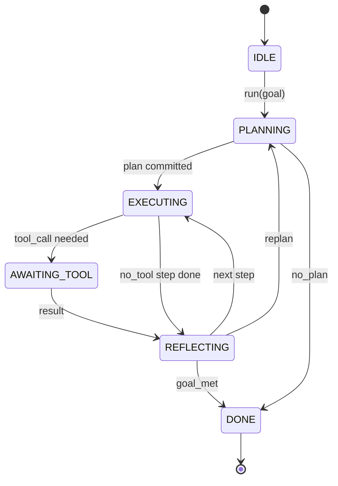

# Hợp đồng Vòng lặp Agent Harness

> Harness chính là agent. Model là bộ đồng xử lý. Bài học này đóng băng hợp đồng vòng lặp mà bạn có thể kết nối bất kỳ model nào vào.

**Type:** Build
**Languages:** Python
**Prerequisites:** Phase 13 lessons 01-07, Phase 14 lesson 01
**Time:** ~90 phút

## Mục tiêu học tập
- Chỉ định vòng lặp agent harness như một máy trạng thái (state machine) tất định với các chuyển đổi rõ ràng.
- Triển khai mười chủ đề hook vòng đời (lifecycle hook) mà người vận hành dùng để gắn policy, telemetry và guardrail vào.
- Xác định hai điểm dừng (pull point) nơi vòng lặp trả quyền điều khiển về cho caller và tiếp tục từ một input mới.
- Thực thi ngân sách theo phiên (số lượt, số lần gọi tool, thời gian thực) mà không làm rò rỉ trạng thái cục bộ khi vượt quá giới hạn.
- Phát ra một luồng sự kiện (event stream) có kiểu dữ liệu gồm mười một loại để các UI và tracer hạ nguồn có thể đăng ký mà không cần kiểm tra trực tiếp vòng lặp.

```figure
cf-loop-contract
```

## Khung cấu trúc

Một coding agent chạy không cần giám sát trong bốn mươi lượt không phải là một vòng lặp chat. Nó là một máy trạng thái mà người vận hành có thể can thiệp vào các node và kiểm toán các cạnh. Một khi bạn đã viết ra hợp đồng, việc thay đổi model, tool hoặc policy không còn là refactor nữa. Nó trở thành một lệnh đăng ký (registration call).

Bài học này xây dựng hợp đồng đó. Chúng ta đặt tên cho sáu trạng thái, mười chủ đề hook, hai điểm dừng, mười một loại sự kiện và một bao thư ngân sách (budget envelope). Mọi thứ khác trong harness (registry tool, transport JSON-RPC, dispatcher, planner) đều cắm vào hình thái này.

## Các trạng thái

Vòng lặp có sáu trạng thái. Năm trạng thái hoạt động. Một trạng thái kết thúc.



`IDLE` là điểm vào hợp lệ duy nhất. `DONE` là điểm thoát hợp lệ duy nhất. `AWAITING_TOOL` là trạng thái duy nhất tạo ra điểm dừng. Mọi chuyển đổi khác đều là nội bộ.

Máy trạng thái này là tất định. Với cùng một nhật ký sự kiện, harness sẽ quay lại cùng một trạng thái. Đặc tính đó cho phép bạn phát lại các phiên để gỡ lỗi mà không cần gọi lại model.

## Các chủ đề hook

Hook là đường nối của người vận hành vào vòng lặp. Harness kích hoạt mười chủ đề. Mỗi chủ đề chấp nhận bất kỳ số lượng subscriber nào. Các subscriber được kích hoạt theo thứ tự đăng ký. Một subscriber có thể thay đổi payload, raise lỗi để hủy lượt, hoặc trả về một sentinel để bỏ qua bước tiếp theo.

```text
before_plan         after_plan
before_tool_call    after_tool_call
before_step         after_step
on_error
on_pause
on_budget_exceeded
on_complete
```

Hình thái này phản ánh những gì Claude Code, Cursor và OpenCode đều đã hội tụ vào giữa năm 2025. Các tên gọi mang tính chức năng, không phải thương hiệu. Một hook chặn `rm -rf` nằm trong `before_tool_call`. Một hook gửi span OpenTelemetry nằm trong `after_step`. Một hook tiếp tục phiên đã tạm dừng nằm trong `on_pause`.

## Các điểm dừng (Pull points)

Vòng lặp trả quyền điều khiển hai lần. Lần đầu tại `AWAITING_TOOL` khi nó không thể tiến triển nếu thiếu kết quả từ tool. Lần thứ hai tại `on_pause` khi ngân sách cạn kiệt hoặc một hook yêu cầu sự xem xét của con người.

Điểm dừng không phải là một ngoại lệ (exception). Nó là một lệnh return. Caller kiểm tra trạng thái harness, lấy bất cứ thứ gì harness yêu cầu và gọi `resume(payload)`. Harness sẽ tiếp tục từ nơi nó dừng lại. Đây là hình thái tương tự như Python generator. Việc truyền tải qua điểm dừng là tùy chọn của bạn. Trong TUI, đó là phím bấm. Qua MCP, đó là `tools/call`. Qua hàng đợi, đó là việc poll job.

## Luồng sự kiện (Event stream)

Vòng lặp thêm các sự kiện vào một luồng có kiểu dữ liệu tại các điểm cụ thể trong hợp đồng. Luồng này chỉ cho phép thêm (append-only) và các subscriber có thể phát lại từ bất kỳ offset nào. Mười một loại sự kiện được triển khai là:

- `session.start` — được phát ra một lần khi `run(goal)` được gọi
- `plan.draft` — được phát ra khi planner trả về một kế hoạch nháp
- `plan.commit` — được phát ra sau khi bản nháp được cam kết thành kế hoạch hoạt động
- `step.start` — được phát ra khi bắt đầu mỗi bước thực thi
- `step.end` — được phát ra khi kết thúc mỗi bước thực thi
- `tool.call` — được phát ra khi một bước yêu cầu tool trả quyền điều khiển cho caller
- `tool.result` — được phát ra khi tiếp tục với kết quả từ tool
- `tool.error` — được phát ra khi tiếp tục với lỗi hoặc khi một hook hủy lệnh gọi
- `budget.warn` — được phát ra khi đạt giới hạn ngân sách
- `session.pause` — được phát ra khi vòng lặp dừng lại (do ngân sách hoặc hook)
- `session.complete` — được phát ra một lần khi vòng lặp đạt đến `DONE`

Các sự kiện không trùng lặp với payload của hook. Hook mang tính mệnh lệnh (thay đổi, hủy bỏ). Sự kiện mang tính quan sát (ghi lại, gửi đi). Hãy coi chúng là các thực thể trực giao.

## Bao thư ngân sách (Budget envelope)

Một phiên mang ba giới hạn: Số lượt, số lần gọi tool, thời gian thực (wall-clock). Mỗi lượt tăng số lượt lên một. Mỗi lần gọi tool tăng số lần gọi tool lên một. Thời gian thực được kiểm tra tại mỗi lần chuyển đổi trạng thái. Khi đạt bất kỳ giới hạn nào, vòng lặp kích hoạt `on_budget_exceeded`, phát ra `budget.warn`, sau đó chuyển sang `IDLE` với lý do vượt quá ngân sách tại điểm dừng tiếp theo.

Ngân sách không phải là công tắc ngắt (kill switch). Nó là một điểm dừng. Caller quyết định có mở rộng ngân sách và tiếp tục, hay đóng phiên.

## Những gì bài học này không làm

Nó không gọi model. Nó không đăng ký tool thực tế. Nó không triển khai transport. Đó là nội dung của bốn bài học tiếp theo. Bài học này chốt hạ hợp đồng để bốn bài tiếp theo có thể cắm vào mà không cần viết lại.

Planner tất định trong `main.py` chỉ là một thành phần thay thế. Nó trả về một kế hoạch cứng gồm ba bước, trong đó hai bước yêu cầu kết quả từ tool. Trọng tâm là vòng lặp, không phải kế hoạch.

## Cách đọc mã nguồn

`HarnessLoop` là class chính. Nó giữ trạng thái, kích hoạt hook, phát sự kiện. `Budget` theo dõi các giới hạn. `Event` là bao thư có kiểu dữ liệu trên luồng. `HookRegistry` là bảng điều phối (dispatch table). `_transition` là hàm duy nhất thay đổi trạng thái, vì vậy các bất biến của máy trạng thái nằm ở một nơi.

Hãy đọc `main.py` từ trên xuống dưới. Sau đó đọc `code/tests/test_loop.py`. Các bài kiểm thử (test) sẽ ghim chặt mọi chuyển đổi và thứ tự kích hoạt hook.

## Đi xa hơn

Phần khó nhất khi xây dựng harness trong môi trường production không phải là máy trạng thái. Đó là làm cho hợp đồng có thể thực thi được. Hợp đồng phải sống sót sau khi hot reload planner. Nó phải sống sót sau một tool trả về JSON sai định dạng. Nó phải sống sót sau một hook bị raise lỗi tại `before_tool_call` khi đã đi được hai phần ba phiên bốn mươi lượt. Các bài kiểm thử trong bài học này thực thi các chế độ lỗi đó. Hãy chạy chúng. Phá vỡ chúng. Thêm các trường hợp mới.

Bài học tiếp theo sẽ thêm registry tool. Sau đó là transport JSON-RPC. Sau đó là dispatcher. Đến bài hai mươi bốn, vòng lặp trong file này sẽ chạy một kế hoạch thực tế với các tool thực tế và ngân sách thực tế được thực thi.