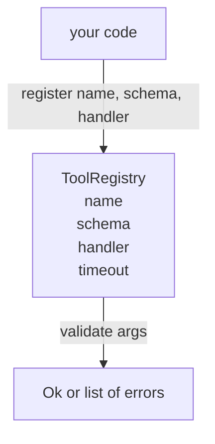

# Tool Registry with Schema Validation

> Một công cụ mà agent không thể xác thực là một công cụ mà agent không thể gọi. Hãy xây dựng registry và trình kiểm tra schema trước khi bạn xây dựng các công cụ.

**Type:** Build
**Languages:** Python
**Prerequisites:** Phase 13 lessons 01-07, Phase 14 lesson 01
**Time:** ~90 minutes

## Learning Objectives
- Duy trì một registry có kiểu dữ liệu (typed registry) gồm tên công cụ → schema → handler mà dispatcher có thể truy vấn một lần và tin tưởng sau đó.
- Triển khai một tập con của JSON Schema 2020-12 bao phủ các từ khóa mà 90% các lệnh gọi công cụ thực tế sử dụng.
- Trả về các đường dẫn lỗi chính xác theo định dạng json-pointer để model có thể tự sửa lỗi trong một vòng lặp (round trip).
- Từ chối việc đăng ký lại nếu không có ghi đè (override) rõ ràng, vì việc ghi đè âm thầm là nguyên nhân khiến các danh mục công cụ trong môi trường production bị sai lệch.
- Giữ cho validator ở trạng thái thuần túy (không I/O, không thời gian, không biến toàn cục) để có thể chạy lại trên log ghi lại (replay log).

```figure
cf-registry-validate
```

## Tại sao registry lại quan trọng trước khi xây dựng công cụ

Một coding agent vào năm 2026 có nhiều công cụ được đăng ký hơn mức mà model có thể chứa trong một cửa sổ ngữ cảnh (context window). Một hệ thống phức tạp sẽ đăng ký hai trăm công cụ và hiển thị từ mười đến bốn mươi công cụ tại bất kỳ lượt gọi nào. Registry là nguồn sự thật (source of truth) cho việc "công cụ nào tồn tại", "đối số của chúng có hình dạng như thế nào" và "tôi nên gọi handler nào". Khi ba câu trả lời đó đã được xác định, phần còn lại của hệ thống có thể ngừng việc đoán mò.

Sai lầm mà chúng ta đang tránh là cung cấp các handler mà không có schema, hoặc cung cấp schema mà không có xác thực. Cả hai đều phổ biến. Cả hai đều biến lớp tiếp theo (dispatcher trong bài học 23) thành một trò chơi đoán mò, nơi chế độ lỗi duy nhất là một stack trace từ handler.

## Hình dạng của một bản ghi công cụ

```text
ToolRecord
  name        : str          (unique, lowercase alphanumeric and underscore segments separated by dots, e.g., snake_case.segment.case)
  description : str          (one line, shown to the model)
  schema      : dict         (JSON Schema 2020-12 subset)
  handler     : Callable     (async or sync, returns Any)
  idempotent  : bool         (dispatcher uses this for retry decisions)
  timeout_ms  : int          (override per-tool dispatcher default)
```

Schema là trường duy nhất mà validator tác động vào. Handler là một "hộp đen" đối với nó. Chúng ta tách biệt chúng một cách có chủ đích. Schema là dữ liệu. Handler là mã nguồn. Việc trộn lẫn chúng sẽ cám dỗ bạn đặt logic xác thực vào bên trong handler, đó chính là lỗi mà chúng ta đang ngăn chặn.

## Tập con JSON Schema 2020-12

Thông số kỹ thuật đầy đủ của 2020-12 là một tài liệu rất dài. Chúng ta chỉ cần tám từ khóa.

```text
type           string / number / integer / boolean / object / array / null
properties     map of property name -> schema
required       list of property names
enum           list of allowed primitive values
minLength      integer, applies to strings
maxLength      integer, applies to strings
pattern        ECMA-262-compatible regex, applies to strings
items          schema applied to every array element
```

Đó là đủ để bao phủ những gì một API công cụ thực sự cần. Các từ khóa mà chúng ta không thêm vào (oneOf, anyOf, allOf, $ref, conditionals) là các từ khóa hợp lệ trong các schema production nhưng sẽ biến validator thành một trình duyệt cây (tree walker) có chu kỳ. Chúng ta đang xây dựng một registry, không phải một công cụ JSON Schema engine.

## Đường dẫn lỗi Json pointer

Khi xác thực thất bại, validator trả về một danh sách các lỗi. Mỗi lỗi mang theo một đường dẫn json-pointer trỏ vào dữ liệu đầu vào. Một pointer là một chuỗi các tên thuộc tính và chỉ số mảng được phân tách bằng dấu gạch chéo.

```text
{"a": {"b": [1, 2, "x"]}}
                    ^
                    /a/b/2
```

Model đọc các đường dẫn lỗi tốt hơn là đọc các câu văn. Nếu một schema yêu cầu `args.user.email` và model truyền vào một số nguyên, lỗi trả về nên là `/user/email` với `expected_type: string`. Model sẽ sửa lỗi đó trong lần gọi tiếp theo mà không cần thêm một vòng lặp ngôn ngữ tự nhiên nào.

## Đăng ký và ghi đè

`register(name, schema, handler, **opts)` từ chối việc đăng ký lại theo mặc định. Người gọi phải truyền `override=True` để thay thế. Đây là quy tắc vệ sinh vận hành. Hai phần của codebase âm thầm đăng ký cùng một tên công cụ là loại lỗi mất cả tuần để tìm ra trong môi trường production.

Registry cung cấp ba phương thức đọc. `get(name)` trả về bản ghi hoặc đưa ra ngoại lệ. `validate(name, args)` trả về một `Ok` hoặc một danh sách các lỗi. `names()` trả về tên các công cụ theo thứ tự đăng ký.

## Validator là gì và không là gì

Nó là một lượt duyệt qua cây schema, mang tính đệ quy. Nó thuần túy. Nó không gọi các handler. Nó không ép kiểu (một chuỗi `"42"` sẽ không vượt qua được schema kiểu số). Nó không cắt bớt dữ liệu một cách âm thầm.

Nó không phải là một ranh giới bảo mật. Một handler độc hại vẫn có thể hoạt động sai sau khi xác thực thành công. Dispatcher trong bài học 23 sẽ thêm các lớp timeout và sandbox. Registry chỉ thêm hình dạng (shape).

## Hình dạng (Shape)



## Cách đọc mã nguồn

`code/main.py` định nghĩa `ToolRegistry`, `ToolRecord`, `ValidationError` và tám hàm validator. Validator phân phối dựa trên `schema["type"]` (hoặc xử lý một schema với `enum` như một kiểm tra enum không kiểu). Mỗi validator kiểu dữ liệu trả về một danh sách rỗng hoặc một danh sách các `ValidationError`. Trình duyệt cây cấp cao nhất sẽ nối các lỗi và thêm các phân đoạn đường dẫn khi nó đi sâu xuống.

`code/tests/test_registry.py` bao gồm việc đăng ký, ghi đè, xác thực thành công, xác thực thất bại với đường dẫn và mọi từ khóa trong tập con.

## Đi xa hơn

Hai phần mở rộng mà bạn sẽ muốn có sau khi bài học này kết thúc là giải quyết `$ref` dựa trên một khối định nghĩa cục bộ, và `additionalProperties: false` cho hình dạng nghiêm ngặt. Cả hai đều nhỏ gọn. Cả hai đều phổ biến khi danh mục công cụ phát triển vượt quá năm mươi công cụ. Chúng tôi đã lược bỏ chúng khỏi bài học để giữ cho tệp tin nằm trong phạm vi một lần đọc.

Bài học tiếp theo (22) xây dựng transport JSON-RPC stdio để hiển thị registry này cho một model client. Bài học sau đó (23) bao bọc cả hai phía sau một dispatcher với các cơ chế timeout và thử lại.