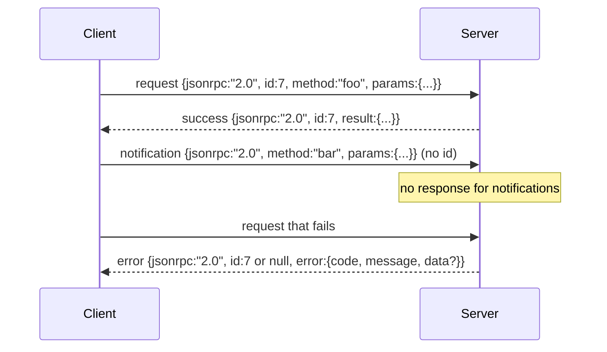

# JSON-RPC 2.0 qua Newline-Delimited Stdio

> Giao thức truyền tải giữa một model client và một tool server là JSON-RPC qua stdio. Việc tự tay triển khai nó một lần sẽ giúp bạn hiểu rõ cái giá phải trả cho từng lớp đóng gói (framing layer).

**Type:** Build
**Languages:** Python
**Prerequisites:** Phase 13 lessons 01-07, Phase 14 lesson 01
**Time:** ~90 phút

## Mục tiêu học tập
- Giao tiếp bằng JSON-RPC 2.0 được đóng gói dưới dạng JSON phân tách bằng dòng mới (newline-delimited) qua stdin và stdout.
- Ánh xạ năm mã lỗi tiêu chuẩn (-32700, -32600, -32601, -32602, -32603) và hiển thị chúng với ngữ nghĩa chính xác.
- Phân biệt giữa requests, responses, notifications và batches mà không cần tạo ra các envelope key mới.
- Xử lý lỗi phân tích cú pháp (parse error) trên mỗi dòng mà không làm hỏng phần còn lại của luồng dữ liệu.
- Xây dựng một bản demo tự kết thúc sử dụng io.BytesIO để bài học có thể chạy mà không cần tạo tiến trình con (child process).

```figure
cf-jsonrpc-frames
```

## Tại sao JSON-RPC vẫn là ngôn ngữ chung (lingua franca)

Một coding agent vào năm 2026 có thể giao tiếp với khoảng mười hai tool server trong một phiên làm việc. Mỗi server là một tiến trình riêng biệt hoặc một remote endpoint. Định dạng truyền tải (wire format) vẫn giữ nguyên từ năm 2013. JSON-RPC 2.0 là một đặc tả chỉ dài hai trang. Nó tồn tại được vì các giải pháp thay thế (gRPC, HTTP per call, custom binary) đều áp đặt những đánh đổi mà JSON-RPC không có: chúng chọn hoặc là streaming, hoặc là batching, hoặc là phụ thuộc vào transport. JSON-RPC có tính đối xứng trên stdio, sockets, websockets và HTTP, và một client có thể điều khiển một server mà nó chưa từng biết đến nếu cả hai đều tuân thủ đặc tả.

Bài học này xây dựng biến thể stdio. JSON phân tách bằng dòng mới. Mỗi request là một dòng. Mỗi response là một dòng. Ranh giới truyền tải là `\n`.

## Hình thái truyền tải (The wire shape)

Có bốn hình thái envelope. Hai loại được client sử dụng. Hai loại được server sử dụng.



Một notification không có `id`. Server không được phép phản hồi lại nó. Nếu server trả về một response cho một notification, client sẽ không có cách nào để gắn nó vào vị trí gọi (call site). Quy tắc đơn giản đó giúp việc tính toán đóng gói trở nên dễ dàng.

Một batch là một mảng JSON chứa các requests hoặc notifications. Server trả lời bằng một mảng các responses, theo bất kỳ thứ tự nào, mỗi entry không phải là notification sẽ tương ứng với một response. Nếu mọi entry trong batch đều là notification, server sẽ không gửi lại gì cả.

## Năm mã lỗi

```text
-32700  Parse error      JSON could not be parsed
-32600  Invalid Request  Envelope shape is wrong
-32601  Method not found
-32602  Invalid params
-32603  Internal error
```

Các mã từ -32000 đến -32099 được dành riêng cho các lỗi do server định nghĩa. Tất cả các mã khác là do ứng dụng định nghĩa. Bài học này tập trung vào năm mã lỗi chính. Nếu handler của bạn phát sinh lỗi, lớp truyền tải sẽ đóng gói nó thành -32603 với tên lớp ngoại lệ nằm trong `data.exception`.

Lỗi phân tích cú pháp (parse error) có một quy tắc đặc biệt. `id` trong response sẽ là `null`, vì request chưa bao giờ được phân tích đủ để trích xuất id.

## Đóng gói dòng mới và demo BytesIO

Lớp truyền tải đọc từng dòng một. Một dòng là các byte cho đến và bao gồm cả `\n`. Nếu một dòng không thể phân tích cú pháp, lớp truyền tải sẽ ghi một response -32600 với `id: null` và tiếp tục. Luồng dữ liệu không bị hỏng. Dòng tiếp theo sẽ được phân tích như mới.

Đối với bài học này, chúng ta bao bọc một cặp `io.BytesIO` làm stdin và stdout. Server đọc các requests cho đến khi gặp EOF, ghi các responses cho mỗi request, và kết thúc. Client đọc lại các responses. Không cần tạo tiến trình. Không cần timeout. Hành vi truyền tải giống hệt như một subprocess pipe thực tế vì giao diện `io` của Python cung cấp cùng một hợp đồng `.readline()` và `.write()`.

## Điều phối phương thức (Method dispatch)

Lớp truyền tải không biết những phương thức nào tồn tại. Nó chuyển giao cho một callable `handler(method, params)` mà harness cung cấp. Handler trả về kết quả hoặc phát sinh lỗi. Ba lớp ngoại lệ sẽ hiển thị các mã lỗi cụ thể.

```text
MethodNotFound -> -32601
InvalidParams  -> -32602
Anything else  -> -32603 with exception name in data
```

Lớp truyền tải không bao giờ nhìn thấy tool registry. Registry nằm phía sau handler. Đây là sự phân lớp mà chúng ta mong muốn. Lớp truyền tải nói ngôn ngữ JSON-RPC. Registry nói ngôn ngữ các hình thái công cụ (tool shapes). Bộ điều phối (bài học 23) sẽ kết nối chúng lại với nhau.

## Hành vi luồng dữ liệu khi có lỗi

```text
client writes              server reads             server writes
---------------            -----------              -------------
{...valid request...}      parses ok                {...response, id matches...}
{...broken json...         parse fails              {id:null, error: -32700}
{...valid request...}      parses ok                {...response, id matches...}
{...missing method...}     invalid envelope         {id:X, error: -32600}
```

Một dòng JSON bị lỗi không làm dừng vòng lặp. Một trường `method` bị thiếu không làm dừng vòng lặp. Một ngoại lệ từ handler không làm dừng vòng lặp. Lớp truyền tải tiếp tục đọc cho đến khi gặp EOF.

## Notifications và luồng không đối xứng

Notification là dạng "gửi và quên" (fire-and-forget). Harness sử dụng notifications cho các sự kiện tiến trình, tín hiệu hủy bỏ và các dòng log. Notifications là cách để một công cụ chạy dài hạn có thể stream các cập nhật trạng thái mà không cần phải thực hiện round-trip cho mỗi cập nhật.

Bài học này triển khai một helper cho notification gửi đi là `write_notification`. Server sử dụng nó để phát ra tiến trình trong khi một request đang được xử lý. Bản demo cho thấy mô hình này: một request đến, handler phát ra hai notification về tiến trình, sau đó ghi response cuối cùng.

## Cách đọc mã nguồn

`code/main.py` định nghĩa `StdioTransport`, helper phân tích cú pháp (`parse_request`), ba helper ghi dữ liệu (`write_response`, `write_error`, `write_notification`), và vòng lặp điều phối `serve`. Các hằng số mã lỗi nằm ở phạm vi module.

`code/tests/test_transport.py` bao gồm năm mã lỗi, notifications (không ghi response), batches (mảng vào, mảng ra, bỏ qua notifications), JSON bị lỗi (parse error rồi tiếp tục), và luồng không đối xứng nơi handler ghi một notification giữa chừng khi đang gọi.

## Đi xa hơn

Lớp truyền tải này là đủ cho các bài học tiếp theo. Các lớp truyền tải trong môi trường production sẽ bổ sung ba thứ. Một trường correlation id có thể tồn tại qua quá trình chuyển tiếp (`id` của bạn đã có sẵn điều này, nhưng trong một mesh, bạn cần thêm một outer trace id). Một kênh hủy bỏ (một notification như `$/cancelRequest` với id của lệnh gọi đang thực hiện). Và một handshake thương lượng content-type để cùng một socket có thể nói cả JSON-RPC và Streamable HTTP. Không có điều nào trong số đó làm thay đổi wire format. Chúng chỉ bổ sung metadata.