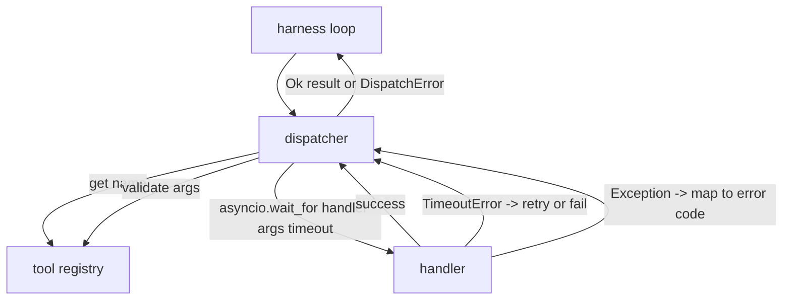
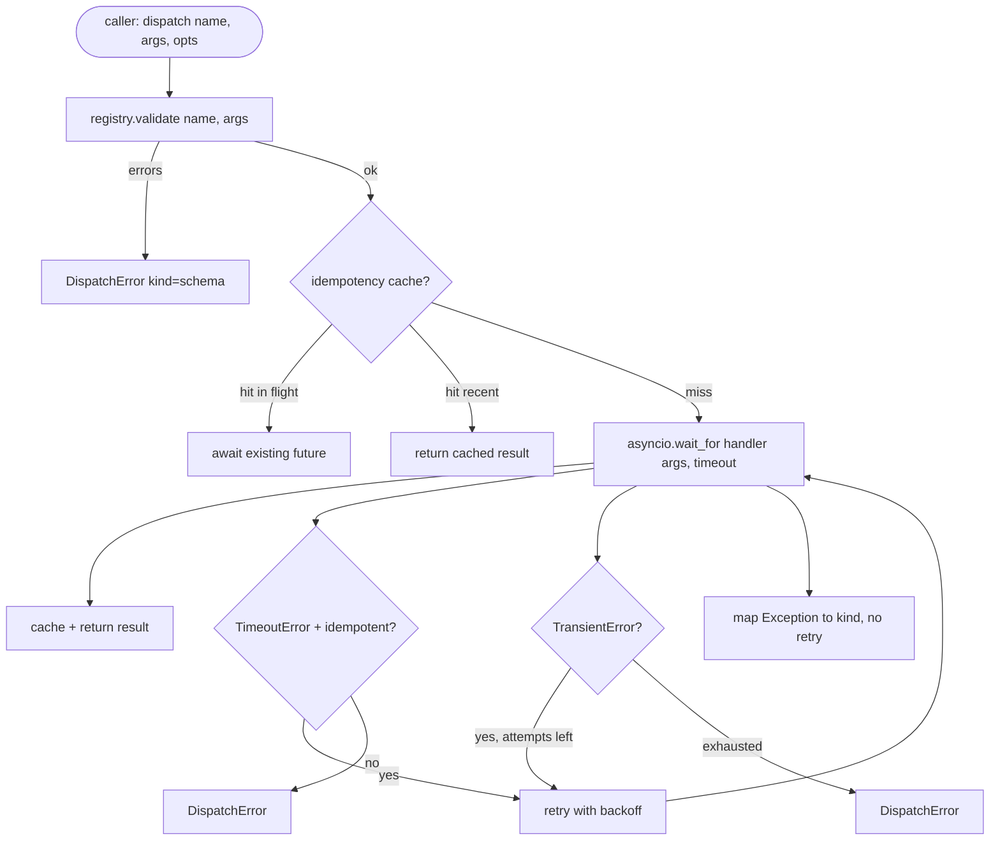

# Function Call Dispatcher

> Dispatcher là nơi mà harness thực hiện mọi cam kết mà schema đã đưa ra. Timeout, retry, dedupe, ánh xạ lỗi. Tất cả đều nằm trên một điểm nối duy nhất.

**Type:** Build
**Languages:** Python
**Prerequisites:** Phase 13 lessons 01-07, Phase 14 lesson 01
**Time:** ~90 phút

## Mục tiêu học tập
- Bao bọc một tool handler trong timeout theo từng lệnh gọi, trả về lỗi có kiểu dữ liệu thay vì làm treo vòng lặp.
- Áp dụng cơ chế retry exponential backoff với jitter và số lần thử tối đa.
- Khử trùng lặp (deduplicate) các lần retry dựa trên idempotency key để đảm bảo một lần retry chạy song song với lệnh gọi gốc chậm chạp sẽ không thực thi hai lần.
- Ánh xạ các ngoại lệ của handler và lỗi truyền tải (transport faults) vào một error envelope duy nhất mà vòng lặp harness có thể hiểu được.
- Giới hạn dispatch song song bằng concurrency limit để việc fan-out bốn mươi tool call không làm cạn kiệt event loop.

```figure
cf-dispatch-retry
```

## Vị trí của dispatcher

Nằm giữa vòng lặp harness (bài 20) và tool registry (bài 21). Transport (bài 22) cung cấp dữ liệu cho vòng lặp. Vòng lặp chuyển một tool call đến dispatcher. Dispatcher gọi registry, chạy handler và trả về kết quả hoặc một error envelope theo định dạng JSON-RPC.



Dispatcher là lớp duy nhất biết về timers, retries và idempotency. Vòng lặp không biết. Registry không biết. Handler cũng không biết. Sự cô lập đó chính là mục đích thiết kế.

## Timeouts

Mỗi tool có một timeout mặc định. Bản ghi registry chứa `timeout_ms`. Dispatcher sẽ ghi đè nó bằng giá trị override theo từng lệnh gọi khi harness cung cấp. Chúng ta sử dụng `asyncio.wait_for`. Khi timeout xảy ra, tác vụ handler sẽ bị hủy và dispatcher trả về `DispatchError(kind="timeout")`.

Theo mặc định, timeout không phải là một lỗi có thể retry đối với các tool không có tính idempotent. Một `db.write` bị timeout có thể đã được commit hoặc chưa. Việc retry sẽ gây ra ghi đè trùng lặp. Dispatcher tuân thủ cờ `idempotent` từ bản ghi registry. Các tool idempotent sẽ được retry. Các tool không có tính idempotent thì không.

## Retries với exponential backoff

Chính sách retry tối đa là ba lần. Backoff theo hàm mũ với jitter.

```text
attempt 1  -> delay 0
attempt 2  -> delay 0.1s * (1 + random[0..0.5])
attempt 3  -> delay 0.4s * (1 + random[0..0.5])
```

Chỉ các lỗi `timeout` và `transient` mới được retry. Lỗi `schema`, `not_found` hoặc `internal` sẽ không được retry. Các lỗi schema là lỗi tất định (deterministic). Việc retry không làm thay đổi kết quả và chỉ gây lãng phí tài nguyên.

Vòng lặp retry tuân thủ ngân sách (budget) từ harness. Nếu ngân sách của caller không còn lượt gọi tool nào, dispatcher sẽ thất bại ngay lập tức ở lần thử đầu tiên và trả về `kind="budget_exceeded"`.

## Idempotency key dedupe

Một lần retry kích hoạt trong khi lệnh gọi gốc vẫn đang thực thi là một lỗi production thực sự. Lệnh gọi đầu tiên treo ở mức 4,9 giây (ngay dưới ngưỡng timeout). Lần retry kích hoạt ở giây thứ 5. Bây giờ hai request cùng chạy đua vào một backend. Nếu tool đó là `payments.charge`, bạn đã bị tính phí hai lần.

Dispatcher chấp nhận một `idempotency_key` tùy chọn. Nếu cùng một key đang trong quá trình thực thi khi một lệnh gọi mới đến, dispatcher sẽ đợi future đang chạy đó và trả về kết quả của nó. Cache lưu giữ các key trong 60 giây sau khi hoàn tất để hấp thụ các lần retry muộn.

Key là trách nhiệm của caller. Harness lấy nó từ planner: `f"{step_id}:{tool_name}:{hash(args)}"`. Dispatcher không tự tạo key, vì việc lấy key chỉ từ các đối số (arguments) sẽ khiến hai lệnh gọi khác nhau về ngữ nghĩa trông có vẻ giống nhau.

## Error envelope

Một dispatch thất bại sẽ trả về một cấu trúc duy nhất.

```text
DispatchError
  kind        : "timeout" | "transient" | "schema" | "not_found" | "internal" | "budget_exceeded"
  message     : str
  attempts    : int
  jsonrpc_code: int   (one of -32601, -32602, -32603)
```

Vòng lặp harness ánh xạ `kind` sang trạng thái tiếp theo. `schema` và `not_found` chuyển đến `on_error` và kích hoạt replan. `timeout` và `transient` chuyển đến `on_error` và có thể replan hoặc không tùy thuộc vào số lần thử. `budget_exceeded` kích hoạt `on_budget_exceeded`.

## Giới hạn concurrency cho fan-out

`gather(*calls)` chạy tất cả các coroutine cùng một lúc. Với bốn mươi tool call, đó là bốn mươi socket đang mở hoặc bốn mươi subprocess pipe. Hầu hết các backend không thích bốn mươi kết nối song song từ một client.

Dispatcher bao bọc `gather` trong một semaphore. Giới hạn concurrency mặc định là tám. Mỗi lệnh gọi sẽ lấy semaphore trước khi dispatch và giải phóng khi hoàn tất. Caller vẫn thấy kết quả dạng `gather` nhưng việc lập lịch thực tế đã bị giới hạn.

## Luồng cho một lệnh gọi



## Cách đọc mã nguồn

`code/main.py` định nghĩa `Dispatcher`, `DispatchError` và `TransientError`. Dispatcher nhận một registry khi khởi tạo. Async `dispatch(name, args, ...)` là điểm truy cập duy nhất. Timeout cho mỗi lần thử được áp dụng nội tuyến bên trong `_run_with_retries` sử dụng `asyncio.wait_for`. `gather_bounded(calls)` chạy nhiều dispatch với giới hạn concurrency.

`code/tests/test_dispatcher.py` bao gồm việc kích hoạt timeout, retry khi gặp lỗi tạm thời, không retry khi lỗi schema, khử trùng lặp idempotency (hai lệnh gọi đồng thời với cùng một key sẽ gộp lại thành một lần gọi handler) và giới hạn concurrency (semaphore hoạt động).

Các bài kiểm tra sử dụng `asyncio.sleep(0)` và các handler dựa trên `Counter` tất định, vì vậy chúng kết thúc trong vài mili giây và không phụ thuộc vào thời gian thực (wall-clock timing).

## Đi xa hơn

Hai phần mở rộng mà các dispatcher trong môi trường production thường thêm vào. Thứ nhất, logging có cấu trúc tại mọi bước chuyển đổi (điều mà event stream của vòng lặp đã cung cấp, nhưng dispatcher cũng nên phát ra các sự kiện `dispatch.attempt` và `dispatch.retry`). Thứ hai, circuit breakers: sau N lần thất bại trong một khoảng thời gian, một tool sẽ có thời gian "hạ nhiệt" (cool-down), nơi các dispatch trả về ngay lập tức với `kind="circuit_open"` thay vì cố gắng gọi handler. Cả hai đều có thể được xây dựng trên dispatcher này mà không cần thay đổi hợp đồng (contract) hiện tại.

Bài 24 sẽ kết nối dispatcher với một plan-and-execute agent để bạn thấy cả bốn phần hoạt động cùng nhau.