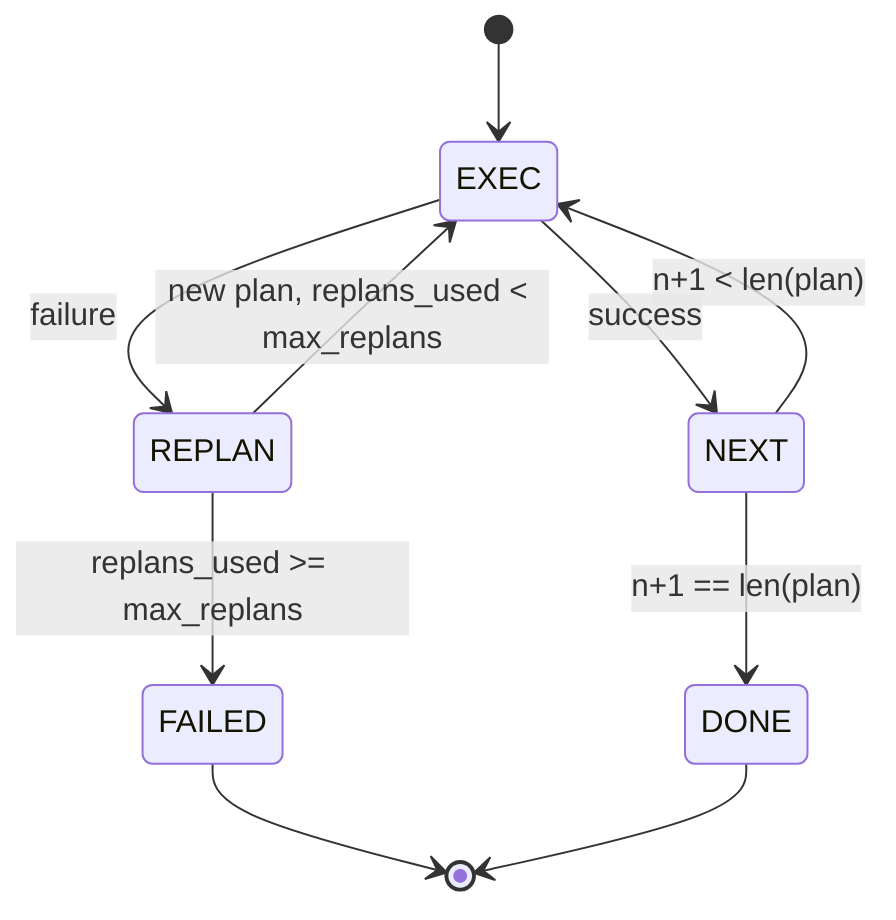

# Plan-Execute Control Flow

> Một kế hoạch không thể vượt qua thất bại chỉ là một kịch bản. Một kịch bản có khả năng lập kế hoạch lại mới là một agent. Hãy xây dựng bộ lập kế hoạch lại (replanner) trước.

**Type:** Build
**Languages:** Python
**Prerequisites:** Phase 13 lessons 01-07, Phase 14 lesson 01
**Time:** ~90 minutes

## Learning Objectives
- Biểu diễn một kế hoạch dưới dạng danh sách các bước có kiểu dữ liệu cụ thể để executor có thể suy luận về tiến độ và kết quả.
- Thực thi các bước theo trình tự với cơ chế xử lý thất bại có kiểm soát, chuyển quyền điều khiển ngược lại cho planner.
- Lập kế hoạch lại từ con trỏ (cursor) hiện tại với lỗi trước đó nằm trong ngữ cảnh để kế hoạch tiếp theo được thông tin đầy đủ hơn.
- Phát ra một plan diff (sự khác biệt giữa các kế hoạch) trong mỗi lần sửa đổi để tracer hoặc UI hạ nguồn có thể hiển thị lý do tại sao kế hoạch thay đổi.
- Thực thi hai hạn mức: giới hạn cứng về số bước và giới hạn cứng về số lần lập kế hoạch lại.

```figure
cg-plan-replan
```

## Plan and execute, không phải chain-of-thought

Một agent chain-of-thought phát ra các token và để vòng lặp đoán xem lời gọi công cụ (tool call) kết thúc ở đâu. Một agent plan-and-execute phát ra một kế hoạch có cấu trúc trước, sau đó thực thi từng bước một cách xác định. Kế hoạch là dữ liệu mà harness có thể kiểm tra. Việc thực thi là quá trình harness chạy dữ liệu đó thông qua một dispatcher.

Gồm hai phần. Một planner tạo ra kế hoạch. Một executor chạy kế hoạch đó. Công việc thú vị nằm ở những gì xảy ra khi executor gặp thất bại. Có ba lựa chọn:

```text
1. Abort         (return failed, surface the error)
2. Skip          (mark step failed, continue with the rest)
3. Replan        (hand the error to the planner, get a new plan from the cursor)
```

Replan là yếu tố biến một kịch bản thành một agent.

## Hình dạng của một Step

```text
Step
  id              : int           (monotonic within a plan revision)
  tool_name       : str
  args            : dict
  expected_outcome: str           (planner's stated success condition)
  result          : Any | None
  error           : str | None
```

`expected_outcome` là một câu ngắn mà planner phát ra cùng với bước đó. Nó không bị executor ép buộc. Nó phục vụ hai mục đích: replanner đọc nó khi sửa đổi kế hoạch; và luồng sự kiện phát ra nó để tracer có thể hiển thị "bước này được dự định để làm X."

## Hình dạng của một Planner

```python
def planner(goal: str, history: list[Step], last_error: str | None) -> list[Step]:
    ...
```

Một hàm thuần túy (pure function). `goal` là mục tiêu của người dùng. `history` là các bước đã thực thi (với kết quả và lỗi được điền vào). `last_error` là None trong lần gọi đầu tiên và là thông báo lỗi gần nhất trong mọi lần gọi tiếp theo. Planner trả về kế hoạch tiếp theo bắt đầu từ con trỏ.

Planner không biết về executor. Nó không biết về việc thử lại (retries). Nó không biết về thời gian chờ (timeouts). Nó chỉ tạo ra một kế hoạch. Chỉ vậy thôi.

## Executor

Executor là một máy trạng thái nhỏ. Mỗi bước chạy qua dispatcher. Kết quả là một trong ba trạng thái: thành công, thất bại-có thể lập kế hoạch lại, thất bại-nghiêm trọng. Các thất bại có thể lập kế hoạch lại sẽ chuyển quyền điều khiển ngược lại cho planner. Các thất bại nghiêm trọng (vượt quá ngân sách, đạt giới hạn lập kế hoạch lại) sẽ trả về một kết quả phiên `FAILED`.



## Plan diffs khi sửa đổi

Khi planner trả về một kế hoạch mới sau khi thất bại, executor phát ra một sự kiện `plan.diff` với ba trường.

```text
removed: list of step ids that were in the old plan and are not in the new
added  : list of step ids in the new plan that were not in the old
revised: list of step ids whose tool_name or args changed
```

Tracer hoặc UI có thể hiển thị điều này dưới dạng gạch ngang trên các bước đã bị loại bỏ và làm nổi bật các bước được thêm vào. Điểm quan trọng không phải là định dạng diff. Điểm quan trọng là việc sửa đổi là một sự kiện có thể nhìn thấy được, không phải là một sự viết lại âm thầm.

## Hai hạn mức, cả hai đều là giới hạn cứng

`max_steps` giới hạn tổng số lần thực thi bước trong toàn bộ phiên, bao gồm cả các lần lập kế hoạch lại. Mặc định là mười hai. Một kế hoạch tuyến tính năm bước mà lập kế hoạch lại hai lần và thêm ba bước mỗi lần sẽ đạt mười sáu lần thực thi và vượt quá ngân sách. Executor sẽ từ chối việc lập kế hoạch lại và trả về FAILED.

`max_replans` giới hạn số lần planner được gọi sau kế hoạch đầu tiên. Mặc định là năm. Đây là giới hạn quan trọng hơn. Một planner trả về cùng một kế hoạch bị lỗi năm lần liên tiếp sẽ lặp vô tận cho đến khi ngân sách bước ngăn lại. Việc giới hạn số lần lập kế hoạch lại giúp phát hiện thất bại nhanh hơn và lý do rõ ràng hơn.

## Planner xác định trong bài học này

Chúng ta không gọi model trong bài học này. Bài học cung cấp một planner xác định (deterministic planner) chọn kế hoạch dựa trên `last_error`.

```text
last_error is None    -> emit a four-step plan
last_error matches X  -> emit a three-step plan that routes around X
last_error matches Y  -> emit a two-step plan that gives up gracefully
otherwise             -> return [] (signals nothing to replan)
```

Điều này đủ để kiểm tra hành vi của executor trên mọi đường dẫn chuyển đổi: thành công, lập kế hoạch lại một lần, lập kế hoạch lại hai lần, cạn kiệt khả năng lập kế hoạch lại và cạn kiệt ngân sách bước.

## Hình dạng của kết quả

```text
SessionResult
  status      : "completed" | "failed"
  reason      : str     ("goal_met" | "step_budget" | "replan_budget" | "no_plan")
  history     : list[Step]
  revisions   : list[PlanDiff]
  events      : list[Event]
```

Vòng lặp harness từ bài học hai mươi có thể đọc trực tiếp kết quả này. Dispatcher từ bài học hai mươi ba là thứ thực thi từng bước. Registry từ bài học hai mươi mốt xác thực các đối số của từng bước. Transport từ bài học hai mươi hai sẽ hiển thị toàn bộ luồng này qua JSON-RPC tới một model client.

## Cách đọc mã nguồn

`code/main.py` định nghĩa `PlanExecuteAgent`, `Step`, `PlanDiff`, `SessionResult` và planner xác định. Executor là một phương thức `run(goal)` duy nhất trả về một `SessionResult`. Plan diff được tính toán bằng cách so sánh các id bước và các tuple `(tool_name, args)`.

`code/tests/test_agent.py` bao gồm một trường hợp thành công tuyến tính, một thất bại giữa chừng khi đang thực thi kế hoạch và lập kế hoạch lại một lần, cạn kiệt khả năng lập kế hoạch lại dẫn đến trả về `failed:replan_budget`, cạn kiệt ngân sách bước và định dạng sự kiện plan-diff.

## Đi xa hơn

Hai phần mở rộng bạn sẽ muốn có khi kết nối điều này với một model thực tế. Thứ nhất, lưu trữ đệm kế hoạch một phần (partial-plan caching): khi một kế hoạch thành công ba trong sáu bước rồi thất bại, bạn không muốn chạy lại ba bước đầu tiên. Executor đã lưu giữ lịch sử; planner chỉ cần đọc nó. Thứ hai, các nhánh song song: executor hiện tại chỉ chạy tuần tự. Một planner phát ra một nhánh độc lập (`gather_step` thay vì `next_step`) có thể chạy hai lời gọi công cụ đồng thời thông qua dispatcher.

Cả hai đều thêm độ phức tạp thực sự. Cả hai đều dễ thêm hơn khi executor tuyến tính đã được cố định. Đó là những gì bài học này thực hiện.