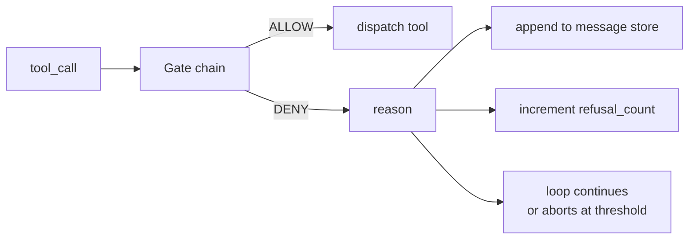
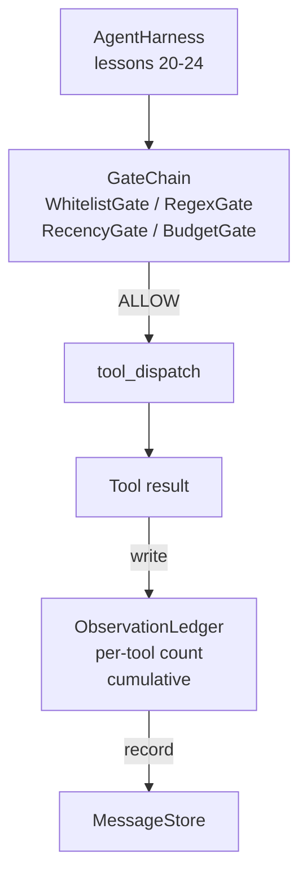

# Capstone Lesson 25: Verification Gates and the Observation Budget

> Một agent harness không có lớp xác thực (verification layer) chẳng khác nào một lời cầu nguyện khoác lên mình chiếc áo choàng. Bài học này xây dựng chuỗi gate xác định (deterministic gate chain) để quyết định xem một tool call có được phép thực thi hay không, agent được phép thấy bao nhiêu phần kết quả đầu ra, và khi nào vòng lặp phải dừng lại vì agent đã đọc quá nhiều. Chuỗi này là một hàm gồm các gate nhỏ, có tên gọi, kết hợp với một observation ledger theo dõi mọi token mà model đã được hiển thị.

**Type:** Build
**Languages:** Python (stdlib)
**Prerequisites:** Phase 19 · 20-24 (Track A1: agent loop, tool registry, message store, prompt builder, model router), Phase 14 · 33 (instructions as constraints), Phase 14 · 36 (scope contracts), Phase 14 · 38 (verification gates)
**Time:** ~90 phút

## Learning Objectives

- Xây dựng giao thức `VerificationGate` với phương thức `evaluate(call)` xác định.
- Kết hợp các gate về ngân sách (budget), độ mới (recency), danh sách trắng (whitelist) và regex thành một chuỗi với ngữ nghĩa ngắt mạch (short-circuit semantics).
- Theo dõi mọi quan sát thông qua `ObservationLedger` được khóa bởi tool và lượt (turn).
- Từ chối một tool call khi ngân sách quan sát tích lũy bị vượt quá.
- Trích xuất bản ghi `GateDecision` có cấu trúc để các hệ thống quan sát (observability) hạ nguồn có thể tiếp nhận.

## The Problem

Khi một agent harness cho phép model gọi các tool một cách tự do, ba loại lỗi sẽ xuất hiện trong vòng một giờ sử dụng thực tế.

Thứ nhất là quan sát không giới hạn (unbounded observation). Một lệnh grep trên repo 200K dòng sẽ đổ nửa triệu token đầu ra vào lượt tiếp theo. Model chỉ thấy một kết quả khớp trên mỗi kilobyte và phần còn lại của ngữ cảnh bị lãng phí. Hóa đơn token tăng cao và agent giờ đây trở nên tệ hơn, thay vì tốt hơn, trong việc thực hiện tác vụ.

Thứ hai là độ mới lỗi thời (stale recency). Một tác vụ chạy dài tích lũy năm mươi tool call. Model đọc lại lệnh read_file đầu tiên từ lượt thứ ba như thể đó là trạng thái trực tiếp. Các chỉnh sửa được thực hiện ở lượt thứ bốn mươi bảy không bao giờ xuất hiện vì prompt builder đã tuần tự hóa các quan sát sớm nhất trước tiên.

Thứ ba là leo thang đặc quyền (privilege creep). Một tác vụ nghiên cứu bắt đầu bằng cách gọi `web_search`, sau đó bằng cách nào đó lại chạy `shell` vì model tự tạo ra tên tool và harness mặc định cho phép. Đến khi có người đọc lại trace, một file rác đã nằm trong /tmp và một lệnh curl đã được thực thi tới một API riêng tư.

Verification gate là thành phần của harness nói "không". Nó không phải là model. Nó không phải là judge. Nó là một hàm xác định của `(call, history, ledger)` trả về ALLOW hoặc DENY kèm theo lý do. Lý do được ghi lại. Model được thông báo. Vòng lặp tiếp tục hoặc hủy bỏ.

## The Concept



Một gate là bất cứ thứ gì có phương thức `evaluate(call, ctx) -> GateDecision`. Chuỗi là một danh sách có thứ tự. Việc đánh giá sẽ ngắt mạch ngay tại gate từ chối đầu tiên. Thứ tự rất quan trọng: các gate cấu trúc giá rẻ chạy trước các gate đếm token đắt đỏ.

Bài học này cung cấp bốn gate:

- `WhitelistGate`. Tên tool được phép là một tập hợp rõ ràng. Bất cứ thứ gì nằm ngoài tập hợp này đều bị từ chối. Đây là gate rẻ nhất và chạy đầu tiên.
- `RegexGate`. Các đối số của tool được so khớp với một regex. Hữu ích để từ chối các lệnh shell có chứa `rm -rf`, hoặc các lệnh gọi HTTP tới các IP nội bộ. Chỉ kiểm tra trên payload của lệnh gọi.
- `RecencyGate`. Model chỉ thấy các quan sát từ N lượt gần nhất. Các quan sát cũ hơn sẽ bị ẩn. Gate này từ chối một tool call nếu kết quả của nó làm mở rộng cửa sổ quan sát đã quá hạn.
- `BudgetGate`. Tổng số token mà model đã đọc trong suốt phiên làm việc có một giới hạn trần. Khi ledger báo hiệu đã đạt trần, mọi tool call tiếp theo đều bị từ chối.

Observation ledger là hệ thống sổ sách. Mỗi tool call thành công sẽ ghi lại một dòng: tên tool, lượt, số token phát ra, và tổng tích lũy. Ledger trả lời hai câu hỏi: model đã thấy tổng cộng bao nhiêu, và nó đã thấy bao nhiêu từ tool X. Budget gate đọc câu hỏi đầu tiên. Một per-tool budget gate, thứ mà bạn sẽ viết như một bài tập, sẽ đọc câu hỏi thứ hai.

```figure
cg-gate-chain
```

## Architecture



Harness hỏi chuỗi gate. Chuỗi gate gật đầu hoặc từ chối. Nếu gật đầu, tool sẽ chạy, ledger ghi nhận, và kết quả được thêm vào message store. Nếu từ chối, model nhận được thông báo từ chối dưới dạng system message và vòng lặp quyết định xem có nên thử lại hay hủy bỏ.

## What you will build

Việc triển khai bao gồm một `main.py` duy nhất cộng với các bài kiểm thử.

1. Các dataclass `Observation` và `ToolCall` xác định hình dạng dữ liệu truyền tải.
2. `ObservationLedger` ghi lại các hàng `(turn, tool, tokens)` và trả lời `cumulative()` và `per_tool(name)`.
3. `GateDecision` mang theo `(allow, reason, gate_name)`.
4. `VerificationGate` là giao thức. Mỗi gate triển khai `evaluate(call, ctx)`.
5. `GateChain` bao bọc một danh sách có thứ tự. Nó gọi từng gate, trả về kết quả từ chối đầu tiên, hoặc trả về allow nếu tất cả các gate đều thông qua.
6. Bản demo chạy một vòng lặp agent tổng hợp nhỏ. Ba lượt. Lượt thứ ba kích hoạt budget gate và vòng lặp báo cáo một sự từ chối sạch sẽ với số lần từ chối khác không.

Bộ đếm token cố tình sử dụng heuristic `len(text) // 4` đơn giản. Mục đích của bài học này là hệ thống ống dẫn (plumbing) của gate, không phải tokenizer. Hãy thay thế bằng một tokenizer thực tế trong môi trường production.

## Why the chain order matters

Một lệnh từ chối rẻ hơn một lệnh cho phép. `WhitelistGate` chạy với độ phức tạp O(1) khi tra cứu hash. `RegexGate` chạy với O(pattern * argv). `RecencyGate` đọc một lát cắt nhỏ của message store. `BudgetGate` đọc toàn bộ ledger. Bạn sắp xếp chúng theo chi phí tăng dần để một lệnh gọi bị từ chối sẽ ngắt mạch trước khi thực hiện các công việc đắt đỏ.

Bạn cũng sắp xếp chúng theo phạm vi ảnh hưởng (blast radius). Whitelist là yêu cầu mạnh nhất: tool này không nằm trong hợp đồng. Regex gate đứng tiếp theo: đối số này không nằm trong hợp đồng. Recency đứng sau: harness vẫn quan tâm nhưng lệnh gọi về mặt cấu trúc là hợp lệ. Budget đứng cuối cùng vì theo định nghĩa, nó chỉ kích hoạt khi mọi thứ khác đã thông qua.

## How this composes with the rest of Track A

Các bài học trước đã cung cấp cho bạn vòng lặp, registry tool, message store, prompt builder và model router. Bài học này thêm lớp nằm giữa model và các tool. Bài học 26 cung cấp sandbox mà dispatcher sẽ chuyển tool call tới sau khi chuỗi gate báo ALLOW. Bài học 27 cung cấp eval harness ghi lại số lần từ chối như một tín hiệu chất lượng. Bài học 28 kết nối các quyết định của gate vào các span OpenTelemetry. Bài học 29 kết hợp tất cả thành một coding agent hoàn chỉnh.

## Running it

```bash
cd phases/19-capstone-projects/25-verification-gates-observation-budget
python3 code/main.py
python3 -m pytest code/tests/ -v
```

Bản demo in ra trace từng lượt bao gồm mọi quyết định của gate và thoát với mã 0. Các bài kiểm thử bao gồm ledger, từng gate riêng lẻ, việc ngắt mạch của chuỗi, và vòng lặp tổng hợp từ đầu đến cuối.