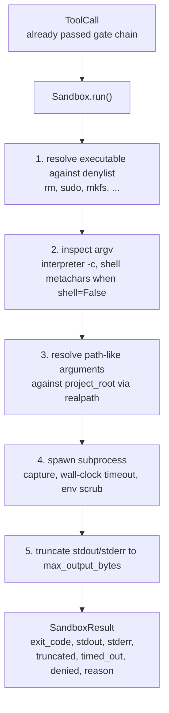
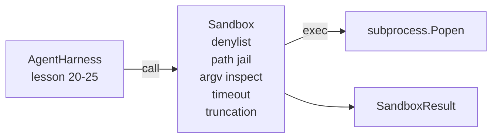

# Capstone Lesson 26: Sandbox Runner với Denylist và Path Jail

> Cổng xác thực (verification gate) quyết định xem một lời gọi công cụ (tool call) có nên được thực thi hay không. Sandbox quyết định điều gì sẽ xảy ra khi nó được thực thi. Bài học này cung cấp một trình chạy subprocess từ chối các tệp thực thi nguy hiểm, từ chối các cấu trúc argv nguy hiểm, "giam" mọi đường dẫn tệp vào thư mục gốc của dự án (project root), cắt bớt đầu ra quá khổ và tiêu diệt các tiến trình chạy quá thời gian quy định (wall-clock timeout). Đây là lớp thứ hai trong hai lớp nằm giữa model và hệ điều hành.

**Type:** Build
**Languages:** Python (stdlib)
**Prerequisites:** Phase 19 · 25 (verification gates và observation budget), Phase 14 · 33 (instructions as constraints), Phase 14 · 38 (verification gates)
**Time:** ~90 phút

## Mục tiêu học tập

- Xây dựng lớp `Sandbox` bao bọc `subprocess.run` với các tính năng timeout, capture và cắt bớt đầu ra (truncation).
- Từ chối một lệnh theo tên dựa trên danh sách đen (denylist) và theo cấu trúc dựa trên trình kiểm tra argv.
- Từ chối bất kỳ đối số đường dẫn nào phân giải ra ngoài thư mục gốc của dự án đã khai báo.
- Từ chối các ký tự đặc biệt của shell khi chế độ shell bị tắt.
- Trả về một `SandboxResult` có cấu trúc để các hệ thống quan sát (observability) và bộ kiểm thử (eval harness) có thể tiếp nhận.

## Vấn đề

Một coding agent có khả năng thực thi lệnh shell có thể cài đặt backdoor, đánh cắp khóa bảo mật, làm hỏng máy tính của lập trình viên và gây ra hóa đơn cloud khổng lồ chỉ trong một lượt chạy. Cách phòng thủ ít tốn kém nhất là không cấp quyền shell cho nó. Cách ít tốn kém thứ hai là một sandbox từ chối một danh sách chính xác các mẫu lệnh nguy hiểm.

Ba loại lỗi thường xuyên lặp lại trong các dấu vết (traces) của agent.

Loại thứ nhất là các tệp thực thi nguy hiểm. Một model đang chịu áp lực phải sửa lỗi đường dẫn sẽ thử `sudo`, `chmod -R 777`, `rm -rf`, `mkfs`, `dd`. Không có lệnh nào trong số này nên xuất hiện trong quá trình chạy của agent. Danh sách đen sẽ bắt chúng theo tên và bí danh.

Loại thứ hai là các thủ thuật argv. Một model đã được yêu cầu không dùng shell sẽ thực hiện tấn công thông qua một trình thông dịch: `python3 -c "import os; os.system('rm -rf /')"`, `bash -c '...'`, `node -e '...'`, `perl -e '...'`. Sandbox cần biết rằng bất kỳ trình thông dịch nào chạy với cờ kiểu `-c` đều chỉ là một lệnh gọi shell với các bước bổ sung.

Loại thứ ba là thoát khỏi đường dẫn (path escape). Model được yêu cầu đọc `./src/main.py` nhưng lại đọc `../../etc/passwd`. Sandbox "giam" mọi đối số đường dẫn bằng cách phân giải nó thông qua `os.path.realpath` và xác nhận tiền tố.

Sandbox này không phải là một ranh giới bảo mật theo nghĩa của hệ điều hành. Một kẻ tấn công quyết tâm có khả năng thực thi mã vẫn có thể thoát ra ngoài. Sandbox là một rào chắn trong quá trình phát triển: nó làm cho các chế độ lỗi phổ biến trở nên rõ ràng và ngăn agent gây thiệt hại do sự thiếu năng lực.

## Khái niệm



Sandbox có bốn trục từ chối: tên, argv, đường dẫn, cấu trúc. Mỗi trục là một hàm thuần túy của lời gọi, chưa thực hiện subprocess. Subprocess chỉ được tạo ra sau khi mọi trục đã vượt qua kiểm tra.

Các mã thoát `SandboxResult` là các mã quy ước: 0 là thành công, khác 0 là thất bại, cộng với ba mã sentinel cho bị từ chối (-100), quá thời gian (-101) và bị cắt bớt (mã thoát là mã thực tế, với một cờ được đặt). Các thành phần hạ nguồn đọc kết quả có cấu trúc này thay vì phân tích stderr.

```figure
cg-path-jail
```

## Kiến trúc



Danh sách đen là một frozenset các tên cơ sở (basename) của tệp thực thi. Các bí danh (`/bin/rm`, `/usr/bin/rm`) đều phân giải về cùng một tên cơ sở. Trình kiểm tra argv biết hình dạng của trình thông dịch: bất kỳ argv nào mà argv[0] là một trình thông dịch và bất kỳ đối số nào sau đó bắt đầu bằng `-c` hoặc `-e` đều bị từ chối. Các ký tự đặc biệt của shell (`;`, `|`, `&`, `>`, `<`, backticks, `$()`) gây ra sự từ chối khi lời gọi không yêu cầu shell một cách rõ ràng.

Path jail là phần tinh tế nhất. Sandbox chấp nhận một `project_root` khi khởi tạo. Bất kỳ đối số nào trông giống như một đường dẫn (chứa `/` hoặc khớp với một tệp hiện có) đều được chuẩn hóa thông qua `os.path.realpath`, sau đó được kiểm tra so với realpath của thư mục gốc dự án. Nếu mục tiêu đã phân giải không nằm dưới thư mục gốc, nó sẽ bị từ chối. Các nỗ lực thoát bằng symlink (một symlink trong thư mục gốc dự án trỏ ra bên ngoài) bị chặn bằng cách kiểm tra realpath, không phải đường dẫn văn bản.

## Những gì bạn sẽ xây dựng

Triển khai bao gồm `main.py` cộng với một thư mục tests.

1. Dataclass `SandboxResult`: exit_code, stdout, stderr, truncated, timed_out, denied, reason, duration_ms.
2. Dataclass `SandboxConfig`: project_root, max_output_bytes, timeout_seconds, denylist, interpreter_block.
3. Lớp `Sandbox`: `run(argv, *, shell=False, cwd=None)` trả về một `SandboxResult`.
4. Các hàm trợ giúp từ chối nội bộ: `_check_executable_denylist`, `_check_argv_interpreter`, `_check_shell_metachars`, `_check_path_jail`.
5. Cắt bớt đầu ra với cờ `truncated` rõ ràng và một dòng đánh dấu trong luồng dữ liệu đã capture.
6. Demo ở phía dưới: một chuỗi các lời gọi hợp lệ và đối kháng. Mỗi lời gọi được hiển thị cùng với kết quả của nó.

Sandbox sử dụng `subprocess.run` với `shell=False` theo mặc định và `capture_output=True`. Thời gian chờ wall-clock sử dụng đối số `timeout`; khi `TimeoutExpired`, sandbox tiêu diệt nhóm tiến trình và tổng hợp một SandboxResult.

## Tại sao đây không phải là một sandbox thực sự

Sandbox trong bài học này không sử dụng namespaces, cgroups, seccomp, gVisor, Firecracker hoặc bất kỳ sự cô lập cấp nhân nào. Bất cứ điều gì subprocess có thể làm, sandbox cũng có thể làm. Sự bảo vệ mang tính cấu trúc: agent bị từ chối các lệnh gọi nguy hiểm phổ biến nhất, và sự từ chối được ghi lại vào hệ thống quan sát thay vì chạy âm thầm.

Đối với các agent trong môi trường production, bạn cần thêm các lớp: chạy bên trong Docker container không đặc quyền, chạy bên trong microVM, loại bỏ các capabilities, mount thư mục gốc dự án ở chế độ chỉ đọc và thư mục tạm ở chế độ đọc-ghi, đặt ulimit cho bộ nhớ và CPU, làm sạch môi trường về một danh sách trắng an toàn đã biết. Bài học 29 thực hiện một số điều này. Sự cô lập ở cấp hệ điều hành nằm ngoài phạm vi của bài học này.

## Chạy thử

```bash
cd phases/19-capstone-projects/26-sandbox-runner-denylist
python3 code/main.py
python3 -m pytest code/tests/ -v
```

Demo tạo một thư mục tạm, đặt một tệp sạch vào đó, sau đó chạy một loạt các lệnh gọi. Các lệnh gọi hợp lệ sẽ thành công. Các lệnh gọi bị từ chối trả về SandboxResult với `denied=True` và lý do. Các lệnh gọi quá thời gian trả về `timed_out=True`. Việc cắt bớt đầu ra đặt cờ `truncated=True`. Demo in ra một bảng JSON các kết quả và thoát với mã 0.

## Cách bài học này kết hợp với phần còn lại của Track A

Bài học 25 đã tạo ra chuỗi cổng xác thực. Bài học 26 là trình thực thi chạy sau khi cổng xác thực trả về ALLOW. Bộ kiểm thử của bài học 27 so sánh các kết quả sandbox với mã thoát dự kiến cho mỗi tác vụ. Bài học 28 phát ra một span `gen_ai.tool.execution` xung quanh mỗi lời gọi `Sandbox.run`. Demo end-to-end của bài học 29 kết nối một coding agent thực tế thông qua cả hai lớp này.