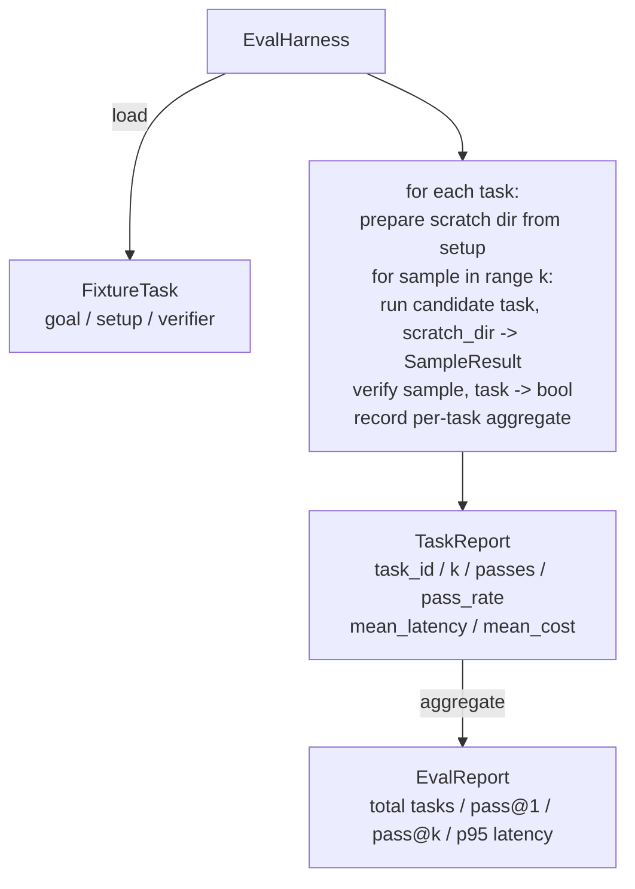

# Capstone Lesson 27: Eval Harness với Fixture Tasks

> Một coding agent chỉ tốt khi bộ task mà bạn dùng để đo lường nó đủ tốt. Bài học này xây dựng một eval harness (bộ khung đánh giá) nhận vào một thư mục chứa các fixture task, chạy từng task qua một candidate agent, chấm điểm đạt (pass) hoặc trượt (fail) thông qua một bộ xác thực (verifier) tất định, và tổng hợp kết quả thành pass@1, pass@k, độ trễ trung bình và chi phí trung bình. Harness này là nguồn sự thật (source of truth) giúp bạn phân biệt được đâu là regression (lỗi hồi quy) và đâu là refactor (tái cấu trúc).

**Type:** Build
**Languages:** Python (stdlib)
**Prerequisites:** Phase 19 · 25 (verification gates), Phase 19 · 26 (sandbox runner), Phase 14 · 30 (eval-driven agent development), Phase 14 · 19 (SWE-bench and GAIA benchmarks)
**Time:** ~90 minutes

## Mục tiêu học tập

- Định nghĩa một fixture task dưới dạng bộ ba: goal (mục tiêu), setup (thiết lập) và verifier (bộ xác thực).
- Chấm điểm nhiều mẫu chạy (sample run) cho mỗi task và tính toán pass@1 và pass@k.
- Tổng hợp độ trễ và chi phí thành các chỉ số trung bình và phân vị thứ 95 (95th-percentile).
- Kết nối các bộ xác thực tất định (file diff, exit code, regex match) vào các hàm có thể tái sử dụng.
- Xuất ra một báo cáo JSON có cấu trúc mà script theo dõi regression có thể đọc được.

## Vấn đề

Ba chế độ lỗi (failure mode) thường gây khó khăn cho các benchmark của agent khi được xây dựng mà không có eval harness.

Thứ nhất là unverified pass (đạt nhưng không được xác thực). Agent nói rằng nó đã sửa lỗi, con người nhìn lướt qua diff, bộ test được đánh dấu xanh, và ba tuần sau, regression test lại phát hiện ra chính lỗi đó. Agent đã suy luận một cách hợp lý mà không thực sự sửa được gì cả.

Thứ hai là undetected regression (lỗi hồi quy không bị phát hiện). Một thay đổi trong prompt template làm cho agent tốt hơn 4% ở task "ồn ào" (loud task) và tệ hơn 14% ở task "yên tĩnh" (quiet task). Nếu không có goldset và điểm số cho từng task, lỗi hồi quy sẽ lọt vào nhánh main và chỉ xuất hiện khi khách hàng phàn nàn.

Thứ ba là per-task drift (trôi dạt theo từng task). Eval được chạy vào thứ Hai với 100 task và vào thứ Sáu với 95 task, vì ai đó đã đổi tên năm fixture. Tỷ lệ pass trông như thể đã cải thiện 5%. Thực tế thì không phải vậy.

Harness là chương trình biến những thất bại này thành sự thật. Nó chạy mọi fixture, mọi lúc, theo một thứ tự có thể tái lập, dựa trên một bộ xác thực trả về true hoặc false dựa trên một kiểm tra tất định.

## Khái niệm

```mermaid
flowchart LR
  F1[fixtures/task_001/<br/>task.json + expected/] --> Harness
  F2[fixtures/task_002/<br/>...] --> Harness
  Harness[Harness<br/>for each task:<br/>setup / run agent k samples /<br/>verify each sample /<br/>record latency, cost]
  Harness --> Report[EvalReport<br/>pass@1 / pass@k<br/>mean ms / p95 ms<br/>mean cost]
```

Một `FixtureTask` là một file JSON nhỏ cộng với một thư mục `expected/` tùy chọn. File JSON khai báo một `id`, một `goal` (prompt được cung cấp cho agent), một khối `setup` (các file cần đưa vào thư mục scratch), và một khối `verifier`. Khối verifier chỉ định tên một hàm trong registry của harness và cung cấp các đối số cho nó.

Ba dạng verifier bao phủ phần lớn các task hữu ích.

Thứ nhất là `file_equals`. Sau khi agent chạy, so sánh một file được chỉ định với nội dung mong đợi. Cách này bắt được các task kiểu "sửa lỗi này theo đúng cách này".

Thứ hai là `regex_match`. Nội dung của file được chỉ định sẽ được so khớp với một regex. Cách này bắt được các task kiểu "hàm phải tồn tại và trả về X" nơi có nhiều giải pháp chấp nhận được.

Thứ ba là `shell_exit_zero`. Harness chạy một lệnh shell (thông qua sandbox từ bài 26) và chỉ cho phép task đạt nếu lệnh đó thoát với mã 0. Cách này bắt được các task kiểu "các test phải pass".

Harness chạy mỗi task `k` lần. Pass@k là `1 - (1 - p)^k` trong đó p là tỷ lệ pass thực nghiệm; harness cũng báo cáo số lượng thô để bạn có thể phát hiện phương sai. Độ trễ là thời gian thực (wall-clock) trên mỗi mẫu. Chi phí là bất cứ thứ gì agent tự báo cáo (số lượng token, USD, hoặc cả hai); harness cộng tổng chúng trên các mẫu và trình bày các con số theo từng task và tổng hợp.

```figure
pass-at-k
```

## Kiến trúc



Candidate là một đối tượng có thể gọi được (callable): `Callable[[FixtureTask, str], SampleResult]`. Harness tạo thư mục scratch thông qua `tempfile.mkdtemp()` và truyền đường dẫn của nó dưới dạng một chuỗi văn bản thuần túy. Harness không quan tâm candidate hoạt động như thế nào. Candidate có thể là một trình áp dụng bản vá tất định (hữu ích cho việc tự kiểm tra harness), một LLM agent thực thụ, hoặc một fuzzer. Hợp đồng (contract) ở đây chính là SampleResult.

## Những gì bạn sẽ xây dựng

`main.py` bao gồm:

1. Dataclass `FixtureTask`.
2. Dataclass `SampleResult`: success_self_reported, latency_ms, cost_units, edits.
3. Các dataclass `TaskReport`, `EvalReport` với `to_dict()`.
4. `VerifierRegistry` ánh xạ tên verifier tới hàm tương ứng. Các verifier tích hợp sẵn: file_equals, regex_match, shell_exit_zero.
5. Lớp `EvalHarness`. Chạy một thư mục các task dựa trên một candidate. Trả về EvalReport.
6. Năm fixture task được đóng gói trong `tasks/`:
   - off-by-one trong `fizzbuzz`
   - thiếu return trong `factorial`
   - lỗi chính tả trong thông báo lỗi
   - thân hàm trống
   - off-by-one trong duyệt linked-list
7. Một candidate tham chiếu tất định (`apply_known_fixes`) mà harness sử dụng để chứng minh pass@1 sạch là 1.0.
8. Demo in ra JSON EvalReport và thoát với mã 0.

Các fixture task được đóng gói dưới dạng các file JSON trong `tasks/` cùng với các file nguồn đi kèm trong `tasks/<id>/buggy/` và `tasks/<id>/expected/`. Harness sao chép các file lỗi vào thư mục scratch, chuyển chúng cho candidate và xác thực dựa trên kết quả mong đợi.

## Tại sao lại là pass@k mà không chỉ là pass@1

Các LLM agent thực tế mang tính ngẫu nhiên. Một pass@1 là 0.6 trông có vẻ là thất bại. Một pass@5 là 0.95 cho thấy agent đưa ra câu trả lời đúng hầu hết thời gian nhưng lại chọn sai ở các mẫu đầu tiên. Giải pháp là lấy mẫu (sampling) và xếp hạng (ranking), không phải lúc nào cũng là huấn luyện thêm. Pass@k làm cho điều đó trở nên rõ ràng.

Pass@k được báo cáo cùng với pass@1 vì pass@k che đậy một thất bại thực sự: nếu mô hình chỉ đưa ra câu trả lời đúng một lần trong hai mươi lần thử, bạn không có một agent hữu ích. Harness hiển thị cả hai.

## Cách bài này kết hợp với phần còn lại của Track A

Bài 25 đã tạo ra chuỗi gate. Bài 26 đã tạo ra sandbox. Harness sử dụng sandbox cho bất kỳ verifier `shell_exit_zero` nào. Bài 28 bao bọc mỗi lần chạy harness trong một OTel trace. Bài 29 chạy demo end-to-end dựa trên một trong các fixture được đóng gói và khẳng định pass@1 = 1.0 cho candidate tham chiếu.

## Chạy chương trình

```bash
cd phases/19-capstone-projects/27-eval-harness-fixture-tasks
python3 code/main.py
python3 -m pytest code/tests/ -v
```

Demo in ra EvalReport dưới dạng JSON, bao gồm pass@1, pass@5, độ trễ trung bình và phân tích chi tiết theo từng task. Mã thoát là 0. Các test bao gồm các hàm verifier, toán học pass@k, tải fixture và harness end-to-end dựa trên candidate tham chiếu được đóng gói.