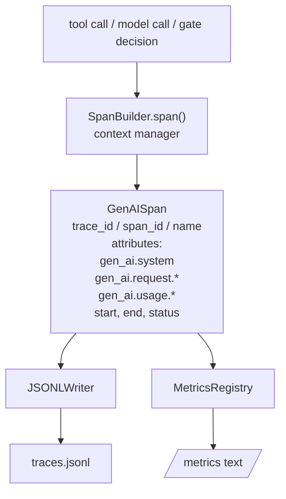
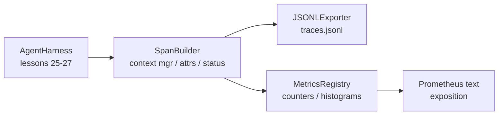

# Capstone Lesson 28: Khả năng quan sát (Observability) với OTel GenAI Spans và Prometheus Metrics

> Một agent harness không có khả năng quan sát giống như một "hộp đen" gây tốn kém chi phí. Bài học này sẽ hướng dẫn tự xây dựng một trình tạo span (span builder) phát ra các bản ghi tuân thủ các quy ước ngữ nghĩa (semantic conventions) của OpenTelemetry GenAI, ghi chúng vào tệp JSON-Lines (mỗi span một dòng), đồng thời hiển thị các bộ đếm (counters) và biểu đồ tần suất (histograms) theo định dạng văn bản của Prometheus. Toàn bộ quá trình sử dụng Python stdlib và chạy offline.

**Type:** Build
**Languages:** Python (stdlib)
**Prerequisites:** Phase 19 · 25 (verification gates), Phase 19 · 26 (sandbox), Phase 19 · 27 (eval harness), Phase 13 · 20 (OpenTelemetry GenAI), Phase 14 · 23 (OTel GenAI conventions)
**Time:** ~90 phút

## Mục tiêu học tập

- Xây dựng một data class cho span có cấu trúc theo các quy ước ngữ nghĩa OpenTelemetry GenAI.
- Triển khai một trình xuất (exporter) JSONL ghi mỗi span hoàn chỉnh trên một dòng.
- Xây dựng các bộ đếm và biểu đồ tần suất với nhãn (labels) và hiển thị theo định dạng văn bản Prometheus.
- Bao bọc (wrap) bất kỳ callable nào trong một context manager của span để ghi lại thời lượng, trạng thái và các ngoại lệ.
- Xác minh rằng các span được phát ra có thể roundtrip qua `json.loads` và khớp với cấu trúc đặc tả.

## Vấn đề

Một coding agent trong môi trường production tạo ra ba loại artifact mỗi lượt: một model call, một tool execution và một quyết định từ verification gate. Không có cái nào trong số này hữu ích nếu thiếu telemetry có cấu trúc.

Dạng lỗi thứ nhất là thiếu trace. Có sự cố xảy ra vào thứ Ba nhưng bản ghi duy nhất là nhật ký chat dài 500 dòng. Không có bản ghi nào cho biết công cụ nào đã chạy, mất bao lâu, bao nhiêu token đã được đưa vào prompt, hoặc liệu gate có từ chối bất cứ điều gì hay không. Tác giả của agent buộc phải đoán.

Dạng lỗi thứ hai là trace không thể phân tích cú pháp. Harness đã ghi các span nhưng sử dụng tên trường tùy ý. Không có gì trong Grafana, Honeycomb, Jaeger hoặc CLI cục bộ có thể đọc được chúng. Bất kỳ công cụ nào hiện có trong stack của nhóm đều trở nên vô dụng vì các span không theo tiêu chuẩn.

Dạng lỗi thứ ba là metric không được tổng hợp. Bạn có thể thấy một tool call chậm trong trace, nhưng bạn không thể trả lời câu hỏi "p95 latency của các lệnh read_file trong giờ qua là bao nhiêu?" vì không có metric, chỉ có trace.

Các quy ước ngữ nghĩa OpenTelemetry GenAI tồn tại chính xác vì điều này. Chúng xác định một tập hợp nhỏ các thuộc tính tiêu chuẩn mà các trình phát span trên các framework LLM đều chia sẻ. Nếu harness của bạn ghi các thuộc tính đó, mọi backend tương thích với OTel đều có thể đọc được chúng.

## Khái niệm



Mỗi thao tác trong harness tạo ra một span. Một span có trace id (toàn bộ quá trình gọi agent), span id (thao tác cụ thể này), tên (ví dụ: `gen_ai.chat`, `gen_ai.tool.execution`), các thuộc tính tuân theo quy ước GenAI, thời gian bắt đầu và kết thúc, và trạng thái.

Các quy ước GenAI chuẩn hóa các khóa thuộc tính này: `gen_ai.system` (nhà cung cấp nào, ví dụ: `anthropic`, `openai`), `gen_ai.request.model` (model id), `gen_ai.request.max_tokens`, `gen_ai.usage.input_tokens`, `gen_ai.usage.output_tokens`, `gen_ai.response.model`, `gen_ai.response.id`, `gen_ai.operation.name`, cộng với các khóa dành riêng cho công cụ như `gen_ai.tool.name` và `gen_ai.tool.call.id`.

Trình xuất ghi JSONL. Mỗi dòng là một đối tượng JSON. Đây là định dạng đơn giản nhất mà các công cụ hạ nguồn có thể stream, grep và import. Một trình xuất OTel thực thụ sẽ sử dụng OTLP gRPC; trình xuất JSONL trong bài học này là phiên bản offline tương đương và luôn thoát với mã 0 trên mọi máy trạm.

Metrics tồn tại song song với traces. Một bộ đếm tăng lên sau mỗi lần gọi công cụ: `tools_called_total{tool="read_file"}`. Một biểu đồ tần suất ghi lại độ trễ quan sát được: `tool_latency_ms{tool="read_file"}`. Cả hai đều được tuần tự hóa sang định dạng văn bản Prometheus, vốn là tiêu chuẩn thực tế cho các metric dựa trên cơ chế pull.

```figure
trace-spans
```

## Kiến trúc



Trình tạo span là một lớp nhỏ với phương thức `span(name, attrs)` trả về một context manager. Context manager ghi lại thời gian bắt đầu khi vào, ghi thời gian kết thúc khi thoát, đính kèm ngoại lệ nếu có và đẩy span đã hoàn thiện tới trình xuất.

Registry cho metrics bao gồm hai từ điển (dicts). Các bộ đếm là `{(name, frozen_labels): int}`. Các biểu đồ tần suất lưu trữ các mẫu thô trong một danh sách và tuần tự hóa thành các bucket của biểu đồ Prometheus tại thời điểm hiển thị.

## Những gì bạn sẽ xây dựng

`main.py` bao gồm:

1. Data class `GenAISpan`: trace_id, span_id, parent_span_id, name, attributes, start_unix_nano, end_unix_nano, status, status_message, events.
2. Lớp `SpanBuilder` với context manager `span(name, attrs, parent=None)`.
3. Lớp `JSONLExporter` với `export(span)` để thêm một dòng dữ liệu.
4. Các lớp `Counter` và `Histogram` cộng với `MetricsRegistry`.
5. `prometheus_exposition(registry)` tạo đầu ra định dạng văn bản.
6. Decorator `wrap_tool_call(name)` phát ra một span và cập nhật các metric.
7. Demo: tổng hợp một quá trình gọi agent hoàn chỉnh (span gen_ai.chat bao quanh các span công cụ), ghi vào traces.jsonl, in ra định dạng Prometheus, thoát với mã 0.

Span id và trace id là các chuỗi hex 16 byte, được tạo từ `os.urandom`. Điều này khớp với ngữ cảnh trace W3C của OTel. Trình xuất không bao giờ ném lỗi; các lỗi IO được hiển thị nhưng harness vẫn tiếp tục chạy.

Biểu đồ tần suất có một tập hợp bucket cố định (mặc định của OTel cho độ trễ tính bằng mili giây: 5, 10, 25, 50, 100, 250, 500, 1000, 2500, 5000, 10000, +Inf). Các mẫu được lưu trữ dưới dạng danh sách; việc hiển thị sẽ tính toán số lượng cho mỗi bucket theo yêu cầu.

## Tại sao tự xây dựng thay vì dùng opentelemetry-sdk

OTel Python SDK là một dependency thực thụ. Nó cũng bao gồm hàng nghìn dòng mã, nhiều tiến trình cho trình xuất OTLP và chi phí runtime vượt quá ngân sách của một bài học. Phiên bản tự xây dựng giúp bạn hiểu định dạng truyền tin (wire format). Trong môi trường production, bạn chỉ cần đưa các thuộc tính tương tự vào SDK thực tế để nhận được trình xuất OTLP, batching và phát hiện tài nguyên miễn phí.

Các quy ước rất ổn định. Định dạng truyền tin mà bài học này phát ra sẽ vẫn có thể phân tích được vào năm 2030 vì OTel không bao giờ thay đổi tên thuộc tính GenAI; họ chỉ thêm các thuộc tính mới.

## Cách bài học này kết hợp với phần còn lại của Track A

Bài học 25 đã tạo ra gate chain. Bài học 26 đã tạo ra sandbox. Bài học 27 đã tạo ra eval harness. Bài học 28 làm cho cả ba có khả năng quan sát. Bài học 29 bao bọc mọi bước của demo end-to-end trong các span và in ra văn bản Prometheus ở cuối.

## Cách chạy

```bash
cd phases/19-capstone-projects/28-observability-otel-traces
python3 code/main.py
python3 -m pytest code/tests/ -v
```

Demo phát ra một tệp `traces.jsonl` trong thư mục làm việc của bài học (được dọn dẹp khi kết thúc), sau đó in ra mẫu của ba span, cuối cùng in ra định dạng Prometheus cho các bộ đếm và biểu đồ tần suất. Các bài kiểm tra xác minh rằng các span được tuần tự hóa round-trip, các thuộc tính GenAI chuẩn đều có mặt, các bộ đếm tăng chính xác và định dạng biểu đồ tần suất chứa đúng số lượng bucket mong đợi.