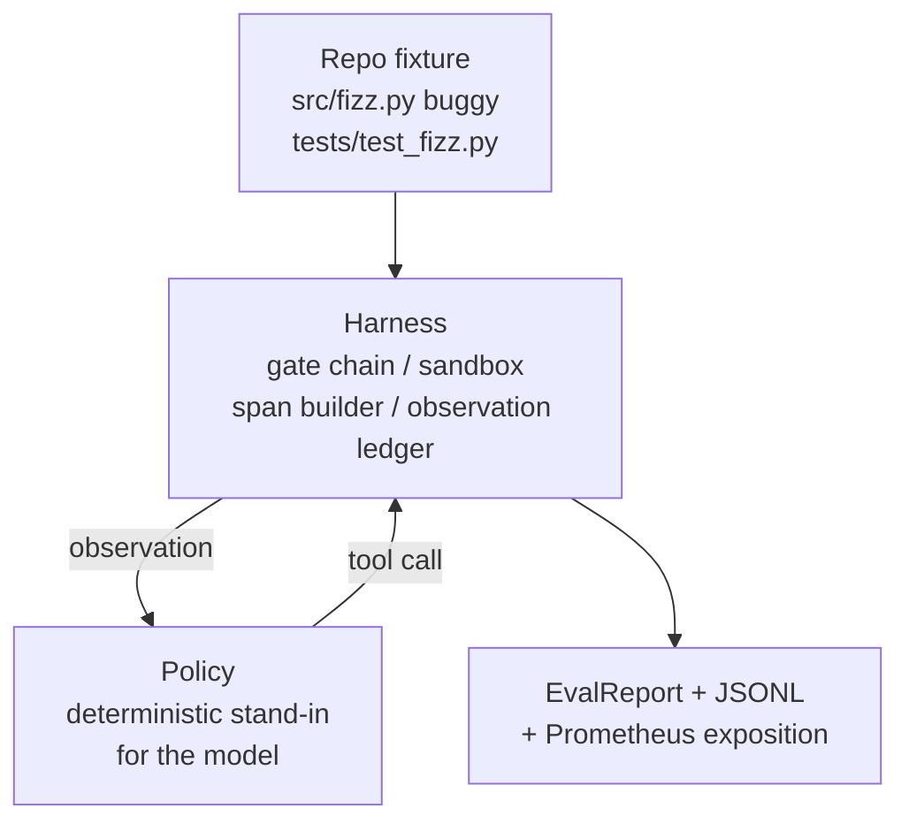
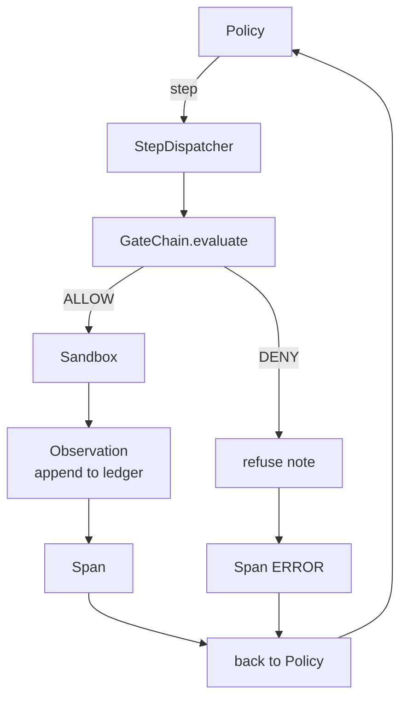

# Capstone Lesson 29: End-to-End Coding Agent on the Harness

> Thành quả của Track A. Bài học này kết nối chuỗi gate, sandbox, eval harness và các OTel span thành một coding agent hoàn chỉnh, có khả năng sửa một lỗi thực tế (quy mô fixture) trong một dự án Python đa tệp tin. Agent này là một chính sách (policy) tất định, không phải LLM; việc thay thế này giúp bài học có thể tái lập và cho thấy rằng harness mới chính là phần thú vị nhất. Hợp đồng (contract) vẫn giữ nguyên: một model thực tế có thể được cắm vào tại vị trí của policy.

**Type:** Build
**Languages:** Python (stdlib)
**Prerequisites:** Phase 19 · 25 (verification gates), Phase 19 · 26 (sandbox), Phase 19 · 27 (eval harness), Phase 19 · 28 (observability), Phase 14 · 38 (verification gates), Phase 14 · 41 (workbench for real repos), Phase 14 · 42 (agent workbench capstone)
**Time:** ~90 phút

## Mục tiêu học tập

- Kết hợp chuỗi gate, sandbox, eval harness và span builder thành một vòng lặp agent duy nhất.
- Triển khai một chính sách tất định sử dụng read_file, run_tests và write_file để sửa một lỗi trong fixture.
- Thực thi ngân sách bước (step budget) toàn cục cộng với ngân sách token quan sát (observation token budget) trong suốt quá trình chạy end-to-end.
- Phát ra các OTel GenAI trace hoàn chỉnh và các Prometheus metric cho toàn bộ quá trình chạy.
- Xác minh agent giải quyết được fixture trong ít hơn 12 bước với không lần vi phạm gate nào trên các công cụ hợp lệ.

## Vấn đề

Hầu hết các bản demo agent hoạt động một cách cô lập: sandbox riêng, eval harness riêng, span emitter riêng. Chúng trông có vẻ ổn. Nhưng khi kết hợp lại, các mối nối bắt đầu bộc lộ vấn đề.

Chuỗi gate báo ALLOW nhưng sandbox từ chối vì một lý do mà chuỗi không lường trước được. Eval harness ghi nhận kết quả pass nhưng OTel span lại báo rằng gate đã từ chối một công cụ mà agent khẳng định là đã sử dụng. Bộ đếm Prometheus tăng hai lần trong khi lẽ ra chỉ nên tăng một lần. Ngân sách quan sát bị vượt quá nhưng agent vẫn tiếp tục vì ngân sách được theo dõi trong chuỗi và sandbox không hề hay biết.

Bài học này là bài kiểm tra tích hợp cho toàn bộ track. Agent phải thực hiện bốn việc theo thứ tự: đọc dự án, chạy kiểm thử, xác định lỗi từ kết quả kiểm thử thất bại, viết bản sửa lỗi, chạy lại kiểm thử và dừng lại. Mọi thao tác đều đi qua chuỗi gate. Mọi lần thực thi công cụ đều đi qua sandbox. Mọi bước đều được bao bọc trong một span. Eval harness sẽ chấm điểm toàn bộ quá trình ở cuối.

## Khái niệm



Chính sách của agent là một máy trạng thái (state machine). Có năm trạng thái.

`SURVEY`: agent đọc danh sách dự án. Trạng thái tiếp theo là RUN_TESTS.

`RUN_TESTS`: agent chạy lệnh kiểm thử. Nếu kiểm thử pass, máy trạng thái dừng lại với kết quả thành công. Nếu không, trạng thái tiếp theo là INSPECT.

`INSPECT`: agent đọc tệp nguồn bị lỗi. Trạng thái tiếp theo là FIX.

`FIX`: agent viết tệp đã sửa. Trạng thái tiếp theo là VERIFY.

`VERIFY`: agent chạy lại lệnh kiểm thử. Nếu kiểm thử pass, dừng lại với kết quả thành công. Nếu không, dừng lại với kết quả thất bại.

Mỗi trạng thái tương ứng với một lần gọi công cụ. Mỗi lần gọi công cụ đều đi qua chuỗi gate. Nếu một lần gọi công cụ bị từ chối, agent sẽ báo cáo sự từ chối trong trace và dừng lại.

Lỗi trong fixture là lỗi off-by-one trong `fizz.py`. Chính sách tất định phát hiện lỗi từ thông báo kiểm thử thất bại thông qua regex và phát ra tệp đã sửa. Việc thay thế chính sách bằng một LLM không làm thay đổi hợp đồng của harness.

```figure
cg-harness-weave
```

## Kiến trúc



Bài học này là độc lập. Mỗi primitive từ bài học trước được triển khai lại ở quy mô tối thiểu trong `main.py` (gate, sandbox, ledger, span) để bài học có thể chạy mà không cần import các thành phần liên quan. Tên gọi khớp chính xác với các bài học 25-28 để ánh xạ khái niệm không gây nhầm lẫn.

## Những gì bạn sẽ xây dựng

`main.py` bao gồm:

1. Các primitive harness tối thiểu, được sao chép với cùng tên gọi như các bài học 25-28: `GateChain`, `Sandbox`, `ObservationLedger`, `SpanBuilder`, `MetricsRegistry`.
2. Lớp `CodingAgentPolicy`: máy trạng thái với năm trạng thái.
3. Helper `Repo`: chuẩn bị một thư mục tạm với fixture bị lỗi đi kèm.
4. Lớp `AgentRun`: điều khiển chính sách, điều phối thông qua harness, trả về một `AgentRunReport`.
5. Một fixture đi kèm (`fixture_repo/`) với src/fizz.py, tests/test_fizz.py và cây thư mục expected/ cho eval harness.
6. Demo: chạy chính sách end-to-end, in ra trace từng bước, khẳng định kết quả pass, in ra các metric.

Fixture đi kèm có cùng cấu trúc với cấu trúc tác vụ của bài học 27: một tệp bị lỗi và một tệp kiểm thử. Thông báo lỗi kiểm thử chứa đủ thông tin để chính sách tất định xác định bản sửa lỗi. Một LLM thực tế sẽ thực hiện công việc tương tự, chậm hơn và với khả năng truy xuất rộng hơn, nhưng nó sẽ không làm thay đổi kỳ vọng của harness.

## Tại sao chính sách không phải là một LLM

Một LLM thực tế yêu cầu API key, gọi mạng và tính ngẫu nhiên không thể xác minh. Harness mới là phần mà bài học quan tâm. Việc thay thế bằng một chính sách tất định cho phép bài học chạy trên bất kỳ máy tính cá nhân nào mà không có phụ thuộc bên ngoài và cho phép bộ kiểm thử khẳng định số bước chính xác.

Chính sách của bài học là một tập con nghiêm ngặt của những gì một LLM agent thực hiện. Chính sách đọc repo, thấy kiểm thử thất bại, xác định dòng lỗi và phát ra bản sửa lỗi. Một LLM trải qua cùng một vòng lặp với cùng một hợp đồng harness; việc ghi chép sổ sách là giống hệt nhau.

## Những gì demo khẳng định

Demo end-to-end khẳng định năm điều tại thời điểm thoát, và bộ kiểm thử khẳng định lại chúng theo lập trình.

Chính sách đã giải quyết fixture trong ít hơn 12 bước.

Ngân sách quan sát không bao giờ bị vượt quá.

Không có lần từ chối gate nào xảy ra trên các công cụ hợp lệ. (Agent không bao giờ tự ý tạo ra một tên công cụ bị từ chối.)

Mỗi bước đều có một span tương ứng trong traces.jsonl.

Dữ liệu Prometheus chứa một mục `tools_called_total{tool="read_file"}` và một biểu đồ `tool_latency_ms`.

## Cách bài học này kết hợp với phần còn lại của Track A

Bài học này là sự tích hợp. Bài học 25 viết chuỗi gate. Bài học 26 viết sandbox. Bài học 27 viết eval harness. Bài học 28 viết khả năng quan sát. Bài học 29 chứng minh chúng hoạt động như một hệ thống. Một harness agent thực tế sẽ mở rộng từ đây: thay thế chính sách tất định bằng một model, thay thế fixture đi kèm bằng một tác vụ repo thực tế, thay thế trình xuất JSONL bằng OTLP.

## Cách chạy

```bash
cd phases/19-capstone-projects/29-end-to-end-coding-task-demo
python3 code/main.py
python3 -m pytest code/tests/ -v
```

Demo in ra trace từng bước, báo cáo eval cuối cùng và dữ liệu Prometheus. Mã thoát là không (zero). Các bài kiểm thử bao gồm các chuyển đổi trạng thái chính sách, các lần từ chối gate trên các lệnh gọi công cụ tổng hợp, quá trình chạy end-to-end trên fixture đi kèm và các bất biến về ngân sách bước.