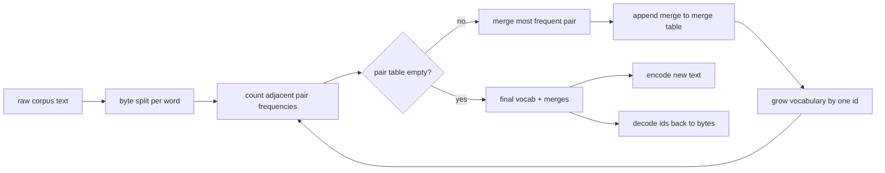
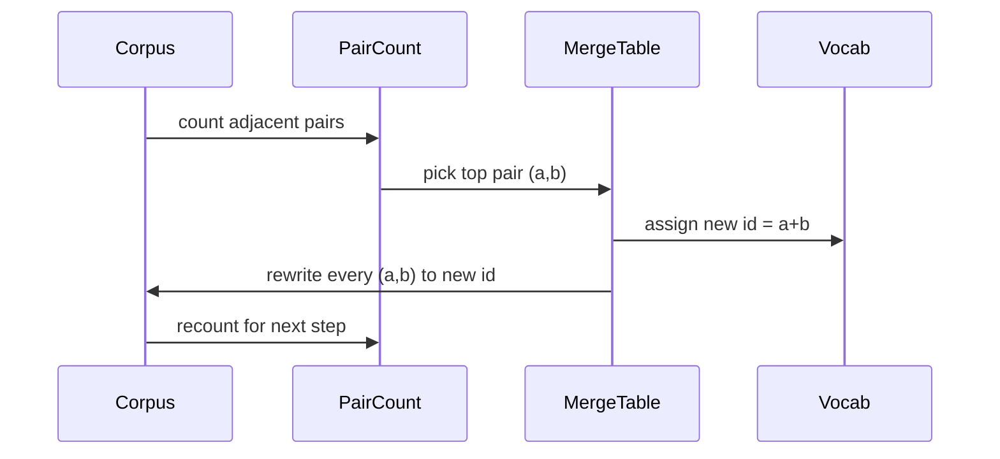

# BPE Tokenizer From Scratch

> Bytes in, ids out, ids back to the same bytes. Xây dựng tokenizer mà mọi mô hình văn bản hiện đại đều bắt đầu từ đó.

**Type:** Build
**Languages:** Python
**Prerequisites:** Phase 04 lessons, Phase 07 transformer lessons
**Time:** ~90 minutes

## Learning Objectives
- Huấn luyện từ vựng Byte-Pair Encoding từ một corpus văn bản thô bằng cách liên tục gộp cặp ký hiệu liền kề xuất hiện thường xuyên nhất.
- Triển khai bảng gộp (merge table) tất-định và áp dụng nó vào văn bản mới để tạo ra luồng các subword id.
- Chuyển đổi qua lại (round-trip) dữ liệu đầu vào UTF-8 tùy ý sang id và ngược lại mà không làm mất thông tin.
- Dành riêng và bảo vệ các special token (`<|endoftext|>`, `<|pad|>`) để chúng tồn tại qua quá trình huấn luyện và giải mã.
- Suy luận lý do tại sao bảng chữ cái cấp byte (byte-level alphabet) là nền tảng phù hợp cho một tokenizer đa năng.

```figure
cap-bpe-merge
```

## The frame

Một mô hình ngôn ngữ không bao giờ nhìn thấy văn bản. Nó nhìn thấy các số nguyên. Bản đồ từ một chuỗi sang danh sách các số nguyên và ngược lại chính là tokenizer. Nếu làm sai lớp này, mọi đường cong mất mát (loss curve) trong quá trình huấn luyện đều đang đo lường sai mục tiêu.

Họ tokenizer subword chiếm ưu thế cho các mô hình văn bản tổng quát là Byte-Pair Encoding. Ý tưởng rất đơn giản. Bắt đầu từ một bảng chữ cái đã biết. Tìm cặp ký hiệu liền kề xuất hiện thường xuyên nhất trong corpus huấn luyện. Gộp chúng thành một ký hiệu mới. Lặp lại cho đến khi từ vựng đạt kích thước mục tiêu. Việc mã hóa văn bản mới sẽ sử dụng lại danh sách gộp theo cùng thứ tự đó.

Chúng ta sẽ xây dựng biến thể cấp byte. Bảng chữ cái là 256 byte thô, không phải các Unicode code point. Lựa chọn đó là điều cho phép tokenizer xử lý bất kỳ đầu vào UTF-8 nào mà không cần quay về token không xác định (unknown token).

## The pipeline



Phía huấn luyện và phía suy luận chia sẻ chung bảng gộp. Việc chia sẻ đó là hợp đồng. Nếu bạn thay đổi thứ tự gộp tại thời điểm suy luận, bạn sẽ giải mã ra một luồng id khác.

## The byte alphabet

256 id đầu tiên được dành riêng cho các byte thô từ 0x00 đến 0xFF. Điều đó đảm bảo mọi chuỗi đầu vào đều có thể được biểu diễn trong từ vựng trước khi bất kỳ quá trình gộp nào xảy ra. Sau khối byte, chúng ta dành riêng một phạm vi nhỏ cho các special token. Vòng lặp huấn luyện không bao giờ đề xuất các id đó làm mục tiêu gộp vì chúng ta giữ chúng hoàn toàn nằm ngoài luồng tiền xử lý (pretokenized stream).

Pretokenizer tách corpus dựa trên ranh giới khoảng trắng và dấu câu trước khi quá trình huấn luyện bắt đầu. Nếu không có sự phân tách đó, bước gộp BPE sẽ vô tình học các phép gộp vượt qua ranh giới từ và từ vựng sẽ bị lấp đầy bởi các cụm từ thông dụng. Với việc phân tách, các phép gộp chỉ nằm trong một từ và kết quả sẽ có tính tổng quát hóa cao hơn.

## The training loop

Đối với mỗi bước huấn luyện, vòng lặp thực hiện ba việc. Nó duyệt qua mọi từ trong corpus và đếm tần suất xuất hiện của mỗi cặp ký hiệu liền kề hiện tại, được trọng số hóa bởi tần suất xuất hiện của chính từ đó. Nó chọn cặp có số lượng cao nhất. Nó viết lại mọi lần xuất hiện của cặp đó thành một ký hiệu mới duy nhất có id là vị trí trống tiếp theo trong từ vựng. Sau đó, nó ghi lại phép gộp.



Chi phí của mỗi bước là tuyến tính với kích thước của corpus được biểu diễn dưới dạng danh sách các chuỗi ký hiệu. Với một triệu từ và từ vựng mục tiêu là mười nghìn id, vòng lặp hoàn thành trong vài giây vì các chuỗi ký hiệu thu nhỏ lại khi các phép gộp được thực hiện.

## Encoding fresh text

Suy luận không gọi bộ đếm phép gộp. Nó áp dụng bảng gộp theo cùng thứ tự đã học. Đối với một từ mới, bộ mã hóa bắt đầu từ việc tách byte. Nó quét chuỗi hiện tại để tìm phép gộp có thứ hạng thấp nhất (phép gộp sớm nhất có thể áp dụng). Nó thực hiện phép gộp đó. Nó quét lại. Vòng lặp kết thúc khi không còn phép gộp nào trong bảng có thể áp dụng cho chuỗi hiện tại.

Việc sắp xếp theo thứ hạng là thuộc tính giúp quá trình mã hóa trở nên tất định và khớp với hành vi huấn luyện trên cùng một đầu vào. Một phép gộp được học trước sẽ nằm ở đầu bảng và được áp dụng trước. Nếu hai phép gộp có thể áp dụng tại cùng một vị trí, phép gộp có thứ hạng thấp hơn sẽ thắng.

## Special tokens

Special tokens là các id mà luồng byte không bao giờ có thể tạo ra. Chúng ta dành riêng chúng bằng tay. Hai token là đủ cho bài học này.

- `<|endoftext|>` phân tách các tài liệu trong quá trình tiền huấn luyện. Nó báo cho mô hình biết "một tài liệu mới bắt đầu tại đây, đừng để ngữ cảnh của tài liệu trước đó bị rò rỉ vào".
- `<|pad|>` lấp đầy các chuỗi ngắn để một batch có thể trở thành một tensor hình chữ nhật. Loss mask sẽ ẩn nó trong quá trình huấn luyện.

Bộ mã hóa chấp nhận một cờ (flag) để cho phép các special token trong đầu vào. Khi cờ tắt, các chuỗi `<|endoftext|>` và `<|pad|>` sẽ được token hóa thành các byte tạo nên chúng. Khi cờ bật, các chuỗi ký tự đó sẽ được ánh xạ tới các id dành riêng của chúng và không chịu bất kỳ phép gộp nào.

## Round-trip guarantee

Mã hóa rồi giải mã phải trả về chính xác các byte đầu vào. Bộ giải mã nối các phần mở rộng byte của mọi id theo thứ tự. Vì mỗi id là một byte thô hoặc là sự kết hợp của hai id đã biết trước đó, quá trình mở rộng đệ quy luôn kết thúc ở các byte thô. Sau đó, quá trình giải mã trả về chuỗi UTF-8 mà các byte đó tạo thành.

Bộ kiểm thử (test suite) trong bài học này kiểm tra thuộc tính đó trên một câu chưa từng thấy, trên một câu có emoji Unicode và trên một câu chứa token `<|endoftext|>` theo nghĩa đen.

## What this lesson does not do

Nó không xây dựng một pretokenizer dựa trên regex theo phong cách của các tokenizer sản xuất lớn nhất. Pretokenizer ở đây là một bộ tách khoảng trắng và dấu câu đơn giản. Nó đủ để tạo ra các phép gộp hợp lý trên một corpus huấn luyện nhỏ và hợp đồng với phần còn lại của chuỗi bài học vẫn được giữ nguyên. Bài học tiếp theo sẽ coi tokenizer như một hộp đen và xây dựng tập dữ liệu cửa sổ trượt (sliding-window) trên đó.

Nó không song song hóa bộ đếm cặp. Một vòng lặp trong Python trên một corpus vài nghìn từ hoàn thành trong chưa đầy một giây. Đối với các corpus lớn hơn, bước đi hiển nhiên là đếm các cặp trên mỗi từ một cách song song và thực hiện reduce.

## How to read the code

`main.py` định nghĩa bốn đối tượng. `BPETokenizer` chứa từ vựng, bảng gộp và bảng special-token. `train` là vòng lặp huấn luyện. `encode` là đường dẫn suy luận. `decode` là quá trình nối byte. Bản demo ở phía dưới huấn luyện một tokenizer nhỏ trên một corpus tích hợp, mã hóa một câu chưa biết, giải mã các id trở lại và in cả hai. Các bài kiểm tra trong `code/tests/test_bpe.py` xác nhận thuộc tính round-trip, việc dành riêng special-token và thứ tự gộp.

Hãy chạy bản demo. Sau đó, thay đổi kích thước từ vựng mục tiêu trong bản demo từ 300 thành 600 và quan sát độ dài mã hóa của câu chưa biết giảm xuống như thế nào. Đường cong đó chính là đường cong nén BPE.