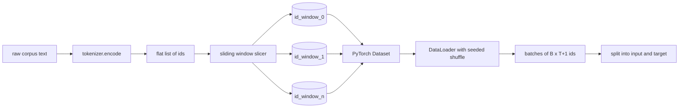
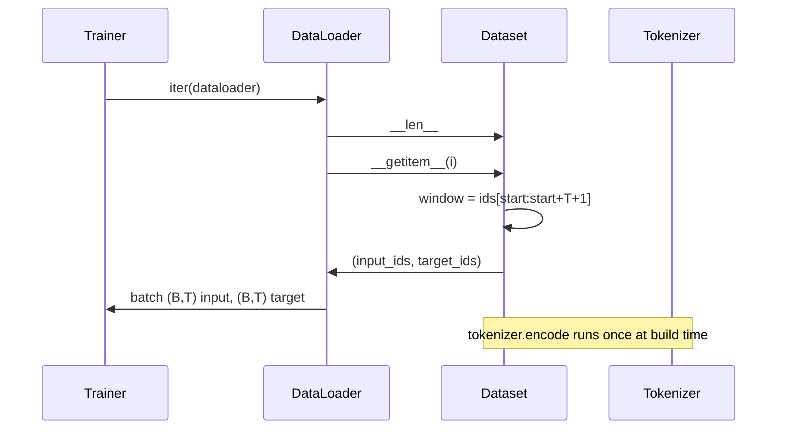

# Tokenized Dataset với Sliding Window

> Một quá trình pretraining là một hàm từ các token id đến các gradient. Bài học này xây dựng băng chuyền để nạp các id đó vào.

**Type:** Build
**Languages:** Python
**Prerequisites:** Các bài học Phase 04, các bài học về Transformer trong Phase 07, Bài 30 của phase này
**Time:** ~90 phút

## Mục tiêu học tập
- Chuyển đổi một corpus thô thành một luồng các token id bằng cách gọi tokenizer một lần duy nhất.
- Cắt luồng id thành các cửa sổ có độ dài cố định với stride (bước nhảy) chồng lấp có thể cấu hình.
- Xây dựng một PyTorch Dataset trả về các tensor đầu vào và mục tiêu cho việc dự đoán token tiếp theo (next-token prediction).
- Bao bọc dataset trong một DataLoader với cơ chế xáo trộn (shuffle) tất yếu được gieo hạt (seed) theo từng epoch.
- Suy luận về sự đánh đổi giữa stride, tính dư thừa và kích thước dataset hiệu dụng.

```figure
cap-sliding-window
```

## Khung làm việc

Một quá trình pretraining đọc từng batch các token id tại một thời điểm và cập nhật mô hình. Hình dạng (shape) của mỗi batch được cố định bởi hợp đồng huấn luyện. Đối với một causal language model, batch chứa `(B, T)` id đầu vào và `(B, T)` id mục tiêu, trong đó mục tiêu là đầu vào được dịch sang trái một vị trí. Công việc của pipeline dữ liệu là tạo ra hợp đồng đó theo yêu cầu, một cách tất yếu và có thể tái lập, từ một corpus có thể lên tới vài gigabyte văn bản thô.

Bài học này xây dựng pipeline đó. Tokenizer từ bài học trước biến văn bản thành một danh sách dài các id. Một sliding window sẽ cắt danh sách đó thành các ví dụ huấn luyện. Một Dataset tùy chỉnh sẽ hiển thị các ví dụ dưới dạng tensor. Một DataLoader sẽ gom chúng thành batch và xáo trộn chúng với một seed đã biết.

## Hợp đồng về hình dạng (Shape contract)

Một causal LM tiêu thụ các id có hình dạng `(B, T)`, trong đó `B` là batch size và `T` là độ dài ngữ cảnh (context length). Mục tiêu tại vị trí `t` chính là đầu vào tại vị trí `t+1`. Điều đó có nghĩa là mỗi ví dụ huấn luyện bao phủ `T+1` id thô. Stride của cửa sổ kiểm soát mức độ chồng lấp giữa các ví dụ liên tiếp.



Bộ cắt (slicer) không bao giờ chồng lấp với ranh giới của corpus. Nếu cửa sổ cuối cùng không có đủ id để lấp đầy `T+1` vị trí, bộ cắt sẽ loại bỏ nó. Việc padding phần đuôi bằng `<|pad|>` cũng là một lựa chọn hợp lệ nhưng nó làm phức tạp thêm loss mask. Đối với bài học này, chúng ta sẽ loại bỏ nó.

## Tại sao lại dùng sliding window

Một corpus pretraining là một luồng id dài. Nếu mô hình chỉ nhìn thấy các cửa sổ không chồng lấp, mỗi ví dụ huấn luyện sẽ dạy nó cùng một ranh giới `T`. Việc điều chỉnh stride sẽ di chuyển các ranh giới đó xung quanh để mô hình nhìn thấy nhiều tác vụ dự đoán token tiếp theo đa dạng hơn.

Một stride bằng `T` tạo ra các cửa sổ không chồng lấp. Một stride bằng `T // 2` tạo ra sự chồng lấp 50% và tăng gấp đôi dataset hiệu dụng. Một stride bằng `1` tạo ra sự chồng lấp tối đa và tăng dataset lên gấp `T` lần. Cái giá phải trả là tốn nhiều tài nguyên tính toán hơn cho mỗi epoch. Lợi ích là sự đa dạng về ranh giới cao hơn. Hầu hết các quá trình pretraining sử dụng stride bằng với độ dài ngữ cảnh vì corpus vốn đã lớn hơn nhiều so với những gì mô hình có thể hoàn thành trong một epoch, do đó lập luận về sự đa dạng ranh giới trở nên yếu hơn.

## Lớp Dataset

Một PyTorch Dataset có hai phương thức bắt buộc. `__len__` trả về số lượng ví dụ. `__getitem__` trả về một ví dụ dưới dạng một cặp tensor. Dataset của chúng ta lưu trữ luồng id đã mã hóa và stride. Việc truy cập vào nó sẽ tính toán điểm bắt đầu của cửa sổ ngay lập tức, vì vậy chi phí bộ nhớ chỉ là một bản sao của luồng id bất kể stride tạo ra bao nhiêu ví dụ.



Việc dịch trái một vị trí (shift-by-one) diễn ra bên trong `__getitem__`. Dataset trả về `(input, target)` trong đó `input = window[:-1]` và `target = window[1:]`. Cả hai đều là các PyTorch long tensor. Vòng lặp huấn luyện coi chúng là ground truth.

## Xáo trộn tất yếu (Deterministic shuffle)

Một DataLoader với `shuffle=True` đọc từ một trình tạo ngẫu nhiên của PyTorch. Bằng cách truyền một `torch.Generator` rõ ràng được gieo hạt theo từng epoch, chúng ta nhận được cùng một kết quả xáo trộn mỗi khi quá trình chạy được khởi động lại. Đặc tính đó rất quan trọng khi bạn muốn so sánh hai lần chạy chỉ khác nhau ở một hyperparameter duy nhất. Nếu không có seed, hai lần chạy sẽ thấy dữ liệu theo các thứ tự khác nhau và các đường cong loss sẽ phân kỳ vì những lý do không liên quan đến thay đổi đó.

Hợp đồng về seed trong bài học này rất đơn giản. `epoch_seed = base_seed + epoch_index`. Seed cơ sở được truyền vào khi khởi tạo. Chỉ số epoch được tăng lên bởi trainer ở đầu mỗi epoch. Một lần chạy lại với cùng seed cơ sở sẽ luôn thấy cùng một thứ tự trong mọi epoch.

## Batch sampler

Sampler mặc định trong PyTorch chọn các chỉ số một cách ngẫu nhiên đồng nhất mà không cho phép thay thế (replacement disabled). Đó là điều chúng ta muốn cho pretraining. Đối với finetuning trên một dataset nhỏ, hợp đồng cũng tương tự. DataLoader tập hợp một batch bằng cách gọi `__getitem__` `B` lần và xếp chồng các kết quả lại. Vì mọi ví dụ đều có cùng độ dài theo thiết kế, không cần logic padding.

Bài học giữ `num_workers=0` để đơn giản hóa. Trong một quá trình chạy thực tế (production), các worker sẽ song song hóa các lệnh gọi `__getitem__`. Với pipeline của chúng ta, điều đó hầu như không có tác dụng vì công việc chỉ là cắt một tensor trong bộ nhớ, nhưng Dataset API vẫn hỗ trợ các worker một cách sạch sẽ.

## Đếm số lượng ví dụ

Đối với một luồng id có độ dài `N`, độ dài ngữ cảnh `T` và stride `S`, số lượng ví dụ là `max(0, 1 + (N - (T + 1)) // S)`. Bài học trình bày phép tính đó dưới dạng một phương thức tĩnh (static method) trên Dataset để trainer có thể tính toán tổng số bước mỗi epoch mà không cần lặp.

## Những gì bài học này không thực hiện

Nó không thực hiện streaming từ đĩa. Corpus được mã hóa hoàn toàn trong bộ nhớ và được giữ dưới dạng một tensor duy nhất. Đối với một corpus vài triệu id, dung lượng này chỉ dưới một trăm megabyte và là hình dạng phù hợp cho bài học. Streaming từ đĩa là một vấn đề riêng biệt có thể được tích hợp bằng cách thay thế bộ lưu trữ nhưng vẫn giữ nguyên hợp đồng Dataset.

Nó không xử lý nhiều tài liệu. Corpus được coi là một luồng id liên tục. Ranh giới giữa các tài liệu được mã hóa bằng cách chèn các id `<|endoftext|>` khi corpus được xây dựng từ nhiều tài liệu. Mô hình sẽ học cách dự đoán xung quanh ranh giới đó.

## Cách đọc mã nguồn

`main.py` định nghĩa hai lớp và một hàm hỗ trợ. `SlidingWindowDataset` là PyTorch Dataset. `make_dataloader` trả về một DataLoader đã cấu hình với một trình tạo (generator) được gieo hạt. `_encode_corpus_to_ids` là lệnh gọi tokenizer một lần. Bản demo ở phía dưới xây dựng một tokenizer nhỏ trong tiến trình, mã hóa một corpus tích hợp, xây dựng dataset và dataloader, in ra một batch và khẳng định hợp đồng về hình dạng. Các bài kiểm tra trong `code/tests/test_dataset.py` cố định công thức đếm cửa sổ, thuộc tính dịch trái một vị trí, sự xáo trộn tất yếu và sự đánh đổi về stride.

Hãy chạy bản demo. Sau đó thay đổi độ dài ngữ cảnh từ 16 thành 32 và quan sát cách số lượng ví dụ mỗi epoch giảm xuống. Con số đó chính là ngân sách số bước mỗi epoch (steps-per-epoch) của bạn.