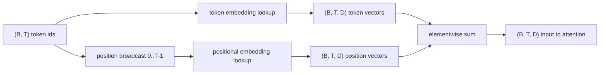
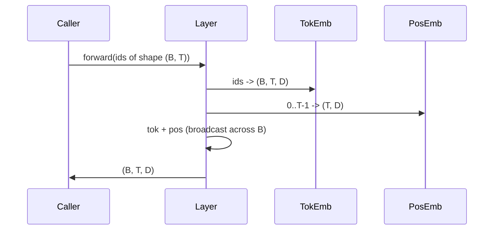

# Token và Positional Embeddings

> Ids là các số nguyên. Mô hình cần các vector. Hai bảng tra cứu (lookup table) nằm giữa chúng, và việc lựa chọn loại positional embedding sẽ định hình những gì mô hình có thể học được.

**Type:** Build
**Languages:** Python
**Prerequisites:** Các bài học Phase 04, các bài học về Transformer ở Phase 07, Bài 30 và 31 của phase này
**Time:** ~90 phút

## Mục tiêu học tập
- Xây dựng bảng tra cứu token-embedding để ánh xạ các vocabulary id sang các vector dày đặc (dense vectors).
- Xây dựng bảng tra cứu positional-embedding đã học (learned) được đánh chỉ mục theo vị trí.
- Xây dựng positional embedding hình sin cố định (fixed sinusoidal) được đánh chỉ mục theo vị trí mà không cần tham số.
- Kết hợp token embedding và positional embedding thành một đầu vào duy nhất cho một transformer block.
- So sánh positional embedding dạng học (learned) và dạng hình sin (sinusoidal) về khả năng tổng quát hóa độ dài và số lượng tham số.

```figure
cc-embedding-lookup
```

## Khung lý thuyết

Điểm tiếp xúc đầu tiên của mô hình với một token id là thao tác tra cứu hàng trong ma trận token-embedding. Ma trận này có một hàng cho mỗi vocabulary id và một cột cho mỗi chiều của mô hình (model dimension). Thao tác tra cứu trả về một vector mà phần còn lại của mô hình coi đó là ý nghĩa của id đó. Backprop cập nhật các hàng đã được sử dụng trong quá trình forward pass. Qua quá trình huấn luyện, hình học của các hàng đó học cách mã hóa sự tương đồng thông qua các hướng.

Bản thân các token id không có thứ tự. Mô hình cần một tín hiệu thứ hai cho nó biết vị trí một khác với vị trí mười bảy. Hai lựa chọn phổ biến cho tín hiệu đó là positional embedding đã học (một bảng tra cứu thứ hai, mỗi hàng cho một vị trí) và positional embedding hình sin cố định (một công thức toán học không có tham số). Sự lựa chọn này mang lại những hệ quả khác nhau. Một bảng đã học là một tham số và bị giới hạn bởi độ dài ngữ cảnh tối đa mà mô hình được huấn luyện. Một bảng hình sin về lý thuyết là không có tham số và công thức có thể mở rộng đến bất kỳ vị trí nào, nhưng `SinusoidalPositionalEmbedding` của bài học này tính toán trước một bảng cố định tại `max_context_length` và `forward` của nó vượt quá giới hạn đó; do đó, cả hai module đều áp đặt độ dài ngữ cảnh tối đa tại đây. Mô hình vẫn có thể gặp khó khăn khi vượt quá độ dài huấn luyện ngay cả khi bảng đủ lớn để đánh chỉ mục.

Bài học này xây dựng cả hai loại và kết hợp chúng với token embedding thành một đầu vào duy nhất cho khối attention của bài học tiếp theo.

## Hợp đồng về hình dạng (Shape contract)

Đầu vào cho giai đoạn embedding là một batch các token id có hình dạng `(B, T)`. Đầu ra là một tensor có hình dạng `(B, T, D)` trong đó `D` là chiều của mô hình. Mỗi phần tử trong batch có cùng độ dài ngữ cảnh `T`. Mỗi vị trí có cùng chiều vector `D`.



Sự kết hợp là phép cộng, không phải phép nối (concatenation). Phép cộng giữ cho `D` không đổi trong toàn bộ mạng và cho phép mô hình quyết định trên cơ sở từng đặc trưng xem ý nghĩa của token hay vị trí sẽ chiếm ưu thế ở mỗi lớp.

## Ma trận token embedding

Token embedding là một tensor tham số có hình dạng `(V, D)` trong đó `V` là kích thước từ vựng. PyTorch hiển thị nó dưới dạng `nn.Embedding(V, D)`. Khi khởi tạo, các mục được lấy từ một phân phối Gaussian nhỏ, theo truyền thống với giá trị trung bình bằng 0 và độ lệch chuẩn khoảng `0.02` cho các mô hình quy mô transformer. Việc khởi tạo chính xác ít quan trọng hơn việc nó duy trì tính nhất quán giữa các lần chạy.

Forward pass là một thao tác đánh chỉ mục đơn lẻ. PyTorch ánh xạ `(B, T)` int64 ids sang `(B, T, D)` floats bằng cách thu thập các hàng. Backward pass chỉ tích lũy gradient vào các hàng đã được chạm tới trong forward pass. Hai hàng không bao giờ xuất hiện trong batch sẽ nhận gradient bằng 0 ở bước đó.

Một chi tiết tinh tế: Token embedding và output projection ở cuối mô hình thường chia sẻ trọng số (weight tying). Khi điều đó xảy ra, mỗi backward pass sẽ chạm vào mọi hàng của embedding thông qua phía đầu ra. Bài học này trình bày cả hai như các module riêng biệt nhưng cùng một ma trận có thể đóng cả hai vai trò trong một mô hình hoàn chỉnh.

## Learned positional embedding

Learned positional embedding là một `nn.Embedding` thứ hai có hình dạng `(max_context_length, D)`. Thao tác tra cứu được khóa bởi position id `0, 1, 2, ..., T-1`. Forward pass phát tán (broadcast) vector vị trí đó trên chiều batch.

Nhược điểm của bảng đã học là nó không thể truy vấn tại vị trí `T` nếu mô hình chỉ được huấn luyện đến vị trí `T-1`. Hàng đó không tồn tại. Các mô hình decoder-only trong thực tế sử dụng lược đồ này sẽ cố định độ dài ngữ cảnh tối đa vào kiến trúc và từ chối xử lý các đầu vào dài hơn.

## Sinusoidal positional embedding

Sinusoidal positional embedding là một hàm từ vị trí sang vector. Vị trí `p` và đặc trưng `i` tạo ra

```python
angle = p / (10000 ** (2 * (i // 2) / D))
emb[p, 2k]     = sin(angle)
emb[p, 2k + 1] = cos(angle)
```

Hàm này không có tham số. Mỗi vị trí có một vector duy nhất. Bước sóng thay đổi theo hình học qua các chiều đặc trưng, vì vậy các chiều thấp hơn mã hóa vị trí thô và các chiều cao hơn mã hóa vị trí chi tiết.

Tính chất rút ra từ việc chọn `sin` và `cos` cùng nhau là vector tại vị trí `p + k` là một hàm tuyến tính của vector tại vị trí `p`. Điều đó mang lại cho lớp attention một con đường dễ dàng để học các độ lệch vị trí tương đối. Mô hình không cần một tham số riêng biệt để diễn đạt "nhìn lại năm token".

Bài học này tính toán toàn bộ bảng hình sin một lần khi khởi tạo và đánh chỉ mục vào đó tại thời điểm forward.

## Sự kết hợp

Pipeline đầu vào thực hiện ba việc theo thứ tự: Đọc các token id. Tra cứu các vector token. Cộng các vector vị trí. Trả về tổng.



Việc phát tán (broadcasting) trong bước cộng sẽ sao chép tensor vị trí `(T, D)` dọc theo chiều batch. PyTorch xử lý điều đó tự động vì tensor vị trí có hình dạng `(1, T, D)` sau khi unsqueeze.

## Phân tích so sánh

Bài học chạy cả hai biến thể trên cùng một đầu vào và in ra hai chẩn đoán.

Thứ nhất là số lượng tham số. Biến thể đã học thêm `max_context_length * D` tham số vào token embedding. Biến thể hình sin thêm 0.

Thứ hai là độ tương đồng cosine giữa các embedding tại các vị trí lân cận. Biến thể hình sin có sự suy giảm mượt mà và có thể dự đoán được vì hàm này liên tục. Biến thể đã học khi khởi tạo có độ tương đồng gần như ngẫu nhiên vì các hàng được lấy độc lập. Sau khi huấn luyện, biến thể đã học thường phát triển một cấu trúc mượt mà tương tự, nhưng nó phải tự khám phá cấu trúc đó từ dữ liệu.

## Những gì bài học này không thực hiện

Nó không xây dựng rotary positional encoding (RoPE) hoặc AliBi. Đó là những lựa chọn hiện đại trong các transformer thực tế. Cả hai đều tuân theo cùng một hợp đồng hình dạng như các embedding ở đây (áp dụng một phép biến đổi phụ thuộc vào vị trí cho các vector có hình dạng `(B, T, D)`) nhưng chúng áp dụng tại bước attention-projection thay vì tại đầu vào. Bài học tiếp theo sẽ xây dựng khối attention, và một trong những phần mở rộng tùy chọn là tích hợp rotary vào các query-key projections ở đó.

Nó không huấn luyện embedding. Huấn luyện đòi hỏi một hàm mất mát (loss), đòi hỏi đầu ra của mô hình, đòi hỏi attention và một LM head. Đó là nội dung của bài học tiếp theo và bài học sau đó nữa.

## Cách đọc mã nguồn

`main.py` định nghĩa ba module. `TokenEmbedding` bao bọc `nn.Embedding(V, D)`. `LearnedPositionalEmbedding` bao bọc `nn.Embedding(L, D)`. `SinusoidalPositionalEmbedding` tính toán trước bảng và hiển thị nó dưới dạng một buffer. `EmbeddingComposer` kết hợp token embedding và positional embedding lại với nhau. Bản demo ở phía dưới in ra các hình dạng, số lượng tham số và chẩn đoán độ tương đồng vị trí lân cận. Các bài kiểm tra trong `code/tests/test_embeddings.py` cố định hình dạng, hành vi broadcast, số lượng tham số và công thức hình sin.

Hãy chạy bản demo. Sau đó thay đổi chiều mô hình `D` từ 64 thành 32 và quan sát cách các dải bước sóng hình sin thay đổi.