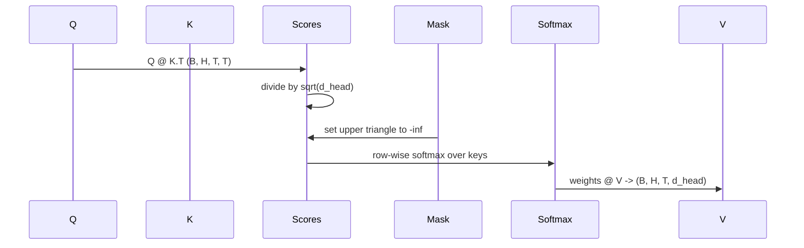

# Multi-Head Self-Attention

> Một phép chiếu tuyến tính, ba góc nhìn, H đầu (head) song song, một mask. Khối attention như cách mô hình thực sự sử dụng.

**Type:** Build
**Languages:** Python
**Prerequisites:** Các bài học Phase 04, các bài học về Transformer ở Phase 07, Bài 30 đến 32 của phase này
**Time:** ~90 phút

## Mục tiêu học tập
- Triển khai phép chiếu Query/Key/Value theo batch dưới dạng một lớp tuyến tính duy nhất được chia thành H đầu.
- Tính toán scaled dot-product attention với chuẩn hóa và xử lý dtype chính xác.
- Áp dụng causal mask để ngăn chặn một vị trí chú ý đến các vị trí trong tương lai.
- Kiểm tra trọng số attention của từng đầu (head) đối với một đầu vào cố định và suy luận về những gì mỗi đầu tập trung vào.
- Huấn luyện một khối attention nhỏ trên một tác vụ đơn giản (toy task) và quan sát loss giảm khi các đầu chuyên biệt hóa.

```figure
cap-multihead-attention
```

## Khung lý thuyết

Attention là hàm cho phép biểu diễn của một token lấy thông tin từ các token khác trong cùng một chuỗi. Self-attention nghĩa là các query, key và value đều được dẫn xuất từ cùng một đầu vào. Multi-head nghĩa là phép chiếu được chia thành H bài toán attention song song, kết quả đầu ra được nối (concatenate) lại và chiếu ngược trở lại.

Mô hình triển khai hiệu quả là sử dụng một lớp tuyến tính chiếu từ `D` sang `3 * D`, sau đó chia thành ba view và reshape thành H đầu với kích thước `D // H` mỗi đầu. Phép nhân ma trận (matmul), softmax và tổng có trọng số diễn ra dưới dạng các thao tác tensor theo batch để các đầu chạy song song trên bộ tăng tốc (accelerator).

Bài học này xây dựng khối đó. Nó cũng thêm causal mask để cùng một đoạn mã có thể hoạt động như lớp attention trong mô hình ngôn ngữ decoder-only. Bài học tiếp theo sẽ chồng các khối này thành một transformer hoàn chỉnh và bài học sau đó sẽ huấn luyện nó.

## Hợp đồng về hình dạng (Shape contract)

Đầu vào là `(B, T, D)`. Đầu ra là `(B, T, D)`. Mask là `(T, T)` hoặc có thể broadcast tới kích thước đó. Bên trong khối, các tensor trung gian có hình dạng `(B, H, T, d_head)` trong đó `d_head = D // H`. Ràng buộc là `D % H == 0`.

```mermaid
flowchart LR
    A["(B, T, D) input"] --> B[Linear D -> 3D]
    B --> C["split into Q, K, V"]
    C --> D["reshape to (B, H, T, d_head)"]
    D --> E["scores = Q @ K.T / sqrt(d_head)"]
    E --> F[apply causal mask]
    F --> G[softmax over keys]
    G --> H["context = weights @ V"]
    H --> I["reshape to (B, T, D)"]
    I --> J[output Linear D -> D]
    J --> K["(B, T, D) output"]
```



Hai lớp tuyến tính (phép chiếu QKV và phép chiếu đầu ra) là các tham số duy nhất trong khối. Mask, softmax, các phép matmul và reshape đều không chứa tham số.

## Phép chia QKV

Cách triển khai ngây thơ (naive) có ba lớp tuyến tính riêng biệt, mỗi lớp cho Q, K và V. Cách triển khai hiệu quả sử dụng một lớp duy nhất xuất ra `3 * D` đặc trưng và chia kết quả đó. Hai cách này tương đương về mặt toán học vì ba phép nhân ma trận riêng biệt với các trọng số `(D, D)` chính xác là một phép nhân ma trận với trọng số `(3D, D)` được xếp chồng từ chúng.

Phiên bản hiệu quả nhanh hơn vì bộ tăng tốc thực hiện một phép matmul thay vì ba. Nó cũng dễ khởi tạo hơn vì ba ma trận con nằm trong cùng một tensor tham số và có thể được khởi tạo cùng nhau.

## Reshape các đầu (head)

Sau khi chia, mỗi Q, K, V có dạng `(B, T, D)`. Để biến nó thành H bài toán attention song song, chúng ta reshape thành `(B, T, H, d_head)` và transpose thành `(B, H, T, d_head)`. Chiều của đầu (head dimension) bây giờ nằm cạnh chiều batch, vì vậy PyTorch xử lý attention của từng đầu như một thao tác theo batch trên `B * H` thực thể độc lập.

Chiều d_head vẫn ở cuối để phép matmul tính điểm `Q @ K.transpose(-2, -1)` thực hiện co rút (contract) nó. Kết quả là `(B, H, T, T)` điểm attention cho mỗi đầu.

## Scaling

Các điểm số được chia cho `sqrt(d_head)` trước khi qua softmax. Nếu không có scaling này, các tích vô hướng sẽ tăng lên khi `d_head` tăng, đẩy softmax vào trạng thái mà một mục gần như chiếm toàn bộ giá trị và các mục khác trở nên cực kỳ nhỏ. Gradient trong trạng thái đó rất nhỏ và việc học sẽ bị đình trệ. Chia cho `sqrt(d_head)` giúp phương sai của các điểm số duy trì ổn định trên các kích thước đầu khác nhau.

## Causal mask

Mô hình ngôn ngữ decoder-only chỉ có thể dựa vào quá khứ khi dự đoán token tiếp theo. Mask thực thi điều đó. Cụ thể, trước khi softmax, mọi mục nằm trên đường chéo của ma trận điểm `(T, T)` sẽ được thay thế bằng âm vô cùng. Sau softmax, các vị trí đó sẽ có trọng số bằng 0.



Chúng ta đăng ký mask như một buffer khi khởi tạo để nó nằm trên cùng thiết bị với mô hình và không nằm trong đồ thị gradient. Mask bao phủ độ dài ngữ cảnh tối đa mà khối sẽ gặp phải. Tại thời điểm forward, chúng ta cắt lấy góc trên bên trái `(T, T)`.

## Phép chiếu đầu ra (Output projection)

Sau khi có các vector ngữ cảnh của từng đầu `(B, H, T, d_head)`, chúng ta transpose ngược lại thành `(B, T, H, d_head)`, reshape thành `(B, T, D)` và áp dụng phép chiếu tuyến tính `(D, D)` cuối cùng. Phép chiếu đầu ra cho phép mô hình trộn các đầu lại với nhau. Nếu không có nó, H đầu sẽ chỉ kết hợp lại thông qua các lớp sau này và khối sẽ bị hạn chế một cách nhân tạo.

## Kiểm tra trọng số attention

Bài học cung cấp cờ `return_weights=True` trong quá trình forward. Khi được thiết lập, khối sẽ trả về trọng số attention của từng đầu với hình dạng `(B, H, T, T)` cùng với đầu ra. Bản demo in ra bản đồ nhiệt (heatmap) trọng số của một đầu trên đầu vào ngắn để bạn có thể thấy cấu trúc tam giác nhân quả và sự tập trung theo từng vị trí.

Trong một mô hình đã huấn luyện, các đầu khác nhau học các mẫu khác nhau. Một số đầu chú ý đến token ngay trước đó. Một số đầu chú ý đến đầu chuỗi. Một số đầu phân bổ sự chú ý gần như đồng đều. Hook kiểm tra này là điểm khởi đầu cho công việc diễn giải mô hình.

## Demo huấn luyện

Demo ở cuối `main.py` kết nối khối attention với một LM head nhỏ và huấn luyện toàn bộ trên một tác vụ lặp lại. Mỗi hàng của đầu vào là một id ngẫu nhiên được sao chép trên toàn bộ ngữ cảnh. Mục tiêu là đầu vào bị dịch chuyển đi một vị trí, vì vậy mô hình phải học được rằng token tiếp theo giống với token trước đó. Loss là cross-entropy. Với H=4, D=32, T=12 và từ vựng 64, loss giảm từ ngẫu nhiên (khoảng `log(64) ~ 4.16`) xuống dưới `1.0` sau ba epoch trên CPU.

Mục đích của demo không phải là huấn luyện một mô hình hữu ích. Mục đích là xác nhận gradient truyền qua mọi phần của khối và các đầu học được điều gì đó trên một bài toán mà câu trả lời là hiển nhiên.

## Những gì bài học này không thực hiện

Nó không thêm khối feed-forward. Lớp transformer trong một mô hình thực tế là attention theo sau bởi một MLP hai lớp với kết nối residual và layer norm xung quanh mỗi lớp. Bài học tiếp theo sẽ thêm các thành phần đó.

Nó không triển khai rotary hoặc AliBi positional encoding. Cả hai đều áp dụng tại bước chiếu QKV trong cùng một khối, nhưng chúng là một đơn vị giảng dạy riêng biệt. Khối được xây dựng ở đây tương thích với cả hai bằng cách biến đổi Q và K trước khi thực hiện matmul.

Nó không triển khai KV cache cho inference. Caching các key và value qua các lần forward là tối ưu hóa giúp giải mã tự hồi quy (autoregressive decoding) nhanh hơn. Nó thay đổi hợp đồng hình dạng trên các tensor K và V nhưng không thay đổi trên Q. Nó thuộc về bài học về inference.

## Cách đọc mã nguồn

`main.py` định nghĩa `MultiHeadSelfAttention`. Lớp này chứa hai lớp tuyến tính và một buffer mask đã đăng ký. Quá trình forward thực hiện chiếu, reshape, tính điểm, mask, softmax, tính trọng số, reshape và chiếu lại. Demo ở cuối xây dựng một mô hình nhỏ bao bọc attention với token và positional embedding cùng một LM head, huấn luyện nó trên tác vụ copy trong ba epoch, và in ra đường cong loss cùng bản đồ nhiệt attention của từng đầu. Các bài kiểm tra trong `code/tests/test_attention.py` cố định hợp đồng hình dạng, tính nhân quả, tính chất softmax, tính chất chia đầu và luồng gradient.

Hãy chạy demo. Sau đó tăng `n_heads` từ 4 lên 8 (giữ nguyên `d_model=32`, tức là `d_head=4`) và quan sát sự thay đổi của bản đồ nhiệt.