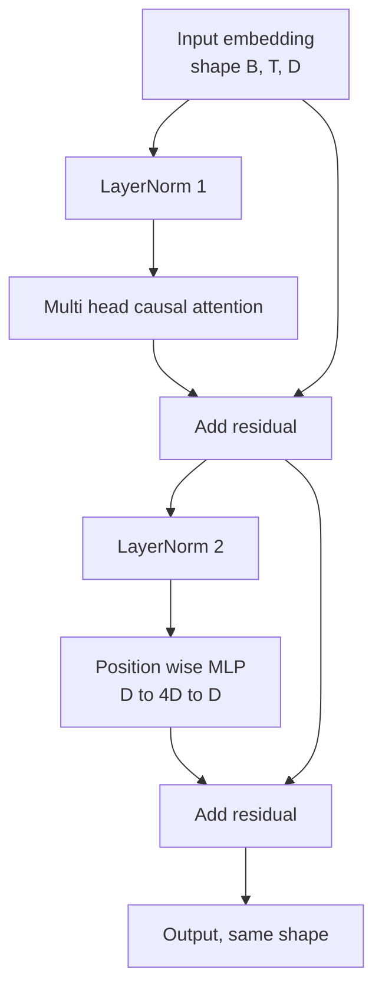
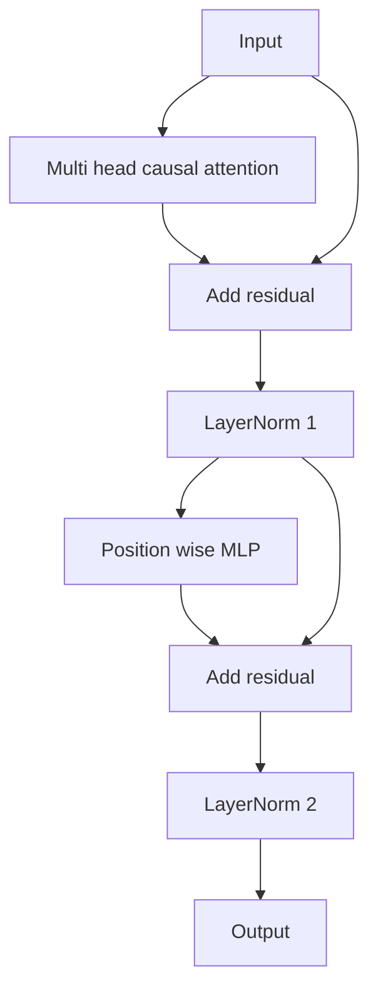

# Transformer Block from Scratch

> Một block là đơn vị cơ bản của mọi LLM decoder hiện đại. Layer norm, multi head attention, residual, MLP, residual. Biến thể pre-LN huấn luyện ổn định mà không cần warmup. Biến thể post-LN là những gì bài báo gốc đã công bố. Bài học này xây dựng cả hai, song song với nhau, và chỉ ra biến thể nào tồn tại được trong một stack 12 lớp ở các learning rate thông thường.

**Type:** Build
**Languages:** Python
**Prerequisites:** Phase 19 lessons 30 to 33 (tokenizer, embeddings, attention math, batched data loader)
**Time:** ~90 minutes

## Learning Objectives

- Xây dựng một transformer block trong PyTorch từ bốn thành phần chính: LayerNorm, multi head causal attention, residual connections, position wise MLP.
- Đặt LayerNorm ở hai cấu hình (pre-LN và post-LN) và giải thích tại sao một trong số đó huấn luyện ổn định mà không cần warmup.
- Triển khai causal masking bên trong multi head attention để token `i` không thể nhìn thấy các token `j > i`.
- Theo dõi luồng gradient qua cả hai biến thể trên một stack 12 lớp và đọc kết quả mà không cần suy đoán.
- Tái sử dụng block như một đơn vị lắp ghép khi bài học tiếp theo xây dựng một GPT 124 triệu tham số.

## The Problem

Một transformer là một block được lặp lại. Nếu làm sai block một lần, lặp lại mười hai lần, bạn sẽ tạo ra một mô hình bị phân kỳ ngay trong epoch đầu tiên hoặc cần các thủ thuật warmup trong suốt quá trình còn lại. Hai chế độ lỗi mà bạn sẽ thấy trong bài học này không hề xa lạ. Chúng xuất hiện ngay lần đầu tiên người học xếp chồng các block một cách ngây thơ. Một là lớp attention chú ý đến tương lai. Hai là LayerNorm được đặt ở vị trí không thể kiểm soát tín hiệu residual ở độ sâu lớn.

Cách sửa lỗi rất máy móc một khi bạn đã thấy nó. Block có chính xác hai đường dẫn residual và chính xác hai vị trí chuẩn hóa. Chọn đúng vị trí và phần còn lại của stack chỉ là việc quản lý sổ sách.

## The Concept

Mỗi transformer block chỉ dành cho decoder là một hàm nhận vào một tensor có hình dạng `(batch, sequence, embedding)` và trả về một tensor cùng hình dạng đó. Bên trong, hai sublayer thực hiện công việc.



Đây là biến thể pre-LN. LayerNorm nằm bên trong nhánh residual, trước sublayer. Kết nối residual mang tín hiệu chưa được chuẩn hóa đi tiếp.

Biến thể post-LN di chuyển LayerNorm ra sau phép cộng residual.



Hình dạng là giống hệt nhau. Hành vi huấn luyện thì không. Với post-LN, gradient chảy ngược qua đường dẫn residual phải đi qua LayerNorm. Ở độ sâu mười hai và learning rate `3e-4`, gradient đó co lại đủ nhanh để cần một lịch trình warmup. Pre-LN để đường dẫn residual không bị chuẩn hóa, vì vậy gradient lan truyền sạch sẽ đến lớp embedding. Pre-LN là cấu hình mà GPT-2 trở đi sử dụng vì lý do đó.

### Causal multi head attention

Sublayer attention chiếu đầu vào theo ba cách thành các tensor query, key, value. Mỗi tensor được định hình lại từ `(B, T, D)` thành `(B, H, T, D/H)` trong đó `H` là số lượng head. Scaled dot product attention tính toán `softmax(Q K^T / sqrt(d_k))` cho mỗi head, mask tam giác trên thành âm vô cùng, áp dụng mask thông qua softmax, sau đó nhân với `V`. Các head được nối lại thành một tensor `(B, T, D)` duy nhất và được chiếu thêm một lần nữa. Mask là thành phần duy nhất làm cho mô hình có tính nhân quả (causal). Quên mask đi và bạn sẽ huấn luyện một mô hình gian lận.

### The MLP

Position wise MLP áp dụng cùng một mạng hai lớp cho mọi token một cách độc lập. Độ rộng ẩn gấp bốn lần độ rộng embedding, hàm kích hoạt là GELU, và dropout theo sau lớp linear thứ hai. Không có token nào nói chuyện với nhau bên trong MLP. Tất cả sự trộn lẫn token đều xảy ra trong attention.

### Residual connections làm hai việc

Chúng làm cho đường dẫn gradient có tính cộng dồn qua các độ sâu, giúp giữ cho chuẩn gradient ở quy mô ổn định qua mười hai lớp. Chúng cũng cho phép mỗi block học một cập nhật cộng dồn vào biểu diễn đang chạy thay vì thay thế hoàn toàn. Cả hai hiệu ứng này là lý do tại sao block có thể mở rộng (scale).

```figure
cc-transformer-block
```

## Build It

`code/main.py` triển khai:

- `class LayerNorm` với scale và shift có thể học được, eps có bias, áp dụng cho mỗi vector token.
- `class MultiHeadAttention` với `num_heads`, `head_dim = d_model // num_heads`, chiếu QKV hợp nhất, causal mask đã đăng ký, attention và residual dropout.
- `class FeedForward` với hai lớp linear, hàm kích hoạt GELU, dropout.
- `class TransformerBlock` với cờ `pre_ln` để chuyển đổi giữa hai biến thể.
- Một bản demo xây dựng stack 6 lớp pre-LN và stack 6 lớp post-LN với đầu vào giống hệt nhau và in ra (a) hình dạng đầu ra, (b) chuẩn gradient tại embedding sau một lần backward pass.

Chạy nó:

```bash
python3 code/main.py
```

Đầu ra: kiểm tra hình dạng trên cả hai stack, chuẩn gradient cạnh nhau. Gradient embedding của stack pre-LN lớn hơn một bậc so với stack post-LN ở cùng learning rate, đó là tín hiệu thực nghiệm cho thấy pre-LN huấn luyện mà không cần warmup.

## Stack

- `torch` cho toán học tensor, autograd, và hệ thống `nn.Module`.
- Không `transformers`, không trọng số tiền huấn luyện. Block được triển khai từ các nguyên hàm.

## Production patterns in the wild

Ba mô hình biến block trong sách giáo khoa thành thứ bạn có thể triển khai thực tế.

**Fused QKV projection.** Ba lớp linear riêng biệt tốn ba lần khởi chạy kernel và ba phép nhân ma trận. Một lớp linear với độ rộng `3 * d_model` thực hiện công việc tương tự trong một lần khởi chạy, sau đó tách đầu ra dọc theo trục cuối cùng. Đường dẫn hợp nhất nhanh hơn trên mọi bộ tăng tốc và khớp với những gì các triển khai tham chiếu của GPT-2, LLaMA và Mistral đều sử dụng.

**Registered causal mask buffer.** Mask chỉ phụ thuộc vào độ dài ngữ cảnh tối đa. Cấp phát nó một lần khi khởi tạo với `register_buffer`, cắt cửa sổ hoạt động cho mỗi forward pass, và bỏ qua việc cấp phát mỗi lần gọi. Quên điều này sẽ biến mask thành điểm nghẽn cấp phát khi ngữ cảnh dài.

**Dropout ở hai nơi, không phải ba.** Dropout thuộc về sau softmax attention (attention dropout) và sau lớp linear thứ hai của MLP (residual dropout). Dropout trên chính residual sẽ phá vỡ tính đồng nhất cộng dồn cho phép gradient chảy ở độ sâu lớn. Một số triển khai ban đầu đã làm sai điều này và phải trả giá bằng việc huấn luyện không ổn định.

## Use It

- Block trong bài học này cắm thẳng vào quá trình lắp ghép GPT trong bài học 35 mà không cần sửa đổi.
- Biến thể pre-LN là thứ mà mọi LLM mã nguồn mở hiện đại đều sử dụng. Biến thể post-LN là thứ mà bài báo attention gốc năm 2017 đã sử dụng. Biết cả hai là đủ để đọc bất kỳ kiến trúc decoder nào bạn gặp phải.
- Thay GELU bằng SiLU và bạn có hàm kích hoạt của dòng LLaMA. Thay LayerNorm bằng RMSNorm và bạn có chuẩn hóa của dòng LLaMA. Cùng một bộ khung.

## Exercises

1. Thêm cờ `bias=False` vào mọi lớp linear trong block. Các LLM mã nguồn mở hiện đại được phát hành mà không có bias trên các lớp linear. Hãy đo xem bạn tiết kiệm được bao nhiêu tham số trong mô hình 12 lớp, 768 chiều.
2. Thay thế `nn.LayerNorm` bằng một RMSNorm tự viết và xác minh hình dạng đầu ra không thay đổi.
3. Thêm một cờ trả về trọng số attention cho head đầu tiên dưới dạng tensor `(B, T, T)`. Vẽ tam giác trên để xác nhận nó bằng không sau softmax.
4. Xây dựng một kiểm tra logic (sanity check) đưa vào một tensor `(2, 16, 384)` với `H=6` qua cả hai biến thể và khẳng định đầu ra forward là khác nhau (ví dụ: `not torch.allclose`) khi trọng số được khởi tạo giống hệt nhau và dropout được đặt bằng không.

## Key Terms

| Thuật ngữ | Cách gọi thông thường | Ý nghĩa thực tế |
|------|-----------------|------------------------|
| Pre-LN | "Pre norm" | LayerNorm bên trong nhánh residual, trước mỗi sublayer; residual mang tín hiệu chưa chuẩn hóa |
| Post-LN | "Post norm" | LayerNorm sau phép cộng residual; thứ mà bài báo 2017 đã dùng và cần warmup |
| Causal mask | "Triangle mask" | Tam giác trên của attention logits được đặt thành âm vô cùng để token i không thể đọc token j khi j lớn hơn i |
| Fused QKV | "Combined projection" | Một lớp linear độ rộng 3D thay vì ba lớp linear độ rộng D; một kernel, một phép nhân ma trận |
| Residual stream | "Skip connection" | Tensor chưa chuẩn hóa chảy từ trên xuống dưới qua mọi block; thứ mà mỗi block cộng thêm vào |

## Further Reading

- Phase 7 lesson 02 (self attention from scratch) cho toán học attention bên dưới block này.
- Phase 7 lesson 05 (full transformer) cho phiên bản encoder decoder của cùng bộ khung này.
- Phase 10 lesson 04 (pre training mini GPT) cho quy trình huấn luyện mà block này cắm vào.
- Phase 19 lesson 35 (this track) xếp chồng mười hai block này thành một mô hình GPT.