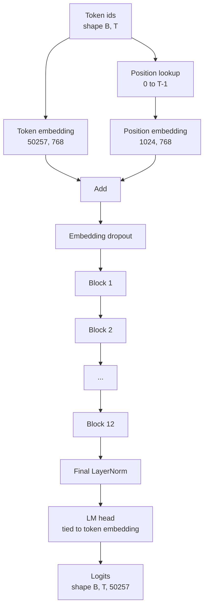
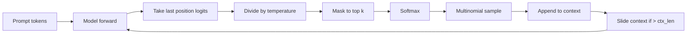

# GPT Model Assembly

> Mười hai khối được xếp chồng, một token embedding, một learned position embedding, một LayerNorm cuối cùng và một language model head được liên kết (tied). Đó là toàn bộ mô hình GPT với 124 triệu tham số. Bài học này lắp ráp các thành phần đó thành một lớp (class) hoàn chỉnh, đếm số lượng tham số để xác nhận mô hình khớp với cấu hình 124M tham chiếu, và tạo văn bản bằng cách sử dụng multinomial sampling, temperature và top-k.

**Type:** Build
**Languages:** Python
**Prerequisites:** Phase 19 lessons 30 to 34
**Time:** ~90 minutes

## Learning Objectives

- Lắp ráp transformer block từ bài học 34 thành một mô hình GPT hoàn chỉnh: token embedding, position embedding, N khối, LayerNorm cuối cùng, language model head.
- Tái tạo cấu hình 124 triệu tham số: vocab 50257, context 1024, embedding 768, mười hai heads, mười hai layers.
- Liên kết (tie) trọng số của language model head với token embedding và giải thích tại sao điều đó giúp tiết kiệm khoảng 38 triệu tham số ở quy mô này.
- Tạo văn bản từ một prompt với multinomial sampling, temperature scaling và top-k truncation, duy trì độ dài ngữ cảnh bằng sliding window.
- Đo lường số lượng tham số và chi phí của forward pass so với mục tiêu 124M.

## The Problem

Một transformer block không thể tự hoạt động. Bạn cần chuyển đổi token id thành các vector, trộn thông tin vị trí, đưa chúng qua các khối xếp chồng và chiếu ngược lại thành các logit từ vựng. Nếu bỏ quên bất kỳ bước nào trong bốn bước này, mô hình sẽ không thể thực hiện forward, bị sai lệch thông tin vị trí hoặc không thể tạo ra ngôn ngữ.

Hình dạng của mô hình cũng rất quan trọng. GPT-2 small tham chiếu có 124 triệu tham số với cấu hình chính xác như trên. Các con số này không phải là phép thuật. Vocab 50257 nhân với embedding 768 là bảng token. Vị trí 1024 nhân với 768 là bảng vị trí. Mười hai khối với khoảng 7 triệu tham số mỗi khối là 84 triệu. Head cuối cùng tái sử dụng bảng token thông qua weight tying. Tổng hợp các phần lại và bạn sẽ có 124 triệu. Việc xây dựng một mô hình có số lượng tham số không khớp với tham chiếu là dấu hiệu cho thấy bạn đã kết nối sai ở đâu đó.

## The Concept



Token id trở thành token vector. Position id trở thành position vector. Cả hai được cộng lại và gửi qua các khối xếp chồng. LayerNorm cuối cùng là thành phần duy nhất nằm ngoài các khối vẫn tồn tại trong mọi biến thể hiện đại. LM head tái sử dụng ma trận token embedding, đó chính là ý nghĩa của weight tying.

### Weight tying

Token embedding có hình dạng `(vocab, d_model)`. Language model head cần chiếu từ `d_model` ngược lại `vocab`. Đây là các ma trận chuyển vị của nhau. Việc liên kết (tie) hai thành phần này có nghĩa là sử dụng cùng một tensor tham số cho cả hai. Với vocab 50257 và d_model 768, ma trận này chiếm 38 triệu tham số. Nếu không liên kết, bạn phải trả giá gấp đôi. Nếu liên kết, bạn chỉ trả giá một lần và còn nhận được tín hiệu gradient sạch hơn một chút vì embedding và head được cập nhật cùng nhau.

### Position embedding là learned, không phải sinusoidal

GPT-2 sử dụng learned position embedding. Bảng vị trí là một tensor tham số có hình dạng `(1024, 768)`. Mô hình tra cứu vị trí từ 0 đến T-1 tại mỗi bước forward và cộng kết quả tra cứu vào token embedding. Đây là sơ đồ vị trí đơn giản nhất (RoPE, ALiBi, T5 relative bias là các lựa chọn thay thế) và đó là những gì cấu hình 124M tham chiếu sử dụng.

### Generation: temperature, top-k, multinomial

Quá trình tạo văn bản là tự hồi quy (autoregressive). Tại mỗi bước, mô hình trả về các logit trên toàn bộ từ vựng tại mỗi vị trí. Bạn chỉ lấy vị trí cuối cùng, chia cho temperature, tùy chọn mask tất cả các logit ngoại trừ top k logit về âm vô cùng, thực hiện softmax để lấy xác suất và lấy mẫu một token từ phân phối thu được.



Ba nút điều chỉnh, ba hành vi khác nhau. Temperature gần bằng 0 sẽ hội tụ về greedy. Temperature bằng 1 khớp với phân phối tự nhiên của mô hình. Top-k bằng 1 là greedy. Top-k bằng 40 lọc bỏ phần đuôi dài. Sự kết hợp giữa chúng rất quan trọng; bài học tiếp theo về huấn luyện sẽ sử dụng việc tạo văn bản như một tín hiệu đánh giá định tính.

```figure
cc-gpt-assembly
```

## Build It

`code/main.py` triển khai:

- `class GPTConfig` dataclass với các giá trị mặc định 124M: `vocab_size=50257`, `context_length=1024`, `d_model=768`, `num_heads=12`, `num_layers=12`, `mlp_expansion=4`, `dropout=0.1`, `use_bias=True`, `weight_tying=True`.
- `class GPTModel` với token embedding, position embedding, embedding dropout, mười hai `TransformerBlock`, LayerNorm cuối cùng và một `lm_head` liên kết với token embedding khi cờ được bật.
- Một helper `count_parameters` trả về số lượng tham số duy nhất (để weight tying được tính đúng trong tổng số).
- Một hàm `generate` thực hiện temperature, top-k, multinomial và sliding window context.
- Một bản demo xây dựng mô hình, in số lượng tham số bên cạnh tham chiếu 124M và tạo một chuỗi ngắn từ một prompt cố định để hiển thị pipeline từ đầu đến cuối.

Chạy nó:

```bash
python3 code/main.py
```

Đầu ra: số lượng tham số cùng với tham chiếu 124M, các token id được tạo từ một prompt ngẫu nhiên và xác nhận rằng LM head và token embedding chia sẻ bộ nhớ khi bật tính năng liên kết.

Để giữ cho bản demo nhanh, script cũng chạy một cấu hình siêu nhỏ (`d_model=64`, `num_layers=2`) từ đầu đến cuối và in chuỗi token được tạo ra. Cấu hình 124M được xây dựng nhưng chỉ được kiểm tra số lượng tham số và một lần forward pass.

## Stack

- `torch` cho các phép toán tensor, autograd và hệ thống module.
- `code/main.py` tái triển khai cùng một mẫu khối từ bài học 34 tại chỗ.

## Production patterns in the wild

Ba mẫu hình tạo nên sự khác biệt giữa một mô hình chạy được và một mô hình có thể triển khai thực tế.

**Khởi tạo các residual projection nhỏ.** Output projection của attention và linear thứ hai của MLP đều đổ trực tiếp vào một residual add. Việc khởi tạo chúng với cùng độ lệch chuẩn như các linear khác sẽ tạo ra một residual stream tăng dần theo độ sâu và đẩy LayerNorm cuối cùng vào trạng thái quá tải. Hãy scale độ lệch chuẩn bằng `1 / sqrt(2 * num_layers)` cho hai projection đó; residual stream sẽ duy trì trong phạm vi an toàn qua mười hai lớp.

**Cache tensor position id, không tính toán lại.** `torch.arange(T)` cấp phát bộ nhớ mới tại mỗi lần forward. Hãy cấp phát một lần trong `__init__` cho ngữ cảnh tối đa, cắt lấy T mục đầu tiên mỗi lần gọi và bỏ qua việc cấp phát lại.

**Liên kết trọng số ở cấp độ tham số, không chỉ bằng cách sao chép.** Thiết lập `lm_head.weight = token_embedding.weight` sẽ chia sẻ tensor; sao chép thì không. Optimizer cần cập nhật một tham số và đồ thị autograd cần một lần tích lũy. Nếu bạn sao chép, head sẽ lệch khỏi embedding và weight tying sẽ không có tác dụng gì.

## Use It

- Lớp mô hình trong bài học này có cùng hình dạng với mô hình mà bài học tiếp theo sẽ huấn luyện.
- Thay thế learned position embedding bằng RoPE sẽ giúp bạn có được dòng LLaMA mà không cần chạm vào khối hay head.
- Thay thế GELU bằng SiLU và LayerNorm bằng RMSNorm sẽ giúp bạn có được các thay đổi còn lại của dòng LLaMA.
- Hàm tạo văn bản hoạt động với bất kỳ nguồn logit nào, không chỉ mô hình này. Bạn có thể lấy logit từ file GPT-2 đã huấn luyện trước trong bài học 37 và tái sử dụng vòng lặp tạo văn bản tương tự.

## Exercises

1. Ngắt liên kết (untie) LM head khỏi token embedding và đếm lại tham số. Xác minh sự chênh lệch là 50257 nhân 768 = 38 triệu.
2. Thay thế learned position embedding bằng bảng sinusoidal được tính toán tại thời điểm khởi tạo. Xác nhận mô hình vẫn forward được và số lượng tham số giảm đi 786,432.
3. Thêm cờ `greedy=True` vào quá trình tạo văn bản để bỏ qua lấy mẫu và chọn argmax. Xác nhận chuỗi là xác định (deterministic) qua các lần chạy.
4. Thêm nút `repetition_penalty` để chia logit của bất kỳ token nào trong prompt hoặc lịch sử đã tạo cho một hằng số trước khi softmax. Chứng minh trên một prompt cố định rằng các giá trị lớn hơn một làm giảm số lần lặp lại trong đầu ra.
5. Thêm lấy mẫu `top_p` (nucleus) bên cạnh `top_k`. Kiểm tra hai dòng rằng tổng xác suất của các token được giữ lại vượt quá `top_p`.

## Key Terms

| Thuật ngữ | Cách gọi thông thường | Ý nghĩa thực tế |
|------|-----------------|------------------------|
| Weight tying | "Tied embeddings" | LM head và token embedding chia sẻ cùng một tensor tham số; tiết kiệm tham số vocab nhân d_model và khớp với tham chiếu GPT-2 |
| Position embedding | "Learned positions" | Một bảng riêng biệt có hình dạng (độ dài ngữ cảnh, d_model) được cộng vào token vector; được học end-to-end |
| Sliding window context | "Context cap" | Khi prompt cộng với các token đã tạo vượt quá độ dài ngữ cảnh, loại bỏ các token cũ nhất để cửa sổ hoạt động vừa vặn |
| Top-k sampling | "K truncation" | Giữ lại K logit có giá trị cao nhất, mask phần còn lại về âm vô cùng, softmax trên phần còn lại |
| Temperature | "Sampling temperature" | Chia logit cho T trước khi softmax; T nhỏ hơn 1 làm sắc nét, T bằng 1 giữ phân phối tự nhiên, T lớn hơn 1 làm phẳng |

## Further Reading

- Phase 19 lesson 34 cho khối mà mô hình này xếp chồng.
- Phase 19 lesson 36 cho vòng lặp huấn luyện điều khiển mô hình này với cross entropy loss.
- Phase 19 lesson 37 cho việc tải trọng số GPT-2 đã huấn luyện trước vào kiến trúc này.
- Phase 7 lesson 07 (GPT causal language modeling) cho toán học của dự đoán token tiếp theo.
- Phase 10 lesson 04 (pre training mini GPT) cho quy trình huấn luyện gốc trên cùng kiến trúc.