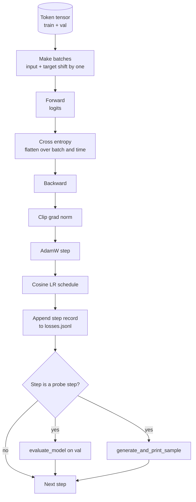

# Vòng lặp huấn luyện và Đánh giá

> Một vòng lặp không đo lường là một vòng lặp nói dối. Bài học này xây dựng vòng lặp huấn luyện điều khiển mô hình GPT: AdamW với cơ chế tách biệt weight decay, lịch trình learning rate gồm warmup cộng với cosine, một trình hỗ trợ `calc_loss_batch`, một lượt `evaluate_model` trên dữ liệu held-out, một bài kiểm tra định tính `generate_and_print_sample` sau mỗi K bước, và một tệp log JSONL chứa các giá trị loss để bạn có thể vẽ biểu đồ sau đó. Cấu trúc khung này sẽ huấn luyện mọi decoder LLM mà bạn sẽ xây dựng sau này.

**Type:** Build
**Languages:** Python
**Prerequisites:** Phase 19 bài 30 đến 35
**Time:** ~90 phút

## Mục tiêu học tập

- Xây dựng vòng lặp huấn luyện tính toán cross entropy loss với sự căn chỉnh input và target chính xác cho việc dự đoán token tiếp theo.
- Cấu hình AdamW với weight decay được áp dụng cho các tensor trọng số (weight) và không áp dụng cho các tensor LayerNorm hoặc bias.
- Triển khai lịch trình learning rate với linear warmup và cosine decay, đồng thời đọc giá trị LR thu được theo thời gian.
- Đánh giá trên tập held-out với `evaluate_model` để loss đánh giá có thể so sánh được giữa các lần chạy.
- Tạo mẫu định tính sau mỗi K bước với `generate_and_print_sample` để phát hiện sự phân kỳ (divergence) trước khi đường cong loss kịp thể hiện.
- Lưu trữ loss theo từng bước vào tệp JSONL để bạn có thể tải lại, vẽ biểu đồ và xuất log huấn luyện như một sản phẩm bàn giao.

## Vấn đề

Một tập lệnh huấn luyện chỉ in ra loss mà không làm gì khác sẽ thất bại theo ba cách. Nó không thể cho bạn biết liệu loss có đang giảm vì lý do đúng đắn hay không (mô hình có thể overfit tập huấn luyện mà không học được gì). Nó không thể cho bạn biết liệu sự phân kỳ có đang bắt đầu hay không (loss có thể tăng vọt trong một bước rồi phục hồi, hoặc tăng vọt rồi sụp đổ). Nó không thể cho bạn biết mô hình đã học được gì (loss chỉ là một giá trị vô hướng; một mẫu được tạo ra mới là một đoạn văn). Cả ba thất bại này đều bị che giấu trừ khi vòng lặp thực hiện đo lường.

Vòng lặp trong bài học này đo lường theo ba cách: Loss trên batch huấn luyện mỗi bước. Loss trên batch held-out sau mỗi K bước. Một đoạn văn bản tiếp nối được tạo ra từ một prompt cố định sau mỗi K bước. Log huấn luyện được ghi vào tệp JSONL để kết quả trở thành bằng chứng xác thực của vòng lặp.

## Khái niệm



Hai phần không hiển nhiên là sự căn chỉnh loss và việc tách biệt decay trong AdamW.

### Căn chỉnh loss (Loss alignment)

Mô hình dự đoán token tiếp theo tại mọi vị trí. Nếu batch input là các token `[t0, t1, t2, t3]`, thì batch target phải là `[t1, t2, t3, t4]`. Cross entropy được tính trên hình dạng phẳng `(batch * seq, vocab)` so với target phẳng `(batch * seq,)`. Nếu quên việc dịch chuyển (shift) này, bạn sẽ huấn luyện mô hình tự dự đoán chính nó, dẫn đến loss hội tụ về 0 trong khi không học được gì hữu ích.

### Tách biệt decay trong AdamW (AdamW decay split)

Weight decay điều tiết các tensor trọng số nhưng không áp dụng cho các hệ số chuẩn hóa (normalization scales) hoặc bias. Việc áp dụng decay lên hệ số LayerNorm sẽ dần dần đẩy hệ số đó về 0 và phá vỡ quá trình chuẩn hóa. Việc áp dụng decay lên bias về mặt toán học là vô hại nhưng lại lãng phí chu kỳ tính toán. Cách tách biệt tiêu chuẩn là: các tensor có hình dạng ma trận (trọng số linear, bảng embedding) sẽ nhận decay, bất cứ thứ gì trông giống hệ số tỉ lệ (scale) hoặc độ lệch (shift) thì không.

### Lịch trình Warmup cộng với Cosine

Warmup tăng dần learning rate từ 0 đến mục tiêu trong vài trăm bước để trạng thái của bộ tối ưu hóa (optimizer state) có thời gian ổn định. Cosine decay giảm dần learning rate trở lại 0 trong các bước còn lại để giai đoạn cuối tinh chỉnh các trọng số với kích thước bước nhỏ. Sự kết hợp này là lịch trình phổ biến nhất trong huấn luyện LLM mã nguồn mở vì nó loại bỏ hầu hết các thời điểm nhạy cảm trong một nghìn bước đầu tiên và một nghìn bước cuối cùng.

### Đánh giá trên tập Held-out

`evaluate_model` chạy một số lượng batch cố định từ tập validation, tích lũy loss, chia cho số lượng batch và trả về kết quả. Không có gradient. Không có dropout. Con số này có thể tái lập qua các lần chạy nếu cùng seed và cùng tập split. Việc báo cáo loss trên tập held-out bên cạnh loss huấn luyện là cách bạn phát hiện overfitting.

### Lấy mẫu định tính như một tín hiệu sớm

Một mô hình có loss huấn luyện giảm đẹp nhưng các mẫu tạo ra đều là cùng một token thì đã bị hỏng. Một mô hình có đường cong loss trông phẳng lì nhưng các mẫu tạo ra dần sắc nét thành các từ ngữ mạch lạc thì đang học tốt. Bài kiểm tra định tính chạy nhanh hơn việc đọc toàn bộ đường cong và bắt được các chế độ mà giá trị vô hướng (scalar) bỏ lỡ.

```figure
cap-training-loop
```

## Xây dựng

`code/main.py` triển khai:

- `make_batches(token_ids, batch_size, context_length)` giúp cắt một tensor token dài thành các cặp input và target.
- `calc_loss_batch(model, inputs, targets)` thực hiện forward, làm phẳng và trả về giá trị cross entropy vô hướng.
- `evaluate_model(model, val_loader, max_batches)` lặp qua một số lượng batch validation cố định mà không cần grad và trả về loss trung bình.
- `generate_and_print_sample(model, prompt, max_new_tokens)` chạy hàm tạo văn bản từ bài 35 trên một prompt cố định và in kết quả.
- `build_param_groups(model, weight_decay)` tạo ra danh sách tham số AdamW chia làm hai nhóm.
- `cosine_with_warmup(step, warmup_steps, total_steps, max_lr, min_lr)` trả về LR tại một bước cụ thể.
- `train(...)` chạy vòng lặp, lưu trữ `outputs/losses.jsonl`, và in loss đánh giá cùng một mẫu sau mỗi `eval_every` bước.
- Một bản demo huấn luyện mô hình nhỏ trên dữ liệu tổng hợp trong một số bước nhỏ, ghi log JSONL, và in loss đánh giá cùng mẫu tại các điểm kiểm tra. Bản demo chạy trong chưa đầy một phút trên CPU.

Chạy nó:

```bash
python3 code/main.py
```

Đầu ra: dòng loss theo từng bước, loss đánh giá tại mỗi bước kiểm tra, một mẫu được tạo ra tại mỗi bước kiểm tra, và một tệp `outputs/losses.jsonl` cuối cùng mà bạn có thể tải bằng `json.loads` cho mỗi dòng.

## Stack

- `torch` cho autograd, optimizer và các module.
- `main.py` triển khai lại `GPTModel` từ bài 35 và các module hỗ trợ cục bộ.

## Các mô hình sản xuất trong thực tế

Ba mô hình biến vòng lặp lý thuyết thành thứ bạn có thể để chạy qua đêm.

**Gradient norm clipping là bắt buộc.** Một batch xấu (dữ liệu bất thường, LR tăng vọt, trường hợp biên về số học) tạo ra gradient khổng lồ làm hỏng hàng giờ huấn luyện. `torch.nn.utils.clip_grad_norm_(params, max_norm=1.0)` sau `backward` và trước `step` giữ cho optimizer ở phạm vi an toàn. Giá trị clipping là một tham số tự do; giá trị 1 là mặc định phù hợp với hầu hết các thiết lập.

**Ghi log JSONL có thể tiếp tục (resumable), không dùng trạng thái pickled.** Các bản ghi loss theo từng bước dưới dạng `{"step": int, "train_loss": float, "lr": float}` trong JSONL rất bền vững: bất kỳ sự cố nào cũng để lại một tệp có thể đọc được, bạn có thể grep, vẽ biểu đồ với 30 dòng Python, và có thể tiếp tục huấn luyện bằng cách đọc bước cuối cùng. Trạng thái pickled buộc bạn phải giữ nguyên cấu trúc module đã tạo ra tệp đó, điều này rất dễ hỏng khi refactor code.

**Các batch đánh giá được lấy từ một lát cắt cố định.** Các token validation được cắt thành các batch ngay khi bắt đầu tập lệnh, không phải trong lúc chạy. Khả năng tái lập phụ thuộc vào việc các batch đánh giá phải giống hệt nhau giữa các lần chạy; nếu không, việc so sánh loss đánh giá giữa hai lần chạy sẽ đo lường cả sự xáo trộn batch thay vì chỉ đo lường mô hình.

## Sử dụng

- Vòng lặp trong bài học này là cấu trúc khung tương tự dùng để huấn luyện mô hình 124M trên dữ liệu thực. Thay thế tensor token tổng hợp bằng một loader kiểu `datasets` và vòng lặp sẽ chạy mà không cần thay đổi.
- Log JSONL là sản phẩm bàn giao biến một lần chạy huấn luyện thành bằng chứng. Bài học tiếp theo sử dụng nó để so sánh checkpoint vừa huấn luyện với checkpoint đã được huấn luyện trước đó.
- Bài kiểm tra định tính là công cụ bắt lỗi toàn diện mà loss vô hướng không thể thay thế.

## Bài tập

1. Thêm các unit test `weight_decay_groups()` để xác nhận các tham số scale và bias nằm trong nhóm không decay, còn trọng số linear và embedding nằm trong nhóm có decay.
2. Thay thế các token ngẫu nhiên tổng hợp bằng các byte từ một tệp văn bản nhỏ để demo huấn luyện trên thứ gì đó dễ đọc. Xác minh mẫu được tạo ra sử dụng các ký tự có trong tệp.
3. Thêm một ngưỡng `min_lr` bằng 10 phần trăm của `max_lr` vào lịch trình cosine và vẽ lại biểu đồ.
4. Lưu checkpoint sau mỗi `eval_every` bước bên cạnh log JSONL. Thêm cờ `resume_from` để tải lại trạng thái mô hình và trạng thái optimizer.
5. Ghi log thông lượng theo từng bước (token mỗi giây) bên cạnh loss và xác nhận nó duy trì trong một dải ổn định.

## Thuật ngữ chính

| Thuật ngữ | Cách gọi thông thường | Ý nghĩa thực tế |
|------|-----------------|------------------------|
| Loss alignment | "Dịch chuyển một" | Token input tại vị trí 0..T-1, token target tại vị trí 1..T; cross entropy được tính trên hình dạng phẳng |
| Decay split | "Hai nhóm" | AdamW nhận các tensor hình ma trận với weight decay và các tensor scale hoặc bias mà không có decay |
| Warmup | "Tăng dần" | Learning rate tăng từ 0 đến mục tiêu trong một số bước cố định để trạng thái optimizer có thể ổn định |
| Eval batches | "Batch held-out" | Một lát cắt cố định của tensor token validation, được cắt một lần khi bắt đầu script, dùng giống hệt nhau mỗi lần kiểm tra |
| Qualitative probe | "In mẫu" | Một đoạn văn bản ngắn được tạo từ prompt cố định, in ra sau mỗi K bước để bắt các chế độ lỗi mà loss không thể hiện |

## Đọc thêm

- Phase 19 bài 35 cho mô hình mà vòng lặp này điều khiển.
- Phase 19 bài 37 cho việc tải các trọng số đã huấn luyện trước vào cùng mô hình.
- Phase 10 bài 04 (pre-training mini GPT) cho quy trình trên dữ liệu thực.
- Phase 10 bài 10 (đánh giá) cho bề mặt đánh giá rộng hơn ngoài cross entropy loss.